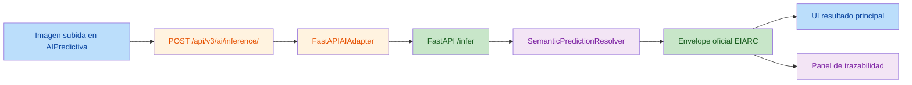

# AI_CONTEXT_V2_IMPLEMENTATION_AUDIT

## Fecha

2026-07-16

## Objetivo

Auditar exclusivamente la implementación actual del `AI Context V2` en la rama activa `feature/refactor-modular-contexts`, validando la coherencia entre la arquitectura aprobada, la corrección científica definida y el código actualmente presente en el workspace.

Contexto operativo:

- rama activa: `feature/refactor-modular-contexts`
- commit de continuidad reportado por el usuario: `fcc5a51`
- estado auditado: working tree actual

Archivos revisados:

- [AIPredictiva.jsx](file:///c:/Users/Devbadolgm/Development/research-ai/ProjectsAndDatasets/sigcTiArural/src/frontend/src/pages/AIPredictiva.jsx)
- [views.py](file:///c:/Users/Devbadolgm/Development/research-ai/ProjectsAndDatasets/sigcTiArural/src/backend/api/views.py)
- [urls.py](file:///c:/Users/Devbadolgm/Development/research-ai/ProjectsAndDatasets/sigcTiArural/src/backend/api/urls.py)
- [fastapi_ai_adapter.py](file:///c:/Users/Devbadolgm/Development/research-ai/ProjectsAndDatasets/sigcTiArural/src/backend/infrastructure/external/ai_service/fastapi_ai_adapter.py)
- [semantic_prediction_resolver.py](file:///c:/Users/Devbadolgm/Development/research-ai/ProjectsAndDatasets/sigcTiArural/src/backend/infrastructure/external/ai_service/semantic_prediction_resolver.py)
- [fastapi_app.py](file:///c:/Users/Devbadolgm/Development/research-ai/ProjectsAndDatasets/sigcTiArural/src/ai_models/fastapi_app.py)

Referencias de contrato y diseño usadas para contrastar:

- [AI_CONTEXT_IMPLEMENTATION_GUIDE.md](file:///c:/Users/Devbadolgm/Development/research-ai/ProjectsAndDatasets/sigcTiArural/docs/eiarc/02_ARCHITECTURE/AI_CONTEXT_IMPLEMENTATION_GUIDE.md)
- [EIARC_AI_SEMANTIC_CONTRACT.md](file:///c:/Users/Devbadolgm/Development/research-ai/ProjectsAndDatasets/sigcTiArural/docs/eiarc/02_ARCHITECTURE/EIARC_AI_SEMANTIC_CONTRACT.md)
- [AI_PREDICTION_VALIDATION_AUDIT.md](file:///c:/Users/Devbadolgm/Development/research-ai/ProjectsAndDatasets/sigcTiArural/AI_PREDICTION_VALIDATION_AUDIT.md)
- [AI_SCIENTIFIC_CORRECTION_DESIGN.md](file:///c:/Users/Devbadolgm/Development/research-ai/ProjectsAndDatasets/sigcTiArural/AI_SCIENTIFIC_CORRECTION_DESIGN.md)

---

## 1. Resumen ejecutivo

La implementación actual **sí materializa el núcleo del AI Context V2**:

- existe endpoint oficial `POST /api/v3/ai/inference/`
- existe adaptador backend hacia el microservicio FastAPI
- existe resolver semántico explícito
- `AIPredictiva.jsx` consume el endpoint oficial
- la UI separa `INFERENCIA REAL`, `SIMULACION` y `ROBOT DEMO`
- la UI ya no publica diagnósticos específicos en el flujo oficial real

Sin embargo, la auditoría encuentra **un bloqueante principal** y **una brecha relevante de trazabilidad**:

1. el microservicio técnico todavía conserva fallbacks legacy que emiten `Tomato_Early_blight`, contaminando la trazabilidad cruda de un modelo oficialmente binario
2. la UI omite `prediction_code` y `semantic_contract_version`, a pesar de que el contrato EIARC los considera claves de interoperabilidad y gobernanza

Dictamen:

- **Estado de coherencia general**: parcial-alto
- **Estado de integración a rama principal**: **NO-GO**

---

## 2. Flujo actual auditado

---

## 3. Hallazgos principales

| No. | Hallazgo | Sugerencia | Código |
|-----|----------|------------|--------|
| 1 | El microservicio `/infer` conserva fallbacks legacy con `Tomato_Early_blight`, lo que rompe la trazabilidad científica del modelo binario actual. | El fallback técnico no debe publicar una enfermedad específica incompatible con el espacio real `class_0/class_1`; debe alinearse a salida binaria o error explícito. | [fastapi_app.py:L231-L250](file:///c:/Users/Devbadolgm/Development/research-ai/ProjectsAndDatasets/sigcTiArural/src/ai_models/fastapi_app.py#L231-L250), [fastapi_app.py:L263-L271](file:///c:/Users/Devbadolgm/Development/research-ai/ProjectsAndDatasets/sigcTiArural/src/ai_models/fastapi_app.py#L263-L271), [views.py:L246-L252](file:///c:/Users/Devbadolgm/Development/research-ai/ProjectsAndDatasets/sigcTiArural/src/backend/api/views.py#L246-L252) |
| 2 | `AIPredictiva.jsx` captura `predictionCode`, pero no lo renderiza; además no muestra `semantic_contract_version`, debilitando trazabilidad y gobernanza EIARC. | Exponer en la UI la clave canónica `prediction_code` y la versión del contrato publicada por backend. | [AIPredictiva.jsx:L129-L151](file:///c:/Users/Devbadolgm/Development/research-ai/ProjectsAndDatasets/sigcTiArural/src/frontend/src/pages/AIPredictiva.jsx#L129-L151), [AIPredictiva.jsx:L511-L541](file:///c:/Users/Devbadolgm/Development/research-ai/ProjectsAndDatasets/sigcTiArural/src/frontend/src/pages/AIPredictiva.jsx#L511-L541), [EIARC_AI_SEMANTIC_CONTRACT.md:L157-L165](file:///c:/Users/Devbadolgm/Development/research-ai/ProjectsAndDatasets/sigcTiArural/docs/eiarc/02_ARCHITECTURE/EIARC_AI_SEMANTIC_CONTRACT.md#L157-L165), [EIARC_AI_SEMANTIC_CONTRACT.md:L188-L194](file:///c:/Users/Devbadolgm/Development/research-ai/ProjectsAndDatasets/sigcTiArural/docs/eiarc/02_ARCHITECTURE/EIARC_AI_SEMANTIC_CONTRACT.md#L188-L194) |
| 3 | Observación de riesgo medio: el backend trata como error solo `raw_result.error`, no todo upstream con `status=\"error\"`; hoy ese caso queda publicado como `fallback` con `trace.upstream_status`. | Mantenerlo como observación abierta y endurecer validación si se decide que un fallo upstream no debe verse como predicción oficial fallback. | [views.py:L225-L253](file:///c:/Users/Devbadolgm/Development/research-ai/ProjectsAndDatasets/sigcTiArural/src/backend/api/views.py#L225-L253), [fastapi_app.py:L263-L271](file:///c:/Users/Devbadolgm/Development/research-ai/ProjectsAndDatasets/sigcTiArural/src/ai_models/fastapi_app.py#L263-L271), [EIARC_AI_SEMANTIC_CONTRACT.md:L212-L215](file:///c:/Users/Devbadolgm/Development/research-ai/ProjectsAndDatasets/sigcTiArural/docs/eiarc/02_ARCHITECTURE/EIARC_AI_SEMANTIC_CONTRACT.md#L212-L215) |

### Validación cruzada de hallazgos

- Hallazgo `1`: confirmado por `2/2` validadores independientes
- Hallazgo `2`: confirmado por `2/2` validadores independientes
- Hallazgo `3`: confirmado por `1/2` validadores como issue autónomo; se mantiene como observación de riesgo, no como bloqueante principal

---

## 4. Función exacta de cada archivo

## 4.1 [AIPredictiva.jsx](file:///c:/Users/Devbadolgm/Development/research-ai/ProjectsAndDatasets/sigcTiArural/src/frontend/src/pages/AIPredictiva.jsx)

Función actual:

- consumidor oficial del endpoint `POST /api/v3/ai/inference/`
- presentación visual del resultado oficial
- separación explícita entre:
  - `INFERENCIA REAL`
  - `SIMULACION`
  - `ROBOT DEMO`
- publicación visible de parte de la trazabilidad técnica

## 4.2 [views.py](file:///c:/Users/Devbadolgm/Development/research-ai/ProjectsAndDatasets/sigcTiArural/src/backend/api/views.py)

Función actual:

- define `AIInferenceV3View`
- recibe imagen por `multipart/form-data`
- valida request
- delega al adaptador FastAPI
- resuelve contrato semántico EIARC
- publica envelope oficial V3 con:
  - `context`
  - `contract_version`
  - `operation`
  - `source_mode`
  - `prediction`
  - `trace`

## 4.3 [urls.py](file:///c:/Users/Devbadolgm/Development/research-ai/ProjectsAndDatasets/sigcTiArural/src/backend/api/urls.py)

Función actual:

- registrar `POST /api/v3/ai/inference/`
- desacoplar el endpoint oficial de inferencia del gate V3 global original

## 4.4 [fastapi_ai_adapter.py](file:///c:/Users/Devbadolgm/Development/research-ai/ProjectsAndDatasets/sigcTiArural/src/backend/infrastructure/external/ai_service/fastapi_ai_adapter.py)

Función actual:

- frontera técnica entre Django y FastAPI
- encapsular la llamada HTTP a `/infer`
- aplicar reintentos reales
- normalizar errores de red y payload inválido

## 4.5 [semantic_prediction_resolver.py](file:///c:/Users/Devbadolgm/Development/research-ai/ProjectsAndDatasets/sigcTiArural/src/backend/infrastructure/external/ai_service/semantic_prediction_resolver.py)

Función actual:

- convertir salida técnica (`diagnosis`, `class_index`) en contrato semántico EIARC
- imponer alcance científico binario
- etiquetar:
  - `prediction_code`
  - `prediction_label`
  - `plant_species`
  - `condition_name`
  - `condition_group`
  - `health_state`
  - `severity`
  - `recommended_action`
  - `model_id`
  - `model_version`
  - `semantic_contract_version`
  - `scientific_scope`

## 4.6 [fastapi_app.py](file:///c:/Users/Devbadolgm/Development/research-ai/ProjectsAndDatasets/sigcTiArural/src/ai_models/fastapi_app.py)

Función actual:

- microservicio técnico de IA
- carga modelo TensorFlow
- expone `/health`
- expone `/infer`
- mantiene endpoints de voz y laboratorio ajenos al alcance PR1/V2

---

## 5. Qué cambios han sido introducidos

## 5.1 Cambios visibles en working tree

Estado git actual de los archivos auditados:

- modificados:
  - `src/ai_models/fastapi_app.py`
  - `src/backend/api/urls.py`
  - `src/backend/api/views.py`
  - `src/backend/infrastructure/external/ai_service/fastapi_ai_adapter.py`
  - `src/frontend/src/pages/AIPredictiva.jsx`
- nuevo archivo:
  - `src/backend/infrastructure/external/ai_service/semantic_prediction_resolver.py`

## 5.2 Cambios introducidos por archivo

### [views.py](file:///c:/Users/Devbadolgm/Development/research-ai/ProjectsAndDatasets/sigcTiArural/src/backend/api/views.py)

Cambio introducido:

- incorporación de `AIInferenceV3View`
- incorporación de import dedicado del resolver semántico
- publicación del envelope oficial AI V3

Evidencia:

- [views.py:L187-L253](file:///c:/Users/Devbadolgm/Development/research-ai/ProjectsAndDatasets/sigcTiArural/src/backend/api/views.py#L187-L253)

### [urls.py](file:///c:/Users/Devbadolgm/Development/research-ai/ProjectsAndDatasets/sigcTiArural/src/backend/api/urls.py)

Cambio introducido:

- registro de la ruta `v3/ai/inference/`

Evidencia:

- [urls.py:L36-L41](file:///c:/Users/Devbadolgm/Development/research-ai/ProjectsAndDatasets/sigcTiArural/src/backend/api/urls.py#L36-L41)

### [fastapi_ai_adapter.py](file:///c:/Users/Devbadolgm/Development/research-ai/ProjectsAndDatasets/sigcTiArural/src/backend/infrastructure/external/ai_service/fastapi_ai_adapter.py)

Cambio introducido:

- separación entre `predecir_enfermedad()` y `_request_inference()`
- reintentos reales con `reraise=True`
- normalización explícita de errores de red y JSON inválido

Evidencia:

- [fastapi_ai_adapter.py:L17-L42](file:///c:/Users/Devbadolgm/Development/research-ai/ProjectsAndDatasets/sigcTiArural/src/backend/infrastructure/external/ai_service/fastapi_ai_adapter.py#L17-L42)

### [semantic_prediction_resolver.py](file:///c:/Users/Devbadolgm/Development/research-ai/ProjectsAndDatasets/sigcTiArural/src/backend/infrastructure/external/ai_service/semantic_prediction_resolver.py)

Cambio introducido:

- nueva capa de resolución semántica
- sustitución de diagnósticos específicos legacy por semántica binaria
- incorporación de `scientific_scope = binary_only`

Evidencia:

- [semantic_prediction_resolver.py:L6-L23](file:///c:/Users/Devbadolgm/Development/research-ai/ProjectsAndDatasets/sigcTiArural/src/backend/infrastructure/external/ai_service/semantic_prediction_resolver.py#L6-L23)
- [semantic_prediction_resolver.py:L25-L69](file:///c:/Users/Devbadolgm/Development/research-ai/ProjectsAndDatasets/sigcTiArural/src/backend/infrastructure/external/ai_service/semantic_prediction_resolver.py#L25-L69)

### [AIPredictiva.jsx](file:///c:/Users/Devbadolgm/Development/research-ai/ProjectsAndDatasets/sigcTiArural/src/frontend/src/pages/AIPredictiva.jsx)

Cambio introducido:

- abandono del flujo directo legado hacia `/infer`
- consumo del endpoint oficial backend V3
- eliminación del fallback mock automático del flujo real
- separación explícita de modos
- introducción del panel de trazabilidad visible

Evidencia:

- [AIPredictiva.jsx:L3-L9](file:///c:/Users/Devbadolgm/Development/research-ai/ProjectsAndDatasets/sigcTiArural/src/frontend/src/pages/AIPredictiva.jsx#L3-L9)
- [AIPredictiva.jsx:L129-L152](file:///c:/Users/Devbadolgm/Development/research-ai/ProjectsAndDatasets/sigcTiArural/src/frontend/src/pages/AIPredictiva.jsx#L129-L152)
- [AIPredictiva.jsx:L228-L269](file:///c:/Users/Devbadolgm/Development/research-ai/ProjectsAndDatasets/sigcTiArural/src/frontend/src/pages/AIPredictiva.jsx#L228-L269)
- [AIPredictiva.jsx:L271-L308](file:///c:/Users/Devbadolgm/Development/research-ai/ProjectsAndDatasets/sigcTiArural/src/frontend/src/pages/AIPredictiva.jsx#L271-L308)
- [AIPredictiva.jsx:L511-L541](file:///c:/Users/Devbadolgm/Development/research-ai/ProjectsAndDatasets/sigcTiArural/src/frontend/src/pages/AIPredictiva.jsx#L511-L541)

### [fastapi_app.py](file:///c:/Users/Devbadolgm/Development/research-ai/ProjectsAndDatasets/sigcTiArural/src/ai_models/fastapi_app.py)

Cambio visible en diff actual:

- corrección de path de modelos para soportar:
  - `/app/production_models`
  - `src/ai_models/production_models`

Evidencia:

- [fastapi_app.py:L78-L85](file:///c:/Users/Devbadolgm/Development/research-ai/ProjectsAndDatasets/sigcTiArural/src/ai_models/fastapi_app.py#L78-L85)

---

## 6. Qué partes implementan AI Context V2, Scientific Correction, Traceability y Governance

## 6.1 AI Context V2

Implementación principal:

- [views.py:L187-L253](file:///c:/Users/Devbadolgm/Development/research-ai/ProjectsAndDatasets/sigcTiArural/src/backend/api/views.py#L187-L253)
- [urls.py:L36-L41](file:///c:/Users/Devbadolgm/Development/research-ai/ProjectsAndDatasets/sigcTiArural/src/backend/api/urls.py#L36-L41)
- [fastapi_ai_adapter.py:L17-L42](file:///c:/Users/Devbadolgm/Development/research-ai/ProjectsAndDatasets/sigcTiArural/src/backend/infrastructure/external/ai_service/fastapi_ai_adapter.py#L17-L42)
- [AIPredictiva.jsx:L228-L269](file:///c:/Users/Devbadolgm/Development/research-ai/ProjectsAndDatasets/sigcTiArural/src/frontend/src/pages/AIPredictiva.jsx#L228-L269)

## 6.2 Scientific Correction

Implementación principal:

- [semantic_prediction_resolver.py:L25-L69](file:///c:/Users/Devbadolgm/Development/research-ai/ProjectsAndDatasets/sigcTiArural/src/backend/infrastructure/external/ai_service/semantic_prediction_resolver.py#L25-L69)
- [AIPredictiva.jsx:L129-L152](file:///c:/Users/Devbadolgm/Development/research-ai/ProjectsAndDatasets/sigcTiArural/src/frontend/src/pages/AIPredictiva.jsx#L129-L152)
- [AIPredictiva.jsx:L419-L427](file:///c:/Users/Devbadolgm/Development/research-ai/ProjectsAndDatasets/sigcTiArural/src/frontend/src/pages/AIPredictiva.jsx#L419-L427)

## 6.3 Prediction Resolver

Implementación principal:

- [semantic_prediction_resolver.py:L4-L101](file:///c:/Users/Devbadolgm/Development/research-ai/ProjectsAndDatasets/sigcTiArural/src/backend/infrastructure/external/ai_service/semantic_prediction_resolver.py#L4-L101)

## 6.4 Traceability

Implementación actual:

- backend publica `trace`:
  - [views.py:L240-L252](file:///c:/Users/Devbadolgm/Development/research-ai/ProjectsAndDatasets/sigcTiArural/src/backend/api/views.py#L240-L252)
- frontend renderiza trazabilidad parcial:
  - [AIPredictiva.jsx:L511-L541](file:///c:/Users/Devbadolgm/Development/research-ai/ProjectsAndDatasets/sigcTiArural/src/frontend/src/pages/AIPredictiva.jsx#L511-L541)

## 6.5 Governance

Implementación actual:

- `prediction_code` y `semantic_contract_version` se generan en backend:
  - [semantic_prediction_resolver.py:L12-L18](file:///c:/Users/Devbadolgm/Development/research-ai/ProjectsAndDatasets/sigcTiArural/src/backend/infrastructure/external/ai_service/semantic_prediction_resolver.py#L12-L18)
- el consumidor UI todavía no los hace visibles:
  - [AIPredictiva.jsx:L129-L151](file:///c:/Users/Devbadolgm/Development/research-ai/ProjectsAndDatasets/sigcTiArural/src/frontend/src/pages/AIPredictiva.jsx#L129-L151)
  - [AIPredictiva.jsx:L511-L541](file:///c:/Users/Devbadolgm/Development/research-ai/ProjectsAndDatasets/sigcTiArural/src/frontend/src/pages/AIPredictiva.jsx#L511-L541)

---

## 7. Validación de coherencia por pregunta

## 7.1 ¿`AIPredictiva.jsx` respeta los límites científicos del modelo actual?

### Respuesta

**Sí, en términos funcionales principales.**

### Evidencia

1. no publica enfermedades específicas en el flujo real
2. usa `prediction.prediction_label`
3. declara alcance científico binario:
   - [AIPredictiva.jsx:L141-L148](file:///c:/Users/Devbadolgm/Development/research-ai/ProjectsAndDatasets/sigcTiArural/src/frontend/src/pages/AIPredictiva.jsx#L141-L148)
4. separa explícitamente:
   - inferencia real
   - simulación
   - robot demo

### Reserva

No es cumplimiento pleno porque:

- omite `prediction_code`
- omite `semantic_contract_version`
- puede mostrar en trazabilidad un `raw_diagnosis` legacy si el upstream técnico cae en fallback

## 7.2 ¿`semantic_prediction_resolver.py` es consistente con EIARC?

### Respuesta

**Sí, con una consistencia alta.**

### Evidencia

Cumple campos clave del contrato:

- `prediction_code`
- `prediction_label`
- `plant_species`
- `condition_name`
- `condition_group`
- `health_state`
- `severity`
- `confidence`
- `recommended_action`
- `model_id`
- `model_version`
- `semantic_contract_version`

Evidencia:

- [semantic_prediction_resolver.py:L12-L18](file:///c:/Users/Devbadolgm/Development/research-ai/ProjectsAndDatasets/sigcTiArural/src/backend/infrastructure/external/ai_service/semantic_prediction_resolver.py#L12-L18)

### Reserva

La consistencia EIARC se ve degradada aguas arriba por el fallback legacy del microservicio, no por la semántica principal del resolver.

## 7.3 ¿Las respuestas backend siguen el contrato semántico definido?

### Respuesta

**Sí, en el camino principal.**

### Evidencia

- envelope V3 con `context`, `contract_version`, `operation`, `source_mode`, `prediction`, `trace`
- `class_index` vive en `trace`, no en `prediction`
- `source_mode` se publica desde backend

Evidencia:

- [views.py:L240-L252](file:///c:/Users/Devbadolgm/Development/research-ai/ProjectsAndDatasets/sigcTiArural/src/backend/api/views.py#L240-L252)

### Reserva

Hay una brecha de pureza semántica cuando el microservicio FastAPI produce `Tomato_Early_blight` en fallback/mock.

---

## 8. Riesgos técnicos encontrados

## 8.1 Riesgo crítico de trazabilidad científica contaminada

Origen:

- [fastapi_app.py:L231-L250](file:///c:/Users/Devbadolgm/Development/research-ai/ProjectsAndDatasets/sigcTiArural/src/ai_models/fastapi_app.py#L231-L250)
- [fastapi_app.py:L263-L271](file:///c:/Users/Devbadolgm/Development/research-ai/ProjectsAndDatasets/sigcTiArural/src/ai_models/fastapi_app.py#L263-L271)

Descripción:

- el fallback técnico sigue emitiendo una enfermedad específica legacy incompatible con el modelo binario actual

## 8.2 Riesgo medio de gobernanza incompleta en el consumidor oficial

Origen:

- [AIPredictiva.jsx:L129-L151](file:///c:/Users/Devbadolgm/Development/research-ai/ProjectsAndDatasets/sigcTiArural/src/frontend/src/pages/AIPredictiva.jsx#L129-L151)
- [AIPredictiva.jsx:L511-L541](file:///c:/Users/Devbadolgm/Development/research-ai/ProjectsAndDatasets/sigcTiArural/src/frontend/src/pages/AIPredictiva.jsx#L511-L541)

Descripción:

- el consumidor visible no hace explícita la clave semántica canónica ni la versión del contrato

## 8.3 Riesgo medio de semántica de fallback publicada como predicción

Origen:

- [views.py:L225-L253](file:///c:/Users/Devbadolgm/Development/research-ai/ProjectsAndDatasets/sigcTiArural/src/backend/api/views.py#L225-L253)

Descripción:

- si el upstream responde con `status="error"` pero sin campo `error`, hoy el backend lo sigue publicando como `fallback` resuelto

---

## 9. Código que debe preservarse

1. `AIInferenceV3View` como fachada oficial V3
2. registro de `POST /api/v3/ai/inference/`
3. refactor del adaptador con reintentos reales y normalización de errores
4. `SemanticPredictionResolver` como capa explícita de semántica
5. separación UI entre `INFERENCIA REAL`, `SIMULACION` y `ROBOT DEMO`
6. eliminación del fallback mock automático en el flujo real de la UI
7. panel actual de trazabilidad como base de gobernanza visible
8. corrección de ruta de modelos en `fastapi_app.py`

---

## 10. Código que debe corregirse

1. fallback/mock legacy en `fastapi_app.py` que aún usa `Tomato_Early_blight`
2. omisión de `prediction_code` en la UI
3. omisión de `semantic_contract_version` en la UI
4. endurecimiento opcional de `AIInferenceV3View` frente a upstream `status="error"` si se decide que ese caso no debe verse como éxito fallback

---

## 11. GO / NO GO para integrar a rama principal

## Decisión

**NO-GO**

## Justificación

1. el núcleo del `AI Context V2` sí está implementado y debe preservarse
2. la corrección científica principal sí está aplicada en backend y frontend
3. pero el microservicio técnico aún conserva una salida fallback que contradice el principio rector de la corrección científica:
   - ninguna capa debe afirmar una enfermedad específica si el modelo real no la produce
4. además, la UI todavía no expone completamente la gobernanza EIARC que el propio backend ya publica

## Condición para pasar a GO

Como mínimo:

1. eliminar el fallback legacy específico del microservicio técnico
2. completar trazabilidad visible en el consumidor oficial con `prediction_code` y `semantic_contract_version`

---

## 12. Conclusión final

La implementación actual del `AI Context V2` **no está desviada de la arquitectura aprobada**; por el contrario, la materializa correctamente en sus piezas centrales:

- endpoint oficial
- adaptador
- resolver
- UI oficial
- separación de modos
- semántica binaria honesta

El problema ya no es arquitectónico. El problema es de **consistencia residual de implementación**:

- un fallback técnico legacy sigue rompiendo la pureza de trazabilidad científica
- la UI oficial todavía no expone toda la semántica que backend ya gobierna

Diagnóstico final:

- coherencia con arquitectura aprobada: **alta**
- cumplimiento científico del flujo principal: **alto**
- cumplimiento de trazabilidad/gobernanza: **parcial**
- decisión de integración: **NO-GO**
