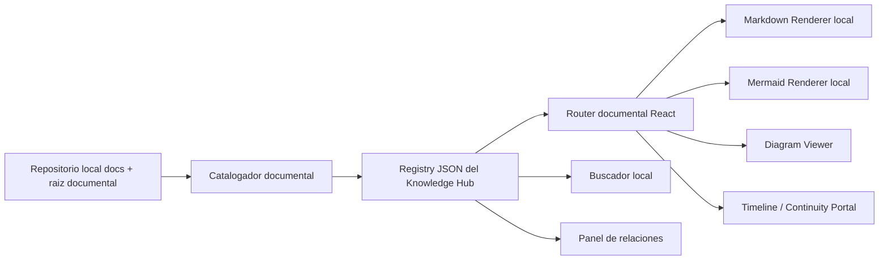

# KNOWLEDGE HUB ARCHITECTURE

## Fecha

2026-07-16

## Objetivo

Diseñar la arquitectura definitiva del Portal de Conocimiento de SIGCT-Rural como un Knowledge Hub permanente, totalmente local, capaz de sostener continuidad técnica durante años sin depender de `raw.githubusercontent.com`, con render nativo de Markdown, soporte Mermaid, navegación estructurada, búsqueda documental, trazabilidad y capacidad de servir como portal de continuidad para futuras IA.

## Principio rector

La documentación en SIGCT-Rural debe tratarse como parte del sistema y no como un artefacto secundario. Por tanto, el portal documental no debe ser una colección de páginas sueltas, sino una capa de producto con:

- fuente local de contenido
- modelo documental explícito
- navegación semántica
- render confiable
- descubrimiento de relaciones
- trazabilidad histórica y técnica

---

## 1. Causa raíz del fallo actual

### 1.1 Causa raíz principal

El sistema documental actual no está construido como un portal de conocimiento local, sino como un conjunto de páginas React independientes que intentan obtener contenido remoto desde GitHub Raw y CDNs.

### 1.2 Evidencia técnica del fallo

#### Dependencia de GitHub Raw

Las páginas documentales actuales cargan contenido desde `raw.githubusercontent.com`:

- `src/frontend/src/pages/DocsReadme.jsx`
- `src/frontend/src/pages/DocsPlanMaestro.jsx`
- `src/frontend/src/pages/DocsApiReference.jsx`
- `src/frontend/src/pages/DocsEdgeSetup.jsx`
- `src/frontend/src/pages/DocsMasterdoc.jsx`

Evidencia específica:

- `DocsReadme.jsx` usa `https://raw.githubusercontent.com/.../README.md`
- `DocsPlanMaestro.jsx` usa `https://raw.githubusercontent.com/.../docs/PLAN_MAESTRO_v4.2.md`
- `DocsMasterdoc.jsx` usa `https://raw.githubusercontent.com/.../docs/MASTERDOC.md`
- `DocsMasterdoc.jsx` también usa `iframe` contra `https://raw.githubusercontent.com/.../docs/MASTERDOC.html`

#### Dependencia de CDNs externos

El render documental no es local:

- `marked` se importa desde `https://cdn.jsdelivr.net/npm/marked/+esm`
- Mermaid se importa desde `https://cdn.jsdelivr.net/npm/mermaid/+esm`
- el estilo de Markdown se inyecta desde `cdnjs.cloudflare.com`

#### Rutas y etiquetas documentales obsoletas

Existen referencias duras a versiones viejas:

- `MASTERDOC v4.3`
- `Plan Maestro v4.2`

Evidencia:

- `src/frontend/src/pages/DocsMasterdoc.jsx`
- `src/frontend/src/pages/DocsPlanMaestro.jsx`
- `src/frontend/src/data/lab-data.js`

#### Integración documental incompleta

El sistema actual sólo expone cinco documentos:

- `/docs/masterdoc`
- `/docs/readme`
- `/docs/plan`
- `/docs/api`
- `/docs/edge-setup`

No existe integración en navegación para:

- `docs/eiarc/`
- `docs/project_knowledge_base/`
- `docs/sena_artifacts/`
- `docs/architect_master/`
- `docs/reports/`
- `docs/database/`
- `docs/diagrams/`
- `docs/uml/`

#### Acoplamiento documento-ruta

Cada documento tiene una página React propia. El portal no descubre contenido; lo tiene hardcodeado.

### 1.3 Fallos estructurales derivados

1. Si GitHub Raw falla, la documentación falla.
2. Si cambia el nombre de un archivo, la ruta React queda obsoleta.
3. Si se agregan documentos nuevos, no aparecen automáticamente.
4. No existe catálogo documental central.
5. No existe búsqueda local.
6. No existe clasificación por niveles o audiencias.
7. No existe trazabilidad entre documentos.

---

## 2. Arquitectura recomendada

### 2.1 Enfoque recomendado

La arquitectura recomendada es un **Knowledge Hub local, compilado en frontend, basado en catálogo documental y render semántico**, no en fetchs remotos.

### 2.2 Patrón general

### 2.3 Capas propuestas

#### Capa 1: Content Sources

Fuentes documentales locales:

- `README.md`
- `INDICE_PROYECTO.md`
- `MASTER_PROJECT_INVENTORY_AUDIT.md`
- `SENA_GRADUATION_READINESS_AUDIT.md`
- `docs/**/*.md`
- `docs/**/*.mmd`
- `docs/**/*.svg`
- `docs/**/*.png`
- `docs/**/*.html`

#### Capa 2: Knowledge Registry

Un registro documental local debe describir cada artefacto con metadatos:

- `id`
- `title`
- `canonical_path`
- `category`
- `level`
- `visibility`
- `document_type`
- `tags`
- `version_label`
- `source_of_truth`
- `related_documents`
- `status`
- `audience`
- `timeline_date`

#### Capa 3: Rendering Engine

El portal debe renderizar localmente:

- Markdown
- Mermaid
- SVG
- PNG
- HTML report embebido controlado

#### Capa 4: Experience Layer

La experiencia documental debe incluir:

- árbol navegable
- breadcrumbs
- vista por categorías
- búsqueda
- panel de relaciones
- línea de tiempo
- vista de continuidad
- badges de visibilidad y criticidad

#### Capa 5: Governance Layer

Debe existir un modelo explícito de:

- documento público
- documento restringido
- documento histórico
- documento canónico
- documento operativo

---

## 3. Experiencia visual recomendada

### 3.1 Dirección visual

La experiencia visual recomendada es un **Knowledge Cockpit** futurista, sobrio y técnico. No debe parecer un blog ni un simple visor Markdown.

### 3.2 Rasgos visuales

- layout tipo consola de conocimiento
- navegación lateral persistente
- panel principal de lectura
- panel contextual derecho para relaciones y metadatos
- breadcrumbs superiores
- paleta oscura con identidad SIGCT-Rural
- neón moderado, no invasivo
- badges de categoría, criticidad y visibilidad

### 3.3 Vistas principales recomendadas

1. **Home del Knowledge Hub**
   - resumen del proyecto
   - accesos rápidos
   - documentos canónicos
   - actividad reciente documental

2. **Doc Reader**
   - lectura principal
   - tabla de contenidos automática
   - navegación por encabezados
   - Mermaid inline

3. **Doc Explorer**
   - árbol por categorías y niveles
   - filtros por audiencia, tipo y estado

4. **Traceability View**
   - documento actual
   - documentos relacionados
   - fuentes de verdad
   - documentos derivados

5. **Project Timeline**
   - secuencia documental del proyecto
   - auditorías
   - EIARC
   - ADSO
   - cierres

6. **Continuity Portal**
   - runbooks
   - deployment
   - API
   - knowledge base crítica

### 3.4 Estilo UX

- lectura cómoda
- fuerte escaneabilidad
- navegación consistente
- cero dependencia de conectividad externa
- tiempo de acceso inmediato a documentos críticos

---

## 4. Componentes React implicados

### 4.1 Componentes existentes impactados

El rediseño afecta conceptualmente a:

- `src/frontend/src/App.jsx`
- `src/frontend/src/components/TopNav.jsx`
- `src/frontend/src/pages/DocsMasterdoc.jsx`
- `src/frontend/src/pages/DocsReadme.jsx`
- `src/frontend/src/pages/DocsPlanMaestro.jsx`
- `src/frontend/src/pages/DocsApiReference.jsx`
- `src/frontend/src/pages/DocsEdgeSetup.jsx`
- `src/frontend/src/data/lab-data.js`

### 4.2 Componentes nuevos recomendados

#### Shell y layout

- `KnowledgeHubLayout`
- `KnowledgeHubHome`
- `KnowledgeHubRoute`
- `KnowledgeHubHeader`
- `KnowledgeHubSidebar`
- `KnowledgeHubRightPanel`

#### Navegación y descubrimiento

- `DocTree`
- `DocCategoryTabs`
- `DocBreadcrumbs`
- `DocSearchCommand`
- `DocLevelSwitcher`
- `DocTimeline`

#### Render documental

- `DocRenderer`
- `MarkdownDocumentView`
- `MermaidBlock`
- `DiagramAssetViewer`
- `HtmlReportViewer`
- `DocTableOfContents`

#### Relación y trazabilidad

- `RelatedDocsPanel`
- `DocMetadataCard`
- `SourceOfTruthBadge`
- `VisibilityBadge`
- `TraceabilityGraph`

#### Continuidad

- `ContinuityHub`
- `OperationsShelf`
- `CriticalDocsRail`

### 4.3 Servicios frontend recomendados

- `knowledgeRegistry.js`
- `knowledgeIndex.js`
- `docLoader.js`
- `docRelationshipEngine.js`
- `docVisibilityPolicy.js`

---

## 5. Diseño de navegación

### 5.1 Regla general

La navegación no debe basarse en páginas aisladas, sino en un **árbol documental canónico**.

### 5.2 Estructura mínima pedida

#### Nivel 1: Proyecto

- `README`
- `MASTERDOC`
- `PLAN_MAESTRO`
- `INDICE_PROYECTO`

#### Nivel 2: EIARC

- `FOUNDATION`
- `ARCHITECTURE`
- `DIAGRAMS`

#### Nivel 3: Knowledge Base

- `KB-001`
- `KB-002`
- `KB-003`
- `KB-004`
- `KB-005`
- `KB-006`

#### Nivel 4: Proyecto ADSO

- `PROYECTO_FORMATIVO_FINAL`
- `EVIDENCIAS_ADSO_MASTER`
- `PRESENTACION_SUSTENTACION`
- `DEPLOYMENT_FINAL`
- `API_DELIVERY_PACKAGE`

#### Nivel 5: Operación

- `API`
- `Deployment`
- `Runbooks`
- `Continuidad`

### 5.3 Navegación recomendada por vistas

#### Navegación primaria

- `Knowledge Hub`
- `Proyecto`
- `EIARC`
- `Knowledge Base`
- `ADSO`
- `Operación`
- `Timeline`

#### Navegación secundaria contextual

Dentro de cada documento:

- resumen
- tabla de contenidos
- relacionados
- versiones/documentos derivados
- documento anterior/siguiente

### 5.4 Navegación transversal

El usuario debe poder descubrir un documento por:

- categoría
- nombre
- nivel
- etiqueta
- fecha
- criticidad
- audiencia

---

## 6. Organización documental recomendada

### 6.1 Taxonomía documental

Cada documento debe clasificarse en una taxonomía estable:

- `project-core`
- `eiarc-foundation`
- `eiarc-architecture`
- `eiarc-diagrams`
- `knowledge-base`
- `sena-deliverables`
- `operations`
- `deployment`
- `api`
- `reports`
- `historical`

### 6.2 Tipos documentales

- documento canónico
- documento operativo
- auditoría
- evidencia
- entregable académico
- diagrama
- reporte
- histórico

### 6.3 Modelo de relaciones

Todo documento debe poder declarar:

- `source_of_truth`
- `derived_from`
- `related_to`
- `supersedes`
- `supports_deliverable`
- `audience`

### 6.4 Núcleo documental recomendado

#### Canónicos

- `README.md`
- `docs/MASTERDOC.md`
- `docs/PLAN_MAESTRO.md`
- `INDICE_PROYECTO.md`

#### Arquitectura y gobierno

- `docs/architect_master/*`
- `docs/eiarc/*`
- `docs/project_knowledge_base/*`

#### Entrega ADSO

- `docs/sena_artifacts/*`

#### Operación

- `docs/API_REFERENCE.md`
- `docs/DEPLOYMENT.md`
- `docs/CONTINUITY_RUNBOOK.md`
- `docs/EDGE_SETUP.md`
- `docs/reports/*`

---

## 7. Ruta de implementación por fases

### Fase 1: Foundation del Hub

Objetivo:

- reemplazar el fetch remoto por carga local
- dejar un router documental único
- crear el registry documental base

Resultado esperado:

- Knowledge Hub navegable localmente
- eliminación de dependencia de GitHub Raw para docs críticas

### Fase 2: Render nativo

Objetivo:

- render Markdown local
- soporte Mermaid local
- soporte para diagramas `.svg`, `.png`, `.mmd`

Resultado esperado:

- lectura consistente sin CDNs externos

### Fase 3: Organización semántica

Objetivo:

- categorizar documentos por niveles 1 a 5
- integrar `docs/sena_artifacts/`
- integrar `docs/eiarc/`
- integrar `docs/project_knowledge_base/`

Resultado esperado:

- navegación por dominios documentales y no por páginas sueltas

### Fase 4: Descubrimiento y continuidad

Objetivo:

- búsqueda documental
- relaciones entre documentos
- panel de trazabilidad
- timeline del proyecto

Resultado esperado:

- portal de continuidad real

### Fase 5: Gobernanza y acceso

Objetivo:

- clasificar documentación pública vs restringida
- aplicar capas de visibilidad
- consolidar el portal como Knowledge Hub permanente

Resultado esperado:

- portal apto para años de continuidad y trabajo con futuras IA

---

## 8. Qué documentación debe verse públicamente

### 8.1 Pública por defecto

Debe estar visible públicamente la documentación que describe identidad, arquitectura general, entrega académica y uso institucional:

- `README.md`
- `docs/MASTERDOC.md`
- `docs/PLAN_MAESTRO.md`
- `INDICE_PROYECTO.md`
- `docs/API_REFERENCE.md`
- `docs/DEPLOYMENT.md`
- `docs/EDGE_SETUP.md`
- `docs/AI_PIPELINE.md`
- `docs/eiarc/01_FOUNDATION/*`
- `docs/eiarc/02_ARCHITECTURE/EIARC_CONTEXTS.md`
- `docs/eiarc/02_ARCHITECTURE/EIARC_IMPLEMENTATION_BLUEPRINT.md`
- `docs/eiarc/02_ARCHITECTURE/EIARC_CANONICAL_DATA_MODEL.md`
- `docs/sena_artifacts/PROYECTO_FORMATIVO_FINAL.md`
- `docs/sena_artifacts/EVIDENCIAS_ADSO_MASTER.md`
- `docs/sena_artifacts/PRESENTACION_SUSTENTACION.md`
- `docs/sena_artifacts/DEPLOYMENT_FINAL.md`
- `docs/sena_artifacts/API_DELIVERY_PACKAGE.md`
- diagramas y ERD de soporte que no expongan información sensible

### 8.2 Pública condicionada

Puede mostrarse públicamente, pero con etiqueta de histórico o auditoría:

- `docs/project_knowledge_base/KB-*`
- `docs/architect_master/05_FINAL_ARCHITECTURE_BASELINE.md`
- `MASTER_PROJECT_INVENTORY_AUDIT.md`
- `SENA_GRADUATION_READINESS_AUDIT.md`

---

## 9. Qué documentación debe requerir acceso restringido

### 9.1 Restringida por operación interna

Debe quedar con acceso restringido la documentación que expone continuidad interna, diagnóstico operativo, rutas de cierre o información sensible de operación:

- `HANDOFF_TRAE_sigcTiArual.md`
- `docs/reports/continuity_status.md`
- `debug-ai-model-loader.md`
- `PROJECT_ARCHIVE_MANIFEST.md`
- `PROJECT_RECORDS_REGISTER.md`
- `DOCUMENT_RETENTION_POLICY.md`
- `PROJECT_STRUCTURE_SNAPSHOT.md`
- `PROJECT_BACKUP_MANIFEST.md`
- `BACKUP_CONTENT_INDEX.md`
- `BACKUP_VERIFICATION_REPORT.md`

### 9.2 Restringida por auditoría técnica interna

- `docs/eiarc/*CODE_REVIEW.md`
- `docs/eiarc/02_ARCHITECTURE/TELEMETRY_DATABASE_DIAGNOSTIC.md`
- `docs/architect_master/03_DOCUMENT_TRUTH_MATRIX.md`
- `docs/architect_master/06_EVIDENCE_STATUS_MATRIX.md`
- `docs/architect_master/08_DEVELOPMENT_ROADMAP.md` si se usa como documento interno de trabajo

### 9.3 Criterio de restricción

La restricción no debe depender solo de la carpeta, sino de la función documental:

- operativo interno
- evidencia de auditoría sensible
- continuidad restringida
- snapshot/backup/archivo

---

## Arquitectura final recomendada

### Decisión central

SIGCT-Rural debe reemplazar el actual conjunto de páginas Docs v5.0 por un **Knowledge Hub local unificado**, montado sobre un registry documental y un router semántico, con render nativo, Mermaid local y navegación estructurada por conocimiento.

### Resultado esperado

El sistema dejaría de ser:

- un visor parcial
- dependiente de GitHub Raw
- amarrado a versiones viejas
- incapaz de integrar nuevos documentos

Y pasaría a ser:

- un portal documental de continuidad
- una biblioteca técnica navegable
- una memoria institucional del proyecto
- un entorno de trabajo válido para futuras IA y futuros mantenedores

## Conclusión

La falla actual no es un bug aislado de `/docs/masterdoc`. Es un síntoma de que la documentación aún no está tratada como un subsistema del producto. La arquitectura recomendada convierte esa documentación en una capa viva, local, durable y navegable, capaz de integrar el proyecto, EIARC, la knowledge base, los entregables ADSO y la operación continua en un único Portal de Conocimiento SIGCT-Rural.
