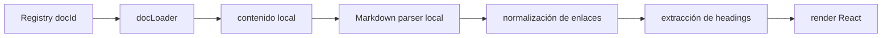

# KNOWLEDGE HUB IMPLEMENTATION SPEC

## Propósito

Convertir `KNOWLEDGE_HUB_ARCHITECTURE.md` en una especificación técnica ejecutable para implementación futura del Portal de Conocimiento SIGCT-Rural, sin rediseñar arquitectura ni modificar código actual.

---

## SECCIÓN 1

## Mapa completo de carpetas

### 1.1 Estructura objetivo en frontend

```text
src/frontend/src/
  knowledge-hub/
    components/
      shell/
        KnowledgeHubLayout.jsx
        KnowledgeHubHeader.jsx
        KnowledgeHubSidebar.jsx
        KnowledgeHubRightPanel.jsx
      navigation/
        DocTree.jsx
        DocBreadcrumbs.jsx
        DocCategoryTabs.jsx
        DocLevelSwitcher.jsx
        DocSearchCommand.jsx
        DocPaginationLinks.jsx
      document/
        DocRenderer.jsx
        MarkdownDocumentView.jsx
        DiagramAssetViewer.jsx
        HtmlReportViewer.jsx
        DocMetadataCard.jsx
        DocTableOfContents.jsx
        DocBadges.jsx
      relations/
        RelatedDocsPanel.jsx
        TraceabilityGraph.jsx
        SourceOfTruthPanel.jsx
      timeline/
        ProjectTimeline.jsx
        TimelineFilters.jsx
        TimelineEventCard.jsx
      operations/
        ContinuityHub.jsx
        OperationsShelf.jsx
        CriticalDocsRail.jsx
      security/
        RestrictedDocGate.jsx
        VisibilityBadge.jsx
    pages/
      KnowledgeHubHome.jsx
      KnowledgeHubDocumentPage.jsx
      KnowledgeHubCategoryPage.jsx
      KnowledgeHubSearchPage.jsx
      KnowledgeHubTimelinePage.jsx
      KnowledgeHubContinuityPage.jsx
      KnowledgeHubRestrictedPage.jsx
    registry/
      knowledgeRegistry.generated.json
      knowledgeRegistry.schema.json
      knowledgeCategories.js
      knowledgeVisibility.js
      knowledgeLevels.js
    services/
      docLoader.js
      docIndexService.js
      docSearchService.js
      docRelationshipEngine.js
      docTimelineService.js
      docVisibilityPolicy.js
      markdownAssetResolver.js
      mermaidRenderer.js
    hooks/
      useKnowledgeRegistry.js
      useDocumentNode.js
      useDocumentSearch.js
      useTimeline.js
      useRestrictedDocs.js
    utils/
      slugifyDocId.js
      normalizeDocPath.js
      extractHeadings.js
      extractFrontmatterLikeMetadata.js
```

### 1.2 Estructura objetivo fuera de `src/frontend/src`

```text
scripts/
  generate_knowledge_registry.py
  export_knowledge_timeline.py

docs/
  ... contenido documental existente ...

README.md
INDICE_PROYECTO.md
MASTER_PROJECT_INVENTORY_AUDIT.md
SENA_GRADUATION_READINESS_AUDIT.md
KNOWLEDGE_HUB_ARCHITECTURE.md
KNOWLEDGE_HUB_IMPLEMENTATION_SPEC.md
```

### 1.3 Regla de coexistencia

La implementación debe convivir inicialmente con el sistema actual de Docs v5.0 hasta completar la migración. El árbol `knowledge-hub/` será aditivo durante Fase 1 a Fase 3 y solo en una fase posterior se retirarán las páginas documentales antiguas.

---

## SECCIÓN 2

## Mapa de componentes React

### 2.1 Componentes React nuevos

#### Shell principal

- `KnowledgeHubLayout.jsx`
- `KnowledgeHubHeader.jsx`
- `KnowledgeHubSidebar.jsx`
- `KnowledgeHubRightPanel.jsx`

#### Navegación

- `DocTree.jsx`
- `DocBreadcrumbs.jsx`
- `DocCategoryTabs.jsx`
- `DocLevelSwitcher.jsx`
- `DocSearchCommand.jsx`
- `DocPaginationLinks.jsx`

#### Render documental

- `DocRenderer.jsx`
- `MarkdownDocumentView.jsx`
- `DiagramAssetViewer.jsx`
- `HtmlReportViewer.jsx`
- `DocMetadataCard.jsx`
- `DocTableOfContents.jsx`
- `DocBadges.jsx`

#### Relaciones y trazabilidad

- `RelatedDocsPanel.jsx`
- `TraceabilityGraph.jsx`
- `SourceOfTruthPanel.jsx`

#### Timeline

- `ProjectTimeline.jsx`
- `TimelineFilters.jsx`
- `TimelineEventCard.jsx`

#### Operación y continuidad

- `ContinuityHub.jsx`
- `OperationsShelf.jsx`
- `CriticalDocsRail.jsx`

#### Seguridad documental

- `RestrictedDocGate.jsx`
- `VisibilityBadge.jsx`

#### Páginas

- `KnowledgeHubHome.jsx`
- `KnowledgeHubDocumentPage.jsx`
- `KnowledgeHubCategoryPage.jsx`
- `KnowledgeHubSearchPage.jsx`
- `KnowledgeHubTimelinePage.jsx`
- `KnowledgeHubContinuityPage.jsx`
- `KnowledgeHubRestrictedPage.jsx`

### 2.2 Componentes React actuales que serán reemplazados

Los siguientes componentes o páginas actuales dejarán de ser la solución documental principal:

- `src/frontend/src/pages/DocsMasterdoc.jsx`
- `src/frontend/src/pages/DocsReadme.jsx`
- `src/frontend/src/pages/DocsPlanMaestro.jsx`
- `src/frontend/src/pages/DocsApiReference.jsx`
- `src/frontend/src/pages/DocsEdgeSetup.jsx`

### 2.3 Componentes actuales que seguirán existiendo pero con integración nueva

- `src/frontend/src/App.jsx`
  - integrará rutas nuevas del Knowledge Hub
- `src/frontend/src/components/TopNav.jsx`
  - reemplazará acceso `Docs (v5.0)` por acceso al Knowledge Hub
- `src/frontend/src/data/lab-data.js`
  - actualizará enlaces internos documentales hacia el nuevo router semántico

### 2.4 Responsabilidad por componente nuevo

| Componente | Responsabilidad |
|---|---|
| `KnowledgeHubLayout` | Shell total del portal |
| `DocTree` | Árbol documental por categorías y niveles |
| `DocRenderer` | Selección del renderer correcto según tipo de documento |
| `MarkdownDocumentView` | Render local de Markdown |
| `DiagramAssetViewer` | Visualización de `.svg`, `.png`, `.mmd` asociados |
| `RelatedDocsPanel` | Relación entre documento actual y ecosistema documental |
| `ProjectTimeline` | Línea de tiempo documental del proyecto |
| `RestrictedDocGate` | Control de visibilidad documental |

---

## SECCIÓN 3

## Mapa de rutas

### 3.1 Rutas nuevas

#### Ruta raíz del portal

- `/knowledge`

#### Home y navegación

- `/knowledge/home`
- `/knowledge/search`
- `/knowledge/timeline`
- `/knowledge/continuity`

#### Navegación por categorías

- `/knowledge/project`
- `/knowledge/eiarc`
- `/knowledge/knowledge-base`
- `/knowledge/adso`
- `/knowledge/operations`
- `/knowledge/historical`

#### Navegación por nivel

- `/knowledge/level/1`
- `/knowledge/level/2`
- `/knowledge/level/3`
- `/knowledge/level/4`
- `/knowledge/level/5`

#### Ruta documental canónica

- `/knowledge/doc/:docId`

Ejemplos:

- `/knowledge/doc/readme`
- `/knowledge/doc/masterdoc`
- `/knowledge/doc/plan_maestro`
- `/knowledge/doc/eiarc_contexts`
- `/knowledge/doc/kb_001_repo_audit`
- `/knowledge/doc/proyecto_formativo_final`

#### Rutas restringidas

- `/knowledge/restricted`
- `/knowledge/restricted/:docId`

### 3.2 Rutas actuales que desaparecerán como destino principal

- `/docs/masterdoc`
- `/docs/readme`
- `/docs/plan`
- `/docs/api`
- `/docs/edge-setup`

### 3.3 Estrategia de compatibilidad

Durante la migración:

- las rutas antiguas responderán con redirección o wrapper hacia `knowledge/doc/:docId`

Mapa sugerido:

- `/docs/masterdoc` -> `/knowledge/doc/masterdoc`
- `/docs/readme` -> `/knowledge/doc/readme`
- `/docs/plan` -> `/knowledge/doc/plan_maestro`
- `/docs/api` -> `/knowledge/doc/api_reference`
- `/docs/edge-setup` -> `/knowledge/doc/edge_setup`

### 3.4 Rutas documentales por dominio

#### Nivel 1 Proyecto

- `readme`
- `masterdoc`
- `plan_maestro`
- `indice_proyecto`

#### Nivel 2 EIARC

- `eiarc_vision`
- `eiarc_mission`
- `eiarc_scope`
- `eiarc_contexts`
- `eiarc_implementation_blueprint`
- `eiarc_canonical_data_model`

#### Nivel 3 Knowledge Base

- `kb_001_repo_audit`
- `kb_002_readme_reality`
- `kb_003_ai_integration`
- `kb_004_ai_semantic_contract`
- `kb_005_eiarc_ai_canonical_model`
- `kb_006_pending_changes`

#### Nivel 4 ADSO

- `proyecto_formativo_final`
- `evidencias_adso_master`
- `presentacion_sustentacion`
- `deployment_final`
- `api_delivery_package`

#### Nivel 5 Operación

- `api_reference`
- `deployment`
- `continuity_runbook`
- `edge_setup`
- `ai_pipeline`

---

## SECCIÓN 4

## Modelo Registry JSON

### 4.1 Archivo principal

- `src/frontend/src/knowledge-hub/registry/knowledgeRegistry.generated.json`

### 4.2 Archivo de esquema

- `src/frontend/src/knowledge-hub/registry/knowledgeRegistry.schema.json`

### 4.3 Estructura JSON raíz

```json
{
  "generated_at": "2026-07-16T00:00:00Z",
  "source_version": "local-workspace",
  "documents": []
}
```

### 4.4 Estructura de documento individual

```json
{
  "id": "masterdoc",
  "title": "MASTERDOC",
  "canonical_path": "docs/MASTERDOC.md",
  "route": "/knowledge/doc/masterdoc",
  "category": "project-core",
  "level": 1,
  "document_type": "canonical",
  "format": "markdown",
  "visibility": "public",
  "audience": ["public", "technical", "academic"],
  "source_of_truth": true,
  "status": "active",
  "version_label": "v7.2",
  "tags": ["masterdoc", "architecture", "adso", "sigct-rural"],
  "related_documents": ["plan_maestro", "indice_proyecto", "readme"],
  "derived_from": [],
  "supersedes": [],
  "supports_deliverable": ["adso-final"],
  "timeline_date": "2026-07-06",
  "summary": "Documento maestro técnico y de arquitectura.",
  "headings": [],
  "assets": [],
  "render": {
    "mode": "markdown",
    "enable_mermaid": true,
    "enable_html_embed": false
  }
}
```

### 4.5 Campos obligatorios

- `id`
- `title`
- `canonical_path`
- `route`
- `category`
- `level`
- `document_type`
- `format`
- `visibility`
- `status`
- `tags`

### 4.6 Categorías de indexación

- `project-core`
- `eiarc-foundation`
- `eiarc-architecture`
- `eiarc-diagrams`
- `knowledge-base`
- `sena-deliverables`
- `operations`
- `historical`
- `restricted`

### 4.7 Cómo se indexarán los grupos pedidos

#### README

- `id`: `readme`
- `category`: `project-core`
- `level`: `1`

#### MASTERDOC

- `id`: `masterdoc`
- `category`: `project-core`
- `level`: `1`
- `source_of_truth`: `true`

#### PLAN_MAESTRO

- `id`: `plan_maestro`
- `category`: `project-core`
- `level`: `1`
- `source_of_truth`: `true`

#### EIARC

- categoría dividida en:
  - `eiarc-foundation`
  - `eiarc-architecture`
  - `eiarc-diagrams`
- `level`: `2`

#### Knowledge Base

- `category`: `knowledge-base`
- `level`: `3`

#### ADSO

- `category`: `sena-deliverables`
- `level`: `4`

#### Operación

- `category`: `operations`
- `level`: `5`

---

## SECCIÓN 5

## Sistema de Renderizado Markdown

### 5.1 Principio

El render será completamente local, sin `fetch` a GitHub Raw y sin importaciones ESM desde CDN.

### 5.2 Pipeline de render



### 5.3 Responsabilidades

#### `docLoader.js`

- resolverá `docId -> canonical_path`
- cargará el contenido local preindexado o empaquetado

#### `markdownAssetResolver.js`

- resolverá rutas relativas de imágenes y diagramas
- normalizará enlaces internos a rutas `knowledge/doc/:docId`

#### `MarkdownDocumentView.jsx`

- mostrará contenido HTML seguro derivado de Markdown
- construirá tabla de contenido
- expondrá anchors internos

### 5.4 Tipos soportados

- `.md`
- `.mmd`
- `.svg`
- `.png`
- `.html` reportado como documento embebido controlado

### 5.5 Reglas de enlaces

- enlace a documento conocido -> resolver a `knowledge/doc/:docId`
- enlace a asset local -> resolver a asset local del repo
- enlace externo -> abrir como externo con badge

### 5.6 Resultado esperado

El documento deja de depender de páginas específicas tipo `DocsReadme` y pasa a ser renderizado por el mismo motor común.

---

## SECCIÓN 6

## Sistema Mermaid

### 6.1 Principio

Mermaid debe funcionar localmente como una capacidad del renderer y no como una excepción exclusiva de `DocsMasterdoc.jsx`.

### 6.2 Componentes implicados

- `DocRenderer.jsx`
- `MarkdownDocumentView.jsx`
- `MermaidBlock` dentro de `DocRenderer`
- `services/mermaidRenderer.js`

### 6.3 Flujo de operación

1. el parser detecta bloques fenced ` ```mermaid `
2. el renderer los transforma en nodos Mermaid
3. `mermaidRenderer.js` inicializa Mermaid una sola vez
4. cada bloque se renderiza localmente

### 6.4 Requisitos funcionales

- soporte inline de Mermaid en Markdown
- fallback visual si el diagrama falla
- modo oscuro coherente con la UI del Hub
- sin import remoto desde `cdn.jsdelivr`

### 6.5 Soporte adicional

Para archivos `.mmd`:

- el sistema los tratará como documentos de diagrama
- ofrecerá vista renderizada y vista fuente

---

## SECCIÓN 7

## Sistema de Búsqueda

### 7.1 Objetivo

Permitir búsqueda documental local por:

- título
- tags
- categoría
- nivel
- contenido textual
- tipo documental

### 7.2 Componentes

- `DocSearchCommand.jsx`
- `KnowledgeHubSearchPage.jsx`
- `services/docSearchService.js`
- `hooks/useDocumentSearch.js`

### 7.3 Índice de búsqueda

El registry generado deberá incluir:

- `title`
- `summary`
- `tags`
- `category`
- `headings`
- `search_text`

### 7.4 Estrategia técnica

#### Índice mínimo

Un índice JSON local generado por script:

```json
{
  "id": "masterdoc",
  "title": "MASTERDOC",
  "summary": "Documento maestro técnico y de arquitectura.",
  "tags": ["architecture", "adso"],
  "headings": ["Estado operativo actual", "Arquitectura Hexagonal"],
  "search_text": "masterdoc arquitectura hexagonal estado operativo..."
}
```

### 7.5 Resultados de búsqueda

Cada resultado deberá mostrar:

- título
- categoría
- nivel
- snippet
- badges
- ruta

### 7.6 Filtros

- `public`
- `restricted`
- `historical`
- `canonical`
- `operations`
- `sena-deliverables`

---

## SECCIÓN 8

## Sistema Timeline

### 8.1 Objetivo

Representar la evolución documental y técnica del proyecto como una línea de tiempo navegable.

### 8.2 Componentes

- `ProjectTimeline.jsx`
- `TimelineFilters.jsx`
- `TimelineEventCard.jsx`
- `services/docTimelineService.js`
- `hooks/useTimeline.js`

### 8.3 Fuente de datos

El timeline se construirá desde el registry usando:

- `timeline_date`
- `category`
- `document_type`
- `status`
- `supports_deliverable`

### 8.4 Tipos de eventos

- fundación documental
- auditoría
- knowledge base
- arquitectura EIARC
- implementación
- code review
- entregable ADSO
- cierre/archivo

### 8.5 Visualización

Cada evento mostrará:

- fecha
- título
- categoría
- tipo
- relación con hitos del proyecto

### 8.6 Vistas del timeline

- global del proyecto
- filtrado por EIARC
- filtrado por ADSO
- filtrado por auditorías
- filtrado por operación

---

## SECCIÓN 9

## Sistema de Seguridad Documental

### 9.1 Objetivo

Controlar visibilidad documental sin cambiar el repositorio fuente.

### 9.2 Niveles de visibilidad

- `public`
- `internal`
- `restricted`
- `historical`

### 9.3 Componentes

- `RestrictedDocGate.jsx`
- `VisibilityBadge.jsx`
- `services/docVisibilityPolicy.js`
- `hooks/useRestrictedDocs.js`

### 9.4 Política de acceso

#### Público

Documentos académicos, canónicos y de presentación:

- `README`
- `MASTERDOC`
- `PLAN_MAESTRO`
- `INDICE_PROYECTO`
- EIARC fundacional y arquitectura base
- `docs/sena_artifacts/*`

#### Interno

Documentación operativa y técnica sensible:

- runbooks internos
- reportes de continuidad
- matrices de verdad y evidencia

#### Restringido

Snapshots de cierre, backups, handoff y diagnósticos sensibles.

### 9.5 Comportamiento UI

Si un documento es restringido:

- no aparecerá en exploración pública normal
- podrá aparecer en resultados solo si el contexto lo permite
- mostrará `RestrictedDocGate`

### 9.6 Seguridad práctica inicial

En primera implementación, la restricción podrá ser lógica/UI y no necesariamente autenticada por backend, dado que este blueprint no modifica backend. La expansión posterior podrá acoplarse a auth existente si se desea endurecimiento real.

---

## SECCIÓN 10

## Roadmap técnico de implementación

### Fase 1. Registry y ruta base

Entregables:

- `knowledge-hub/registry/*`
- script `generate_knowledge_registry.py`
- rutas `/knowledge/*`
- `KnowledgeHubLayout`

### Fase 2. Renderer documental común

Entregables:

- `DocRenderer`
- `MarkdownDocumentView`
- `DiagramAssetViewer`
- `HtmlReportViewer`
- carga local de documentos

### Fase 3. Migración de docs actuales

Entregables:

- wrapper o redirect desde:
  - `/docs/masterdoc`
  - `/docs/readme`
  - `/docs/plan`
  - `/docs/api`
  - `/docs/edge-setup`
- retiro progresivo de `DocsMasterdoc.jsx`, `DocsReadme.jsx`, `DocsPlanMaestro.jsx`, `DocsApiReference.jsx`, `DocsEdgeSetup.jsx` como solución principal

### Fase 4. Búsqueda y relaciones

Entregables:

- índice de búsqueda
- `DocSearchCommand`
- `RelatedDocsPanel`
- `TraceabilityGraph`

### Fase 5. Timeline y continuidad

Entregables:

- `ProjectTimeline`
- `ContinuityHub`
- `OperationsShelf`
- acceso a runbooks, API, deployment y docs críticas

### Fase 6. Seguridad documental

Entregables:

- `docVisibilityPolicy`
- `RestrictedDocGate`
- visibilidad por categorías y niveles

### Fase 7. Cierre de migración

Entregables:

- TopNav apuntando al Knowledge Hub como portal único
- `lab-data.js` sin referencias a `MASTERDOC v4.3` ni `Plan Maestro v4.2`
- retiro de dependencia de GitHub Raw y CDNs para documentación

---

## Resultado esperado

Al finalizar la implementación futura de esta especificación, SIGCT-Rural tendrá un Portal de Conocimiento permanente, local, categorizado e indexado, con soporte nativo para Markdown, Mermaid, diagramas, continuidad técnica, trazabilidad documental y control de visibilidad, reemplazando por completo el modelo actual de páginas documentales aisladas.
