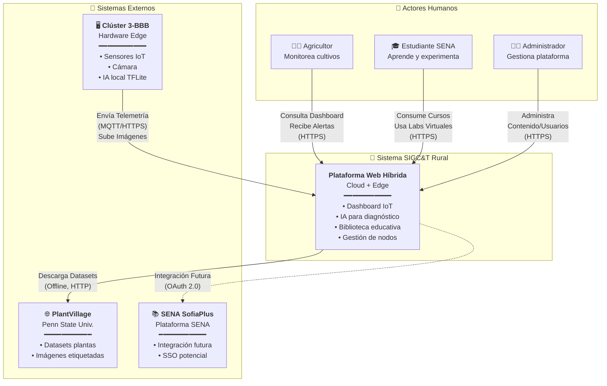

<div align="center">

# 🌾 SIGC&T Rural

### Sistema Integrado de Gestión en Ciencia y Tecnología Rural


**Plataforma web híbrida (Cloud/Edge) que integra IoT, Inteligencia Artificial y educación técnica para impulsar la agricultura sostenible y la inclusión tecnológica en zonas rurales de Colombia.**

[📚 Documentación](docs/MASTERDOC.md) • [🚀 Plan Maestro](docs/PLAN_MAESTRO.md) • [🐛 Reportar Bug](https://github.com/badolgm/sigcTiArural/issues) • [💡 Solicitar Feature](https://github.com/badolgm/sigcTiArural/issues/new)

</div>

---

## 📖 Tabla de Contenidos

- [🧭 Descripción General](#-descripción-general)
- [🎯 Visión y Objetivos](#-visión-y-objetivos)
- [🌍 Impacto Social (ODS)](#-impacto-social-ods)
- [✨ Características Principales](#-características-principales)
- [🏗️ Arquitectura del Sistema](#️-arquitectura-del-sistema)
- [📚 Documentación Técnica](#-documentación-técnica)
- [🚀 Inicio Rápido](#-inicio-rápido)
- [🧩 Estructura del Proyecto](#-estructura-del-proyecto)
- [📊 Stack Tecnológico](#-stack-tecnológico)
- [🤖 Inteligencia Artificial](#-inteligencia-artificial)
- [🤝 Contribuciones](#-contribuciones)
- [🎓 Contexto Académico SENA](#-contexto-académico-sena)
- [📜 Licencia](#-licencia)
- [👥 Autor](#-autor)

---

## 🧭 Descripción General

**SIGC&T Rural** es una plataforma web de código abierto, con enfoque académico, científico y social, que integra **IoT**, **Inteligencia Artificial (IA)** y **educación técnica** para impulsar la agricultura sostenible y la inclusión tecnológica en zonas rurales de Colombia.

Nace en el marco del **Proyecto Productivo SENA** del programa **Tecnología en Análisis y Desarrollo de Software** y propone una arquitectura híbrida **Cloud/Edge** que conecta un backend **Django** y un frontend **React + TailwindCSS** con dispositivos como **BeagleBone Black**.

---

## 🎯 Visión y Objetivos

### 🌟 Misión

Democratizar el acceso a tecnologías de agricultura inteligente, ofreciendo herramientas de monitoreo IoT, diagnóstico con IA y educación técnica gratuita.

### 🎯 Objetivos del Negocio (Académicos ADSO)

| ID | Objetivo | Descripción | Criterio de Éxito |
|:---|:---------|:------------|:------------------|
| O-01 | Dashboard Centralizado | Proveer visualización web de datos de sensores en tiempo real | Dashboard funcional con latencia <2s |
| O-02 | Modelo de IA | Implementar clasificación de enfermedades con alta precisión | Accuracy >85% en dataset de validación |
| O-03 | Laboratorio Hardware | Establecer clúster de 3 BeagleBone Black operacional | 3 nodos comunicados vía MQTT/HTTP |
| O-04 | Biblioteca Educativa | Crear repositorio de recursos educativos curados | Mínimo 20 recursos categorizados |
| O-05 | Cumplimiento ADSO | Entregar artefactos completos del Proyecto Productivo | 100% de entregables aprobados |

---

## 🌍 Impacto Social (ODS)

El proyecto se alinea con los **Objetivos de Desarrollo Sostenible** de la ONU:

| ODS | Objetivo | Contribución de SIGC&T |
|:----|:---------|:-----------------------|
| **ODS 2** | Hambre Cero | Optimización productiva mediante datos y diagnóstico temprano |
| **ODS 4** | Educación de Calidad | Acceso abierto a formación técnica avanzada |
| **ODS 9** | Industria e Innovación | Infraestructura tecnológica en contextos rurales |
| **ODS 17** | Alianzas | Articulación academia–agricultura–tecnología |

---

## ✨ Características Principales

- 📊 **Dashboard IoT:** Visualización en tiempo real de temperatura, humedad, luz, etc.
- 🤖 **Diagnóstico IA:** Clasificación de enfermedades de plantas (38 clases) con modelos en Cloud y Edge
- 📚 **Biblioteca Educativa:** Módulo de gestión de contenido para cursos, videos y laboratorios
- 🔌 **Arquitectura Híbrida:** Lógica "Store-and-Forward" que tolera fallos de red en el Edge
- 📡 **Comunicación:** API RESTful (Django) y WebSockets (Channels) para datos en vivo
- 📱 **Responsive Design:** Interfaz moderna con React y TailwindCSS

---

## 🏗️ Arquitectura del Sistema

Esta plataforma utiliza una **arquitectura híbrida Cloud-Edge**.

### Nivel 1: Vista de Contexto del Sistema

El sistema como "caja negra" y sus interacciones con actores y sistemas externos.



### Nivel 2: Vista de Contenedores

Descompone el sistema en sus componentes principales (Cloud vs. Edge).

```mermaid
graph TB
    subgraph "🌐 Internet"
        actor1["👤 Usuario<br/>(Navegador Web)"]
    end

    subgraph "☁️ Cloud Provider (Render / Railway)"
        direction TB
        
        subgraph "Frontend Container"
            WebApp["⚛️ <b>React App</b><br/>(Vite + TailwindCSS)"]
        end
        
        subgraph "Backend Container"
            APIServer["🐍 <b>Django API</b><br/>(DRF + Channels)"]
        end
        
        subgraph "AI Service"
            AI_Service["🤖 <b>Servicio IA</b><br/>(TensorFlow/Keras)"]
        end
        
        subgraph "Database"
            Database[("💾 <b>PostgreSQL 15</b><br/>(Datos y Telemetría)")]
        end
        
        WebApp -- "Consume<br/>REST API" --> APIServer
        APIServer -- "Lee/Escribe<br/>SQL" --> Database
        APIServer -- "Ejecuta<br/>Inferencia" --> AI_Service
    end

    subgraph "🏠 Laboratorio Edge (Red Local)"
        direction TB
        
        subgraph "BBB-01 Gateway"
            Cluster_GW["🌐 <b>Gateway</b><br/>(Broker Mosquitto + Sync)"]
        end
        
        subgraph "BBB-02 IA-Edge"
            Cluster_IA["🧠 <b>IA Local</b><br/>(API Flask + TFLite)"]
        end
        
        subgraph "BBB-03 Sensores"
            Cluster_IoT["📡 <b>IoT Node</b><br/>(Sensores + Cámara)"]
        end
        
        Cluster_IoT -- "Publica<br/>MQTT (LAN)" --> Cluster_GW
        Cluster_IoT -- "POST Imagen<br/>HTTP (LAN)" --> Cluster_IA
        Cluster_IA -- "Reporta<br/>MQTT (LAN)" --> Cluster_GW
    end

    actor1 -- "HTTPS<br/>443" --> WebApp
    actor1 -- "HTTPS/WSS" --> APIServer
    Cluster_GW -- "HTTPS<br/>POST /api/readings/" --> APIServer
```

> 📘 **Para más detalles:** Consulta el [MASTERDOC.md](docs/MASTERDOC.md) con todos los diagramas C4, el Modelo Entidad-Relación y las especificaciones técnicas completas.

---

## 📚 Documentación Técnica

Este README.md es la portada del proyecto. Toda la ingeniería, diagramas C4, Modelo Entidad-Relación (ERD) y el cronograma del proyecto se encuentran en la carpeta `/docs`.

| Documento | Propósito |
|:----------|:----------|
| 📘 **[MASTERDOC (DAS)](docs/MASTERDOC.md)** | Documento de Arquitectura de Software. Contiene todos los diagramas, el Modelo ER, el Diccionario de Datos y las especificaciones técnicas completas. |
| 🚀 **[PLAN MAESTRO](docs/PLAN_MAESTRO.md)** | Las fases, tareas y cronograma (Gantt) del proyecto. |
| 🔧 **API REFERENCE** | *(En construcción)* Documentación de todos los endpoints de la API RESTful. |
| 🖥️ **EDGE SETUP** | *(En construcción)* Guía de configuración del hardware BeagleBone Black. |
| 📑 **[REPORTES](docs/reports/)** | Auditorías técnicas, estado maestro y anexos (PDF/HTML). |

---

## 🖼️ Galería de Diagramas (SVG)

> Visualización directa desde `/docs/diagrams` y `/docs/database` (renderizados para GitHub).

- Arquitectura general del sistema: `docs/diagrams/architecture.svg`
- C4 Contenedores (Cloud/Edge): `docs/diagrams/c4_containers.svg`
- C4 Componentes: `docs/diagrams/c4_components.svg`
- C4 Despliegue (Cloud/Edge): `docs/diagrams/c4_deployment.svg`
- Casos de uso del sistema: `docs/diagrams/use_cases.svg`
- Secuencia de navegación: `docs/diagrams/sequence_navigation.svg`
- Catálogo de laboratorio: `docs/diagrams/class_lab_catalog.svg`
- Arquitectura del Edge (Clúster BBB): `docs/diagrams/architecture_edge.svg`
- Modelo ER (Base de datos): `docs/database/er_schema.svg`
- Modelos/Relaciones BD: `docs/database/class_db_models.svg`

> Nota: también se encuentran diagramas UML en `docs/uml/` (copiados en `docs/diagrams/` para conveniencia).


## 🚀 Inicio Rápido

### Requisitos Previos

- Git 2.30+
- Python 3.10+
- Node.js 18+ y npm 9+

### 1. Clonar y preparar entorno

```bash
git clone https://github.com/badolgm/sigcTiArural.git
cd sigcTiArural
```

### 2. Backend (Django)

```bash
cd src/backend
python -m venv venv

# Linux/Mac:
source venv/bin/activate
# Windows:
venv\Scripts\activate

pip install -r requirements.txt
python manage.py migrate
python manage.py runserver 0.0.0.0:8000
```

### 3. Frontend (React + Vite)

```bash
# En una nueva terminal
cd src/frontend
npm install
echo "VITE_API_URL=http://localhost:8000" > .env.local
npm run dev
```

🎉 **¡Listo!** La app estará disponible en `http://localhost:5173`

---

## 🧩 Estructura del Proyecto

```
sigcTiArural/
├── docs/                 # 👈 TODA LA DOCUMENTACIÓN (MASTERDOC, PLAN MAESTRO, etc.)
│   ├── MASTERDOC.md
│   ├── PLAN_MAESTRO.md
│   └── sena_artifacts/
├── src/                  # 👈 TODO EL CÓDIGO FUENTE
│   ├── backend/          # (Django API)
│   ├── frontend/         # (React App)
│   └── embedded/         # (Scripts de Python para BBB)
├── tests/                # Pruebas
├── .env.example          # Plantilla de variables de entorno
└── README.md             # (Este archivo)
```

---

## 📊 Stack Tecnológico

### Backend
- **Python**, **Django**, **DRF**, **Channels**, **PostgreSQL**

### Frontend
- **React**, **Vite**, **TailwindCSS**, **Axios**

### Inteligencia Artificial
- **TensorFlow**, **TensorFlow Lite**, **Keras**, **OpenCV**

### Edge Computing
- **BeagleBone Black**, **Paho-MQTT**, **Adafruit_BBIO**

### DevOps
- **Docker** *(futuro)*, **GitHub Actions** *(futuro)*, **Nginx** *(futuro)*

---

## 🤖 Inteligencia Artificial

Modelo base de clasificación (PlantVillage) con **MobileNetV2 + Transfer Learning**:

```
Input(224x224x3) → MobileNetV2 → GAP → Dropout(0.3) → Dense(38, softmax)
```

**Entrenamiento y notebooks:** `src/ai_models/notebooks/`

**Métricas:**
- Accuracy Cloud: >92%
- Accuracy Edge: >88%
- Latencia Cloud: 2-5s
- Latencia Edge: <500ms

---

## 🤝 Contribuciones

Las contribuciones son bienvenidas. Abre un **Issue** o crea un **Pull Request** con cambios claros y pruebas asociadas cuando aplique.

### Cómo Contribuir

1. **Fork** el proyecto
2. Crea una **rama feature** (`git checkout -b feature/nueva-funcionalidad`)
3. **Commit** tus cambios (`git commit -m 'feat: Agrega nueva funcionalidad'`)
4. **Push** a la rama (`git push origin feature/nueva-funcionalidad`)
5. Abre un **Pull Request**

---

## 🎓 Contexto Académico SENA

Este proyecto es desarrollado como **Proyecto Productivo** del programa **Tecnología en Análisis y Desarrollo de Software (ADSO)** del **SENA (Servicio Nacional de Aprendizaje)** de Colombia.

### Competencias Demostradas

**Técnicas:**
- ✅ Desarrollo Full-Stack (React + Django)
- ✅ Diseño de APIs RESTful
- ✅ Bases de datos relacionales (PostgreSQL)
- ✅ Machine Learning aplicado (TensorFlow)
- ✅ IoT y sistemas embebidos (BeagleBone)
- ✅ Arquitectura de software (Modelo C4)

**Transversales:**
- ✅ Trabajo autónomo
- ✅ Resolución de problemas complejos
- ✅ Documentación técnica
- ✅ Pensamiento sistémico

---

## 📜 Licencia

Este proyecto está licenciado bajo **MIT License**.

```
MIT License

Copyright (c) 2025 Bernardo A. Gómez Montoya

Permission is hereby granted, free of charge, to any person obtaining a copy
of this software and associated documentation files (the "Software"), to deal
in the Software without restriction...
```

**¿Por qué MIT?**
- ✅ Permite uso comercial
- ✅ Permite modificación
- ✅ Permite distribución
- ✅ Permite uso privado
- ⚠️ Sin garantía

---

## 👥 Autor

<table>
<tr>
<td align="center" width="150">
<br/>
<b>Bernardo A. Gómez Montoya</b><br/>
<sub>Desarrollador Full-Stack</sub><br/>
<a href="mailto:badolgm@gmail.com">📧 Email</a> •
<a href="https://github.com/badolgm">🔗 GitHub</a><br/>
<sub>Medellín, Colombia 🇨🇴</sub>
</td>
<td>

**Rol:** Líder del Proyecto, Arquitecto de Software

**Responsabilidades:**
- Diseño de arquitectura Cloud-Edge
- Desarrollo Backend (Django)
- Desarrollo Frontend (React)
- Entrenamiento de modelos de IA
- Configuración de hardware embebido
- Documentación técnica completa

**Formación:** Tecnología en Análisis y Desarrollo de Software - SENA

</td>
</tr>
</table>

---

<div align="center">

### 🌱 "La educación tecnológica aplicada es el camino más corto entre la idea y la innovación."

**— Proyecto SIGC&T Rural**


**Si este proyecto te inspira, ¡apóyalo con una ⭐!**

[🏠 Inicio](#-sigct-rural) • [📚 Documentación](docs/MASTERDOC.md) • [🚀 Instalación](#-inicio-rápido) • [🤝 Contribuir](#-contribuciones) • [📜 Licencia](#-licencia)

---

*Hecho con ❤️ en Colombia *  
*Para la comunidad rural y educativa del mundo 🌍*

**© 2025 Bernardo A. Gómez Montoya | Proyecto SIGC&T Rural | MIT License**

<sub>Última actualización: 14 de Noviembre, 2025 | Versión 1.0</sub>

</div>
