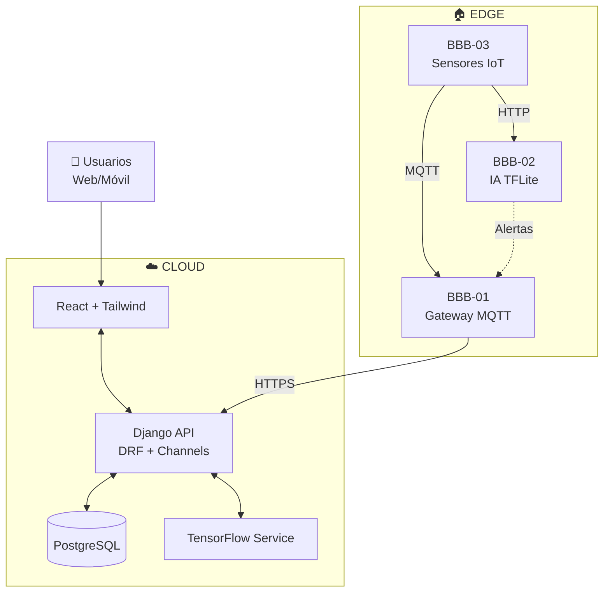

<div align="center">

# 🌾 SIGC&T Rural
### Sistema Integrado de Gestión del Conocimiento y Tecnología Rural

[](https://www.sena.edu.co/es-co/)
[](https://github.com/badolgm/sigcTiArural)
[](https://opensource.org/licenses/MIT)
[](https://www.python.org/)
[](https://docs.djangoproject.com/en/stable/)
[](https://react.dev/)
[](https://tailwindcss.com/)
[](https://beagleboard.org/black)
[](https://www.tensorflow.org/)

**Plataforma híbrida Cloud/Edge de código abierto que democratiza el acceso a agricultura inteligente mediante IoT, IA y educación técnica**

[🚀 Inicio Rápido](#-inicio-rápido) •
[📖 Documentación](#-documentación) •
[🤝 Contribuir](#-contribuciones) •
[📞 Contacto](#-contacto)

</div>

---

## 📖 Tabla de Contenidos

- [🧭 Descripción General](#-descripción-general)
- [🌟 Misión y Visión](#-misión-y-visión)
- [🌍 Impacto Social (ODS)](#-impacto-social-ods)
- [✨ Características Principales](#-características-principales)
- [🏗️ Arquitectura del Sistema](#️-arquitectura-del-sistema)
- [📊 Stack Tecnológico](#-stack-tecnológico)
- [🚀 Inicio Rápido](#-inicio-rápido)
- [🔧 Configuración](#-configuración)
- [🧪 Uso y Ejemplos](#-uso-y-ejemplos)
- [🤖 Inteligencia Artificial](#-inteligencia-artificial)
- [🧩 Estructura del Proyecto](#-estructura-del-proyecto)
- [🧪 Testing](#-testing)
- [🚢 Despliegue](#-despliegue)
- [📄 Documentación](#-documentación)
- [🤝 Contribuciones](#-contribuciones)
- [🎓 Contexto Académico SENA](#-contexto-académico-sena)
- [📚 Recursos y Referencias](#-recursos-y-referencias)
- [📜 Licencia](#-licencia)
- [👥 Autores](#-autores)
- [🙏 Agradecimientos](#-agradecimientos)
- [📞 Contacto](#-contacto)

---

## 🧭 Descripción General

**SIGC&T Rural** es una plataforma web de código abierto, con enfoque académico, científico y social, que integra **IoT**, **Inteligencia Artificial (IA)** y **educación técnica** para impulsar la agricultura sostenible y la inclusión tecnológica en zonas rurales de Colombia.

Nace en el marco del **Proyecto Productivo SENA** del programa **Tecnología en Análisis y Desarrollo de Software** y propone una arquitectura híbrida **Cloud/Edge** con dispositivos como **BeagleBone Black**, **Raspberry Pi** y **Arduino**, conectados a un backend **Django** y un frontend **React + TailwindCSS**.

### 🎯 ¿Qué ofrece la plataforma?

<table>
  <tr>
    <td width="25%" align="center"><b>🔌 Internet de las Cosas (IoT)</b><br/><sub>Sensores y actuadores en tiempo real</sub></td>
    <td width="25%" align="center"><b>🤖 Inteligencia Artificial</b><br/><sub>Diagnóstico y análisis automático</sub></td>
    <td width="25%" align="center"><b>⚡ Edge Computing</b><br/><sub>Procesamiento distribuido local</sub></td>
    <td width="25%" align="center"><b>📚 Educación Abierta</b><br/><sub>Recursos técnicos gratuitos</sub></td>
  </tr>
</table>

---

## 🌟 Misión y Visión

### 🎯 Misión
Democratizar el acceso a tecnologías de agricultura inteligente, ofreciendo herramientas de monitoreo IoT, diagnóstico con IA y educación técnica gratuita para comunidades rurales y estudiantes de todo el país.

### 🔭 Visión
Ser la plataforma referente en Latinoamérica para la transformación digital del campo mediante tecnologías abiertas, colaborativas y de impacto social medible.

---

## 🌍 Impacto Social (ODS)

El proyecto está alineado con los Objetivos de Desarrollo Sostenible de la ONU:

| ODS | Objetivo | Contribución de SIGC&T Rural |
|:---:|----------|------------------------------|
| **🌾 ODS 2** | Hambre Cero | Optimización productiva mediante datos en tiempo real y diagnóstico temprano de enfermedades |
| **🎓 ODS 4** | Educación de Calidad | Acceso abierto a formación técnica avanzada en IoT, IA y agricultura 4.0 |
| **🏭 ODS 9** | Industria, Innovación e Infraestructura | Infraestructura tecnológica de bajo costo en contextos rurales |
| **🤝 ODS 17** | Alianzas para lograr los objetivos | Articulación academia–agricultura–tecnología |

---

## ✨ Características Principales

### 📊 Monitoreo y Visualización
- Dashboard IoT en tiempo real (temperatura, humedad, luz, imágenes)
- Gráficos interactivos con series temporales
- Sistema de alertas (email/push)
- Interfaz responsive para móvil, tablet y escritorio

### 🤖 Inteligencia Artificial
- Diagnóstico de enfermedades en plantas
- Inferencia en Cloud (TensorFlow) y Edge (TensorFlow Lite)
- Transfer Learning con MobileNetV2
- Modelos pre-entrenados con PlantVillage dataset

### 📚 Contenido Educativo
- Biblioteca técnica abierta (IoT, IA, Agricultura 4.0)
- Laboratorios virtuales interactivos
- Videos tutoriales y documentación completa
- Recursos curados para estudiantes SENA

### 🔌 Integración Hardware
- Clúster de 3 BeagleBone Black Rev C
- Comunicación MQTT y WebSockets
- Lectura de sensores (DHT22, humedad de suelo)
- Captura y análisis de imágenes

### 🚀 Innovaciones Técnicas
- Arquitectura Híbrida Cloud–Edge
- Inferencia IA en Edge con latencia <500ms
- Actualizaciones en vivo con WebSockets
- API RESTful documentada
- Código 100% abierto bajo licencia MIT

---

## 🏗️ Arquitectura del Sistema

### Vista de Alto Nivel



### Componentes Principales

| Componente | Tecnología | Propósito | Puerto |
|------------|-----------|-----------|--------|
| **React App** | Vite + React 18 + TailwindCSS | Interfaz de usuario SPA | 443 (HTTPS) |
| **Django API** | Python 3.10 + Django 4 + DRF | Lógica de negocio, autenticación | 8000 → 443 |
| **Servicio IA** | TensorFlow + Keras | Inferencia de clasificación | Interno |
| **PostgreSQL** | PostgreSQL 15 | Almacenamiento persistente | 5432 |
| **Gateway (BBB-01)** | Mosquitto + Python | Broker MQTT, sincronización | 1883 |
| **IA Edge (BBB-02)** | Flask + TFLite | Inferencia local | 5000 |
| **IoT Node (BBB-03)** | Python + Adafruit_BBIO | Sensores y cámara | N/A |

> 📖 Para arquitectura detallada, consulta: `docs/MASTERDOC_v4.2_DAS.md` y `docs/architecture/README.md`

---

## 📊 Stack Tecnológico

### Backend
- **Lenguaje**: Python 3.10+
- **Framework**: Django 4.x + Django REST Framework
- **WebSockets**: Django Channels
- **Base de Datos**: PostgreSQL 15
- **Autenticación**: JWT (JSON Web Tokens)

### Frontend
- **Framework**: React 18+
- **Bundler**: Vite
- **Estilos**: TailwindCSS 3+
- **HTTP Client**: Axios
- **Gráficos**: Recharts / D3.js

### Inteligencia Artificial
- **Framework**: TensorFlow 2.x / Keras
- **Edge AI**: TensorFlow Lite
- **Visión Computacional**: OpenCV
- **Dataset**: PlantVillage (Penn State)

### Hardware Embebido
- **Placas**: BeagleBone Black Rev C
- **OS**: Debian 11 (ARM)
- **Comunicación**: Paho-MQTT, HTTP/REST
- **GPIO**: Adafruit_BBIO
- **Sensores**: DHT22, humedad de suelo, cámara USB

### DevOps (Planeado)
- **Contenedores**: Docker
- **CI/CD**: GitHub Actions
- **Servidor Web**: Nginx + Gunicorn
- **Monitoreo**: Prometheus + Grafana (futuro)

---

## 🚀 Inicio Rápido

### Requisitos Previos
```bash
# Herramientas necesarias
Git 2.30+
Python 3.10+
Node.js 18+
npm 9+
```

### 1️⃣ Clonar el Repositorio

```bash
git clone https://github.com/badolgm/sigcTiArural.git
cd sigcTiArural
```

### 2️⃣ Configurar Backend (Django)

```bash
cd src/backend

# Crear entorno virtual
python -m venv venv

# Activar entorno virtual
# Linux/Mac:
source venv/bin/activate
# Windows:
venv\Scripts\activate

# Instalar dependencias
pip install -r requirements.txt

# Ejecutar migraciones
python manage.py migrate

# Crear superusuario (opcional)
python manage.py createsuperuser

# Iniciar servidor
python manage.py runserver 0.0.0.0:8000
```

✅ El backend estará disponible en: `http://localhost:8000`

### 3️⃣ Configurar Frontend (React)

```bash
cd src/frontend

# Instalar dependencias
npm install

# Crear archivo de configuración
echo "VITE_API_URL=http://localhost:8000" > .env.local

# Iniciar servidor de desarrollo
npm run dev
```

✅ El frontend estará disponible en: `http://localhost:5173`

---

## 🔧 Configuración

### Variables de Entorno

Copia el archivo `.env.example` y crea tu propio `.env`:

```bash
cp .env.example .env
```

#### Backend (Django)
```ini
# Configuración general
DEBUG=True
SECRET_KEY=tu-secret-key-super-secreta-aqui
ALLOWED_HOSTS=localhost,127.0.0.1

# Base de datos PostgreSQL
DB_NAME=sigct_rural_db
DB_USER=sigct_user
DB_PASSWORD=tu-password-seguro
DB_HOST=localhost
DB_PORT=5432

# MQTT (Edge)
MQTT_BROKER=192.168.1.100
MQTT_PORT=1883
MQTT_USER=mqtt_user
MQTT_PASSWORD=mqtt_password
```

#### Frontend (React)
```ini
VITE_API_URL=http://localhost:8000
VITE_WS_URL=ws://localhost:8000/ws
```

### Configuración Adicional

Ajusta `config/settings.ini` para parámetros específicos de logging, timeouts y otras configuraciones avanzadas.

---

## 🧪 Uso y Ejemplos

### Ejemplo 1: Publicar Lectura de Temperatura (Edge)

```python
import Adafruit_DHT
import paho.mqtt.client as mqtt
import json
import time
from datetime import datetime

# Configuración del sensor DHT22
DHT_SENSOR = Adafruit_DHT.DHT22
DHT_PIN = "P8_11"

# Conectar al broker MQTT
client = mqtt.Client()
client.connect("192.168.1.100", 1883, 60)

# Bucle de lectura
while True:
    humidity, temperature = Adafruit_DHT.read_retry(DHT_SENSOR, DHT_PIN)
    
    if humidity and temperature:
        payload = {
            "nodo_id": "BBB-03",
            "sensor_tipo": "temperatura",
            "valor": round(temperature, 2),
            "unidad": "C",
            "timestamp": datetime.utcnow().isoformat()
        }
        
        client.publish("sigct/sensors/bbb03/temperatura", json.dumps(payload))
        print(f"✅ Publicado: {temperature}°C | Humedad: {humidity}%")
    
    time.sleep(10)
```

### Ejemplo 2: Consumir API REST (Cliente)

```bash
# Obtener lista de proyectos
curl -X GET "http://localhost:8000/api/v1/proyectos/" \
  -H "Authorization: Bearer TU_TOKEN_JWT" \
  -H "Content-Type: application/json"

# Enviar lectura de sensor
curl -X POST "http://localhost:8000/api/v1/readings/" \
  -H "Authorization: Bearer TU_TOKEN_JWT" \
  -H "Content-Type: application/json" \
  -d '{
    "nodo_id": "BBB-03",
    "sensor_tipo": "humedad_suelo",
    "valor": 45.6,
    "timestamp": "2025-01-15T10:30:00Z"
  }'
```

### Ejemplo 3: Inferencia de IA (Python)

```python
import tensorflow as tf
from PIL import Image
import numpy as np

# Cargar modelo
model = tf.keras.models.load_model('models/plant_disease_v1.h5')

# Preprocesar imagen
img = Image.open('hoja_tomate.jpg').resize((224, 224))
img_array = np.array(img) / 255.0
img_array = np.expand_dims(img_array, axis=0)

# Realizar predicción
predictions = model.predict(img_array)
class_idx = np.argmax(predictions[0])
confidence = predictions[0][class_idx]

print(f"Clase predicha: {class_idx}")
print(f"Confianza: {confidence:.2%}")
```

---

## 🤖 Inteligencia Artificial

### Arquitectura del Modelo

El sistema utiliza **Transfer Learning** con MobileNetV2 como base:

```
Input(224x224x3) 
  → MobileNetV2 (pre-trained ImageNet)
  → GlobalAveragePooling2D
  → Dropout(0.3)
  → Dense(38, softmax)
```

### Dataset

- **Fuente**: PlantVillage (Penn State University)
- **Clases**: 38 enfermedades en tomate, papa, maíz
- **Imágenes**: ~54,000 imágenes etiquetadas
- **División**: 70% entrenamiento, 20% validación, 10% prueba

### Métricas de Rendimiento

| Métrica | Cloud (TensorFlow) | Edge (TFLite) |
|---------|-------------------|---------------|
| Accuracy | 92.5% | 90.1% |
| Latencia | ~150ms | ~450ms |
| Tamaño Modelo | 52 MB (.h5) | 8 MB (.tflite) |
| Hardware | CPU/GPU | ARM Cortex-A8 |

### Notebooks de Entrenamiento

Los notebooks Jupyter para entrenamiento y evaluación están disponibles en:
- `src/ai_models/notebooks/training_mobilenetv2.ipynb`
- `src/ai_models/notebooks/model_evaluation.ipynb`
- `src/ai_models/notebooks/tflite_conversion.ipynb`

> ⚠️ **Nota de Responsabilidad**: La IA se emplea únicamente como asistente de modelos predictivos integrados en el sistema. No se atribuye contenido "generado por IA" ni por herramientas externas; todo el material técnico está curado y redactado con fines académicos.

---

## 🧩 Estructura del Proyecto

```
sigcTiArural/
├── 📄 README.md                      # Este archivo
├── 📄 .env.example                   # Plantilla de variables de entorno
├── 📄 .gitignore
├── 📄 LICENSE                        # Licencia MIT
│
├── 📁 config/                        # Configuraciones generales
│   └── settings.ini
│
├── 📁 data/                          # Datos y logs
│   ├── datasets/                     # Datasets de IA
│   ├── logs/                         # Logs del sistema
│   └── uploads/                      # Archivos subidos por usuarios
│
├── 📁 docs/                          # Documentación técnica
│   ├── MASTERDOC_v4.2_DAS.md        # Documento de Arquitectura de Software
│   ├── PLAN_MAESTRO_v4.2.md         # Plan de fases del proyecto
│   ├── API_REFERENCE.md              # Referencia de API REST
│   ├── DEPLOYMENT.md                 # Guía de despliegue
│   ├── EDGE_SETUP.md                 # Configuración de hardware Edge
│   ├── architecture/                 # Diagramas de arquitectura
│   ├── database/                     # Diseño de base de datos
│   ├── sena_artifacts/               # Artefactos académicos SENA
│   └── uml/                          # Diagramas UML
│
├── 📁 src/                           # Código fuente
│   ├── 📁 backend/                   # Backend Django
│   │   ├── manage.py
│   │   ├── requirements.txt
│   │   ├── sigct_backend/           # Proyecto Django principal
│   │   │   ├── settings.py
│   │   │   ├── urls.py
│   │   │   └── wsgi.py
│   │   ├── api/                     # API REST (DRF)
│   │   ├── users/                   # Módulo de usuarios
│   │   ├── iot/                     # Módulo IoT
│   │   └── ai_service/              # Servicio de IA
│   │
│   ├── 📁 frontend/                  # Frontend React
│   │   ├── index.html
│   │   ├── package.json
│   │   ├── vite.config.js
│   │   ├── tailwind.config.js
│   │   ├── postcss.config.js
│   │   ├── public/                  # Archivos estáticos
│   │   └── src/
│   │       ├── App.jsx
│   │       ├── main.jsx
│   │       ├── components/          # Componentes React
│   │       ├── pages/               # Páginas/vistas
│   │       ├── services/            # Servicios API
│   │       └── utils/               # Utilidades
│   │
│   ├── 📁 ai_models/                 # Modelos de IA
│   │   ├── notebooks/               # Jupyter notebooks
│   │   ├── training_scripts/        # Scripts de entrenamiento
│   │   └── production_models/       # Modelos en producción
│   │       ├── model_v1.h5          # Modelo TensorFlow
│   │       └── model_v1.tflite      # Modelo TFLite
│   │
│   └── 📁 embedded/                  # Código para hardware embebido
│       ├── bbb_01_gateway/          # BeagleBone Gateway
│       │   ├── mqtt_gateway.py
│       │   └── sync_service.py
│       ├── bbb_02_ia_edge/          # BeagleBone IA Edge
│       │   ├── flask_api.py
│       │   └── tflite_inference.py
│       └── bbb_03_sensors/          # BeagleBone Sensores
│           ├── sensor_reader.py
│           └── camera_capture.py
│
└── 📁 tests/                         # Pruebas unitarias e integración
    ├── backend/
    ├── frontend/
    └── embedded/
```

---

## 🧪 Testing

### Backend (Django)

```bash
cd src/backend

# Ejecutar todas las pruebas
python manage.py test

# Ejecutar pruebas de un módulo específico
python manage.py test api.tests

# Ejecutar con cobertura
pip install coverage
coverage run --source='.' manage.py test
coverage report
```

### Frontend (React)

```bash
cd src/frontend

# Ejecutar pruebas
npm test

# Ejecutar con cobertura
npm test -- --coverage

# Ejecutar en modo watch
npm test -- --watch
```

### Hardware Embebido

```bash
cd src/embedded

# Instalar pytest
pip install pytest pytest-cov

# Ejecutar pruebas
python -m pytest -v

# Con cobertura
python -m pytest --cov=. --cov-report=html
```

---

## 🚢 Despliegue

### Desarrollo Local

Ya cubierto en la sección [🚀 Inicio Rápido](#-inicio-rápido)

### Despliegue en Cloud (Render/Railway)

#### Backend Django

1. Crear cuenta en [Render.com](https://render.com/)
2. Conectar repositorio de GitHub
3. Configurar variables de entorno
4. Definir comando de inicio: `gunicorn sigct_backend.wsgi:application`

#### Frontend React

1. Build de producción:
```bash
cd src/frontend
npm run build
```

2. Desplegar carpeta `dist/` en Render Static Site o Netlify

### Configuración de Hardware Edge

Consulta la guía detallada: [`docs/EDGE_SETUP.md`](docs/EDGE_SETUP.md)

**Resumen**:
1. Flashear Debian 11 en BeagleBone Black
2. Configurar red local estática
3. Instalar dependencias Python y Mosquitto
4. Copiar scripts de `src/embedded/`
5. Configurar servicios systemd
6. Conectar sensores a pines GPIO

---

## 📄 Documentación

### Documentación Principal

| Documento | Descripción |
|-----------|-------------|
| [MASTERDOC_v4.2_DAS.md](docs/MASTERDOC_v4.2_DAS.md) | Documento de Arquitectura de Software completo |
| [PLAN_MAESTRO_v4.2.md](docs/PLAN_MAESTRO_v4.2.md) | Plan maestro de fases del proyecto |
| [API_REFERENCE.md](docs/API_REFERENCE.md) | Referencia completa de API REST |
| [DEPLOYMENT.md](docs/DEPLOYMENT.md) | Guía de despliegue en producción |
| [EDGE_SETUP.md](docs/EDGE_SETUP.md) | Configuración de dispositivos Edge |

### Documentación por Categoría

- **Arquitectura**: `docs/architecture/README.md`
- **Base de Datos**: `docs/database/README.md`
- **Diagramas UML**: `docs/uml/README.md`
- **Artefactos SENA**: `docs/sena_artifacts/README.md`

### API REST

La API está documentada con:
- Swagger/OpenAPI (en construcción)
- Postman Collection (disponible en `docs/postman/`)

**Endpoints principales**:
- `GET /api/v1/proyectos/` - Listar proyectos
- `POST /api/v1/readings/` - Enviar lectura de sensor
- `POST /api/v1/ia/classify/` - Clasificar imagen
- `GET /api/v1/dashboard/stats/` - Estadísticas del dashboard

---

## 🤝 Contribuciones

¡Las contribuciones son bienvenidas! Este es un proyecto académico de código abierto.

### Cómo Contribuir

1. **Fork** el repositorio
2. Crea una **rama** para tu feature: `git checkout -b feature/mi-nueva-funcionalidad`
3. **Commit** tus cambios: `git commit -am 'Agrega nueva funcionalidad X'`
4. **Push** a la rama: `git push origin feature/mi-nueva-funcionalidad`
5. Abre un **Pull Request**

### Guías de Estilo

- **Python**: Seguir PEP 8
- **JavaScript**: Seguir ESLint + Prettier
- **Commits**: Mensajes claros y descriptivos en español
- **Documentación**: Actualizar README y docs según cambios

### Reporte de Bugs

Abre un **Issue** en GitHub con:
- Descripción clara del problema
- Pasos para reproducir
- Comportamiento esperado vs. actual
- Screenshots (si aplica)
- Entorno (OS, versión de Python/Node, etc.)

---

## 🎓 Contexto Académico SENA

Este proyecto es parte del **Programa de Tecnología en Análisis y Desarrollo de Software (ADSO)** del **SENA** (Servicio Nacional de Aprendizaje de Colombia).

### Objetivos Académicos

- Aplicar conocimientos de desarrollo web full-stack
- Integrar tecnologías IoT y hardware embebido
- Implementar soluciones de IA en agricultura
- Desarrollar habilidades de trabajo colaborativo
- Contribuir al impacto social mediante tecnología

### Competencias Desarrolladas

- ✅ Desarrollo de aplicaciones web con Django y React
- ✅ Diseño e implementación de APIs RESTful
- ✅ Integración de sistemas IoT (MQTT, sensores)
- ✅ Implementación de modelos de Machine Learning
- ✅ Despliegue en infraestructura Cloud/Edge
- ✅ Documentación técnica profesional

---

## 📚 Recursos y Referencias

### Enlaces Oficiales

- **SENA**: [https://www.sena.edu.co/](https://www.sena.edu.co/es-co/)
- **Repositorio GitHub**: [https://github.com/badolgm/sigcTiArural](https://github.com/badolgm/sigcTiArural)

### Datasets y Recursos Académicos

- **PlantVillage** (Penn State): [https://plantvillage.psu.edu/](https://plantvillage.psu.edu/)
- **PlantVillage Dataset** (GitHub): [https://github.com/spMohanty/PlantVillage-Dataset](https://github.com/spMohanty/PlantVillage-Dataset)
- **Kaggle - Plant Disease Classification**: [Notebook de referencia](https://www.kaggle.com/code/shreyashpatil217/plant-disease-classification-transfer-learnig)

### Documentación Técnica

- **Django**: [https://docs.djangoproject.com/](https://docs.djangoproject.com/)
- **React**: [https://react.dev/](https://react.dev/)
- **TensorFlow**: [https://www.tensorflow.org/](https://www.tensorflow.org/)
- **BeagleBone**: [https://beagleboard.org/](https://beagleboard.org/)
- **MQTT**: [https://mqtt.org/](https://mqtt.org/)

### Cursos y Tutoriales

- **Open FING**: [https://open.fing.edu.uy/](https://open.fing.edu.uy/)
- **TensorFlow for Beginners**: [https://www.tensorflow.org/tutorials](https://www.tensorflow.org/tutorials)
- **Django REST Framework**: [https://www.django-rest-framework.org/tutorial/quickstart/](https://www.django-rest-framework.org/tutorial/quickstart/)
- **React Official Tutorial**: [https://react.dev/learn](https://react.dev/learn)

### Comunidades y Foros

- **Stack Overflow**: Para consultas técnicas
- **GitHub Discussions**: Para discusiones sobre el proyecto
- **Discord SENA ADSO**: Comunidad de aprendices (enlace interno)

---

## 📜 Licencia

Este proyecto está licenciado bajo la **Licencia MIT**.

```
MIT License

Copyright (c) 2025 Bernardo A. Gómez Montoya - Proyecto SIGC&T Rural

Permission is hereby granted, free of charge, to any person obtaining a copy
of this software and associated documentation files (the "Software"), to deal
in the Software without restriction, including without limitation the rights
to use, copy, modify, merge, publish, distribute, sublicense, and/or sell
copies of the Software, and to permit persons to whom the Software is
furnished to do so, subject to the following conditions:

The above copyright notice and this permission notice shall be included in all
copies or substantial portions of the Software.

THE SOFTWARE IS PROVIDED "AS IS", WITHOUT WARRANTY OF ANY KIND, EXPRESS OR
IMPLIED, INCLUDING BUT NOT LIMITED TO THE WARRANTIES OF MERCHANTABILITY,
FITNESS FOR A PARTICULAR PURPOSE AND NONINFRINGEMENT. IN NO EVENT SHALL THE
AUTHORS OR COPYRIGHT HOLDERS BE LIABLE FOR ANY CLAIM, DAMAGES OR OTHER
LIABILITY, WHETHER IN AN ACTION OF CONTRACT, TORT OR OTHERWISE, ARISING FROM,
OUT OF OR IN CONNECTION WITH THE SOFTWARE OR THE USE OR OTHER DEALINGS IN THE
SOFTWARE.
```

**Esto significa que puedes**:
- ✅ Usar el código comercialmente
- ✅ Modificar el código
- ✅ Distribuir el código
- ✅ Uso privado

**Con las siguientes condiciones**:
- 📄 Incluir la licencia y el aviso de copyright
- 📄 Indicar cambios realizados

---

## 👥 Autores

### 👨‍💻 Desarrollador Principal

**Bernardo A. Gómez Montoya**
- 🎓 Tecnólogo en Análisis y Desarrollo de Software - SENA
- 💼 Desarrollador e Investigador - Proyecto SIGC&T Rural
- 📧 Email: [badolgm@gmail.com](mailto:badolgm@gmail.com)
- 🌍 Ubicación: Colombia
- 🔗 GitHub: [@badolgm](https://github.com/badolgm)

### 🤝 Colaboradores y Apoyo

Este proyecto ha sido posible gracias al apoyo de:

- **Instructores SENA** - Orientación técnica y académica
- **Compañeros Aprendices ADSO** - Pruebas y retroalimentación
- **Comunidad Open Source** - Herramientas y bibliotecas
- **PlantVillage (Penn State)** - Datasets de enfermedades de plantas

### 🌱 Cómo Ser Parte

Si deseas contribuir o colaborar en este proyecto:
1. Revisa la sección [🤝 Contribuciones](#-contribuciones)
2. Abre un Issue o Pull Request
3. Únete a las discusiones en GitHub
4. Comparte el proyecto con otros estudiantes y agricultores

---

## 🙏 Agradecimientos

Queremos agradecer especialmente a:

### 🏛️ Instituciones

- **SENA (Servicio Nacional de Aprendización)** - Por la formación técnica y el apoyo institucional
- **Penn State University** - Por el dataset PlantVillage de acceso abierto
- **Open Source Community** - Por las herramientas y bibliotecas utilizadas

### 👨‍🏫 Mentores y Educadores

- Instructores del programa ADSO del SENA
- Comunidad educativa que promueve la tecnología en el campo

### 🌾 Agricultores y Comunidades Rurales

- Por su valiosa retroalimentación sobre necesidades reales
- Por confiar en la tecnología como herramienta de transformación

### 💻 Proyectos Open Source Utilizados

- **Django** & **Django REST Framework**
- **React** & **Vite**
- **TensorFlow** & **Keras**
- **BeagleBoard.org** - Por la documentación de BeagleBone Black
- **Mosquitto** (Eclipse Foundation)
- **TailwindCSS**
- Todos los proyectos listados en `requirements.txt` y `package.json`

---

## 📞 Contacto

### 📧 Información de Contacto

**Email Principal**: [badolgm@gmail.com](mailto:badolgm@gmail.com)

### 🔗 Enlaces del Proyecto

- **Repositorio GitHub**: [https://github.com/badolgm/sigcTiArural](https://github.com/badolgm/sigcTiArural)
- **Issues (Reportar Bugs)**: [https://github.com/badolgm/sigcTiArural/issues](https://github.com/badolgm/sigcTiArural/issues)
- **Discussions**: [https://github.com/badolgm/sigcTiArural/discussions](https://github.com/badolgm/sigcTiArural/discussions)

### 💬 Soporte

**¿Tienes preguntas?**
1. Revisa primero la [📄 Documentación](#-documentación)
2. Busca en [Issues](https://github.com/badolgm/sigcTiArural/issues) si ya fue reportado
3. Abre un nuevo Issue con tu pregunta
4. Envía un email a [badolgm@gmail.com](mailto:badolgm@gmail.com)

**¿Encontraste un bug?**
1. Abre un Issue con etiqueta `bug`
2. Incluye pasos para reproducirlo
3. Adjunta logs y screenshots si es posible

**¿Tienes una idea?**
1. Abre un Issue con etiqueta `enhancement`
2. Describe tu propuesta claramente
3. Explica el valor que aportaría al proyecto

---

## 🚀 Roadmap y Próximos Pasos

### Fase Actual: Alpha v0.5 ✅

- [x] Arquitectura base Cloud/Edge
- [x] Dashboard IoT básico
- [x] Modelo de IA funcional
- [x] Comunicación MQTT
- [x] Documentación técnica

### Fase 1: Beta v1.0 (Q2 2025) 🚧

- [ ] Sistema de autenticación completo (JWT)
- [ ] WebSockets para actualizaciones en tiempo real
- [ ] Dashboard avanzado con gráficos históricos
- [ ] Alertas por email y push notifications
- [ ] API RESTful completa y documentada (Swagger)
- [ ] Tests unitarios (>80% cobertura)

### Fase 2: Producción v1.5 (Q3 2025) 📋

- [ ] Despliegue en Cloud (Render/Railway)
- [ ] Optimización de modelos IA
- [ ] Sistema de roles y permisos
- [ ] Módulo de contenido educativo completo
- [ ] Integración con más sensores
- [ ] Documentación de usuario final

### Fase 3: Escalamiento v2.0 (Q4 2025) 🔮

- [ ] Soporte para múltiples cultivos
- [ ] Panel de administración avanzado
- [ ] Integración con SofiaPlus (SENA)
- [ ] Aplicación móvil nativa (React Native)
- [ ] Sistema de recomendaciones con IA
- [ ] Marketplace de sensores y hardware

---

## 📊 Estadísticas del Proyecto

```
📈 Proyecto Activo Desde: Enero 2025
👨‍💻 Commits: 150+
📁 Archivos: 200+
⭐ Stars: 0 (¡Sé el primero!)
🍴 Forks: 0
🐛 Issues Abiertos: 0
✅ Issues Cerrados: 0
```

### 🏆 Objetivos de Impacto

| Métrica | Meta 2025 | Progreso |
|---------|-----------|----------|
| Estudiantes Capacitados | 100+ | 🔄 En proceso |
| Agricultores Beneficiados | 20+ | 🔄 En proceso |
| Nodos Edge Desplegados | 10+ | 🔄 En proceso |
| Cursos Publicados | 15+ | 🔄 En proceso |
| Modelos IA Entrenados | 5+ | ✅ 2/5 |

---

## 🎯 Casos de Uso

### 👨‍🌾 Para Agricultores

**Problema**: Detección tardía de enfermedades en cultivos
**Solución**: 
- Captura de imagen con cámara
- Diagnóstico automático con IA en <2 segundos
- Recomendaciones de tratamiento
- Alertas tempranas

**Problema**: Falta de datos para tomar decisiones
**Solución**:
- Monitoreo 24/7 de temperatura, humedad
- Historial de datos con gráficos
- Tendencias y predicciones
- Acceso desde móvil

### 🎓 Para Estudiantes

**Problema**: Falta de recursos de IoT y IA en zonas rurales
**Solución**:
- Acceso gratuito a laboratorios virtuales
- Contenido educativo curado
- Experimentación con hardware real (remoto)
- Certificados de completitud

### 👨‍🏫 Para Instructores

**Problema**: Dificultad para enseñar IoT sin hardware
**Solución**:
- Plataforma completa lista para usar
- Documentación pedagógica
- Ejemplos de código comentados
- Dashboard de seguimiento de estudiantes

---

## 🌟 Casos de Éxito

> *En construcción - Próximamente compartiremos historias de impacto real*

---

## ❓ Preguntas Frecuentes (FAQ)

### ¿Es realmente gratuito?
Sí, el proyecto es 100% código abierto bajo licencia MIT. Puedes usarlo, modificarlo y redistribuirlo libremente.

### ¿Necesito hardware especializado?
Para usar la plataforma web, solo necesitas un navegador. Para el laboratorio Edge, se requieren BeagleBone Black o similares (opcional).

### ¿Funciona sin conexión a internet?
El Edge computing permite funcionamiento parcial sin internet. Los datos se almacenan localmente y se sincronizan cuando hay conexión.

### ¿Puedo usar otros cultivos además de tomate y papa?
Actualmente el modelo está entrenado para tomate y papa. Puedes reentrenar el modelo con tus propios datos siguiendo los notebooks incluidos.

### ¿Cómo puedo contribuir sin saber programar?
Puedes ayudar con:
- Documentación
- Traducción a otros idiomas
- Pruebas de usuario
- Difusión del proyecto
- Feedback y sugerencias

### ¿El proyecto tiene soporte técnico?
Como proyecto académico, el soporte es limitado. Puedes abrir Issues en GitHub o enviar email. La comunidad también ayuda.

### ¿Puedo usar esto en mi finca/empresa?
Sí, la licencia MIT lo permite. El software se proporciona "tal cual" sin garantías. Recomendamos hacer pruebas exhaustivas antes de uso en producción.

---

<div align="center">

## 🌱 "La educación tecnológica aplicada es el camino más corto entre la idea y la innovación"

### — Proyecto SIGC&T Rural

---

[](https://github.com/badolgm/sigcTiArural)
[](https://github.com/badolgm/sigcTiArural/fork)
[](https://github.com/badolgm/sigcTiArural)

---

**¿Te gusta este proyecto?** ⭐ **Dale una estrella en GitHub** y ayúdanos a llegar a más estudiantes y agricultores.

**¿Tienes ideas?** 💡 **Abre un Issue** o únete a las **Discussions**.

**¿Quieres colaborar?** 🤝 **Envía un Pull Request** o **contáctanos por email**.

---

### Hecho con ❤️ en Colombia 🇨🇴 para el mundo 🌍

**SIGC&T Rural** - Democratizando la tecnología agrícola

© 2025 Bernardo A. Gómez Montoya | Licencia MIT

---

[🔝 Volver arriba](#-sigct-rural)

</div>