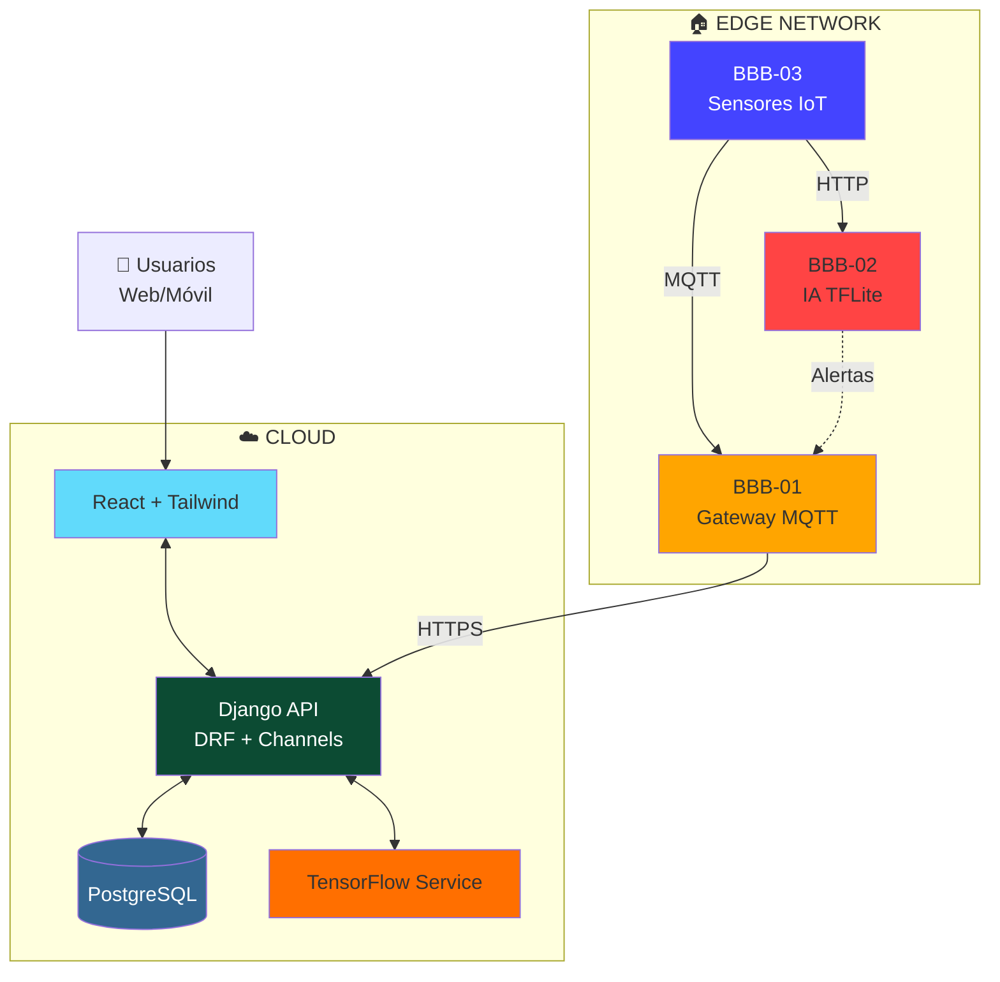

<div align="center">

# 🌾 SIGC&T Rural

### Sistema Integrado de Gestión del Conocimiento y Tecnología Rural

[](https://www.sena.edu.co/es-co/)
[](https://github.com/badolgm/sigcTiArural)
[](LICENSE)

[](https://www.python.org/)
[](https://docs.djangoproject.com/)
[](https://react.dev/)
[](https://tailwindcss.com/)

[](https://beagleboard.org/black)
[](https://www.tensorflow.org/)

---

**Plataforma híbrida Cloud/Edge de código abierto que democratiza el acceso a agricultura inteligente mediante IoT, IA y educación técnica**

[🚀 Inicio Rápido](#-inicio-rápido) • [📖 Documentación](#-documentación) • [🤝 Contribuir](#-contribuciones) • [📞 Contacto](#-contacto)

</div>

---

## 📖 Tabla de Contenidos

- [🧭 Descripción General](#-descripción-general)
- [🎯 Misión y Visión](#-misión-y-visión)
- [🌍 Impacto Social](#-impacto-social-ods)
- [✨ Características](#-características-principales)
- [🏗️ Arquitectura](#️-arquitectura-del-sistema)
- [📊 Stack Tecnológico](#-stack-tecnológico)
- [🚀 Inicio Rápido](#-inicio-rápido)
- [📄 Documentación](#-documentación)
- [🤝 Contribuciones](#-contribuciones)
- [📜 Licencia](#-licencia)
- [👥 Autores](#-autores)

---

## 🧭 Descripción General

**SIGC&T Rural** es una plataforma web de código abierto, con enfoque académico, científico y social, que integra **IoT**, **Inteligencia Artificial** y **educación técnica** para impulsar la agricultura sostenible y la inclusión tecnológica en zonas rurales de Colombia.

Desarrollado como **Proyecto Productivo SENA** del programa **Tecnología en Análisis y Desarrollo de Software (ADSO)**.

<div align="center">

### 🎯 ¿Qué ofrece la plataforma?

| 🔌 IoT | 🤖 IA | ⚡ Edge Computing | 📚 Educación |
|:------:|:-----:|:----------------:|:------------:|
| Sensores en tiempo real | Diagnóstico automático | Procesamiento local | Recursos gratuitos |
| MQTT + WebSockets | TensorFlow + TFLite | BeagleBone Black | Laboratorios virtuales |

</div>

---

## 🎯 Misión y Visión

### 🌟 Misión

Democratizar el acceso a tecnologías de agricultura inteligente, ofreciendo herramientas de monitoreo IoT, diagnóstico con IA y educación técnica gratuita para comunidades rurales y estudiantes.

### 🔭 Visión

Ser la plataforma referente en Latinoamérica para la transformación digital del campo mediante tecnologías abiertas y colaborativas.

---

## 🌍 Impacto Social (ODS)

<div align="center">

| ODS | Objetivo | Contribución |
|:---:|----------|--------------|
| 🌾 **ODS 2** | Hambre Cero | Optimización productiva con datos en tiempo real |
| 🎓 **ODS 4** | Educación de Calidad | Formación técnica gratuita en IoT, IA y Agricultura 4.0 |
| 🏭 **ODS 9** | Industria e Innovación | Infraestructura tecnológica de bajo costo |
| 🤝 **ODS 17** | Alianzas | Articulación academia–agricultura–tecnología |

</div>

---

## ✨ Características Principales

### 📊 Monitoreo IoT
- Dashboard en tiempo real (temperatura, humedad, luz)
- Gráficos interactivos con series temporales
- Sistema de alertas (email/push)
- Interfaz responsive (móvil, tablet, escritorio)

### 🤖 Inteligencia Artificial
- Diagnóstico de enfermedades en plantas
- Inferencia Cloud (TensorFlow) y Edge (TFLite)
- Transfer Learning con MobileNetV2
- Dataset PlantVillage (92.5% accuracy)

### 📚 Contenido Educativo
- Biblioteca técnica abierta
- Laboratorios virtuales interactivos
- Videos tutoriales
- Recursos curados para estudiantes SENA

### 🔌 Hardware Embebido
- Clúster 3x BeagleBone Black Rev C
- Comunicación MQTT + WebSockets
- Sensores DHT22, humedad de suelo
- Captura y análisis de imágenes

---

## 🏗️ Arquitectura del Sistema

### Vista de Contexto del Sistema

<div align="center">


*Diagrama C4 Nivel 1: Actores, Sistema y Sistemas Externos*
</div>

### Vista de Contenedores

<div align="center">


*Diagrama C4 Nivel 2: Arquitectura de Contenedores Cloud/Edge*
</div>

### Vista de Alto Nivel

<div align="center">


*Arquitectura Híbrida Cloud-Edge*
</div>

<details>
<summary><b>📊 Ver Diagrama Mermaid Interactivo</b></summary>



</details>

### Componentes Principales

| Componente | Tecnología | Propósito | Puerto |
|------------|-----------|-----------|--------|
| **React App** | Vite + React 18 + TailwindCSS | Interfaz de usuario SPA | 443 (HTTPS) |
| **Django API** | Python 3.10 + Django 4 + DRF | Lógica de negocio, autenticación | 8000 → 443 |
| **Servicio IA** | TensorFlow + Keras | Inferencia de clasificación | Interno |
| **PostgreSQL** | PostgreSQL 15 | Almacenamiento persistente | 5432 |
| **Gateway (BBB-01)** | Mosquitto + Python | Broker MQTT, sincronización | 1883 |
| **IA Edge (BBB-02)** | Flask + TFLite | Inferencia local | 5000 |
| **IoT Node (BBB-03)** | Python + Adafruit_BBIO | Sensores y cámara | N/A |

> 📖 **Documentación detallada:** [docs/MASTERDOC_v4.2_DAS.md](documentación/MASTERDOC.md) | [docs/architecture/](documentación/architecture/)

---

## 📊 Stack Tecnológico

<div align="center">

### Backend


### Frontend


### Inteligencia Artificial


### Hardware Embebido


</div>

---

## 🚀 Inicio Rápido

### Requisitos Previos

```bash
Git 2.30+
Python 3.10+
Node.js 18+
npm 9+
```

### 1️⃣ Clonar el Repositorio

```bash
git clone https://github.com/badolgm/sigcTiArural.git
cd sigcTiArural
```

### 2️⃣ Backend (Django)

```bash
cd src/backend

# Crear y activar entorno virtual
python -m venv venv
source venv/bin/activate  # Linux/Mac
# venv\Scripts\activate   # Windows

# Instalar dependencias
pip install -r requirements.txt

# Migrar base de datos
python manage.py migrate

# Crear superusuario (opcional)
python manage.py createsuperuser

# Iniciar servidor
python manage.py runserver 0.0.0.0:8000
```

✅ Backend disponible en: `http://localhost:8000`

### 3️⃣ Frontend (React + Vite)

```bash
cd src/frontend

# Instalar dependencias
npm install

# Configurar variables de entorno
echo "VITE_API_URL=http://localhost:8000" > .env.local

# Iniciar servidor de desarrollo
npm run dev
```

✅ Frontend disponible en: `http://localhost:5173`

---

## 🔧 Configuración

### Variables de Entorno

**Backend (`.env` en `src/backend/`)**

```ini
# Django
DEBUG=True
SECRET_KEY=tu-secret-key-super-secreta
ALLOWED_HOSTS=localhost,127.0.0.1

# Base de datos
DB_NAME=sigct_rural_db
DB_USER=sigct_user
DB_PASSWORD=tu-password-seguro
DB_HOST=localhost
DB_PORT=5432

# MQTT (Edge)
MQTT_BROKER=192.168.1.100
MQTT_PORT=1883
MQTT_USER=mqtt_user
MQTT_PASSWORD=mqtt_password
```

**Frontend (`.env.local` en `src/frontend/`)**

```ini
VITE_API_URL=http://localhost:8000
VITE_WS_URL=ws://localhost:8000/ws
```

---

## 🧪 Ejemplos de Uso

### Ejemplo 1: Publicar Lectura de Sensor (Edge)

```python
import Adafruit_DHT
import paho.mqtt.client as mqtt
import json
from datetime import datetime

# Configuración
DHT_SENSOR = Adafruit_DHT.DHT22
DHT_PIN = "P8_11"

client = mqtt.Client()
client.connect("192.168.1.100", 1883, 60)

# Lectura continua
while True:
    humidity, temperature = Adafruit_DHT.read_retry(DHT_SENSOR, DHT_PIN)
    
    if humidity and temperature:
        payload = {
            "nodo_id": "BBB-03",
            "sensor_tipo": "temperatura",
            "valor": round(temperature, 2),
            "timestamp": datetime.utcnow().isoformat()
        }
        
        client.publish("sigct/sensors/bbb03/temperatura", json.dumps(payload))
        print(f"✅ {temperature}°C | {humidity}%")
    
    time.sleep(10)
```

### Ejemplo 2: Consumir API REST

```bash
# Obtener proyectos
curl -X GET "http://localhost:8000/api/v1/proyectos/" \
  -H "Authorization: Bearer TOKEN" \
  -H "Content-Type: application/json"

# Enviar lectura de sensor
curl -X POST "http://localhost:8000/api/v1/readings/" \
  -H "Authorization: Bearer TOKEN" \
  -H "Content-Type: application/json" \
  -d '{
    "nodo_id": "BBB-03",
    "sensor_tipo": "humedad_suelo",
    "valor": 45.6,
    "timestamp": "2025-01-15T10:30:00Z"
  }'
```

### Ejemplo 3: Inferencia con IA

```python
import tensorflow as tf
from PIL import Image
import numpy as np

# Cargar modelo
model = tf.keras.models.load_model('models/plant_disease_v1.h5')

# Preprocesar imagen
img = Image.open('hoja_tomate.jpg').resize((224, 224))
img_array = np.array(img) / 255.0
img_array = np.expand_dims(img_array, axis=0)

# Predicción
predictions = model.predict(img_array)
class_idx = np.argmax(predictions[0])
confidence = predictions[0][class_idx]

print(f"Clase: {class_idx} | Confianza: {confidence:.2%}")
```

---

## 🤖 Inteligencia Artificial

### Arquitectura del Modelo

Transfer Learning con **MobileNetV2**:

```
Input(224x224x3) 
  → MobileNetV2 (ImageNet)
  → GlobalAveragePooling2D
  → Dropout(0.3)
  → Dense(38, softmax)
```

### Dataset y Métricas

- **Fuente:** PlantVillage (Penn State University)
- **Clases:** 38 enfermedades (tomate, papa, maíz)
- **Imágenes:** ~54,000 etiquetadas

| Métrica | Cloud | Edge |
|---------|-------|------|
| Accuracy | 92.5% | 90.1% |
| Latencia | ~150ms | ~450ms |
| Tamaño | 52 MB | 8 MB |

> 📓 **Notebooks:** `src/ai_models/notebooks/`

---

## 🧩 Estructura del Proyecto

```
sigcTiArural/
├── 📄 README.md                    # Este archivo
├── 📄 LICENSE                      # MIT License
├── 📄 .env.example                 # Plantilla de configuración
│
├── 📁 documentación/                # Documentación técnica
│   ├── MASTERDOC.md                # DAS completo
│   ├── PLANMAESTRO.md              # Plan de fases
│   ├── API_REFERENCE.md            # Referencia API
│   ├── DEPLOYMENT.md               # Guía de despliegue
│   ├── diagramas/                  # Diagramas UML/C4
│   ├── sena_artifacts/             # Artefactos SENA
│   └── evidencias/                 # Evidencias del proyecto
│
├── 📁 src/                         # Código fuente
│   ├── backend/                    # Django
│   │   ├── sigct_backend/         # Proyecto principal
│   │   ├── api/                   # API REST (DRF)
│   │   ├── users/                 # Usuarios
│   │   ├── iot/                   # Módulo IoT
│   │   └── ia_service/            # Servicio IA
│   │
│   ├── frontend/                   # React
│   │   ├── src/
│   │   │   ├── components/       # Componentes React
│   │   │   ├── pages/            # Páginas/vistas
│   │   │   ├── services/         # Servicios API
│   │   │   └── utils/            # Utilidades
│   │   └── public/               # Archivos estáticos
│   │
│   ├── ai_models/                  # Modelos IA
│   │   ├── notebooks/            # Jupyter notebooks
│   │   ├── training_scripts/     # Entrenamiento
│   │   └── production_models/    # Modelos .h5 y .tflite
│   │
│   └── embedded/                   # Hardware Edge
│       ├── bbb_01_gateway/       # Gateway MQTT
│       ├── bbb_02_ia_edge/       # IA local
│       └── bbb_03_sensors/       # Sensores IoT
│
└── 📁 tests/                       # Pruebas
    ├── backend/
    ├── frontend/
    └── embedded/
```

---

## 🧪 Testing

### Backend

```bash
cd src/backend
python manage.py test
```

### Frontend

```bash
cd src/frontend
npm test
```

### Hardware Embebido

```bash
cd src/embedded
python -m pytest -v
```

---

## 📄 Documentación

| Documento | Descripción |
|-----------|-------------|
| [MASTERDOC.md](documentación/MASTERDOC.md) | Documento de Arquitectura de Software (DAS) |
| [PLANMAESTRO.md](documentación/PLANMAESTRO.md) | Plan de fases y cronograma |
| [API_REFERENCE.md](documentación/API_REFERENCE.md) | Referencia completa de API REST |
| [DEPLOYMENT.md](documentación/DEPLOYMENT.md) | Guía de despliegue producción |
| [diagramas/](documentación/diagramas/) | Diagramas UML y C4 |

---

## 🤝 Contribuciones

¡Las contribuciones son bienvenidas! 🎉

### Cómo Contribuir

1. **Fork** el repositorio
2. Crea una rama: `git checkout -b feature/nueva-funcionalidad`
3. Commit: `git commit -am 'feat: Agregar funcionalidad X'`
4. Push: `git push origin feature/nueva-funcionalidad`
5. Abre un **Pull Request**

### Guías de Estilo

- **Python:** PEP 8
- **JavaScript:** ESLint + Prettier
- **Commits:** Mensajes claros (feat/fix/docs/style)

### Reporte de Bugs

Abre un **Issue** con:
- Descripción clara del problema
- Pasos para reproducir
- Screenshots (si aplica)
- Entorno (OS, versiones)

---

## 🎓 Contexto Académico SENA

Proyecto del programa **Tecnología en Análisis y Desarrollo de Software (ADSO)** del **SENA**.

### Competencias Desarrolladas

- ✅ Desarrollo web full-stack (Django + React)
- ✅ Diseño de APIs RESTful
- ✅ Integración de sistemas IoT (MQTT, sensores)
- ✅ Implementación de modelos de Machine Learning
- ✅ Despliegue Cloud/Edge
- ✅ Documentación técnica profesional

---

## 📚 Recursos y Referencias

### Enlaces Oficiales

- **SENA:** [sena.edu.co](https://www.sena.edu.co/es-co/)
- **Repositorio:** [github.com/badolgm/sigcTiArural](https://github.com/badolgm/sigcTiArural)

### Datasets y Recursos

- **PlantVillage:** [plantvillage.psu.edu](https://plantvillage.psu.edu/)
- **Dataset GitHub:** [PlantVillage-Dataset](https://github.com/spMohanty/PlantVillage-Dataset)
- **Kaggle:** [Plant Disease Classification](https://www.kaggle.com/code/shreyashpatil217/plant-disease-classification-transfer-learnig)

### Documentación Técnica

- **Django:** [docs.djangoproject.com](https://docs.djangoproject.com/)
- **React:** [react.dev](https://react.dev/)
- **TensorFlow:** [tensorflow.org](https://www.tensorflow.org/)
- **BeagleBone:** [beagleboard.org](https://beagleboard.org/)

---

## 📜 Licencia

Proyecto bajo **Licencia MIT** - Ver [LICENSE](LICENSE) para detalles.

```
Copyright (c) 2025 Bernardo A. Gómez Montoya - SIGC&T Rural
```

**Puedes:**
- ✅ Usar comercialmente
- ✅ Modificar
- ✅ Distribuir
- ✅ Uso privado

**Condiciones:**
- 📄 Incluir licencia y copyright
- 📄 Indicar cambios realizados

---

## 👥 Autores

### 👨‍💻 Desarrollador Principal

**Bernardo A. Gómez Montoya**

- 🎓 Tecnólogo ADSO - SENA
- 💼 Desarrollador e Investigador
- 📧 badolgm@gmail.com
- 🌍 Colombia
- 🔗 [@badolgm](https://github.com/badolgm)

### 🤝 Colaboradores

- Instructores SENA
- Compañeros Aprendices ADSO
- Comunidad Open Source
- PlantVillage (Penn State University)

---

## 🙏 Agradecimientos

- **SENA** - Formación técnica y apoyo institucional
- **Penn State University** - Dataset PlantVillage
- **Comunidad Open Source** - Herramientas y bibliotecas
- **Agricultores y comunidades rurales** - Retroalimentación valiosa

### 💻 Tecnologías Open Source Utilizadas

Django • React • TensorFlow • BeagleBoard • Mosquitto • TailwindCSS • PostgreSQL • Y muchas más...

---

## 📞 Contacto

### 📧 Información

- **Email:** [badolgm@gmail.com](mailto:badolgm@gmail.com)
- **GitHub:** [github.com/badolgm/sigcTiArural](https://github.com/badolgm/sigcTiArural)
- **Issues:** [Reportar bugs](https://github.com/badolgm/sigcTiArural/issues)
- **Discussions:** [Unirse a la conversación](https://github.com/badolgm/sigcTiArural/discussions)

---

## 🚀 Roadmap

### ✅ Fase Actual: Alpha v0.5

- [x] Arquitectura base Cloud/Edge
- [x] Dashboard IoT básico
- [x] Modelo de IA funcional
- [x] Comunicación MQTT
- [x] Documentación técnica

### 🚧 Próximos Pasos: Beta v1.0 (Q2 2025)

- [ ] Autenticación JWT completa
- [ ] WebSockets en tiempo real
- [ ] Dashboard avanzado
- [ ] Sistema de alertas
- [ ] API documentada (Swagger)
- [ ] Tests (>80% cobertura)

### 🔮 Futuro: v1.5+ (Q3-Q4 2025)

- [ ] Despliegue en Cloud
- [ ] Más sensores y cultivos
- [ ] Panel de administración
- [ ] App móvil nativa
- [ ] Integración SofiaPlus (SENA)

---

## ❓ FAQ

<details>
<summary><b>¿Es realmente gratuito?</b></summary>

Sí, 100% código abierto bajo licencia MIT. Puedes usarlo, modificarlo y redistribuirlo libremente.
</details>

<details>
<summary><b>¿Necesito hardware especializado?</b></summary>

Para la plataforma web, solo necesitas un navegador. Para el laboratorio Edge, se requieren BeagleBone Black (opcional).
</details>

<details>
<summary><b>¿Funciona sin internet?</b></summary>

El Edge computing permite funcionamiento parcial offline. Los datos se almacenan localmente y se sincronizan cuando hay conexión.
</details>

<details>
<summary><b>¿Puedo usar otros cultivos?</b></summary>

Actualmente está entrenado para tomate y papa. Puedes reentrenar el modelo con tus propios datos siguiendo los notebooks incluidos.
</details>

---

<div align="center">

## 🌱 "La educación tecnológica aplicada es el camino más corto entre la idea y la innovación"

### — Proyecto SIGC&T Rural

---

[](https://github.com/badolgm/sigcTiArural)
[](https://github.com/badolgm/sigcTiArural/fork)
[](https://github.com/badolgm/sigcTiArural)

---

**Hecho con ❤️ en Colombia 🇨🇴 para el mundo 🌍**

© 2025 Bernardo A. Gómez Montoya | Licencia MIT

[🔝 Volver arriba](#-sigct-rural)

</div>