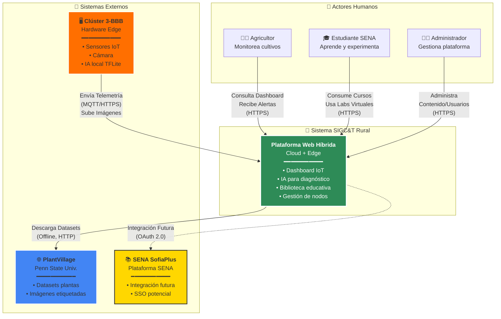
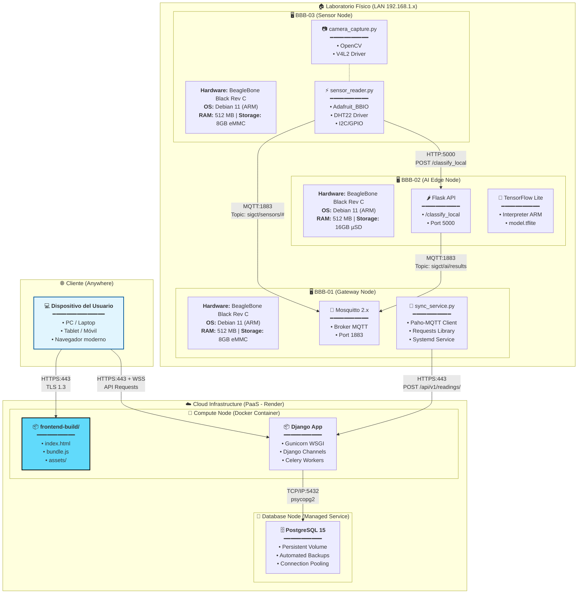

<div align="center">

# 🌾 SIGC&T Rural
### Sistema Integrado de Gestión del Conocimiento y Tecnología Rural


</div>

---

## 🧭 Descripción General

**SIGC&T Rural** es una plataforma web de código abierto, con enfoque académico, científico y social, que integra **IoT**, **Inteligencia Artificial (IA)** y **educación técnica** para impulsar la agricultura sostenible y la inclusión tecnológica en zonas rurales de Colombia.

Nace en el marco del **Proyecto Productivo SENA** del programa **Tecnología en Análisis y Desarrollo de Software** y propone una arquitectura híbrida **Cloud/Edge** con dispositivos como **BeagleBone Black**, **Raspberry Pi** y **Arduino**, conectados a un backend **Django** y un frontend **React + TailwindCSS**.

---

## 📖 Tabla de Contenidos

<details>
<summary><b>Ver Tabla de Contenidos</b></summary>

- 🎯 ¿Qué es SIGC&T Rural?
- 🌟 Misión y Visión
- 🌍 Impacto Social (ODS)
- ✨ Características Principales
- 🏗️ Arquitectura del Sistema
- 🚀 Inicio Rápido
- 📦 Instalación (Desarrollo Local)
- 🔧 Configuración
- 🧪 Uso y Ejemplos
- 📊 Stack Tecnológico
- 🤖 Inteligencia Artificial
- 🌐 API REST
- 🧩 Estructura del Proyecto
- 🧪 Testing
- 🚢 Despliegue
- 🤝 Contribuciones
- 📄 Documentación
- 🎓 Contexto Académico SENA
- 📚 Recursos y Referencias
- 📜 Licencia
- 👥 Autores
- 🙏 Agradecimientos
- 📞 Contacto

</details>

---

## 🎯 ¿Qué es SIGC&T Rural?

Plataforma híbrida **Cloud/Edge** que integra:

<table>
  <tr>
    <td width="25%" align="center"><b>Internet de las Cosas (IoT)</b><br/><sub>Sensores y actuadores en tiempo real</sub></td>
    <td width="25%" align="center"><b>Inteligencia Artificial</b><br/><sub>Diagnóstico y análisis automático</sub></td>
    <td width="25%" align="center"><b>Edge Computing</b><br/><sub>Procesamiento distribuido local</sub></td>
    <td width="25%" align="center"><b>Educación Abierta</b><br/><sub>Recursos técnicos gratuitos</sub></td>
  </tr>
  </table>

### 🌟 Misión
Democratizar el acceso a tecnologías de agricultura inteligente, ofreciendo herramientas de monitoreo IoT, diagnóstico con IA y educación técnica gratuita.

### 🎯 Visión
Ser plataforma referente en Latinoamérica para la transformación digital del campo mediante tecnologías abiertas y colaborativas.

---

## 🌍 Impacto Social (ODS)

| ODS | Objetivo | Contribución de SIGC&T |
|---|---|---|
| ODS 2 | Hambre Cero | Optimización productiva mediante datos y diagnóstico temprano |
| ODS 4 | Educación de Calidad | Acceso abierto a formación técnica avanzada |
| ODS 9 | Industria e Innovación | Infraestructura tecnológica en contextos rurales |
| ODS 17 | Alianzas | Articulación academia–agricultura–tecnología |

---

## ✨ Características Principales

- 📊 Dashboard IoT en tiempo real (temperatura, humedad, luz, imágenes)
- 🤖 Diagnóstico asistido por IA (Cloud y Edge)
- 📚 Biblioteca técnica abierta (IoT, IA, Agricultura 4.0)
- 🔌 Integraciones por API REST y WebSockets
- 📈 Series temporales y análisis de tendencias
- 📱 Interfaz responsive para móvil, tablet y escritorio

### 🚀 Innovaciones Técnicas

- Arquitectura Híbrida Cloud–Edge
- Inferencia IA en Edge con **TensorFlow Lite** (<500ms)
- Actualizaciones en vivo con **WebSockets**
- API RESTful documentable (OpenAPI/Swagger futuro)
- Código 100% abierto bajo **MIT**

---

## 🏗️ Arquitectura del Sistema



```mermaid
graph TB
    subgraph CLOUD
        FE[React + Tailwind]
        BE[Django API (DRF + Channels)]
        DB[(PostgreSQL)]
        AI[TensorFlow Service]
    end
    subgraph EDGE
        BBB1[BBB-01 • Gateway MQTT]
        BBB2[BBB-02 • IA TFLite]
        BBB3[BBB-03 • Sensores IoT]
    end
    U[Usuarios Web/Móvil] --> FE
    FE <--> BE
    BE <--> DB
    BE <--> AI
    BBB3 -->|MQTT| BBB1
    BBB3 -->|HTTP| BBB2
    BBB1 -->|HTTPS| BE
    BBB2 -.->|Alertas| BBB1
```

> Para la arquitectura detallada, revisa `docs/architecture/README.md` y `docs/MASTERDOC_v4.2_DAS.md`.

---

## 🚀 Inicio Rápido

### Requisitos
- `Git 2.30+`
- `Python 3.10+`
- `Node.js 18+` y `npm 9+`

### Clonar y preparar entorno

```bash
git clone https://github.com/badolgm/sigcTiArural.git
cd sigcTiArural
```

#### Backend (Django)

```bash
cd src/backend
python -m venv venv
# Linux/Mac
source venv/bin/activate
# Windows
venv\Scripts\activate
pip install -r requirements.txt
python manage.py migrate
python manage.py runserver 0.0.0.0:8000
```

#### Frontend (React + Vite)

```bash
cd src/frontend
npm install
echo "VITE_API_URL=http://localhost:8000" > .env.local
npm run dev
# La app estará disponible en http://localhost:5173
```

> Nota: El despliegue con Docker aún no está versionado en este repositorio. Se documentará en `docs/DEPLOYMENT.md` cuando esté listo.

---

## 🔧 Configuración

- Copia el archivo de ejemplo `.env.example` en la raíz y crea `.env` con tus credenciales.
- Ajusta `config/settings.ini` para parámetros de entorno y logging según tu escenario.

Variables recomendadas (referencia):

```ini
# Backend
DEBUG=True
SECRET_KEY=tu-secret-key
ALLOWED_HOSTS=localhost,127.0.0.1

# Base de datos (si aplicas PostgreSQL)
DB_NAME=sigct_rural_db
DB_USER=sigct_user
DB_PASSWORD=tu-password
DB_HOST=localhost
DB_PORT=5432

# Frontend
VITE_API_URL=http://localhost:8000
VITE_WS_URL=ws://localhost:8000/ws
```

---

## 🧪 Uso y Ejemplos

### Publicar lectura de temperatura (DHT22) vía MQTT desde Edge

```python
import Adafruit_DHT
import paho.mqtt.client as mqtt
import json, time
from datetime import datetime

DHT_SENSOR = Adafruit_DHT.DHT22
DHT_PIN = "P8_11"

client = mqtt.Client()
client.connect("192.168.1.100", 1883, 60)

while True:
    humidity, temperature = Adafruit_DHT.read_retry(DHT_SENSOR, DHT_PIN)
    if humidity and temperature:
        payload = {
            "nodo_id": "BBB-03",
            "sensor_tipo": "temperatura",
            "valor": round(temperature, 2),
            "timestamp": datetime.utcnow().isoformat()
        }
        client.publish("sigct/sensors/bbb03/temperatura", json.dumps(payload))
        print(f"✅ Publicado: {temperature}°C")
    time.sleep(10)
```

### Consumir API (ejemplo genérico)

```bash
curl -X GET "http://localhost:8000/api/v1/proyectos/" \
  -H "Authorization: Bearer TU_TOKEN_JWT"
```

---

## 📊 Stack Tecnológico

- Backend: `Python`, `Django`, `DRF`, `Channels`, `PostgreSQL`
- Frontend: `React`, `Vite`, `TailwindCSS`, `Axios`
- IA: `TensorFlow`, `TensorFlow Lite`, `Keras`, `OpenCV`
- Edge: `BeagleBone Black`, `Paho-MQTT`, `Adafruit_BBIO`
- DevOps: `Docker` (futuro), `GitHub Actions` (futuro), `Nginx` (futuro)

---

## 🤖 Inteligencia Artificial

Modelo base de clasificación (PlantVillage) con **MobileNetV2 + Transfer Learning**:

```text
Input(224x224x3) → MobileNetV2 → GAP → Dropout(0.3) → Dense(38, softmax)
```

> Entrenamiento y notebooks en `src/ai_models/notebooks/` y modelos en `src/ai_models/production_models/`.

---

## 🌐 API REST

- Endpoints y vistas en `src/backend/api/`.
- Autenticación (JWT) y módulos de usuarios en `src/backend/users/`.
- Referencia detallada: `docs/API_REFERENCE.md`.
- OpenAPI/Swagger: en construcción.

---

## 🧩 Estructura del Proyecto

```
sigcTiArural/
├── .env.example
├── config/
│   └── settings.ini
├── data/
│   ├── datasets/
│   └── logs/
├── docs/
│   ├── MASTERDOC_v4.2_DAS.md
│   ├── PLAN_MAESTRO_v4.2.md
│   ├── architecture/README.md
│   ├── database/README.md
│   ├── sena_artifacts/README.md
│   └── uml/README.md
├── src/
│   ├── backend/
│   │   ├── manage.py
│   │   ├── requirements.txt
│   │   ├── sigct_backend/
│   │   └── users/
│   ├── frontend/
│   │   ├── index.html
│   │   ├── package.json
│   │   ├── postcss.config.js
│   │   └── tailwind.config.js
│   └── embedded/
│       ├── bbb_01_gateway/
│       ├── bbb_02_ia_edge/
│       └── bbb_03_sensors/
└── tests/
    ├── backend/
    ├── embedded/
    └── frontend/
```

---

## 🧪 Testing

### Backend (Django)
```bash
cd src/backend
python manage.py test
```

### Frontend (React)
```bash
cd src/frontend
npm test
```

### Edge (Python)
```bash
cd src/embedded
python -m pytest -v
```

---

## 🚢 Despliegue

- Guía de desarrollo local y opciones Cloud: `docs/DEPLOYMENT.md`.
- Configuración de Edge (BeagleBone, sensores, TFLite): `docs/EDGE_SETUP.md`.

---

## 🤝 Contribuciones

Las contribuciones son bienvenidas. Abre un **Issue** o crea un **Pull Request** con cambios claros y pruebas asociadas cuando aplique.

---

## 📄 Documentación

- Arquitectura de Software: `docs/MASTERDOC_v4.2_DAS.md`
- Plan Maestro de Fases: `docs/PLAN_MAESTRO_v4.2.md`
- Arquitectura (resumen): `docs/architecture/README.md`
- Base de Datos (resumen): `docs/database/README.md`
- Artefactos SENA: `docs/sena_artifacts/README.md`
- Diagramas UML: `docs/uml/README.md`

---

## Secciones del DAS (integradas literalmente desde MASTERDOC v4.2)

Estas secciones se integran para asegurar fidelidad con el Documento Maestro de Arquitectura (DAS). El contenido textual y los diagramas conservan los mismos términos, IDs y relaciones. Se ha encapsulado el código Mermaid en bloques de código para render correcto en GitHub, manteniendo intacta la semántica del diagrama.

### 1. Visión y Alcance — Propósito del Sistema

SIGC&T Rural es una plataforma web híbrida (Cloud/Edge) de propósito académico, científico y social que impulsa la educación técnica aplicada al campo colombiano mediante la integración de:

- Monitoreo agrícola inteligente con IoT y sensores embebidos
- Diagnóstico de enfermedades de plantas mediante Inteligencia Artificial
- Ecosistema educativo abierto con recursos digitales y laboratorios virtuales
- Laboratorio de hardware embebido (Clúster BeagleBone Black de 3 nodos)
- Arquitectura híbrida Cloud-Edge para procesamiento distribuido

El sistema actúa como un laboratorio digital accesible desde cualquier institución educativa o centro rural, permitiendo experimentación científica remota, toma de decisiones basadas en datos, y formación técnica de calidad.

Impacto Social (ODS):
- ODS 2: Hambre Cero — Optimización de producción agrícola
- ODS 4: Educación de Calidad — Formación técnica abierta
- ODS 9: Industria, Innovación e Infraestructura — Tecnología rural
- ODS 17: Alianzas para lograr los objetivos — Colaboración institucional

### 1.2 Objetivos del Negocio y Técnicos

Objetivos Académicos (SENA - Proyecto Productivo ADSO)

ID | Objetivo | Descripción | Criterio de Éxito
--- | --- | --- | ---
O-01 | Dashboard Centralizado | Proveer visualización web de datos de sensores en tiempo real | Dashboard funcional con latencia <2s
O-02 | Modelo de IA | Implementar clasificación de enfermedades de plantas con alta precisión | Accuracy >85% en dataset de validación
O-03 | Laboratorio Hardware | Establecer clúster de 3 BeagleBone Black operacional | 3 nodos comunicados vía MQTT/HTTP
O-04 | Biblioteca Educativa | Crear repositorio de recursos educativos curados | Mínimo 20 recursos categorizados
O-05 | Cumplimiento ADSO | Entregar artefactos completos del Proyecto Productivo | 100% de entregables aprobados

Objetivos Técnicos:
- Arquitectura Escalable: Sistema capaz de soportar 100+ nodos Edge sin degradación
- Alta Disponibilidad: Uptime >99% en componentes Cloud
- Seguridad: Implementar autenticación JWT, encriptación HTTPS/TLS
- Documentación: Cobertura completa de código, APIs y procesos

### 1.3 Alcance y Límites

✅ Dentro del Alcance

Cloud (Plataforma Web):
- Frontend React responsive (mobile-first)
- Backend Django con API RESTful
- Base de datos PostgreSQL
- Autenticación y autorización (roles)
- Dashboard con gráficos en tiempo real
- Sistema de alertas (email/push)
- Módulo de IA (inferencia cloud)
- CRUD de contenido académico

Edge (Laboratorio Físico):
- Clúster 3x BeagleBone Black Rev C
- Broker MQTT (Mosquitto)
- Lectura de sensores (DHT22, humedad suelo)
- Captura de imágenes (cámara USB)
- Inferencia local con TensorFlow Lite
- Sincronización cloud automática
- Lógica de "store-and-forward"

Inteligencia Artificial:
- Modelo CNN para clasificación de enfermedades
- Dataset: PlantVillage (tomate, papa)
- Transfer Learning con MobileNetV2
- Modelos: .h5 (cloud) y .tflite (edge)
- Pipeline de reentrenamiento documentado

Contenido Educativo:
- Cursos sobre IoT, IA, agricultura 4.0
- Videos tutoriales (embebidos de YouTube)
- Laboratorios virtuales interactivos
- Documentación técnica completa
- Enlaces a recursos externos (SENA, PlantVillage, etc.)

❌ Fuera del Alcance
- Creación de hardware personalizado (PCBs, sensores propios)
- Aplicación móvil nativa (iOS/Android) — solo web responsive
- Integración directa con SofiaPlus del SENA (fase futura)
- Comercialización del producto o soporte empresarial
- Procesamiento de pagos o e-commerce
- Soporte 24/7 en producción
- Despliegue en dispositivos FPGA (referencia futura)

### 1.4 Actores y Roles

Actor | Rol | Descripción | Interacciones Principales
--- | --- | --- | ---
Agricultor | Usuario Final | Propietario/operador de cultivo que monitorea producción | Ver Dashboard, Recibir alertas, Solicitar análisis IA, Consultar históricos
Estudiante SENA | Aprendiz | Usuario que consume contenido educativo y experimenta | Acceder a Biblioteca, Usar Labs Virtuales, Ver tutoriales y videos, Descargar recursos
Administrador | Gestor del Sistema | B. Gómez — Mantiene plataforma y contenido | CRUD de Contenido Académico, Gestión de usuarios, Ver logs y métricas, Configurar nodos Edge
Clúster BBB | Sistema Externo (Hardware) | 3 nodos BeagleBone Black en red local | Enviar telemetría vía MQTT, Ejecutar IA local, Sincronizar con Cloud, Reportar estado
PlantVillage | Sistema Externo (Datos) | Repositorio académico | Uso offline — Fuente de datasets de entrenamiento

---

## 2. Vistas de Arquitectura (Modelo C4)

### 2.1 Vista de Contexto del Sistema

Nivel 1 C4: El sistema como "caja negra" y sus interacciones con actores y sistemas externos.



### 2.2 Vista de Contenedores

Nivel 2 C4: Descompone el sistema en contenedores principales.



```mermaid
graph TB
    subgraph "🌐 Internet"
        actor1["👤 Usuario<br/>(Navegador Web)<br/>━━━━━━━━━<br/>Chrome / Firefox / Safari"]
    end

    subgraph "☁️ Cloud Provider (Render / Railway / Heroku)"
        direction TB
        
        subgraph "Frontend Container"
            WebApp["⚛️ <b>React App</b><br/>━━━━━━━━━<br/>• SPA con Vite<br/>• TailwindCSS<br/>• Recharts/D3.js<br/>• Axios API client"]
        end
        
        subgraph "Backend Container"
            APIServer["🐍 <b>Django API</b><br/>━━━━━━━━━<br/>• Django REST Framework<br/>• JWT Auth<br/>• WebSockets (Channels)<br/>• Gunicorn + Nginx"]
        end
        
        subgraph "AI Service"
            AI_Service["🤖 <b>Servicio IA</b><br/>━━━━━━━━━<br/>• TensorFlow/Keras<br/>• Modelo .h5<br/>• Endpoint /api/ia/classify"]
        end
        
        subgraph "Database"
            Database[("💾 <b>PostgreSQL 15</b><br/>━━━━━━━━━<br/>• Usuarios<br/>• Proyectos<br/>• Telemetría<br/>• Análisis IA")]
        end
        
        WebApp -- "Consume<br/>REST API" --> APIServer
        APIServer -- "Lee/Escribe<br/>SQL" --> Database
        APIServer -- "Ejecuta<br/>Inferencia" --> AI_Service
    end

    subgraph "🏠 Laboratorio Edge (Red Local 192.168.1.x)"
        direction TB
        
        subgraph "BBB-01 Gateway"
            Cluster_GW["🌐 <b>Gateway</b><br/>━━━━━━━━━<br/>• Broker Mosquitto<br/>• Script Sync (Python)<br/>• Store-and-Forward"]
        end
        
        subgraph "BBB-02 IA-Edge"
            Cluster_IA["🧠 <b>IA Local</b><br/>━━━━━━━━━<br/>• API Flask<br/>• TensorFlow Lite<br/>• Modelo .tflite"]
        end
        
        subgraph "BBB-03 Sensores"
            Cluster_IoT["📡 <b>IoT Node</b><br/>━━━━━━━━━<br/>• Sensores DHT22<br/>• Humedad suelo<br/>• Cámara USB"]
        end
        
        Cluster_IoT -- "Publica<br/>MQTT (LAN)" --> Cluster_GW
        Cluster_IoT -- "POST Imagen<br/>HTTP (LAN)" --> Cluster_IA
        Cluster_IA -- "Reporta<br/>MQTT (LAN)" --> Cluster_GW
    end

    actor1 -- "HTTPS<br/>443" --> WebApp
    actor1 -- "HTTPS/WSS<br/>API + WebSockets" --> APIServer
    Cluster_GW -- "HTTPS<br/>POST /api/readings/" --> APIServer

    style WebApp fill:#61dafb,stroke:#000,stroke-width:2px
    style APIServer fill:#0c4b33,stroke:#fff,stroke-width:2px,color:#fff
    style AI_Service fill:#ff6f00,stroke:#fff,stroke-width:2px
    style Database fill:#336791,stroke:#fff,stroke-width:2px,color:#fff
    style Cluster_GW fill:#ffa500,stroke:#000,stroke-width:2px
    style Cluster_IA fill:#ff4444,stroke:#000,stroke-width:2px
    style Cluster_IoT fill:#4444ff,stroke:#fff,stroke-width:2px,color:#fff
```

Descripción de Contenedores:

Contenedor | Tecnología | Propósito | Puerto
--- | --- | --- | ---
React App | Vite + React 18 + TailwindCSS | Interfaz de usuario SPA | 443 (HTTPS)
Django API | Python 3.10 + Django 4 + DRF | Lógica, auth, orquestación | 8000 → 443
Servicio IA | TensorFlow + Keras | Inferencia de clasificación imágenes | Interno
PostgreSQL | PostgreSQL 15 | Almacenamiento persistente | 5432 (interno)
Gateway (BBB-01) | Mosquitto + Python | Broker MQTT, sincronización cloud | 1883 (MQTT)
IA Edge (BBB-02) | Flask + TFLite | Inferencia local | 5000 (HTTP)
IoT Node (BBB-03) | Python + Adafruit_BBIO | Sensores/cámara | N/A (cliente)

### 2.3 Vista de Despliegue

Diagrama UML de Despliegue: Infraestructura física y software desplegado.





---

## Referencias del DAS
- Documento Maestro: `docs/MASTERDOC_v4.2_DAS.md` (no se modifica)
- Diagramas adicionales: `docs/architecture/README.md`, `docs/uml/README.md`
- Datos y diccionario: `docs/database/README.md`


---

## 🎓 Contexto Académico SENA

Proyecto alineado al **SENA** para fortalecer habilidades técnicas aplicadas al campo, con enfoque en IA, IoT y desarrollo web.

---

## 📚 Recursos y Referencias

- SENA: https://www.sena.edu.co/es-co/
- PlantVillage (Penn State): https://plantvillage.psu.edu/
- PlantVillage Dataset (GitHub): https://github.com/spMohanty/PlantVillage-Dataset
- Kaggle – Plant Disease Classification: https://www.kaggle.com/code/shreyashpatil217/plant-disease-classification-transfer-learnig
- Open FING: https://open.fing.edu.uy/

---

## 📜 Licencia

Código abierto bajo **MIT**. Usa, modifica y comparte citando la fuente.

---

## 👥 Autores

- **Bernardo A. Gómez Montoya** — Desarrollador e Investigador (SIGC&T Rural)
  - 📧 badolgm@gmail.com
  - 📍 Colombia

Con el apoyo de instructores, aprendices y equipos académicos del SENA – Tecnología en Análisis y Desarrollo de Software.

---

## 🙏 Agradecimientos

- Comunidad SENA y aliados académicos
- PlantVillage (Penn State University)
- Ecosistema Open Source

---

## 📞 Contacto

- Email: `badolgm@gmail.com`
- Repositorio: https://github.com/badolgm/sigcTiArural

<div align="center">

⭐ Si este proyecto te inspira, apóyalo con un Star en GitHub.

</div>

```

## ⚙️ **Tecnologías Base**

| Categoría | Tecnologías |
|------------|--------------|
| **Lenguajes Base** | Python, JavaScript |
| **Frameworks Backend** | Flask, Django, Node.js (Express) |
| **Frontend Web** | HTML5, CSS3, JavaScript, React, TailwindCSS |
| **Comunicación** | WebSocket, REST API, MQTT |
| **IA y Aprendizaje Automático** | TensorFlow, PyTorch, Scikit-learn |
| **Dispositivos Embebidos** | BeagleBone Black, Raspberry Pi, Arduino, FPGA |
| **Bases de Datos** | PostgreSQL, SQLite, MongoDB |
| **Infraestructura** | Docker, Nginx, Linux Servers |
| **Control de Versiones** | Git / GitHub |

```

```

## 🧩 **Arquitectura General del Sistema**


┌────────────────────────────┐
│ Interfaz Web (UI) │ ← Navegador del Usuario
└───────────────┬────────────┘
│
Comunicación WebSocket / REST
│
┌───────────────▼───────────────┐
│ Servidor Web / API Backend │ ← Python (Flask / Django) o Node.js
│ - Gestión de usuarios │
│ - Control de sesiones │
│ - Módulo IA y simulaciones │
└───────────────┬───────────────┘
│
SSH / MQTT / TCP/IP
│
┌───────────────▼───────────────┐
│ Dispositivos Embebidos │
│ (BeagleBone, Pi, FPGA, etc.) │
│ - Sensores / Actuadores │
│ - Control en tiempo real │
└───────────────────────────────┘


```


## 🧠 **Ejemplo de Conexión con BeagleBone Black**

```python
import Adafruit_BBIO.GPIO as GPIO
import time

GPIO.setup("P8_10", GPIO.OUT)

for i in range(5):
    GPIO.output("P8_10", GPIO.HIGH)
    time.sleep(1)
    GPIO.output("P8_10", GPIO.LOW)
    time.sleep(1)

GPIO.cleanup()

🧰 Estructura Sugerida del Proyecto
sigcTiArural/
├── docs/                  # Documentación técnica y académica
├── src/                   # Código fuente
│   ├── backend/           # API, control de IA y lógica
│   ├── frontend/          # Interfaz web y componentes visuales
│   ├── ai_models/         # Modelos entrenados y scripts de IA
│   └── embedded/          # Drivers y comunicación con hardware
├── tests/                 # Pruebas unitarias y funcionales
├── data/                  # Datos para simulaciones y entrenamientos
├── config/                # Configuraciones y credenciales
├── requirements.txt       # Dependencias de Python
├── package.json           # Dependencias Node.js
└── README.md              # Este documento

🚀 Instalación Local
1️⃣ Clonar el repositorio
git clone https://github.com/badolgm/sigcTiArural.git
cd sigcTiArural

2️⃣ Crear entorno virtual (Python)
python -m venv venv
source venv/bin/activate   # Linux / Mac
venv\Scripts\activate      # Windows

3️⃣ Instalar dependencias
pip install -r requirements.txt

4️⃣ Ejecutar el servidor local
python app.py


Accede desde tu navegador:
👉 http://localhost:5000

👥 Autores y Colaboradores

Bernardo A. Gómez Montoya
Desarrollador e Investigador — Proyecto SIGC&T Rural
📧 badolgm@gmail.com

📍 Colombia

Con el apoyo de instructores, aprendices y equipos académicos del SENA – Tecnología en Análisis y Desarrollo de Software.

🧾 Licencia

Este proyecto está licenciado bajo MIT License.
Puedes usarlo, modificarlo y redistribuirlo citando la fuente original.

© 2025 Bernardo A. Gómez Montoya — Proyecto SIGC&T Rural.

<div align="center">
🌱 “La educación tecnológica aplicada es el camino más corto entre la idea y la innovación.”

— Proyecto SIGC&T Rural

🔗 Repositorio GitHub
 •
📚 Documentación Técnica (en construcción)
 •
🌾 PlantVillage

⭐ Si este proyecto te inspira, apóyalo con un Star en GitHub.

</div> ```
