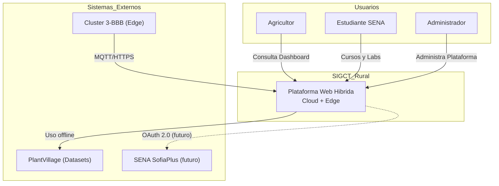
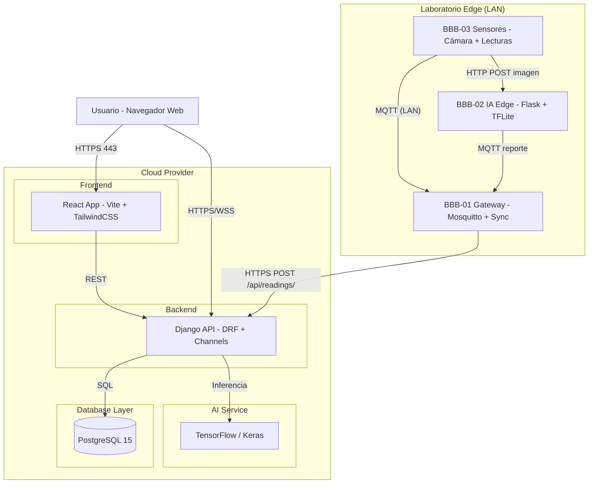

# 🌾 SIGC&T Rural
### Sistema Integrado de Gestión en Ciencia y Tecnología Rural

[](https://www.sena.edu.co/)
[](https://github.com/badolgm/sigcTiArural)
[](https://opensource.org/licenses/MIT)
[](https://www.python.org/)
[](https://www.djangoproject.com/)
[](https://react.dev/)
[](https://tailwindcss.com/)
[](https://beagleboard.org/black)
[](https://www.tensorflow.org/)

---

**Plataforma web híbrida (Cloud/Edge) que integra IoT, Inteligencia Artificial y educación técnica para impulsar la agricultura sostenible y la inclusión tecnológica en zonas rurales de Colombia.**

📚 [Documentación completa (MASTERDOC)](docs/MASTERDOC.md) • 🚀 [Plan Maestro](docs/PLAN_MAESTRO.md) • 🐞 [Reportar bug](https://github.com/badolgm/sigcTiArural/issues) • 💡 [Solicitar mejora](https://github.com/badolgm/sigcTiArural/issues/new)

---

## 📖 Descripción General
SIGC&T Rural es una plataforma **open source** con enfoque académico, científico y social, que integra **IoT**, **IA** y **educación técnica**. Nace como **Proyecto Productivo SENA** del programa **Tecnología en ADSO**, proponiendo una arquitectura híbrida **Cloud/Edge** que conecta un backend **Django** y un frontend **React + TailwindCSS** con dispositivos **BeagleBone Black**.

---

## 🧭 Tabla de Contenidos
- 🎯 [Visión y Objetivos](#-visión-y-objetivos)
- 🌍 [Impacto Social (ODS)](#-impacto-social-ods)
- ✨ [Características Principales](#-características-principales)
- 🏗️ [Arquitectura del Sistema](#️-arquitectura-del-sistema)
- 📚 [Documentación Técnica](#-documentación-técnica)
- 🚀 [Inicio Rápido](#-inicio-rápido)
- 🧱 [Estructura del Proyecto](#-estructura-del-proyecto)
- 📊 [Stack Tecnológico](#-stack-tecnológico)
- 🤖 [Inteligencia Artificial](#-inteligencia-artificial)
- 🧩 [Edge Computing](#-edge-computing)
- 🤝 [Contribuciones](#-contribuciones)
- 🎓 [Contexto Académico SENA](#-contexto-académico-sena)
- 📄 [Licencia](#-licencia)
- 👤 [Autor](#-autor)

---

## 🎯 Visión y Objetivos
### ⭐ Misión
Democratizar el acceso a tecnologías de agricultura inteligente, ofreciendo herramientas de monitoreo IoT, diagnóstico con IA y educación técnica gratuita.

### 🎯 Objetivos Académicos (ADSO)
ID | Objetivo | Descripción | Criterio de Éxito
---|---|---|---
O-01 | Dashboard centralizado | Visualizar datos de sensores en tiempo real | Latencia < 2s
O-02 | Modelo de IA | Clasificación de enfermedades de plantas | Accuracy > 85%
O-03 | Laboratorio hardware | Clúster de 3 BeagleBone Black operativo | Comunicación MQTT/HTTP
O-04 | Biblioteca educativa | Repositorio de recursos curados | ≥ 20 recursos categorizados
O-05 | Cumplimiento ADSO | Entregables del Proyecto Productivo | 100% aprobados

---

## 🌍 Impacto Social (ODS)
ODS | Objetivo | Contribución
---|---|---
ODS 2 | Hambre Cero | Optimización productiva mediante datos y diagnóstico temprano
ODS 4 | Educación de Calidad | Acceso abierto a formación técnica avanzada
ODS 9 | Industria e Innovación | Infraestructura tecnológica en contextos rurales
ODS 17 | Alianzas | Articulación academia–agricultura–tecnología

---

## ✨ Características Principales
- 📈 **Dashboard IoT:** Visualización en tiempo real.
- 🤖 **Diagnóstico IA:** Clasificación de enfermedades (Cloud y Edge).
- 📚 **Biblioteca Educativa:** Cursos, videos y laboratorios.
- 🔌 **Arquitectura Híbrida:** Lógica *store-and-forward* tolerante a fallos.
- 📡 **Comunicaciones:** API REST + WebSockets.
- 📱 **Responsive Design:** Interfaz moderna con React + TailwindCSS.

---

## 🏗️ Arquitectura del Sistema
> **Nota técnica:** El entrenamiento de IA se realiza en Cloud/Local; las BBB actúan como nodos Edge para adquisición, preprocesamiento e inferencia optimizada con TFLite.

### Nivel 1: Vista de Contexto

```mermaid
%%{init: {'flowchart': {'htmlLabels': true, 'useMaxWidth': true}} }%%
flowchart TD
  subgraph Usuarios
    A["Agricultor"]
    B["Estudiante SENA"]
    C["Administrador"]
  end

  subgraph SIGCT_Rural
    S["Plataforma Web Hibrida\nCloud + Edge"]
  end

  subgraph Sistemas_Externos
    E1["Cluster 3-BBB (Edge)"]
    E2["PlantVillage (Datasets)"]
    E3["SENA SofiaPlus (futuro)"]
  end

  A -->|"Consulta Dashboard"| S
  B -->|"Cursos y Labs"| S
  C -->|"Administra Plataforma"| S
  E1 -->|"MQTT/HTTPS"| S
  S -->|"Uso offline"| E2
  S -.->|"OAuth 2.0 (futuro)"| E3
```

### Nivel 2: Vista de Contenedores

```mermaid
%%{init: {'flowchart': {'htmlLabels': true, 'useMaxWidth': true}} }%%
flowchart TB

U["Usuario - Navegador Web"]

subgraph CLOUD["Cloud Provider"]
  direction TB
  subgraph FRONTEND["Frontend"]
    FE["React App - Vite + TailwindCSS"]
  end
  subgraph BACKEND["Backend"]
    API["Django API - DRF + Channels"]
  end
  subgraph AI_SVC["AI Service"]
    AIS["TensorFlow / Keras"]
  end
  subgraph DB_LAYER["Database Layer"]
    DB[("PostgreSQL 15")]
  end
  FE -->|"REST"| API
  API -->|"SQL"| DB
  API -->|"Inferencia"| AIS
end

subgraph EDGE["Laboratorio Edge (LAN)"]
  direction TB
  GW["BBB-01 Gateway - Mosquitto + Sync"]
  IA["BBB-02 IA Edge - Flask + TFLite"]
  IOT["BBB-03 Sensores - Cámara + Lecturas"]
  IOT -->|"MQTT (LAN)"| GW
  IOT -->|"HTTP POST imagen"| IA
  IA  -->|"MQTT reporte"| GW
end

U  -->|"HTTPS 443"| FE
U  -->|"HTTPS/WSS"| API
GW -->|"HTTPS POST /api/readings/"| API
```

> Diagramas completos (Componentes, Despliegue, ERD) en [docs/MASTERDOC.md](docs/MASTERDOC.md).

---

## 📚 Documentación Técnica
Documento | Propósito
---|---
[MASTERDOC.md](docs/MASTERDOC.md) | Documento Maestro (DAS): diagramas, ERD, especificaciones.
[PLAN_MAESTRO.md](docs/PLAN_MAESTRO.md) | Cronograma y fases del proyecto.

---

## 🚀 Inicio Rápido
### Requisitos
- Git 2.30+
- Python 3.10+
- Node.js 18+ y npm 9+

### Backend (Django)
```bash
cd src/backend
python -m venv venv
source venv/bin/activate  # Linux/Mac
venv\Scriptsctivate     # Windows
pip install -r requirements.txt
python manage.py migrate
python manage.py runserver
```

### Frontend (React + Vite)
```bash
cd src/frontend
npm install
echo "VITE_API_URL=http://localhost:8000" > .env.local
npm run dev
```

---

## 🧱 Estructura del Proyecto
```
sigcTiArural/
├── docs/          # Documentación técnica
│   ├── MASTERDOC.md
│   └── PLAN_MAESTRO.md
├── src/
│   ├── backend/   # Django API
│   ├── frontend/  # React App
│   └── embedded/  # Scripts BBB
└── README.md
```

---

## 📊 Stack Tecnológico
- **Backend:** Python, Django, DRF, Channels, PostgreSQL
- **Frontend:** React, Vite, TailwindCSS
- **IA:** TensorFlow, TensorFlow Lite, Keras
- **Edge:** BeagleBone Black, Paho-MQTT
- **DevOps:** Docker, GitHub Actions (futuro)

---

## 🤖 Inteligencia Artificial
- **Cloud:** MobileNet/EfficientNet con TensorFlow/Keras.
- **Edge:** MobileNetV2 optimizado con TFLite.
- **Dataset:** PlantVillage.

---

## 🧩 Edge Computing
- BBB-01: Gateway MQTT + Sync
- BBB-02: IA Edge (Flask + TFLite)
- BBB-03: Sensores + Cámara

---

## 🤝 Contribuciones
1. Fork del proyecto
2. Crear rama feature
3. Commit claro
4. Push
5. Pull Request

---

## 🎓 Contexto Académico SENA
Proyecto Productivo del programa **Tecnología en ADSO (SENA Colombia)**.

---

## 📄 Licencia
Código abierto bajo [MIT License](https://opensource.org/licenses/MIT).

---

## 👤 Autor
**Bernardo Adolfo Gómez Montoya**  
📧 [badolfogm@gmail.com](mailto:badolfogm@gmail.com) • 🔗 [GitHub](https://github.com/badolgm)

> Hecho con ❤️ en Colombia. Para la comunidad rural y educativa del mundo.
