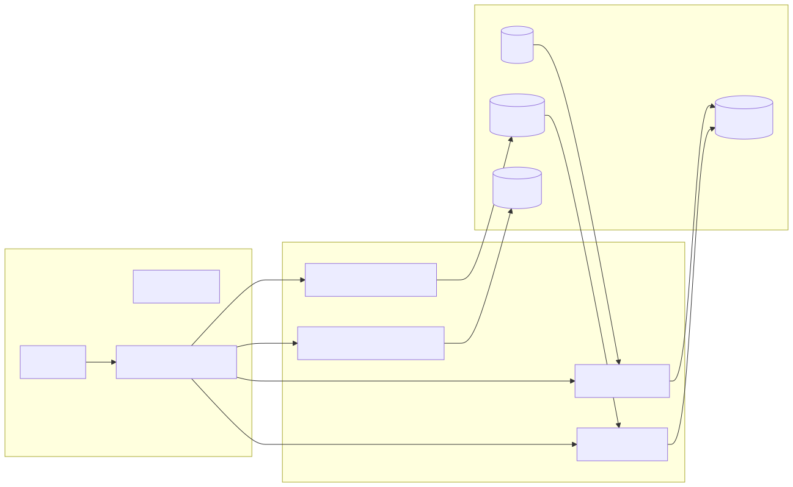

# SIGC&T Rural: Sistema Inteligente de Gestión, Control y Telemetría para el Entorno Rural


**SIGC&T Rural** es un proyecto integral que fusiona la agricultura de precisión, la tecnología educativa (EdTech) y los sistemas embebidos inteligentes para fortalecer el desarrollo sostenible en entornos rurales. La plataforma ofrece herramientas de telemetría, control de actuadores y análisis de datos mediante inteligencia artificial, todo gestionado desde una interfaz web moderna e intuitiva.

## 🧩 Arquitectura General del Sistema

El sistema sigue una arquitectura de microservicios distribuida, compuesta por tres componentes principales que pueden ser desplegados de forma independiente o conjunta a través de Docker.



1.  **Frontend (React + Vite)**: Una aplicación de una sola página (SPA) que proporciona la interfaz de usuario. Incluye dashboards de visualización de datos, paneles de control para actuadores y laboratorios virtuales interactivos.
2.  **Backend (Django REST Framework)**: El núcleo del sistema. Gestiona la lógica de negocio, la autenticación de usuarios, el almacenamiento de datos en una base de datos MySQL y expone una API REST para la comunicación con el frontend y los dispositivos de campo.
3.  **AI Service (FastAPI)**: Un microservicio dedicado que aloja los modelos de inteligencia artificial (ej. detección de enfermedades en plantas). Expone endpoints para realizar inferencias y se comunica con el backend.

## 🚀 Tecnologías Principales

| Área                | Tecnologías                                                              |
| ------------------- | ------------------------------------------------------------------------ |
| **Frontend**        | `React`, `Vite`, `TailwindCSS`, `JavaScript`                             |
| **Backend**         | `Python`, `Django`, `Django REST Framework`, `MySQL`                     |
| **AI Service**      | `Python`, `FastAPI`, `TensorFlow/TFLite`, `Scikit-learn`                 |
| **Base de Datos**   | `MySQL`                                                                  |
| **Contenerización** | `Docker`, `Docker Compose`                                               |
| **Embebidos (Edge)**| `BeagleBone`, `Raspberry Pi`, `Python`, `MQTT`                           |
| **Documentación**   | `Markdown`, `Mermaid`                                                    |

---

## ⚙️ Configuración de Variables de Entorno

Antes de iniciar cualquier servicio (manual o con Docker Compose), es fundamental configurar las variables de entorno necesarias.

1.  Copia el archivo `.env.example` a un nuevo archivo llamado `.env` en la raíz del proyecto:
    ```bash
    cp .env.example .env
    ```
    (En Windows, puedes usar `copy .env.example .env`)

2.  Edita el archivo `.env` y ajusta los valores según sea necesario para tu entorno local. Esto incluye credenciales de base de datos, URLs de API, etc.
    *   **Nota:** Si utilizas Docker Compose, algunas variables de entorno (como `DB_HOST`) serán manejadas internamente por Docker, pero otras (como claves secretas o URLs de servicios externos) aún pueden ser necesarias aquí.

---

## 🏁 Instalación y Ejecución Local

Para ejecutar el proyecto en tu entorno local, necesitarás tener instalado **Git**, **Node.js (v18+)**, **Python (v3.10+)** y **Docker**.

### Método 1: Ejecución Manual (Componente por Componente)

Este método es ideal para desarrollar y depurar un componente específico. Para ejecutar el sistema completo manualmente, **necesitarás abrir *tres terminales separadas* (ventanas de Git Bash o PowerShell en Windows) y ejecutar los comandos en el orden correcto en cada una.**

**¡Paso Cero - Configuración Inicial y Variables de Entorno!**

Antes de iniciar cualquier servicio, asegúrate de haber realizado los siguientes pasos **UNA SOLA VEZ** desde la raíz del proyecto en tu terminal principal (o cualquier terminal que uses para Git):

1.  **Clonar el repositorio (si aún no lo has hecho):**
    ```bash
    git clone https://github.com/tu-usuario/sigcTiArural.git # Reemplaza con la URL correcta de tu repo
    cd sigcTiArural
    ```
2.  **Configurar Variables de Entorno:**
    *   Ve a la sección "⚙️ Configuración de Variables de Entorno" (más arriba en este documento) y sigue las instrucciones.
    *   **¡Este paso es CRÍTICO!** El archivo `.env` debe estar configurado en la raíz del proyecto para que los servicios encuentren sus configuraciones (credenciales de base de datos, URLs de APIs internas, etc.).

**¡Importante!** Asegúrate de haber completado la sección "⚙️ Configuración de Variables de Entorno" antes de continuar, para que los archivos `.env` estén configurados.

**Orden Sugerido de Inicio (en terminales separadas):**

1.  **Backend (Django)**
2.  **AI Service (FastAPI)**
3.  **Frontend (React)**

---

#### 1. Iniciar el Backend (Django)

**Abre tu PRIMERA terminal de Git Bash (o PowerShell) y sigue estos pasos con atención:**

```bash
# Paso 1: Navega a la raíz del proyecto.
# Si ya estás en 'c:\Users\bagm2\workspace_toshiba\Clone\sigcTiArural', no necesitas ejecutar este comando.
# Si no, usa el comando 'cd' apropiado para llegar a la raíz de 'sigcTiArural'.
# Ejemplo: cd /c/Users/bagm2/workspace_toshiba/Clone/sigcTiArural

# Paso 2: Navega al directorio específico del Backend
cd src/backend

# Paso 3: Crea y Activa el entorno virtual (si no lo has hecho antes).
# Un entorno virtual aísla las dependencias de este proyecto de otros.
python -m venv venv
source venv/Scripts/activate  # <--- EJECUTA ESTE COMANDO para Windows (Git Bash o PowerShell)

# CONFIRMACIÓN: DEBES VER "(venv)" al inicio de tu línea de comando, por ejemplo:
# (venv) user@hostname /c/Users/bagm2/workspace_toshiba/Clone/sigcTiArural/src/backend $

# Paso 4: Instala las dependencias de Python del Backend.
# Este paso solo es necesario la primera vez o si se actualiza 'requirements.txt'.
pip install -r requirements.txt

# Paso 5: Aplica las migraciones de la base de datos.
# Esto crea las tablas necesarias en tu base de datos MySQL.
# ¡IMPORTANTE! Asegúrate de que tu base de datos MySQL esté ejecutándose y sea accesible.
# Si tienes problemas, verifica la configuración en tu archivo '.env'.
python manage.py migrate

# Paso 6: Inicia el servidor de desarrollo de Django.
# Este comando dejará esta terminal "ocupada" ejecutando el servidor.
# ¡NO CIERRES ESTA TERMINAL! Déjala abierta y ve a la siguiente.
# El servidor Backend se ejecutará en: http://127.0.0.1:8000
python manage.py runserver

# CONFIRMACIÓN: Espera a ver un mensaje como:
# "Starting development server at http://127.0.0.1:8000/"
# Si ves errores aquí, revísalos cuidadosamente. Los más comunes son:
# - Problemas con la base de datos (MySQL no corriendo o credenciales incorrectas en .env)
# - Dependencias de Python faltantes.
```

---

#### 2. AI Service (FastAPI)

En tu **segunda terminal (Git Bash)**:

```bash
# 1. Navega al directorio del módulo de IA desde la raíz del proyecto
cd src/ai_models

# 2. (Recomendado) Crea un entorno virtual si no existe
python -m venv venv

# 3. Activa el entorno virtual
source venv/Scripts/activate  # Para Windows (Git Bash o PowerShell)
# source venv/bin/activate    # Para macOS/Linux

# 4. Instala las dependencias de Python del AI Service
pip install -r requirements.txt

# 5. Inicia el servidor de IA (FastAPI). Se ejecutará en http://127.0.0.1:8081
# Este comando usa --reload, lo que reiniciará el servidor automáticamente si detecta cambios.
python -m uvicorn fastapi_app:app --host 0.0.0.0 --port 8081 --reload

# Si estás en Linux/macOS y quieres usar el script de ayuda (asegúrate de que sea ejecutable):
# sh ../../scripts/start_ai_server.sh
```

---

#### 3. Frontend (React)

En tu **tercera terminal (Git Bash)**:

```bash
# 1. Navega al directorio del frontend desde la raíz del proyecto
cd src/frontend

# 2. Instala las dependencias de Node.js (esto solo es necesario la primera vez o si package.json cambia)
npm install

# 3. Inicia el servidor de desarrollo de React. Se ejecutará en http://localhost:5173
npm run dev
```

---

### Método 2: Orquestación con Docker Compose (¡Método Altamente Recomendado!)

Este es el método más sencillo y robusto para levantar todo el entorno de desarrollo. Con un solo comando, Docker Compose se encarga de construir (si es necesario) e iniciar todos los servicios interconectados (Backend, Frontend, AI Service, y la Base de Datos MySQL), simulando un entorno de producción de manera controlada.

**Prerrequisito:** Asegúrate de que Docker Desktop esté en ejecución en tu sistema operativo antes de proceder.

```bash
# 1. Asegúrate de que Docker Desktop esté en ejecución.

# 2. Desde la raíz del proyecto, ejecuta:
docker-compose up --build

# 3. Los servicios estarán disponibles en:
#    - Frontend: http://localhost:5173
#    - Backend: http://localhost:8000
#    - AI Service: http://localhost:8081

# 4. Para detener todos los servicios:
docker-compose down
```

## 🛠️ Scripts Útiles

*   `scripts/generate-diagrams.mjs`: Genera diagramas SVG/PNG a partir de archivos `.mmd` (Mermaid).
*   `scripts/start_ai_server.sh`: Script de ayuda para iniciar el servidor FastAPI de IA (incluye inferencia de imágenes y asistente de voz con contexto conversacional).
*   `fix_and_clean.py`: Herramienta de auditoría y limpieza de código.

## 📄 Documentación Adicional

Para una visión más profunda de la arquitectura, decisiones de diseño y planificación, consulta el **[PLAN MAESTRO](docs/PLAN_MAESTRO.md)**.