# SIGCTiArural — Capacidades vs Hardware

> **Estado:** U0.5 (Gate 0). Diseño. Cero código.
> **Versión:** 1.0.0 | **Fecha:** 2026-09-14
> **Familia:** Refactorización Global (Gate U0.5)

---

## 1. Tesis central

> **Hardware ≠ Capacidad.**

Una **capacidad** es una función del sistema definida por un **rol** + un **protocolo** + una **política de operación**, independiente de la marca del dispositivo que la ejecuta. Un "BBB-01" es infraestructura; un "Gateway MQTT" es una capacidad.

El dashboard actual representa infraestructura (3 tarjetas BBB con estado). El dashboard futuro representa **capacidades**, y el hardware es uno de los posibles portadores.

---

## 2. Matriz capacidad ↔ portadores posibles

| Capacidad | Rol | Protocolo esencial | Portadores posibles | Determinantes de elección |
|---|---|---|---|---|
| **Telemetría** | Adquisición + transporte de señal | MQTT, HTTP(S) | BBB, ESP32, STM32, Raspberry | consumo, determinismo, costo, ruralidad |
| **IA Edge** | Inferencia local con explicabilidad | TFLite/ONNX/TensorRT, REST | BBB, Jetson, Mini PC | cómputo (CV vs series), presupuesto |
| **UBTN** | Adquisición biométrica integrada | MQTT QoS+BLE/LoRa | ESP32, hardware propio, futuros wearables | forma factor por especie, ADR-08 |
| **Broker/Orquestación** | Exposición de flujos y servicios | MQTT, REST, Docker | BBB, Mini PC, nube | HA, autonomía, operación |
| **Conocimiento** | Dotación documental gobernada | HTTP local (solo estático) | cualquier host | Knowledge Hub (51 docs), agnóstico |

**Consecuencia:** ninguna tarjeta de navegación se llama "BBB-01"; se llama "Gateway", "Inferencia", "Adquisición", y el hardware aparece como detalle (portador actual).

---

## 3. Modelo formal (diseño)

```mermaid
flowchart LR
    CAP[Capacidad<br/>rol + protocolo + política]
    HW[Hardware<br/>portador]
    DEP[Dependencia inocua]
    PROJ[Proyecto]
    CAP --> DEP
    CAD2[Otra capacidad] --> CAP
    CAP --> PROJ
    HW -.portador a.- CAP
    HW -.sustituible por.- HW2[Otro HW]
    style CAP fill:#0f4c5c,stroke:#5bc0be
    style HW fill:#3f2d1f,stroke:#d0a06e
```

- La capacidad depende de **contratos y protocolos**, no de fábrica.
- El hardware es **portador reemplazable** (un gateway puede migrar de BBB a MiniPC sin cambiar la API).
- Regla UBTN explícita: identificador de nodo = `NodeId` (no una dirección ni un modelo), igual que `BiologicalNode` ≠ "collar de la marca X" (ADR-UBTN-08).

---

## 4. Ejemplos concretos

### Telemetría
- Rol: capturar señal física y entregarla con procedencia.
- BBB (gateway+broker) / ESP32 (nodo) / STM32 (adquisición determinista) / Raspberry (maqueta o nodo). Hoy: BBB referencia (0 bytes) — la capacidad está **diseñada**, el portador no está operativo.
- En la UI: se ve "Telemetría Ambiental — fuente: gateway (BBB Rev C, referencia)".

### IA Edge
- Rol: inferir + explicar.
- BBB-02 (hoy, referencia) / Jetson (futuro) / Mini PC (variante).
- La capacidad no muere si muere el BBB; migra de portador.

### UBTN
- Rol: telemetría biológica por especie.
- Portador: ESP32 en V1-V4; **hardware propio** y futuros dispositivos (ADR-UBTN-08 generaliza a BiologicalNode).
- El node es la capacidad; el collar es un form factor.

---

## 5. Anti-patrones que este modelo prohibe

| Anti-patrón | Ejemplo real | Por qué es dañino |
|---|---|---|
| **Infrastructure-as-identity** | Dashboard con "BBB-01/02/03" como vista principal | El estudiante aprende nombres de equipos, no funciones |
| **Capacidad locked al portador** | "IA Edge = BBB-02" | Migrar hardware = "re-hacer la capacidad" |
| **Cero-portador** | Tarjeta "RPI-05 / FPGA-X / DRONE-NAV" como "Integraciones futuras" | Promete capacidades sin rol definido → ruido visual |
| **Estado de portador como estado de capacidad** | `BBB-02: alert` (código de ejemplo) como si fuera la plataforma | Confunde infra con salud funcional |
| **Nombre genérico sin rol** | "Node-7" sin decir qué hace | El hardware no enseña; el rol sí |

---

## 6. Regla de representación en UI

1. **Primer plano = capacidad** (nombre + rol + estado funcional honesto).
2. **Segundo plano = portador** (modelo, IP/ubicación, detalle técnico) colapsable.
3. **Estado** = `operativo / referencia / diseño / vacío` (regla Misión 3, GHL-03), nunca "online/alert" estilizado que fabrique salud.
4. **Sustitución de portador = migración transparente** (misma capacidad, nuevo portador).

---

## 7. Referencias

- [`SIGCTIARURAL_VISION_ALIGNMENT.md`](SIGCTIARURAL_VISION_ALIGNMENT.md) — principio P4 (agnosticismo) y item 7 (honestidad).
- [`SIGCTIARURAL_HARDWARE_LEARNING_MODEL.md`](SIGCTIARURAL_HARDWARE_LEARNING_MODEL.md) — qué se aprende por portador.
- [`SIGCTIARURAL_DASHBOARD_REIMAGINED_V2.md`](SIGCTIARURAL_DASHBOARD_REIMAGINED_V2.md) — UI de capacidades.
- [`docs/UBTN_ARCHITECTURE.md`](UBTN_ARCHITECTURE.md) — `BiologicalNode` y `NodeId` (ADR-08).