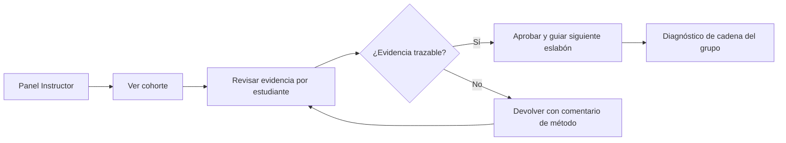
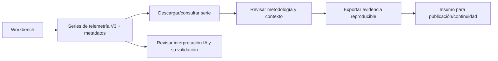
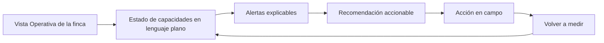
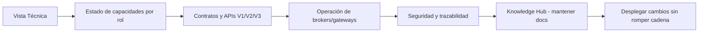

# SIGCTiArural — Modelo de Navegación del Dashboard

> **Estado:** U0.5 (Gate 0). Diseño. Cero código.
> **Versión:** 1.0.0 | **Fecha:** 2026-09-14
> **Familia:** Refactorización Global (Gate U0.5)

---

## 1. Propósito

Definir **cómo navega cada persona** del ecosistema y qué información jerárquica necesita. Es la especificación de IA (information architecture) que la Misión 7 convierte en wireframes.

Principio rector (Misión 1): la navegación expone la cadena **Conocimiento → Laboratorios → Hardware → Protocolos → Telemetría → IA → Proyectos Reales**, y a cada persona se le ofrece la vista de esa cadena que le corresponde.

---

## 2. Personas y objetivos

| Persona | Objetivo primario | Objetivo derivado | Vista que necesita |
|---|---|---|---|
| **Estudiante ADSO** | Producir evidencia de aprendizaje | Trazar su señal de lab → proyecto | Espacios de laboratorio + registro de evidencia |
| **Instructor SENA** | Verificar evidencia y guiar | Ver progreso de la cadena por estudiante | Panel de evidencia de cohorte + labs |
| **Investigador** | Trazar datos y metodología | Acceso a series, metadatos y repos | Workbench de investigación + telemetría cruda |
| **Agricultor** | Decidir con la interpretación (objetivo futuro*) | Ver alertas explicables y próximas acciones | Vista operativa (estado → interpretación → recomendación) |
| **Desarrollador/Operador** | Mantener y extender | Estado de capacidad, APIs, contratos | Vistas técnicas + Knowledge + monitoreo de capacidad |

---

> \* **Agricultor = objetivo futuro (CE-02):** hoy no existe despliegue productivo real (BBB 0 bytes, UBTN en diseño). Su vista no se navega hasta que exista un MVP real (UBTN o Agricultura V2); de lo contrario sería oferta falsa de valor.

---

## 3. Arquitectura de navegación (diseño)

```mermaid
flowchart TD
    D[Dashboard Principal] --> CAP[Capacidades]
    D --> LAB[Laboratorios]
    D --> HWC[Hardware Catalog]
    D --> TEL[Telemetría]
    D --> AI[IA]
    D --> PRO[Proyectos Reales]
    D --> KNW[Conocimiento]
    D --> OPS[Operación (subordinada)]
    CAP --> HB[Hardware-agnóstico]
    CAP --> UB[UBTN - capacidad]
    LAB --> L1[Matemáticas] --> L2[Física] --> L3[Electrónica] --> L4[Telecom] --> L5[Embebidos] --> L6[IoT] --> L7[IA] --> L8[Agricultura]
    KNW --> KE[Knowledge Hub - 51 docs]
    OPS --> E2[BBB / infra]
    style UB fill:#333269,stroke:#818cf8,color:#fff
```

> **Nota (C-04):** **UBTN no es eslabón de la cadena de labs.** Aparece como capacidad/proyecto (Capacidades → UBTN), consumiendo la cadena (IoT/Telecom/IA) pero sin ser prerrequisito pedagógico.

**Regla:** la infraestructura (TOP de hoy: BBB) pasa a ser un submenú de **Operación**, no el dashboard principal.

---

## 4. Flujo 1 — Estudiante ADSO

```mermaid
flowchart LR
    INICIO[Entra al Dashboard] --> R1{¿Dónde empiezo?}
    R1 -->|"Ver cadena y elegir señal"| CAD[Explorar laboratorios]
    CAD --> L[Entrar al lab (Electrónica)]
    L --> RES[Realizar actividad con instrumento]
    RES --> EVID[Guardar evidencia con método]
    EVID --> VAL[Ver cómo su evidencia alimenta la siguiente etapa]
    VAL --> PRO[Conectar a Proyecto Real]
    PRO --> MVP[Completar MVP integrador ADSO]
```

**Evidencia esperada:** captura configurable (lectura/parámetro/referencia) + asociación a un eslabón de la cadena + trazabilidad hasta el proyecto.

---

## 5. Flujo 2 — Instructor SENA



**Norma:** el instructor no ve "pantallas bonitas"; ve **evidencia con procedencia**.

---

## 6. Flujo 3 — Investigador



**Norma de investigación:** todo dato mostrado declara procedencia (lab/sensor/experimento) — sin eso no es dato científico.

---

## 7. Flujo 4 — Agricultor



**Norma:** las alertas describen causa física (temp/humedad o bioseñal), NO un identificador de infraestructura ("BBB-02 alert").

---

## 8. Flujo 5 — Desarrollador/Operador



---

## 9. Matriz persona → entrada → salida

| Persona | Punto de entrada | Acción clave | Salida deseada |
|---|---|---|---|
| Estudiante ADSO | Dashboard → Laboratorios | Actividad en lab + evidencia | Evidencia trazada + conexión a proyecto |
| Instructor SENA | Dashboard → Panel Instructor | Revisión de evidencia de cohorte | Diagnóstico por estudiante/cadena |
| Investigador | Workbench → Telemetría/IA | Consulta/export serie + metodología | Dataset reproducible con metadatos |
| Agricultor | Vista Operativa | Ver alerta → recomendación | Decisión de campo informada |
| Desarrollador | Vista Técnica | Consultar API/contrato | Cambio desplegado sin romper cadena |

---

## 10. Reglas de navegación

1. **Máximo 2 niveles** para llegar a cualquier actividad (no enterrar labs bajo submenús infinitos).
2. **La cadena es el breadcrumb:** toda página muestra "estás en [eslabón] ← [eslabón anterior]" como orientación pedagógica.
3. **Sin estados falsos de salud:** el estado de infraestructura siempre distingue `operativo / referencia / diseño / vacío` (regla de Misión 3, GHL-03).
4. **Cada persona tiene su vista**; ninguna vista es un "tile de nodos" genérico.
5. La navegación no sustituye contenidos: el Knowledge Hub permanece como repositorio de documentación gobernada.

---

## 11. Referencias

- [`SIGCTIARURAL_VISION_ALIGNMENT.md`](SIGCTIARURAL_VISION_ALIGNMENT.md) — principios (P3, P4, término de honestidad).
- [`SIGCTIARURAL_LAB_CONNECTIVITY_MODEL.md`](SIGCTIARURAL_LAB_CONNECTIVITY_MODEL.md) — grafo de labs (base de esta IA).
- [`SIGCTIARURAL_DASHBOARD_REIMAGINED_V2.md`](SIGCTIARURAL_DASHBOARD_REIMAGINED_V2.md) — wireframes de estas vistas.
- [`docs/UBTN_FRONTEND_UX_STRATEGY.md`](UBTN_FRONTEND_UX_STRATEGY.md) — perfiles de usuario UBTN que se integran a estas personas.