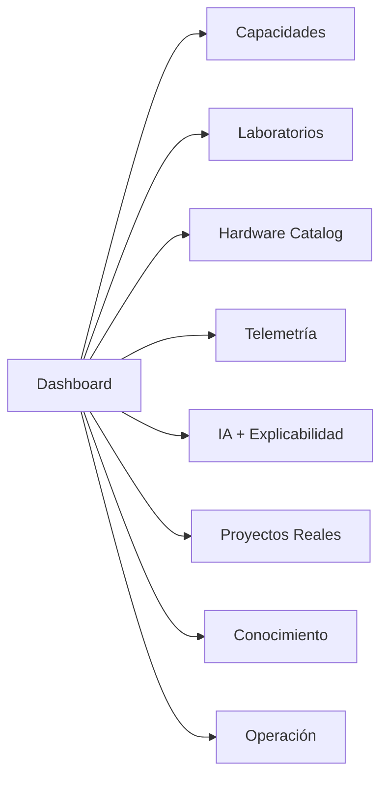

# SIGCTiArural — Dashboard Reimaginado V2

> **Estado:** U0.5 (Gate 0). Diseño. Cero código.
> **Versión:** 1.0.0 | **Fecha:** 2026-09-14
> **Familia:** Refactorización Global (Gate U0.5)

---

## 1. Propósito

Diseño completo del dashboard reimaginado: **Dashboard principal, Hardware Catalog, Knowledge Hub, UBTN, Telemetría, Laboratorios, Conocimiento**. Wireframes, diagramas y flujos. **NO código.**

> **Canonicidad (D-01):** los flujos de persona y la IA viven en [`SIGCTIARURAL_DASHBOARD_NAVIGATION_MODEL.md`](SIGCTIARURAL_DASHBOARD_NAVIGATION_MODEL.md) (canónico). Este documento es la **spec visual** (wireframes/páginas) que lo cita — no repite flujos ni matrices, para evitar divergencia de mantenimiento.

La firma distintiva: representa **CAPACIDADES, CONOCIMIENTO, LABORATORIOS, HARDWARE, PROYECTOS** — no infraestructura (Misión 1, P4; Misión 5).

---

## 2. Arquitectura de información (resumen)



Principio: cada entrada es **una capacidad o un espacio de conocimiento**; "Operación" queda al final y siempre distinguida de la identidad.

---

## 3. Wireframe — Dashboard principal

```
┌─────────────────────────────────────────────────────────────┐
│ 🌱 SIGCTiArural               [Persona: Estudiante▾|Instructor|Investigador|Desarrollador|Agricultor*] [🔔] │
├─────────────────────────────────────────────────────────────┤
│  Capacidades     Laboratorios   Hardware    Telemetría    IA │
│  Proyectos       Conocimiento            (⋯) Operación      │
├─────────────────────────────────────────────────────────────┤
│  CADENA DEL ECOSISTEMA (activa, navegable)                  │
│  Conocimiento → Labs → Hardware → Protocolos → Telemetría → IA → Proyectos  │
├─────────────────────────────────────────────────────────────┤
│  CAPACIDADES ACTIVAS                                         │
│  ┌───────────────┐ ┌───────────────┐ ┌───────────────┐      │
│  │ Telemetría    │ │ IA Edge       │ │ Conocimiento  │      │
│  │ (ambiente)    │ │ (inferencia)  │ │ (51 docs)     │      │
│  │ ● Referencia  │ │ ● Referencia  │ │ ● Operativo   │      │
│  │ fuente: BBB   │ │ fuente: BBB   │ │               │      │
│  └───────────────┘ └───────────────┘ └───────────────┘      │
│  ┌───────────────┐ ┌───────────────┐                        │
│  │ UBTN          │ │ Research/AI   │                        │
│  │ (bioseñal)    │ │ V2 (diseño)   │                        │
│  │ ◖ Diseño      │ │ ◖ Framework   │                        │
│  └───────────────┘ └───────────────┘                        │
├─────────────────────────────────────────────────────────────┤
│  EVIDENCIA RECIENTE  (trazable hasta proyecto)              │
│  [lab Electrónica → señal → proyecto: ...]                  │
├─────────────────────────────────────────────────────────────┤
│  ESTADO DE OPERACIÓN  (colapsable, subordinado)             │
│  ▸ Gateway  (portador: BBB-01) · Inferencia · Adquisición   │
│  ▸ Brokers/APIs (V1/V2/V3, tests 58 ✓)                     │
└─────────────────────────────────────────────────────────────┘
```

**Nota de honestidad:** los "● Referencia" no fingen "online": etiquetan el estado real (`referencia / diseño / operativo / vacío`, Misión 3 §7). La persona **Agricultor*** es **objetivo futuro**, gated por la existencia de un MVP real (UBTN o Agricultura V2): hoy no hay despliegue productivo, por lo que su vista no se oferta hasta que exista valor real (CE-02).

---

## 4. Wireframe — Hardware Catalog (modelo de aprendizaje)

```
┌─────────────────────────────────────────────────────────────┐
│ HARDWARE CATALOG — "¿Qué puedo aprender con esto?"           │
├─────────────────────────────────────────────────────────────┤
│ Nivel │ Plataforma  │ Estado    │ Protocolos │ Labs       │ Proyectos │
│───────┼─────────────┼───────────┼────────────┼────────────┼───────────┤
│ 1     │ Arduino     │ ▶ Operat.*│ UART/I2C   │ Electrónica│ Robot,    │
│       │             │           │            │ Robótica   │ sensores  │
│ 2     │ BBB Rev C   │ ⛏ Ref.    │ MQTT/HTTP  │ Telecom/IoT│ Gateway,  │
│       │             │           │            │ IA/UBTN    │ edge      │
│ 2     │ ESP32       │ 📐 Diseño │ WiFi/BLE/  │ Embebidos/ │ Wearable  │
│       │ (WROOM-32)  │ (UBTN)    │ LoRa       │ UBTN       │ UBTN V1   │
│ 3     │ Raspberry   │ 🧭 Futuro │ HTTP/WS    │ Embebidos  │ Visión,   │
│       │             │           │ GPIO       │ IA         │ maqueta   │
│ 4     │ STM32/FPGA  │ 🧭 Vacío  │ CAN/HDL    │ Embebidos  │ Adq.      │
│       │             │           │            │            │ determin. │
│ 4     │ Jetson/MiniPC│ 🧭 Vacío  │ CUDA/Dock  │ IA/MLOps  │ Edge IA,  │
│       │             │           │            │            │ broker    │
│─────────────────────────────────────────────────────────────│
│ * Arduino: precisar alcance real en el back; no prometer.    │
├─────────────────────────────────────────────────────────────┤
│ DETALLE (al seleccionar):                                   │
│ · Qué se aprende: ...   · Protocolo: ...   · Labs: ...      │
│ · Evidencia esperada: ...      · Proyectos que habilita: ...│
└─────────────────────────────────────────────────────────────┘
```

**Regla**: el catálogo ordena por **nivel de aprendizaje** y etiqueta estado real (GHL-03/04/05). Nunca se muestra lo que no existe como operativo.

---

## 5. Knowledge Hub (proyecto operativo)

- **No se rediseña desde cero:** se integra a la cadena como eslabón "Conocimiento" (51 docs gobernados).
- Cambio propuesto: desde el dashboard se accede con contexto (buscar un lab → ver su documentación); no como portal aislado.

```mermaid
flowchart LR
    KNOW[Dashboard → Conocimiento] --> KH[Knowledge Hub]<-->DOC[51 docs]
    KN2[Lab page: "Documentación"] --> KH
    AI2[IA V2 grounding] --> KH
```

---

## 6. UBTN en la navegación (eslabón "Bioseñal")

```mermaid
flowchart LR
    CAP2[Capacidad: UBTN] --> NOD[BiologicalNode]<br/>form factor por especie]
    NOD --> FW[Firmware ESP32]
    FW --> G[Gateway BBB - MQTT QoS1]
    G --> RK[Read-model + alertas]
    RK --> UI[UX por perfil: estudiante/investigador/agricultor]
    RK --> IA3[IA explicable]
    style NOD fill:#333269,stroke:#818cf8,color:#fff
```

- Presente en la cadena, en el Hardware Catalog (ESP32, diseño), y con UX propia (ADR-20) — pero **sin tocar `SensorReading`** (GR-03).

---

## 7. Vista "Telemetría" (capacidad, no tile)

| Bloque | Contenido | Fuente honesta |
|---|---|---|
| Señal ambiental | temp/humedad (V1/V2/V3) + procedencia | `TelemetryHistory*View` (referencia) |
| Bioseñal (UBTN) | diseño / sin datos hoy | — (etiqueta "diseño") |
| Interpretación IA | alerta explicable + validación | `AI_PREDICTION_VALIDATION_AUDIT.md` (marco) |
| Metadatos | lab/sensor/experimento | procedencia (Misión 2 GLC-03) |

---

## 8. Vista "Proyectos Reales"

```
┌─ PROYECTOS REALES ──────────────────────────────────────────┐
│ ★ MVP integrador ADSO  (cadena completa, evidencia)         │
│   [señal → datos → IA → decisión]                          │
│ ● UBTN (diseño)   ● Agricultura/V2 (framework)             │
│ (⋆) SENA: evidencia de graduación                           │
└──────────────────────────────────────────────────────────────┘
```

Cada proyecto muestra su **evidencia trazada** (qué labs participaron, qué señal, qué método).

---

## 9. Recap de páginas/estados (spec de diseño)

> **Regla (C-03):** se conserva la **nomenclatura de rutas reales** del frontend (`/dashboard`, `/labs`, `/knowledge`, `/ai-predictive`, etc.). Los nombres nuevos solo cambian **contenido/IA**, no las URLs, para no romper enlaces ni crear doble vocabulario (GR-09/12). Únicas rutas nuevas propuestas: `/hardware-catalog` y `/proyectos`.

| Ruta (real / nueva) | Objetivo | Deuda evitada |
|---|---|---|
| `/` | redirigir a `/dashboard` (vista por persona) | nave → gracias al rol |
| `/dashboard` | capacidades + cadena + evidencia + operación colapsable | ya no BBB tiles |
| `/labs` (+ `/labs/*`) | grafo de cadena (Misión 2) | ya no categorías planas |
| `/hardware-catalog` *(nueva)* | aprendizaje por plataforma (Misión 3) | no inventario |
| `/dashboard` (bloque telemetría) | señal + procedencia + interpretación | no feed crudo |
| `/proyectos` *(nueva)* | proyectos y evidencia | — |
| `/knowledge` | Knowledge Hub contextual (root de la cadena) | no docs aislados |
| `/operacion` (nuevo bloque en dashboard) | estado real de capacidades/portadores | no primaria |
| `/ai-predictive` (+ `/data-science`) | explicabilidad + pipeline V2 | no "IA mágica" |

---

## 10. Regla Suprema: NO ELIMINAR NADA (actualización Misión Crítica — Preservación)

**Nada desaparece. La evolución es por ampliación, no por sustitución.** Esta sección modifica (no elimina) el §10 original:

- **Tiles "Integraciones Futuras" (RPI-05, FPGA-X, ARDUINO-UNO-Q, ALEXA-IOT, DRONE-NAV): NO se borran.** Pasan a integrar el **Hardware Catalog** como entradas reales de estado `vacío/futuro`, **conservando su identidad, ícono, rol y enlaces externos/documentación** (raspberrypi.com, amd.com/yosys, docs.arduino.cc, Alexa, PX4/ArduPilot). Cambia solo el contenedor: de "tile con estado falso `construction`" a "entrada de catálogo honesta" (GLH del [`HARDWARE_LEARNING_MODEL`](SIGCTIARURAL_HARDWARE_LEARNING_MODEL.md)).
- **ClusterBBB (BBB-01 Gateway/MQTT, BBB-02 IA Edge/TFLite, BBB-03 Adquisición/Sensores): permanecen visibles en "Operación"** con sus roles originales y su dot de estado en la TopNav. Dejan de ser el centro conceptual, **pero su tarjeta, datos simulados, fallback y/o enlace a telemetría V3 se conservan intactos**.
- **Gráfica de telemetría V3** (`/api/v3/telemetry/history/`), **TelemetryPanel, GlobalChart, ClusterCard, Telemetry3DScene, LoginModal y la gráfica fallback**: componentes preservados tal cual en la nueva composición.
- **No mostrará estado `online/alert` sin procedencia**: se mantiene el estado, pero rotulado con su origen real (BBB = datos simulados/referencia 0 bytes; catálogo = `vacío/futuro`).
- No enterrará labs tras un menú; la cadena es el breadcrumb (preservado).
- No introducirá complejidad (BFF/microfrontend/streaming) sin demanda de persona (GR-11) (preservado).

### 10.1. Regla de transformación (Hoy → Mañana, del prompt de la Misión)

```
HOY                      MAÑANA (preservando todo lo de HOY)
BBB-01 Gateway  ──╮       Hardware
BBB-02 IA Edge   ──┼──►    ├─ BBB-01 Gateway   (sigue siendo Gateway/MQTT)
BBB-03 Sensor    ──╯       ├─ BBB-02 IA Edge   (sigue siendo IA Edge/TFLite)
                           ├─ BBB-03 Sensor    (sigue siendo Adquisición)
                           ├─ ESP32            (+)
                           ├─ STM32            (+)
                           ├─ Raspberry        (RPI-05, +)
                           └─ etc              (FPGA-X, ARDUINO, ALEXA-IOT, DRONE-NAV, UBTN-ESP32)
                           ▲ los tres BBB siguen existiendo: solo dejan de
                           ser el centro del universo
```

### 10.2. Matriz "qué pasa con lo que existe" (integración sin pérdida)

| Existente (hoy) | Acción (V2) | Se pierde algo |
|---|---|---|
| BBB-01/02/03 (ClusterCard + datos + fallback) | Sección **Operación** con los 3 BBB + dot TopNav + acceso a telemetría V3 | No |
| TelemetryPanel / GlobalChart / Telemetry3DScene / gráfica V3 | Sección **Telemetría** (capacidad) con los mismos componentes | No |
| IA Predictiva (`/ai-predictive`) | Ruta y entrada preservadas en la cadena y navegación | No |
| Laboratorios canónicos + experiencia + STEM (`/labs/*`, `/advanced-math*`, `/data-science`) | Sección **Laboratorios** (cadena Conocimiento→…) preservada, breadcrumb | No |
| Knowledge Hub (`/knowledge`, 51 docs operativos) | Sección **Conocimiento** preservada y enlazada | No |
| Tiles Integraciones Futuras (5) | Entradas del **Hardware Catalog** (estado `vacío/futuro`, sus enlaces intactos) | No (cambia contenedor) |
| Voice Assistant + `routeMap` | Se preserva y se **extiende** su mapa de comandos (nunca se reduce) | No |
| Login/Register/Admin2FA/AuthContext/AuthGuard | Se inventarían como "capacidad latente" (GR-03) y se preservan; sin rutear aún (GIA) | No |
| UBTN (diseño U0) | Capacidad/Proyecto de la cadena (C-04): vista de telemetría biológica conceptual, sin falso estado | No |
| `_deprecated/*` (5 docs) | Se preservan como legado histórico en Conocimiento | No |
| Ruta 404 → `/dashboard` | Preservada | No |

---

## 11. Relación con implementación (gobernanza)

- Toda esta UI es **diseño sin código**; su convertibilidad a implementación depende del gate U1 (previa Fases 7-8 del PLAN_MAESTRO) y del check de guardarraíles (Misión 6).
- Cambios de IA posteriores requieren este documento + auditoría (Misión 8) + bitácora.

---

## 12. Referencias

- [`SIGCTIARURAL_VISION_ALIGNMENT.md`](SIGCTIARURAL_VISION_ALIGNMENT.md) — principios/no-negociables.
- [`SIGCTIARURAL_DASHBOARD_NAVIGATION_MODEL.md`](SIGCTIARURAL_DASHBOARD_NAVIGATION_MODEL.md) — flujos por persona.
- [`SIGCTIARURAL_HARDWARE_LEARNING_MODEL.md`](SIGCTIARURAL_HARDWARE_LEARNING_MODEL.md) y [`SIGCTIARURAL_CAPABILITIES_VS_HARDWARE.md`](SIGCTIARURAL_CAPABILITIES_VS_HARDWARE.md).
- [`SIGCTIARURAL_PRESERVATION_STRATEGY.md`](SIGCTIARURAL_PRESERVATION_STRATEGY.md) — qué se preserva/protege (Misión Crítica).
- [`SIGCTIARURAL_COMPONENT_MAP.md`](SIGCTIARURAL_COMPONENT_MAP.md) — inventario existente/falta/evoluciona.
- [`SIGCTIARURAL_NAVIGATION_EVOLUTION.md`](SIGCTIARURAL_NAVIGATION_EVOLUTION.md) — evolución sin romper hábitos.
- [`SIGCTIARURAL_IMPLEMENTATION_READINESS.md`](SIGCTIARURAL_IMPLEMENTATION_READINESS.md) — qué está listo para U1.
- [`docs/UBTN_FRONTEND_UX_STRATEGY.md`](UBTN_FRONTEND_UX_STRATEGY.md) — perfiles y ADR-20.