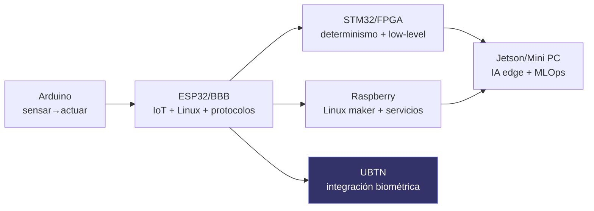

# SIGCTiArural — Modelo de Aprendizaje por Hardware

> **Estado:** U0.5 (Gate 0). Diseño. Cero código.
> **Versión:** 1.0.0 | **Fecha:** 2026-09-14
> **Familia:** Refactorización Global (Gate U0.5)

---

## 1. Propósito

Documentar, para cada plataforma de hardware del ecosistema, **qué se aprende, qué protocolos usa, qué laboratorios utiliza y qué proyectos permite construir**. El Hardware Catalog futuro (Misión 7) será la expresión navegable de este modelo.

**Regla de existencia parcial:** de esta lista, en el repositorio hay evidencia real de BBB (referencia, scripts 0 bytes), ESP32 y Arduino (actuadores de robótica, UBTN en diseño). **STM32, Raspberry (como hardware propio), Jetson, FPGA y Mini PC NO están documentados en el inventario** — se incluyen porque la cadena del ecosistema los exige como etapas o como opciones de capacidad, y su ausencia es un vacío a declarar, no una existencia a asumir.

---

## 2. Tabla maestra

| Plataforma | Estado en repo | Qué se aprende | Protocolos | Labs que utiliza | Proyectos que permite |
|---|---|---|---|---|---|
| **BBB (BeagleBone Black Rev C)** | Referencia (gateway/IA/adquisición); scripts 0 bytes "en progreso" | Linux embebido, MQTT broker, bridge edge→cloud, store-and-forward, inference TFLite, adquisición de sensores | MQTT (QoS), HTTP(S), Ethernet, GPIO/I2C/SPI/UART (cámara USB) | Telecomunicaciones, IoT, Embebidos, IA, UBTN (gateway ADR-04) | Gateway de telemetría, edge inferencia, broker rural, nodo UBTN (ADR-04) |
| **ESP32 (WROOM-32/S3/C3)** | UBTN en diseño (núcleo de nodo wearable) | Firmware IoT, BLE/WiFi, bajo consumo, sensores biométricos (ADS1292R/MAX30102/MPU6050), TDD en embedded | WiFi, BLE, MQTT (QoS 1/RETAIN), LoRa (SX1276/78 reserva) | Embebidos, Telecomunicaciones, Electrónica, UBTN | Wearable UBTN (V1-V4, ver `UBTN_HARDWARE_ROADMAP.md`), robótica telemetría de actuadores |
| **STM32** | Vacío (no inventariado) | Bare-metal/RTOS, ADC/DMA/timers, determinismo, drivers de bajo nivel | CAN, UART, SPI/I2C, USB, (futuro LoRa) | Embebidos, Electrónica | Controladores de actuador, adquisición determinista, nodos de borde rígidos |
| **Arduino** | Actuadores de robótica (Fase 6), entry-level | Primer contacto con electrónica/sensores, flujo lectura→actuación, prototipado rápido | UART, I2C, SPI, GPIO | Electrónica, Robótica, STEM piso | Brazo/robot simple, estaciones de sensores escolares |
| **Raspberry (Pi 5 / RPi)** | Solo placeholder en dashboard ("RPI-05") y dataset; sin inventario como hardware propio | Linux maker, visión con cámara, servicios propios, HTTP/WebSocket, microservicios ligeros | WiFi/Ethernet, HTTP(S), WebSocket, GPIO/I2C | Embebidos, IA (CV), Telecomunicaciones | Estación de visión económica, mini broker, demo escolar de IoT |
| **Jetson (Nano/Orin)** | Vacío (no inventariado) | IA en el borde con GPU/CUDA, CV embebida, optimización de modelos (TensorRT) | PCIe, USB3, GPIO, MQTT/HTTP | IA, Ciencia de Datos, UBTN (futura evolución de BBB-02) | Inferencia CV en finca/corral (detección), edge video analytics |
| **FPGA** | Solo link educativo en `/lab-embedded` | Lógica digital, HDL (VHDL/Verilog), determinismo temporal, pipelines | HDL, JTAG, interfaces seriales (SPI/LVDS) | Electrónica, Embebidos | Adquisición determinista de bioseñales (ECG pre-procesado), protocolos custom |
| **Mini PC** | Vacío | DevOps, orquestación (Docker), MLOps, brokers persistentes, CI/CD | Ethernet, TCP/IP, MQTT, VPN | IA, TI/DevOps, Knowledge (servicios) | Broker central auto-hospedado, planes de entrenamiento, laboratorio de MLOps |

---

## 3. Ladder de aprendizaje (de lo simple a lo complejo)

Regla implícita del ecosistema: **el hardware es un vehículo pedagógico, no un fetiche**: se avanza de plataforma cuando la pregunta de aprendizaje lo exige, no "porque la plataforma tiene hype".

---

## 4. Protocolos por etapa (mapa protocolo → aprendizaje)

| Protocolo | Plataformas | Qué enseña | Dónde se evidencia hoy |
|---|---|---|---|
| MQTT (QoS 0/1/2, RETAIN, LWT) | BBB, ESP32, Mini PC | entrega confiable, brokers, edge | `UBTN_MQTT_ARCHITECTURE.md`, diseño edge |
| HTTP(S)/REST (V1/V2/V3) | BBB, Raspberry, Mini PC | contratos, versionado, no-regresión | API `api/views.py`, `robotics_contracts.md` |
| BLE/WiFi | ESP32 | enlace de corto alcance, consumo | UBTN (diseño) |
| LoRa | ESP32 (reserva) | ruralidad (MHz no licenciados, presupuesto de enlace) | `UBTN_SENSOR_CATALOG.md` |
| I2C/SPI/UART/GPIO | BBB, ESP32, Arduino, STM32, RPi | transporte de señal de sensores | catalog de sensores UBTN |
| HAL/RTOS/CUDA/TensorRT | STM32/FPGA/Jetson | determinismo y cómputo acelerado | vacíos (ver §6) |
| Docker/MLOps | Mini PC | operación real sostenible | `AI_MLOPS_AND_TRAINING_GOVERNANCE_V2.md` |

---

## 5. Proyectos que la cadena permite construir

1. **Telemetría ambiental rural** (Agricultura): BBB gateway + sensores → V3 → dashboard → alerta de estrés.
2. **Wearable UBTN** (Bioseñal): ESP32 + ADS1292R/MAX30102 → MQTT QoS 1 → gateway BBB → read-model → alertas.
3. **Robótica didáctica**: Arduino/ESP32 actuadores + contratos JSON → telemetría de robot.
4. **IA en el borde**: BBB-02 (hoy) / Jetson (futuro) → inferencia de enfermedades de plantas.
5. **Adquisición determinista** (futuro): STM32/FPGA → ECG/EMG pre-procesado en el borde.
6. **Operación autohospedada**: Mini PC → broker central + MLOps + Knowledge Hub services.

---

## 6. Vacíos del modelo (GHL = Gap Hardware Learning)

| ID | vacío | Severidad | Acción |
|---|---|---|---|
| GHL-01 | **STM32, Jetson, FPGA, Mini PC sin rol/inventario definidos** (existen solo como links educativos en `/lab-embedded` y placeholders `FPGA-X`/`RPI-05` en el dashboard; no hay definición como hardware del proyecto) | 🔴 | Declararlos como opciones de capacidad futura en el Hardware Catalog; no prometer existencias |
| GHL-02 | **Raspberry solo como placeholder (`RPI-05`) y counterexample en identidad** — sin definición de rol | 🟡 | Definir rol (visión económica/maqueta), o quitar el placeholder del dashboard |
| GHL-03 | **BBB = scripts 0 bytes**: el catálogo puede mostrar "aprendizaje de gateway" que hoy no produce señal | 🔴 | El catálogo debe etiquetar el estado real (referencia/en-progreso), no simular operación (honestidad del item 7 de Misión 1) |
| GHL-04 | Sin **ladder explícito** en la UI (el estudiante no ve la progresión de plataformas) | 🟡 | El Hardware Catalog debe ordenar por `nivel de aprendizaje`, no alfabético |
| GHL-05 | Falta mapeo **protocolo↔laboratorio↔evidencia** (qué se entrega como evidencia al pasar un lab con tal plataforma) | 🟡 | Cada ficha de plataforma declara: laboratorio, protocolo, evidencia esperada |

---

## 7. Regla del catálogo honesto

1. **Solo se muestra lo que existe**, con etiqueta de estado: ▶ Operativo / ⛏️ Referencia-en-progreso / 📐 Diseño / 🧭 Futuro.
2. **El aprendizaje no se promete sobre hardware inexistente**: UBTN/ESP32 se muestra como "diseño" hasta gate U1; STM32/Jetson/FPGA/Mini PC como "capacidad futura por evaluar".
3. **Cada ficha responde las 4 preguntas** (qué se aprende, qué protocolos, qué labs, qué proyectos) sin rellenar con ansiedad.

---

## 8. Referencias

- [`docs/UBTN_SENSOR_CATALOG.md`](UBTN_SENSOR_CATALOG.md) — plataformas UBTN en diseño (ESP32, ADS1292R, MAX30102, LoRa, BLE).
- [`docs/UBTN_HARDWARE_ROADMAP.md`](UBTN_HARDWARE_ROADMAP.md) — variantes V1-V4 con costos y energía.
- [`docs/UBTN_BBB_EDGE_GATEWAY.md`](UBTN_BBB_EDGE_GATEWAY.md) — BBB-01 como gateway UBTN (ADR-04).
- [`docs/PLAN_MAESTRO.md`](PLAN_MAESTRO.md) — Fase 6 (actuadores ESP32/Arduino) y Fase 7 (edge).
- [`SIGCTIARURAL_CAPABILITIES_VS_HARDWARE.md`](SIGCTIARURAL_CAPABILITIES_VS_HARDWARE.md) — hardware ≠ capacidad.