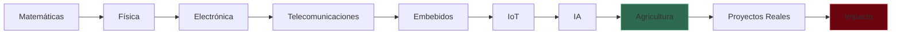

# SIGCTiArural — Modelo de Conectividad de Laboratorios

> **Estado:** U0.5 (Gate 0). Diseño. Cero código.
> **Versión:** 1.0.0 | **Fecha:** 2026-09-14
> **Familia:** Refactorización Global (Gate U0.5)

---

## 1. Propósito

Mapear **todos los laboratorios** del ecosistema, las relaciones (prerrequisito, flujo de señal, producción de evidencia) entre ellos y los vacíos de conectividad. Es el plano que la navegación futura (Misión 4/7) debe exponer.

Fuente de verdad de existencia: frontend real (`src/frontend/src/labs/*` y páginas `/labs/*`), el contexto `labs` del backend (Strategy/Factory con 4 líneas canónicas) y la integración documentada de UBTN ([`docs/UBTN_LAB_INTEGRATION.md`](UBTN_LAB_INTEGRATION.md)).

---

## 2. Cadena conceptual (matriz del ecosistema)

> **Nota (C-04):** **UBTN no es eslabón de esta cadena pedagógica.** Es un dominio/línea de telemetría biológica que **consume** la cadena (IoT, Telecomunicaciones, IA), pero no es prerrequisito ni etapa de laboratorio. Se representa como capacidad/proyecto (ver Misión 5 y §4 nota).

Esta cadena es el "currículo oculto": cada eslabón se apoya en el anterior y produce el insumo del siguiente.

---

## 3. Inventario de laboratorios (estado real)

### 3.1 Laboratorios canónicos (contexto `labs`, Strategy/Factory)

| Lab | Estrategia (código real) | Evidencia que produce | Señal que consume/produce |
|---|---|---|---|
| **Agricultura** | `agricultura.py` | lecturas ambientales (DHT22, suelo), alerta de estrés (38.5 °C / 18 % vía `OnSensorReadingHandler`) | `sensor_reading` (temperatura/humedad) |
| **Electrónica** | `electronica.py` | circuitos simulados (Falstad), diseños reproductibles | esquemáticos → parámetros de medición |
| **Robótica** | `robotica.py` | telemetría de actuadores (joints/batería), contratos JSON | `robot_telemetry` / comandos |
| **Telecomunicaciones** | `telecom.py` | espectro (WebAudio FFT), análisis de señales | espectro → modulación |

### 3.2 Laboratorios de experiencia (frontend)

| Lab | Ruta | Qué hace |
|---|---|---|
| Matemáticas Avanzadas | `/advanced-math`, `/advanced-math-v2` | matemática interactiva, demodulación de señales ("Dr. Binary") |
| Ciencia de Datos | `/data-science` | consola Python (Pyodide), visualización |
| Sistemas Embebidos | `/lab-embedded` | Wokwi, FPGA/HDL, RTOS (links) |
| Telecomunicaciones | `/lab-telecom` | WebAudio FFT + WebSDR |
| Electrónica | `/lab-electronics` | simulador de circuitos Falstad |
| Robótica | `/labs/robotics` | escena 3D de robot, telemetría |
| IA Predictiva | `/ai-predictive` | inferencia de enfermedades de plantas (real/sim/demo) |

> **Nota (C-01):** Conocimiento/Knowledge Hub (`/knowledge`) **no es un laboratorio**; es la raíz de la cadena y el portal documental gobernado (51 docs, base del RAG de Knowledge AI). Se retira de esta tabla de labs.

### 3.3 Piso educativo STEM y líneas en diseño

- **STEM (piso educativo):** enfoque triple (Ciencias, Tecnología, Matemáticas; Física incorporada vía modelado paramétrico de señales) documentado en `UBTN_LAB_INTEGRATION.md` §8.
- **UBTN (diseño):** línea de telemetría biológica que debe conectarse a los laboratorios (Labs integration en UBTN_LAB_INTEGRATION) y a la cadena como consumidor de Telecom/IoT/IA y productor de señal biológica.

---

## 4. Grafo de conectividad objetivo (conexiones futuras marcadas)

```mermaid
flowchart LR
    subgraph Prerrequisitos
        MA[Matemáticas: señal/modelado]
        FI[Física: fenómenos]
    end
    MA --> EL[Electrónica]
    FI --> EL
    EL --> TC[Telecomunicaciones]
    TC --> EM[Embebidos]
    MA --> DS[Ciencia de Datos]
    EM --> IOT[IoT: MQTT / sensores]
    IOT --> AG[Agricultura]
    AG --> AI[IA Predictiva]
    AI --> PR[Proyectos Reales]
    DS -.futuro/falta.- AI
    IOT -.consume línea.- UBTN[UBTN - bioseñal]
    UBTN -.futuro/falta.- AI
    style AG fill:#2d6a4f,stroke:#95d5b2
    style UBTN fill:#333269,stroke:#818cf8
```

> **Lectura honesta del estado actual (C-02):** los labs canónicos existen como estrategias de backend y como páginas; pero **falta el "pegamento" que haga visible la cadena**: no hay modelo de datos de evidencia que conecte una señal del lab A con un proyecto del lab D. Las conexiones punteadas (`...`) son **objetivo/futuro**, no existencia actual.

---

## 5. Matriz de dependencias (prerrequisito → habilitado)

| Eslabón | Se apoya en | Habilita |
|---|---|---|
| Matemáticas | — | modelado de señal en Electrónica/Telecom/DataScience |
| Física | Matemáticas | fenómenos medibles (temperatura, movimientos, ondas) |
| Electrónica | Física, Matemáticas | acondicionamiento de señal |
| Telecomunicaciones | Electrónica, Matemáticas | transporte de señal (FFT, modulación) |
| Embebidos | Electrónica, Telecomunicaciones | instrumentos (Wokwi/FPGA/RTOS) |
| IoT | Embebidos, Telecomunicaciones | MQTT, bridges, edge |
| IA | Ciencia de Datos, IoT | interpretación de datos |
| Agricultura | IoT, Embebidos | decisión de campo (estrés térmico) |
| UBTN | IoT, Telecomunicaciones, IA, Electrónica | telemetría biológica (diseño) |
| Proyectos Reales | todos los anteriores | MVP/evidencia integradora (ADSO) |

---

## 6. Vacíos de conectividad detectados (GLC = Gap Lab Connectivity)

| ID | Vacío | Severidad | Consecuencia | Propuesta |
|---|---|---|---|---|
| GLC-01 | No existe laboratorio de **Física** explícito (solo modelado paramétrico en STEM) | 🟠 | La cadena parte "en el aire": sin fenómeno físico no hay señal que medir | Definir espacio de Física (experimentos de onda/período) anclado a Electrónica/Telecom |
| GLC-02 | **IoT como laboratorio propio** ausente: "IoT" es concepto difuso entre Embebidos y Telemetría | 🟠 | No hay una etapa donde se enseñe protocolo/edge (MQTT, QoS, store-and-forward) como evidencia | Formalizar etapa IoT (protocolos) en el modelo de navegación |
| GLC-03 | **Sin modelo de evidencia transversal** entre labs (nada conecta señal de lab A → proyecto lab D) | 🔴 | La cadena no es trazable como aprendizaje | Diseñar `Evidencia` (ID, lab origen, señal, proyecto destino) como concepto de navegación/datos (diseño, no BD) |
| GLC-04 | **Agricultura consume solo telemetría ambiental** — no recibe retroalimentación de UBTN ni de IA educativa | 🟠 | La decisión de campo no es circular (medir → interpretar → actuar → volver a medir) | Pipeline de retroalimentación lab ↔ IA ↔ proyecto |
| GLC-05 | **UBTN no tiene laboratorio de entrada** (bioseñal) en el modelo actual | 🟡 | Su integración a labs queda documental y no navegable | Añadir nodo "Bioseñal/UBTN" en la navegación como numerario de la misma cadena |
| GLC-06 | **Ciencia de Datos desconectado de los labs de señal** | 🟡 | El análisis no se evidencia sobre los datos del sistema | Enlazar DataScience con telemetría real (V3) y datasets de laboratorio |
| GLC-07 | Dependencia de hardware: la cadena se representa por nodos (BBB) en lugar de por capacidad | 🔴 | Los estudiantes aprenden "3 BBB" en vez de "gateway/inferencia/adquisición" | Aplicar modelo Hardware≠Capacidad (Misión 5) |

---

## 7. Plan de conectividad objetivo (lo que la navegación futura debe exponer)

1. **Visibilidad de cadena:** cada lab muestra sus eslabones de entrada (prerrequisitos) y salida (qué habilita), para que la navegación no sea un menú plano sino un grafo de aprendizaje.
2. **Concepto de evidencia transversal** (diseño, no implementado): un objeto `Evidencia` describe *lab origen + señal + método + proyecto destino*. Es el pegamento que hace trazable la relación Conocimiento→Proyectos.
3. **Roles por capacidad, no por nombre de nodo:** "Gateway", "Inferencia", "Adquisición" reemplazan "BBB-01/02/03" en el modelo navegable (ver Misión 5).
4. **Cierre de GLC-01/02 de forma conceptual:** el mapa de navegación incluye nodos Física e IoT como etapas de la cadena (aunque no existan como ruta propia hoy, se declaran como espacios; su implementación es decisión posterior del gate, no de este diseño).
5. **Retroalimentación circular Agricultura↔IA↔Proyectos:** el dashboard debe permitir "ver el dato, ver la interpretación, ver la decisión", no solo "ver el dato".

---

## 8. Referencias

- [`SIGCTIARURAL_VISION_ALIGNMENT.md`](SIGCTIARURAL_VISION_ALIGNMENT.md) — principios de identidad (P2: labs comunicados).
- [`SIGCTIARURAL_DASHBOARD_NAVIGATION_MODEL.md`](SIGCTIARURAL_DASHBOARD_NAVIGATION_MODEL.md) — flujos por persona sobre este grafo.
- [`SIGCTIARURAL_CAPABILITIES_VS_HARDWARE.md`](SIGCTIARURAL_CAPABILITIES_VS_HARDWARE.md) — roles por capacidad (GLC-07).
- [`docs/UBTN_LAB_INTEGRATION.md`](UBTN_LAB_INTEGRATION.md) — integración de UBTN con los labs y el piso STEM.
- [`docs/ECOSYSTEM_IDENTITY.md`](ECOSYSTEM_IDENTITY.md) — principio 2 (labs se comunican).