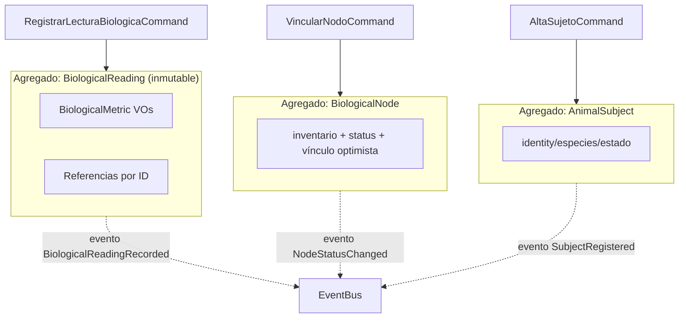

# 🧱 UBTN — Diseño de Agregados (Aggregates)

## Universal Biological Telemetry Node — Límites de Consistencia, Raíces y Eventos

| Campo | Valor |
|-------|-------|
| **Versión** | 1.0.0 (diseño — sin implementación) |
| **Fecha** | 2026-09-13 |
| **Rama** | `feature/ubtn-biological-telemetry` |
| **Estado** | 🔷 Diseño — profundiza `UBTN_DOMAIN_MODEL.md` §6 |
| **Decisión** | Tres agregados alineados con la regla "agregados pequeños, referencia por ID" |

---

## 1. Propósito

Justificar, sin ambigüedad, **cuáles son los agregados** de `BiologicalTelemetry`, **dónde termina su consistencia**, y **qué eventos de dominio los cruzan**. Responde: ¿qué se actualiza atómicamente?, ¿qué se publica cuando esto ocurre?, ¿qué le queda a otro agregado/contexto por eventual consistency?

> ⛔ Diseño de dominio — no implementación.

---

## 2. Reglas de Diseño de Agregados Adoptadas

| Regla | Justificación |
|---|---|
| **Agregados pequeños** | menos contención, fácil de validar (PRINCIPIO operativo para telemetría de alto volumen) |
| **Referencia por ID, no por objeto** | evita arrastrar `AnimalSubject`/`BiologicalNode` dentro de `BiologicalReading` (Lectura pequeña y reutilizable) |
| **Un solo evento raíz por comando** | observable, idempotente, integrable con EventBus |
| **No transacciones inter-agregado** | cada comando toca un único agregado; lo demás es eventual |
| **Versionado de optimismo en nodos** | prevención de conflictos en provisioning (concurrencia de operarios) |
| **Ninguna mutación tras creación** | `BiologicalReading` es inmutable; correcciones son analítica, no mutación |

---

## 3. Los Tres Agregados

### 3.1 `BiologicalReading` (raíz: raíz de telemetría)

| Atributo | Tipo | Nota |
|---|---|---|
| `id` | AggregateId | persistencia |
| `subject_id` | AnimalSubjectId | referencia (no objeto) |
| `device_id` | NodeId | referencia (no objeto) |
| `captured_at` | datetime | eje temporal principal |
| `metrics` | Mapping[SensorChannel, BiologicalMetric] | canales abiertos (ADR-07) |
| `reading_signature` | Signature | deduplicación |
| `placement` | PlacementSite | contexto de medición |
| `burst_token` | optional | si la lectura resume una ráfaga |

**Root invariants:**

1. `metrics` no vacío y con al menos un canal válido.
2. `captured_at` no futuro.
3. `reading_signature` determinista y único en el store.
4. La lectura es **inmutable** post-creación.

**Tamaño del agregado:** mínimo — solo VOs (`BiologicalMetric`) y referencias. Justificación: es el agregado de mayor tasa de escritura; todo lo que se pueda externalizar, se externaliza.

### 3.2 `AnimalSubject` (raíz: registro de individuo)

| Atributo | Tipo |
|---|---|
| `identity` | AnimalSubjectId (local, pseudonimizado) |
| `species` | SubjectSpecies |
| `breed`, `birth_date`, `sex` | perfil |
| `active` | bool |
| `facility_id` | optional (colmena/estanque/corral) |

**Root invariants:** identity único; species válida; una vez `active=false` no se aceptan nuevas lecturas productivas (la analítica histórica sí sigue).

**Tamaño:** pequeño; sin historial de nodos ni lecturas dentro (referencias por ID).

### 3.3 `BiologicalNode` (raíz: catálogo/estado del dispositivo)

| Atributo | Tipo |
|---|---|
| `device_id` | NodeId |
| `form_factor` / `placement` | forma y sitio |
| `model`, `firmware_version` | inventario |
| `sensor_channels` | frozenset |
| `subject_id` / `facility_id` | objetivo activo |
| `battery_percent`, `last_seen`, `status` | observabilidad |
| `version` | concurrencia optimista |

**Root invariants:**

1. Un nodo **activo** tiene un solo `subject_id` (o `facility_id`), nunca ambos.
2. `status` ∈ {provisioning, online, offline, maintenance, lost}.
3. `firmware_version` sigue una política de inventario (sello `fw` verificado en catálogo).
4. Actualización de estado **solo vía comando dedicado** (`UpdateNodeStatus`), nunca por mutación interna.

**Tamaño:** pequeño-medio; las series NO viven aquí.

---

## 4. Límites de Consistencia (Consistency Boundaries)

**Reglas de frontera:**
- `BiologicalReading` **referencia** `AnimalSubject` y `BiologicalNode` por ID; **no** los modifica.
- La validación "nodo vinculado a sujeto" se hace **antes** de aceptar la lectura (chequeo en el comando vía `BiologicalNodeRepositoryPort`), no por escritura conjunta — decisión por volumen.
- `AnimalSubject` y `BiologicalNode` pueden evolucionar de forma independiente y eventual.

---

## 5. Eventos que Cruzan Agregados

| Evento | Emisor | Contenido | Naturaleza |
|---|---|---|---|
| `BiologicalReadingRecorded` | `BiologicalReading` | resumen canal + firmas | dominio (para labs/IA) |
| `ThresholdViolated` | policy de umbral (sobre `BiologicalReading`) | canal, valor, umbral | dominio |
| `PhysiologicalAlertRaised` | policy (post-sostenimiento) | alert_id, severidad | dominio → `BioAlertPort` |
| `NodeStatusChanged` | `BiologicalNode` | estado, batería | dominio → monitoring |
| `NodeLinkedToSubject` | `BiologicalNode` | device_id, subject_id | dominio → auditoría |
| `BurstStored` | `BiologicalReading` (burst) | burst_token, channel | datos pesados referenciados |

**Regla:** un evento publica **solo lo necesario** (IDs + resumen), nunca el agregado entero. El receptor que quiera más, consulta por query.

---

## 6. Estrategia Transaccional por Caso

| Comando | Escritura | Consistencia |
|---|---|---|
| `RegistrarLecturaBiologicaCommand` | un solo INSERT en `BiologicalReading` + publica evento | inmediata (reactor idempotente) |
| `RegistrarRafagaBiologicaCommand` | INSERT lectura + objeto burst en bucket | eventual para el burst (el token ya da el resumen) |
| `VincularNodoCommand` | UPDATE `BiologicalNode` con versionado optimista | inmediata en nodo; eventual para lecturas futuras |
| `AltaSujetoCommand` | INSERT `AnimalSubject` | inmediata |
| `UpdateNodeStatusCommand` | UPDATE `BiologicalNode.status` | inmediata; no bloquea lecturas |

> **Inciso anti-sofisma:** la validación de "nodo activo con un sujeto" no exige transacción distribuida: la unicidad es **condición de entrada** del comando (`VincularNodo`) con verificación y versionado; las lecturas concurrentes aceptan un lapso eventual mientras la marca de nodo cambia. Se documenta como **consistencia eventual aceptada** (redundante con la deduplicación por firma).

---

## 7. Criterios de Aceptación de Diseño de Agregados

1. ✅ Cada comando toca **un solo agregado**.
2. ✅ Ningún agregado contiene otro por objeto (solo IDs).
3. ✅ `BiologicalReading` inmutable tras creación.
4. ✅ Eventos publican resumen, no agregados.
5. ✅ Unicidad de nodo→sujeto resuelta con versionado optimista + condición de entrada (no transacción distribuida).
6. ✅ Las alertas **no** son agregado de dominio: son **read-model/event-trace** (derivadas), no fuente de verdad del dominio.

---

## 8. Referencias

- [`UBTN_DOMAIN_MODEL.md`](UBTN_DOMAIN_MODEL.md) — vocabulario, comandos y VOs.
- [`UBTN_EVENT_STORMING.md`](UBTN_EVENT_STORMING.md) — origen de comandos/eventos.
- [`UBTN_CONTEXT_MAP.md`](UBTN_CONTEXT_MAP.md) — bordes entre contextos.
- [`UBTN_DATA_CONTRACTS.md`](UBTN_DATA_CONTRACTS.md) — formato de eventos en el bus.
- [`UBTN_ADR_INDEX.md`](UBTN_ADR_INDEX.md) — registro de decisiones.

---

*Diseño de agregados — sin implementación. Coherente con pequeños límites de consistencia.*