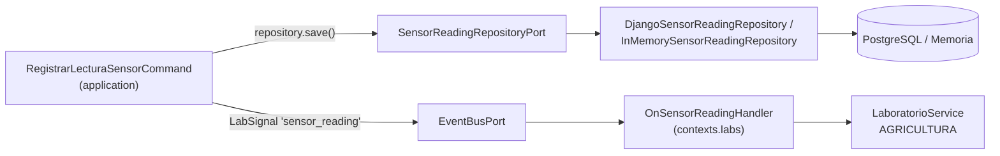
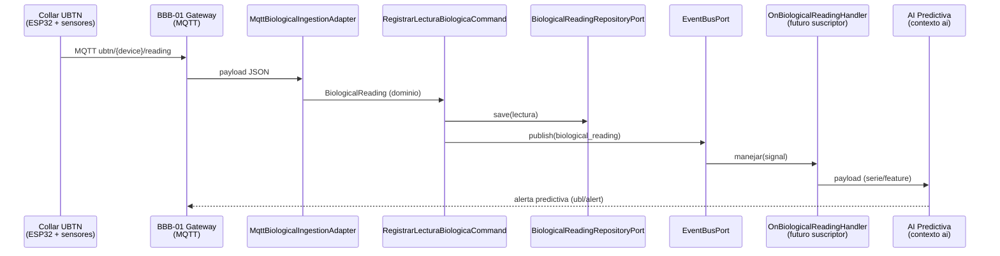
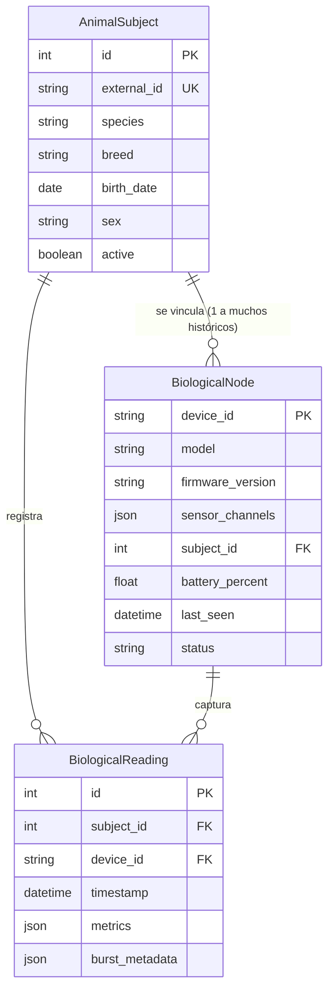

# 📡 UBTN — Universal Biological Telemetry Node

## Arquitectura de Referencia — Telemetría Biológica para SIGC&T Rural / EIARC

| Campo | Valor |
|-------|-------|
| **Versión** | 1.0.0 (Análisis arquitectónico — sin implementación) |
| **Fecha** | 2026-09-13 |
| **Rama** | `feature/ubtn-biological-telemetry` |
| **Estado** | 🔷 Diseño (análisis, DDD, roadmap — no implementado) |
| **Alcance** | Collares inteligentes, wearables veterinarios, sensores biométricos y futuros dispositivos biológicos |
| **Prohibición vigente** | No modificar `SensorReading` · No romper compatibilidad con Telemetry Context · No tocar `main` |

---

## 1. Propósito

Este documento es la especificación arquitectónica del **UBTN (Universal Biological Telemetry Node)**: la línea de telemetría biológica de SIGC&T Rural que incorpora señales vitales procedentes de **collares inteligentes**, **wearables veterinarios**, **sensores biométricos** (ECG/PPG/IMU en formato wearable) y **futuros dispositivos biométricos** al mismo ecosistema donde hoy conviven la telemetría ambiental (`SensorReading`) y la telemetría robótica (`RobotTelemetry`).

El UBTN **no reemplaza** la telemetría existente: es un **nuevo subdominio DDD** (`BiologicalTelemetry`) diseñado para crecer *al lado* del Telemetry Context sin alterar ninguna entidad viva del repositorio.

> **Regla de oro:** este documento describe diseño, no código. No existe implementación nueva asociada a esta rama.

---

## 2. Análisis Arquitectónico del Contexto Telemetry (Estado Verificado 2026-09-13)

Para diseñar el subdominio sin romper el contexto actual, primero se analizó cada pieza del Telemetry Context y de su ecosistema.

### 2.1 `SensorReading` — Entidad de Dominio (PROHIBIDO MODIFICAR)

- **Ruta canónica:** `src/backend/contexts/telemetry/domain/entities/sensor_reading.py`
- **Espejo legacy:** `src/backend/core/domain/entities/sensor_reading.py`
- **Modelo Django:** `src/backend/api/models.py` (clase `SensorReading`)

| Atributo | Tipo | Valor de objeto |
|---|---|---|
| `sensor_id` | `SensorId` | VO inmutable, no vacío, limpiado (`strip`) |
| `temperature` | `Temperature` | VO inmutable, rango `[-50, 60] °C` |
| `humidity` | `Humidity` | VO inmutable, rango `[0, 100] %` |
| `timestamp` | `datetime` | Rechaza fechas futuras |
| `id` | `Optional[int]` | Reservado para persistencia |

**Características a respetar (patrón de referencia para el subdominio nuevo):**
- Entidad `@dataclass` con `__post_init__` que valida invariantes.
- Value objects `frozen=True`, validación en rango, excepción de dominio dedicada (`InvalidTemperatureError`, `InvalidHumidityError`, `InvalidSensorIdError`).
- `__str__` legible: `SensorReading[BBB-03]: 22.5°C, 60.0% @ 2026-07-20 12:00:00`.

> ⛔ **Invariante:** ninguna propuesta del UBTN agrega, elimina ni cambia campos de `SensorReading`. El subdominio biológico crea su **propia** entidad (`BiologicalReading`) con sus propios value objects.

### 2.2 `RobotTelemetry` — Modelo Django (Fase 6, Robótica)

- **Ruta:** `src/backend/api/models.py` (líneas 41-53)
- **Rol:** telemetría de robots (V1), aún **sin** contexto hexagonal de dominio.

| Atributo | Tipo |
|---|---|
| `robot` | `FK → Robot` |
| `battery_level` | `FloatField` (0-100) |
| `status_mode` | `CharField` (`idle`, `moving`, `error`) |
| `position_x/y/z` | `FloatField` |
| `velocity_linear` | `FloatField` |
| `timestamp` | `DateTimeField` |

**Observación para el UBTN:** `RobotTelemetry` demuestra el patrón de un segundo flujo telemetría coexistente con `SensorReading` dentro del mismo proyecto. El UBTN puede repetir la misma estrategia a nivel hexagonal: un flujo paralelo, no una fusión.

### 2.3 `EventBusPort` + `LabSignal` (Días 16-17) — Mecanismo de interconexión

- **Puerto:** `src/backend/shared_kernel/event_bus/ports/event_bus.py`
- **Objeto de valor de transporte:** `src/backend/shared_kernel/event_bus/domain/lab_signal.py`
- **Adaptador:** `src/backend/shared_kernel/event_bus/infrastructure/in_memory_event_bus.py`

```python
class EventBusPort(ABC):
    def publish(self, signal: LabSignal) -> None: ...
    def subscribe(self, signal_type: str, handler: Callable[[LabSignal], None]) -> None: ...

@dataclass(frozen=True)
class LabSignal:
    source_context: str      # "telemetry"
    signal_type: str         # "sensor_reading"
    timestamp: datetime
    payload: Dict[str, Any]  # MappingProxyType (inmutable en runtime)
    signal_id: str = ...     # uuid4
    metadata: Dict[str, Any] = ...
```

**Contrato de señal hoy (Telemetría → Labs/Agricultura):**

| `signal_type` | `source_context` | Payload actual |
|---|---|---|
| `sensor_reading` | `telemetry` | `{ temperature, humidity, sensor_id }` |

**Regla de compatibilidad:** el UBTN publicará un `signal_type` **nuevo** (`biological_reading`) y **nunca** reutilizará A/Cambiará el contrato de `sensor_reading`. El `InMemoryEventBus` entrega síncrona e inmutable; los suscriptores se aíslan por excepción (un handler roto no bloquea al resto) — propiedad que se reutiliza tal cual.

### 2.4 Composición del Telemetry Context (patrón a replicar)

```
src/backend/contexts/telemetry/
├── domain/
│   ├── entities/sensor_reading.py
│   └── value_objects/{temperature,humidity,sensor_id}.py
├── application/commands/registrar_lectura_sensor_command.py
├── ports/sensor_reading_repository.py
└── infrastructure/
    ├── config/dependencies.py
    ├── compat/legacy_sensor_reading_adapter.py
    └── persistence/
        ├── django/{django_sensor_reading_repository.py, sensor_reading_mapper.py}
        └── in_memory/in_memory_sensor_reading_repository.py
```

### 2.5 Cadena funcional del caso piloto (Telemetría → Labs)



**Puntos de extensión identificados (para el UBTN, sin tocar nada):**
1. `wiring.py` (composition root) — lugar donde se registraría un futuro `OnBiologicalReadingHandler` como suscripción adicional a `biological_reading`.
2. `RegistrarLecturaSensorCommand` — plantilla del comando de aplicación del subdominio nuevo.
3. Patrón port + adaptador + mapper de `telemetry` — plantilla estructural del subdominio nuevo.
4. `shared_kernel.event_bus` — mecanismo reutilizado sin cambios (el bus es neutral, no conoce contextos).

---

## 3. Diseño del Subdominio DDD — `BiologicalTelemetry`

### 3.1 Posicionamiento de subdominio

| Contexto delimitado | Rol | Propiedad |
|---|---|---|
| **Telemetry Context** (existente) | Ingesta IoT ambiental y de cultivos | `SensorReading` |
| **Robótica (V1)** (existente) | Telemetría de actuadores | `RobotTelemetry` |
| **BiologicalTelemetry** (nuevo) | Ingesta biométrica de individuos animales | `BiologicalReading` ubtns |

**Decisión de diseño:** `BiologicalTelemetry` se modela como **bounded context hermano**, no como extensión del contrato de `SensorReading`. Razones:

1. **Inmutabilidad del dominio existente:** `SensorReading` está prohibido de modificar y sus VOs son estrictos (temperatura de ambiente -50..60°C, sin frecuencia cardíaca). Las biometrías (HR, SpO₂, ECG, acelerometría, rumia) no caben en ese contrato.
2. **Lenguaje ubicuo distinto:** "sujeto animal", "collar", "especie", "alerta clínica" son conceptos de un subdominio de apoyo/core que no comparte invariantes con la telemetría de cultivo.
3. **Evolución independiente:** los sensores biométricos (ECG de 2 canales, PPG, IMU) y sus frecuencias de muestreo (alta tasa, ráfagas) no deben contaminar el slice de telemetría ambiental estable.

### 3.2 Lenguaje Ubicuo

| Término | Definición |
|---|---|
| **UBTN** | Universal Biological Telemetry Node — dispositivo/collar wearable que captura señales vitales de un animal y las publica. |
| **AnimalSubject** | Sujeto animal identificado (individuo) al que se le asigna un collar. |
| **BiologicalReading** | Lectura biométrica periódica registrada por el sistema. Entidad raíz de telemetría del subdominio. |
| **BiologicalMetric** | Valor biológico concreto con unidad y rango fisiológico (T° corporal, FC, FR, SpO₂, índice de rumia, actividad). |
| **BiologicalNode** | Entidad que representa el hardware wearable (firmware, sensores embarcados, estado). *Antes `CollarDevice`, renombrada por ADR-UBTN-08.* |
| **SensorChannel** | Canal de adquisición de un sensor dentro del nodo (ECG-1, PPG, IMU-X/Y/Z…). |
| **Encargo / Provisioning** | Acción de vincular un `BiologicalNode` a un `AnimalSubject` (asociación nodo-animal). |
| **Alerta fisiológica** | Regla de dominio que dispara señal `physiological_alert` (fiebre, hipoactividad, taquicardia sostenida). |
| **Ráfaga (burst)** | Recolección de alta frecuencia (ej. ECG a 500 Hz) durante ventanas cortas, distinta del latido de telemetría periódica. |

### 3.3 Mapa de Contextos (Context Map)

```mermaid
flowchart LR
    subgraph PLC["Telemetry Context (existente)"]
        SRS[SensorReading]
    end
    subgraph ROB["Robótica V1 (existente)"]
        RTS[RobotTelemetry]
    end
    subgraph BIO["BiologicalTelemetry (nuevo, diseñado)"]
        BR[BiologicalReading]
        AN[AnimalSubject]
        BN[BiologicalNode]
    end
    subgraph AI["AI Context (existente)"]
        PRED[IA Predictiva<br/>detección de anomalías]
    end
    subgraph LAB["Labs Context (existente)"]
        AG[Agricultura]
    end

    SRS -.->|"LabSignal: sensor_reading"| AG
    BR ==>|"LabSignal: biological_reading<br/>(nuevo, no toca sensor_reading)"| PRED
    BR -. "consulta/analítica" .-> PRED
    PRED ==>|"alerta predictiva"| AN
    AN --> BN
    BN --> BR

    style BIO fill:#042f2e,stroke:#34d399,stroke-width:3px
    style PLC fill:#0f172a,stroke:#8b5cf6,stroke-width:2px
    style ROB fill:#0f172a,stroke:#8b5cf6,stroke-width:2px
    style AI fill:#1e3a8a,stroke:#60a5fa,stroke-width:2px
    style LAB fill:#052e16,stroke:#4ade80,stroke-width:2px
```



**Relaciones entre contextos:**
- `BiologicalTelemetry → AI`: **upstream/downstream** — publica lecturas (eventos) y recibe alertas predictivas. La IA predictiva consume series históricas vía CUI (Customer/Supplier Interface), no acoplando los agregados.
- `BiologicalTelemetry` **no** se acopla a `Telemetry Context`: no importa `SensorReading`, no reutiliza su repositorio.
- `Labs Context`: recibirá `biological_reading` como nuevo `signal_type` reaccionable (patrón ya probado con `sensor_reading`), sin tocar el handler existente.

### 3.4 Estructura objetivo de la carpeta del subdominio

```
src/backend/contexts/bio/                      # (diseño; NO se crea en esta rama)
├── domain/
│   ├── entities/
│   │   ├── animal_subject.py
│   │   ├── biological_reading.py
│   │   └── collar_device.py
│   ├── value_objects/
│   │   ├── animal_id.py            # identificador de individuo
│   │   ├── subject_species.py      # especie (BOVINE, OVINE, PORCINE, CANINE…)
│   │   ├── device_id.py
│   │   ├── sensor_channel.py       # canal físico (ECG1, PPG, IMU_X, …)
│   │   ├── body_temperature.py     # rango fisiológico por especie, °C
│   │   ├── heart_rate.py           # bpm, rango válido
│   │   ├── respiratory_rate.py     # respiraciones/min
│   │   ├── spo2.py                 # saturación O₂ %
│   │   ├── rumination_index.py     # actividad de rumia (proxy)
│   │   ├── activity_score.py       # índice de actividad (IMU)
│   │   └── accelerometry_sample.py # triplete X/Y/Z (MPU6050)
│   ├── exceptions/
│   │   └── bio_domain_exceptions.py
│   └── domain_services/
│       └── physiological_threshold_service.py   # umbrales por especie (tabla)
├── application/
│   ├── commands/
│   │   ├── registrar_lectura_biologica_command.py
│   │   └── vincular_collar_command.py
│   └── queries/
│       └── listar_lecturas_por_sujeto_query.py
├── ports/
│   ├── biological_reading_repository_port.py
│   ├── collar_device_repository_port.py
│   └── bio_alert_port.py
└── infrastructure/
    ├── config/
    │   └── dependencies.py
    ├── persistence/
    │   ├── django/
    │   │   ├── django_biological_reading_repository.py
    │   │   ├── django_collar_device_repository.py
    │   │   └── biological_reading_mapper.py
    │   └── in_memory/
    │       └── in_memory_biological_reading_repository.py
    └── mqtt/
        └── mqtt_biological_ingestion_adapter.py   # (M4, ver roadmap)
```

### 3.5 Modelado táctico DDD

#### 3.5.1 Aggregate Root: `BiologicalReading` (entidad de telemetría)

```python
# CONTRATO DE DISEÑO (no implementación)
@dataclass
class BiologicalReading:
    subject_id: AnimalSubjectId     # a quién pertenece
    device_id: BiologicalNodeId     # qué nodo capturó
    timestamp: datetime             # instante de captura
    metrics: Dict[SensorChannel, BiologicalMetric]  # al menos 1
    burst_metadata: Optional[dict]  # frecuencia de muestreo / ventana
    id: Optional[int] = None
```

- Cada `BiologicalMetric` es un VO inmutable con: `channel`, `value`, `unit`, `physiological_range`, `sample_rate_hz`.
- Se valida que `metrics` no sea vacío y que cada valor esté en rango fisiológico conocido (o se marque como `out_of_range` sin rechazo).
- **Invariante:** `device_id` debe estar asociado a `subject_id` (ver `BiologicalNode`) — en un MVP puede relajarse a "aceptar el sujeto aún cuando la vinculación formal esté pendiente".

> El UBTN **no** reutiliza `Temperature` de telemetría ambiental: la temperatura corporal define su propio VO `BodyTemperature` con rangos por especie (ej. bovino 37.5–39.1 °C).

#### 3.5.2 Aggregate Root: `AnimalSubject`

```python
@dataclass(frozen=True)
class AnimalIdentity:  # identificador del individuo
    id: str

@dataclass
class AnimalSubject:
    identity: AnimalIdentity
    species: SubjectSpecies       # BOVINE, OVINE, PORCINE, CAPRINE, CANINE…
    breed: str
    birth_date: Optional[datetime]
    sex: Optional[str]
    active: bool = True
```

#### 3.5.3 Aggregate Root: `BiologicalNode` (antes `CollarDevice`)

```python
@dataclass
class BiologicalNode:
    device_id: BiologicalNodeId
    model: str                    # ej. UBTN-ESP32-S03
    firmware_version: str
    sensor_channels: frozenset[SensorChannel]   # ECG1/ECG2, PPG, IMU_X/Y/Z…
    subject: Optional[AnimalSubjectId]          # vinculación actual (o facility en colmena/estanque)
    battery_percent: Optional[float]
    last_seen: Optional[datetime]
    status: str = "online"        # online / offline / maintenance / provisioning / lost
```

- La asociación nodo→sujeto (`vincular_nodo`) es el comando de aplicación que respeta la invariante de unicidad (un nodo activo con un solo objetivo — sujeto o instalación — a la vez). Nombre histórico: `vincular_collar` (ADR-UBTN-08).

### 3.6 Puertos (Ports) de salida

| Puerto | Tipo | Contrato de diseño |
|---|---|---|
| `BiologicalReadingRepositoryPort` | Persistencia | `save(reading)`, `get_all(limit)`, `get_by_id`, `get_by_subject(subject_id, window)` |
| `BiologicalNodeRepositoryPort` | Persistencia | `save(node)`, `get_by_id`, `link_subject(device_id, subject_id)` |
| `BioAlertPort` | Notificación | `emit_alert(sujeto, canal, gravedad, mensaje)` |

> De forma deliberada **no** se extiende `SensorReadingRepositoryPort`: el subdominio nuevo declara sus propios puertos, replicando el patrón del contexto hermano sin acoplarse a él.

### 3.7 Adaptadores (Adapters) de salida

| Adaptador | Puerto que implementa | Notas |
|---|---|---|
| `DjangoBiologicalReadingRepository` (+ mapper) | `BiologicalReadingRepositoryPort` | Modelo Django `BiologicalReading` (nueva tabla, ver §5.4) |
| `InMemoryBiologicalReadingRepository` | `BiologicalReadingRepositoryPort` | Tests y modo simulado (idéntica estrategia a `InMemorySensorReadingRepository`) |
| `MqttBiologicalIngestionAdapter` | (driver de entrada) | Consume tópicos MQTT del gateway BBB, traduce payload → `BiologicalReading` |
| `ConsoleBioAlertAdapter` | `BioAlertPort` | Espejo de `ConsoleNotificationAdapter` (labs) — alertas en consola/log |

### 3.8 Capa de aplicación

- **`RegistrarLecturaBiologicaCommand`** — orquesta `save()` en el repositorio + publica `LabSignal(signal_type="biological_reading")`. Espejo de `RegistrarLecturaSensorCommand`, con payload:

```python
signal = LabSignal(
    source_context="bio",
    signal_type="biological_reading",
    timestamp=lectura.timestamp,
    payload={
        "subject_id": ...,
        "device_id": ...,
        "heart_rate": ...,       # si aplica
        "body_temperature": ..., # si aplica
        "spo2": ...,            # si aplica
        "activity_score": ...,
    },
)
```

- **`VincularCollarCommand`** — asocia collar → sujeto, validando estado de provisionamiento.
- **Queries** — listar lecturas por sujeto, por ventana temporal, serie para IA predictiva (sin acoplarse a `ai`).

### 3.9 Integración con el EventBus (sin romper compatibilidad)



**Clave de no-regresión:** el flujo existente `sensor_reading` (Telemetría → Agricultura) queda **inalterado**. `wire_all()` agrega líneas nuevas sin quitar las existentes.

---

## 4. Investigación de Integración de Hardware

### 4.1 Plataforma wearable — ESP32

| Aspecto | Detalle |
|---|---|
| Rol | MCU del collar UBTN: adquisición, filtrado ligero, WiFi/BLE, publicación MQTT |
| Por qué | Bajo consumo, WiFi/BLE integrado, ADC/PWM/I2C/SPI suficientes para los 3 sensores, ecosistema Arduino/ESP-IDF, soporte Paho MQTT |
| Consumo | Deep-sleep entre ráfagas; frecuencia de telemetría configurable (p. ej. 1 lectura/10 min; ráfaga ECG a demanda) |
| Firmware (diseño) | `ubtn_firmware/` dentro de `src/embedded/ubtn/` (futuro) |

### 4.2 Sensores embarcados

| Sensor | Interfaz | Señales | Uso clínico propuesto |
|---|---|---|---|
| **ADS1292R** | SPI | ECG 2 canales, 24-bit, hasta 8 kSPS | Frecuencia cardíaca + morfología ECG (arritmias), calidad de señal |
| **MAX30102** | I2C | PPG: HR y SpO₂ (LED rojo/IR) | Saturación de oxígeno, frecuencia cardíaca por fotopletismografía |
| **MPU6050** | I2C | Acelerómetro 3-ejes + giroscopio 3-ejes | Actividad, rumia/posición (echado/de pie), hipoactividad (proxy de morbilidad) |

```mermaid
flowchart LR
    subgraph COLLAR["Collar UBTN (ESP32)"]
        ECG[ADS1292R<br/>ECG 2ch 24-bit]
        PPG[MAX30102<br/>PPG HR/SpO2]
        IMU[MPU6050<br/>Acc+Gyro 6 ejes]
        MCU[ESP32<br/>procesamiento + MQTT]
        BAT[Batería LiPo + PMIC]
        ECG --> MCU
        PPG --> MCU
        IMU --> MCU
        BAT --> MCU
    end
    MCU -->|"WiFi · MQTT 5"| GW
    subgraph GW["Gateway Edge BBB Rev C"]
        MQ[Brigde MQTT→HTTPS]
    end
    GW --> CLOUD["Backend Django<br/>Persistence + EventBus"]

    style COLLAR fill:#052e16,stroke:#4ade80,stroke-width:2px
    style GW fill:#0f172a,stroke:#10b981,stroke-width:2px
```



### 4.3 BeagleBone Black Rev C como Gateway UBTN

Ver documento dedicado: [`UBTN_BBB_EDGE_GATEWAY.md`](UBTN_BBB_EDGE_GATEWAY.md).

Rol propuesto: **BBB-01 asciende de "gateway de sensores ambientales" a "gateway UBTN"** — broker MQTT (Mosquitto), adaptador de tópicos `ubtn/*`, reenvío TLS al backend, y buffer local *store-and-forward* para conectividad intermitente (propiedad ya existente en la filosofía edge del proyecto).

### 4.4 Protocolo MQTT (diseño de tópicos)

| Tópico | Dirección | Payload (ej.) |
|---|---|---|
| `ubtn/{node_id}/reading` | nodo → broker | `{"t": "...", "hr": 55, "temp": 38.6, "spo2": 97, "acc": [0.1,-0.2,9.8]}` |
| `ubtn/{node_id}/burst` | nodo → broker | ráfaga ECG/PPG con `sample_rate_hz` y ventana |
| `ubtn/{node_id}/status` | nodo → broker | `{"batt": 84, "fw": "0.1.0", "state": "online"}` (QoS 1 + RETAIN, ver `UBTN_MQTT_ARCHITECTURE.md`) |
| `ubtn/cmd/{node_id}` | broker → nodo | `{"cmd": "calibrate", ...}` (full-duplex futuro) |
| `ubtn/{node_id}/alert` | edge → cloud | mirror de alerta fisiológica (read-model por API es la fuente de verdad) |

> Reconciliación A-2/A-4 (auditoría): el tópico de `status` pasa a QoS 1 + retained y el de `alert` se granulariza por nodo — `ubtn/alert` global queda deprecado por inconsistencia.

**Seguridad:** TLS/PSK obligatorio en el lazo collar↔broker y broker↔nube; identidad de dispositivo (CA local) en el provisioning.

### 4.5 IA Predictiva (diseño de integración)

La IA predictiva **no** vive en el subdominio: consume series limpias del `BiologicalTelemetry` a través del `AIServicePort` existente (que ya orquesta `ai_advisory`/`AI Context`) o un puerto de analítica nuevo.

```mermaid
flowchart LR
    SUB[BiologicalReading<br/>serie temporal por sujeto] --> FE[Feature Engineering<br/>medias móviles, variabilidad, tendencias]
    FE --> MOD[Modelos<br/>ML/DL: anomalías, clasificación de estado]
    MOD --> RULES[Fusión con umbrales fisiológicos<br/>(rango por especie)]
    RULES --> ALERT[Alerta predictiva<br/>prevención antes de crítico]
    ALERT --> PROD[Productor/Operario]
```

**Patrón de evolución (consistente con PLAN_MAESTRO §9.3):** primero reglas de umbral (fiebre: temperatura corporal > umbral por especie sostenido), luego ML/DL cuando existan datos propios etiquetados.

---

## 5. Modelo de Datos Propuesto

### 5.1 Principio

Ninguna tabla existente se modifica. Se crean tablas nuevas (prefijo `bio_`) gobernadas por migraciones Django, conservando `schema_postgresql.sql` como referencia histórica (regla §18.4 del SYSTEM BOOT).

### 5.2 Modelo lógico



### 5.3 Campos `metrics` en JSONB (para evolución libre de canales)

Coherente con la persistencia JSONB del ecosistema (checklist §4 MASTERDOC): los canales son un mapa clave→valor con unidad y rango fisiológico; futuros sensores biométricos se incorporan **sin migración** estructural.

### 5.4 Consideraciones de rendimiento

- Índice compuesto por `(subject_id, timestamp DESC)` — la consulta principal es series por animal.
- Los `burst` (ECG/PPG de alta frecuencia) se recomiendan en tabla aparte `bio_burst_samples` o almacenamiento columna (futuro), para no inflar la tabla de lecturas periódicas.
- Retención/agregación por antigüedad (downsampling) es un criterio de aceptación de la Fase de persistencia del roadmap.

---

## 6. Compatibilidad y No-Regresión (Checklist de Verificación)

| Criterio | Resultado del diseño |
|---|---|
| `SensorReading` no modificado | ✅ Subdominio nuevo crea `BiologicalReading`; no toca entidades del contexto hermano |
| `sensor_reading` (LabSignal) sin cambios | ✅ Se publica `biological_reading` nuevo como señal adicional |
| `EventBusPort`/`LabSignal` no alterados | ✅ Uso directo de `shared_kernel.event_bus` sin cambios |
| `SensorReadingRepositoryPort` no tocado | ✅ Puerto nuevo dedicado |
| `wiring.py` no rompe suscripciones actuales | ✅ Se agregan líneas, no se quitan |
| `api/models.py` V1/V2/V3 intactos | ✅ Solo tablas nuevas; V1..V3 siguen su ciclo planificado |
| `RobotTelemetry` intacto | ✅ No relacionado |
| Dashboards / endpoints existentes intactos | ✅ Solo endpoints nuevos (`/api/v4/bio/*` propuesto) |
| Docker/compose intacto | ✅ Sin cambios de infraestructura en esta rama |

---

## 7. Decisiones Arquitectónicas Registradas (ADR resumido)

| ID | Decisión | Alternativa rechazada | Motivo |
|---|---|---|---|
| ADR-UBTN-01 | Nuevo bounded context `bio` (hermano) | Extender `SensorReading` | Prohibición explícita + contratos incompatibles + lenguaje ubicuo distinto |
| ADR-UBTN-02 | Puerto y repositorio propios | Reutilizar `SensorReadingRepositoryPort` | Acoplamiento indebido y rompería la vista V3 |
| ADR-UBTN-03 | Señal EventBus `biological_reading` nueva | Reutilizar `sensor_reading` | La señal original describe temperatura/humedad ambiental; los suscriptores actuales traducen ese payload y no deben conocer biometrías |
| ADR-UBTN-04 | BBB-01 como gateway UBTN (evolución) | BBB nuevo | Reutiliza broker, poder y rol de gateway ya asignado; softening del clúster existente |
| ADR-UBTN-05 | MVP de una sola variable vital end-to-end | Multivariable simultánea | Principio §9.2 de PLAN_MAESTRO: validar un variable primero. ⚠️ Variable en revisión (A-7): el set base no incluye sensor de T°; alternativa RT con MAX30102. |

> **Nota auditoría (A-7):** la elección específica de la variable del MVP permanece abierta en la familia: [`UBTN_ROADMAP.md`](UBTN_ROADMAP.md) U5/U7 y [`UBTN_RESEARCH_GAPS.md`](UBTN_RESEARCH_GAPS.md) B1. No bloquea el diseño, sí bloquea la compra de hardware del prototipo.
| ADR-UBTN-06 | Umbrales fisiológicos primero, ML después | ML directo sin reglas | Sin datos propios etiquetados; gobernanza de IA V2 |

---

## 8. Referencias Internas

- [`UBTN_ADR_INDEX.md`](UBTN_ADR_INDEX.md) — registro central de decisiones arquitectónicas (ADRs 01-20).
- [`UBTN_INDEX.md`](UBTN_INDEX.md) — índice general UBTN, árbol documental y matriz de trazabilidad.
- [`UBTN_DOMAIN_MODEL.md`](UBTN_DOMAIN_MODEL.md) — modelado táctico DDD completo (entidades, VOs, eventos).
- [`UBTN_RISK_ANALYSIS.md`](UBTN_RISK_ANALYSIS.md) — registro de riesgos y controles.
- [`UBTN_AUDIT_REVIEW.md`](UBTN_AUDIT_REVIEW.md) — auditoría crítica de la familia (hallazgos A-1..A-8 y reconciliación).
- [`PLAN_MAESTRO.md`](PLAN_MAESTRO.md) — Fase 9.2 (monitoreo biométrico de ganado) y 9.3 (alertas tempranas).
- [`MASTERDOC.md`](MASTERDOC.md) — Sección 3.2 (telemetría veterinaria multiespecie) y bitácora.
- [`UBTN_ROADMAP.md`](UBTN_ROADMAP.md) — plan faseado de implementación.
- [`UBTN_BBB_EDGE_GATEWAY.md`](UBTN_BBB_EDGE_GATEWAY.md) — detalle del gateway edge.
- [`UBTN_SENSOR_CATALOG.md`](UBTN_SENSOR_CATALOG.md) — comparativa de sensores y plataformas.
- `src/backend/contexts/telemetry/` — patrón estructural de referencia.
- `src/backend/shared_kernel/event_bus/` — bus neutral reutilizado.
- `docs/ADSO_GUIA_TECNICA_REFACTORIZACION_HEXAGONAL_SIGCTIARURAL.md` — guía de estudio/backlog hexagonal.

---

*Documento de análisis — sin implementación. Fecha de verificación del contexto: 2026-09-13.*