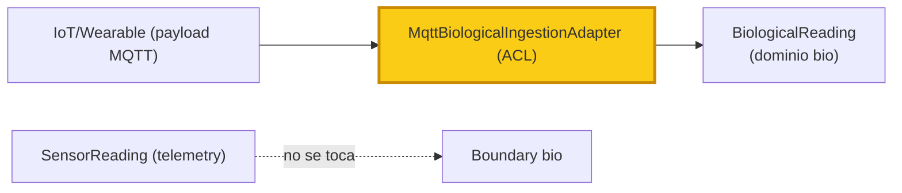

# 🗺️ UBTN — Context Map DDD

## Universal Biological Telemetry Node — Mapa de Contextos y Relaciones entre Dominios

| Campo | Valor |
|-------|-------|
| **Versión** | 1.0.0 (diseño — sin implementación) |
| **Fecha** | 2026-09-13 |
| **Rama** | `feature/ubtn-biological-telemetry` |
| **Estado** | 🔷 Diseño — formaliza y profundiza `UBTN_ARCHITECTURE.md` §3.3 |
| **Base DDD** | Upstream/Downstream · ACL · Partnership · Shared Kernel · Conformist · Published Language |

---

## 1. Propósito

Producir el **Context Map** canónico del ecosistema en el que vive `BiologicalTelemetry`, describiendo **qué contexto se relaciona con cuál**, **en qué dirección**, **con qué patrón DDD** y **con qué contrato técnico**. Es la pieza que valida que la invariante "no romper el contexto existente" es estructural (no solo una regla de cortesía).

> ⛔ Regla: este documento describe relaciones y contratos de diseño; no crea ni modifica código.

---

## 2. Inventario de Contextos en el Mapa

| Contexto | Estado | Rol UBTN | Propiedad clave |
|---|---|---|---|
| `BiologicalTelemetry` (bio) | 🔷 diseñado | contexto nuevo de telemetría biométrica | `BiologicalReading`, `BiologicalNode`, `AnimalSubject` |
| `Telemetry Context` (telemetry) | ✅ existente | vecino independiente (ambiental) | `SensorReading`, `sensor_reading` |
| `Robótica` (V1) | ✅ existente | vecino (actuadores/telemetría) | `RobotTelemetry` |
| `Labs Context` (labs) | ✅ existente | consumidor downstream de eventos | `LaboratorioStrategyFactory`, estrategias |
| `AI Context` (ai) | ✅ existente/auditado | consumidor de series + productor de alertas | `AIServicePort`, IA predictiva |
| `Identity / Farm Planning` (futuro) | 🔮 diseño | registro de granjas/productores | `Granja`, `Productor`, `Ubicación` |
| `Knowledge Hub` (knowledge) | ✅ existente | consumidor documental | familia documental UBTN, KB |

---

## 3. Mapa de Contextos General

```mermaid
flowchart LR
    subgraph BIO["BiologicalTelemetry (nuevo — diseñado)"]
        BR[BiologicalReading]
        BN[BiologicalNode]
        SU[AnimalSubject]
    end
    subgraph TEL["Telemetry Context (existente)"]
        SR[SensorReading]
    end
    subgraph ROB["Robótica V1 (existente)"]
        RT[RobotTelemetry]
    end
    subgraph LAB["Labs Context (existente)"]
        AG[Agricultura]
        EL[Electrónica]
    end
    subgraph AI["AI Context (existente)"]
        PRD[IA Predictiva]
    end
    subgraph FARM["Identity / Farm (futuro)"]
        GR[Granja]
        PR[Productor]
    end
    KNW[Knowledge Hub]

    BIO ==>|"Published Language: LabSignal 'biological_reading'"| LAB
    BIO ==>|"UP serie; Conformist a CUI AI; ACL de datos"| AI
    AI ==|"alertas predictivas (downstream)"| BIO
    TEL ==>|"Published Language: 'sensor_reading'"| LAB
    BIO -. "no relación (ACL de blindaje: no shared model)" .x TEL
    BIO -. "partnership analítica (sin acoplar)" .-> ROB
    FARM -. "partnership futuro: registro de sujeto ← granja" .-> BIO
    KNW ==>|"documentación/evidencias"| BIO

    style BIO fill:#042f2e,stroke:#34d399,stroke-width:3px
    style TEL fill:#0f172a,stroke:#8b5cf6,stroke-width:2px
    style ROB fill:#0f172a,stroke:#8b5cf6,stroke-width:2px
    style AI fill:#1e3a8a,stroke:#60a5fa,stroke-width:2px
    style LAB fill:#052e16,stroke:#4ade80,stroke-width:2px
    style FARM fill:#422006,stroke:#fbbf24,stroke-width:2px
```

---

## 4. Relaciones en Detalle (Patrones DDD)

### 4.1 `BiologicalTelemetry` → `Labs Context` — **Published Language** (downstream)

| Atributo | Valor |
|---|---|
| Patrón DDD | **Published Language** — el `LabSignal` del `EventBusPort` es el lenguaje publicado neutral; ambos contextos lo usan sin compartir modelo |
| Dirección | `bio` (upstream de eventos) → `labs` (consumidor conformista) |
| Contrato | `LabSignal(source_context="bio", signal_type="biological_reading")` (ver `UBTN_DATA_CONTRACTS.md` §8) |
| Regla | `labs` trata el evento como dato opcional de contexto productivo; NO trae agregados de `bio` |

```mermaid
sequenceDiagram
    participant BIO as BiologicalTelemetry
    participant BUS as EventBusPort (publicado)
    participant LAB as Labs Context

    BIO->>BUS: publish(LabSignal biological_reading)
    BUS->>LAB: subscribe → OnBiologicalReadingHandler
    LAB->>LAB: enriquece estrategia productiva (sin conocer agregados bio)
    Note over BIO,LAB: Published Language: contrato neutral; ambos lados sin shared model
```

### 4.2 `BiologicalTelemetry` ↔ `AI Context` — **Upstream/Downstream + Conformist** (doble rol)

| Atributo | Valor |
|---|---|
| Patrón | `bio` es **upstream** de datos (serie) para `AI`; a la vez `AI` es **upstream** de especificación (CUI de series) y `bio` se comporta como **Conformist** hacia esa especificación |
| Contratos | Salida: series limpias vía query/no-coupling; Entrada: `alertas predictivas` vía EventBus (`physiological_alert`) |
| Frontera | **CUI (Customer/Supplier Interface)** — APIs de series/ventana para IA; `AIServicePort` anima la IA (sin acoplarse a `bio`) |
| Regla | `bio` nunca importa `ai`; `ai` nunca importa agregados `bio`; solo se comparten DTOs de serie + eventos |

```mermaid
flowchart LR
    subgraph BIO["BiologicalTelemetry"]
        Q[Query de series<br/>port de analítica]
    end
    subgraph AI["AI Context"]
        CUI[CUI de series IA]
        PRD[Modelos Animal Health AI]
        EV[Emitter physiological_alert]
    end
    Q -->|"DTO serie {subject, channel, window}"| CUI
    PRD --> EV
    EV -->|"LabSignal physiological_alert"| BIO
    style BIO fill:#042f2e,stroke:#34d399,stroke-width:2px
    style AI fill:#1e3a8a,stroke:#60a5fa,stroke-width:2px
```



### 4.3 `BiologicalTelemetry` ⇢ `Telemetry Context` — **Sin relación + ACL de blindaje**

| Atributo | Valor |
|---|---|
| Patrón DDD | **No cooperación intencional** con **ACL** en el borde: la ingesta del `bio` traduce IoT/Wearable → dominio propio, jamás reutiliza `SensorReading` |
| Dirección | ninguna relación de dominio; comparten solo infraestructura neutral (EventBus, patrones) |
| Contrato | **ninguno** a nivel de dominio |
| ACL | `MqttBiologicalIngestionAdapter` es la frontera: traduce payload MQTT → VO de dominio `bio` (analogía al patrón anti-corrupción ante un mundo externo heterogéneo) |



### 4.4 `BiologicalTelemetry` ↔ `Robótica` — **Partnership** (asimétrico, analítica)

| Atributo | Valor |
|---|---|
| Patrón DDD | **Partnership** táctico: cooperan en **analítica** sin compartir modelo ni transacciones |
| Dirección | correlación recíproca de series (robótica detecta eventos; bio ve estrés) |
| Contrato | ninguno en el MVP; query cruzada opcional en analítica (ID de correlación por nodo/espacio-tiempo) |
| Regla | no hay comando de robot → collar; no hay evento `biological_*` manejado por robótica |

### 4.5 `BiologicalTelemetry` ⇢ `Identity / Farm` (futuro) — **Partnership / ACL futuro**

| Atributo | Valor |
|---|---|
| Patrón | **Partnership** con ACL a construir cuando `FarmPlanning` exista |
| Contrato futuro | `AnimalSubject` recibe `granja/productor` desde Identity vía CIF; nunca al revés |
| Regla | `AnimalSubject.external_id` local hoy (sin PII); cuando exista Identity, `external_id` → referencia a `GranjaId` (ADR-UBTN-16) |

### 4.6 Shared Kernel — QUÉ se comparte y QUÉ NO

| Elemento | Compartido (SHARED KERNEL) | No compartido |
|---|---|---|
| `EventBusPort`/`LabSignal` | ➕ infraestructura neutral del `shared_kernel` | — |
| Reglas de idempotencia/entrega | ➕ convención operativa | — |
| `SensorReading` + VOs | ❌ | exclusivo de telemetry |
| Repositorios `SensorReadingRepositoryPort` | ❌ | exclusivo de telemetry |
| Modelo de datos de telemetry V1-V3 | ❌ | exclusivo |

> **Precisión:** el "shared kernel" del ecosistema es **infraestructura** (bus, convenciones), no dominio. Los contextos NO comparten agregados de dominio. Esta precisión evita el error de creer que compartir EventBus legitima compartir `SensorReading`.

---

## 5. Matriz de Relaciones (resumen ejecutivo)

| Desde | Hacia | Patrón DDD | Contrato | Dirección |
|---|---|---|---|---|
| bio | labs | Published Language | `biological_reading` (LabSignal) | UP→DOWN |
| bio | ai | UP/DOWN + Conformist + ACL | CUI series + `physiological_alert` | bidireccional |
| ai | bio | idem | `physiological_alert` | DOWN→UP |
| bio | telemetry | no relación + ACL de blindaje | ninguno | — |
| bio | robótica | partnership (analítica) | ninguno (MVP) | correlacional |
| telemetry | labs | Published Language | `sensor_reading` (existente) | UP→DOWN |
| bio | identity/farm (futuro) | partnership + ACL | `AnimalSubject.external_id` → `GranjaId` | futuro |
| knowledge | bio | documental | familia UBTN (KB) | — |

---

## 6. Reglas de Mantenimiento del Context Map

1. Una nueva relación **requiere ADR** y actualiza esta matriz.
2. Si `bio` necesita un dato de `labs`/`ai`, debe usar **Open Host Service/contrato** o evento — nunca acceso directo a agregado de otro contexto.
3. El mapa vigente es este documento (superas el esbozo de `UBTN_ARCHITECTURE.md` §3.3).
4. Las decisiones basadas en contexto se citan como `ContextMap §` en el `UBTN_ADR_INDEX.md`.

---

## 7. Referencias

- [`UBTN_ARCHITECTURE.md`](UBTN_ARCHITECTURE.md) §3.3 (esbozo original de mapa).
- [`UBTN_DOMAIN_MODEL.md`](UBTN_DOMAIN_MODEL.md) — vocabulario y agregados.
- [`UBTN_DATA_CONTRACTS.md`](UBTN_DATA_CONTRACTS.md) §8 — señales publicadas.
- [`UBTN_ADR_INDEX.md`](UBTN_ADR_INDEX.md) — registro de decisiones.
- `docs/ECOSYSTEM_IDENTITY.md` — identidad del ecosistema.

---

*Mapa de contextos — diseño sin implementación. Es la referencia de relación entre dominios del UBTN.*