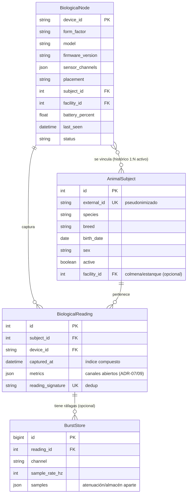
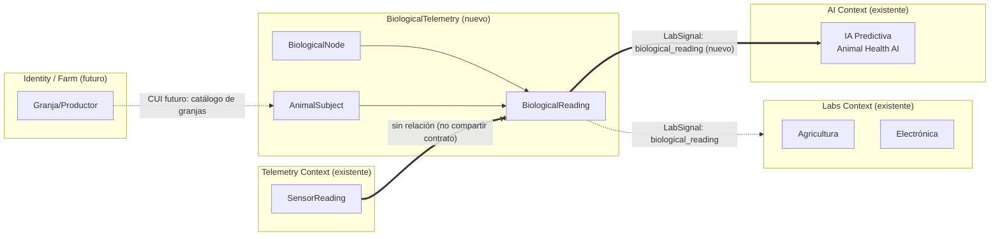

# 🧬 UBTN — Modelo de Dominio (DDD)

## Universal Biological Telemetry Node — Diseño Táctico del Subdominio `BiologicalTelemetry`

| Campo | Valor |
|-------|-------|
| **Versión** | 1.0.0 (diseño DDD — sin implementación) |
| **Fecha** | 2026-09-13 |
| **Rama** | `feature/ubtn-biological-telemetry` |
| **Estado** | 🔷 Diseño — ningún archivo de `src/backend` es creado ni modificado |
| **Base** | [`UBTN_ARCHITECTURE.md`](UBTN_ARCHITECTURE.md) §3 (propuesta DDD) |

---

## 1. Propósito y Alcance

Este documento profundiza el **modelado táctico DDD** del subdominio `BiologicalTelemetry`: bounded context, agregados, entidades, value objects, eventos de dominio, repositorios, comandos y el mapa de contextos. Complementa la propuesta resumida de `UBTN_ARCHITECTURE.md` §3 y extiende el lenguaje ubicuo con los conceptos de *forma factor* y *canal abierto de métricas*.

> ⛔ **Regla de oro:** todo lo aquí descrito es un **contrato de diseño**. No se crea ni modifica código en esta rama. `SensorReading`, `RobotTelemetry`, el `EventBusPort`, `sensor_reading` y `wiring.py` quedan intactos (ADR-UBTN-01/02/03).

---

## 2. Bounded Context

### 2.1 Ficha del contexto

| Campo | Valor |
|---|---|
| **Nombre** | `BiologicalTelemetry` |
| **Carpeta objetivo** | `src/backend/contexts/bio/` (futuro) |
| **Tipo de subdominio** | Support (apoyado en el core de telemetría); con núcleo algorítmico en umbrales fisiológicos (candidate a Core si escala a línea productiva verterinaria) |
| **Responsabilidad** | Ingesta, validación, almacenamiento y notificación de señales biométricas de individuos animales |
| **Relación con Telemetry Context** | Hermano — sin importación, sin herencia, sin contratos compartidos |
| **Equipo de propiedad** | SIGC&T Rural — SENA (proyecto formativo EIARC) |

### 2.2 Ubicación en el ULM (Ubiquitous Language Map)

| Contexto | Rol respecto a `BiologicalTelemetry` |
|---|---|
| **Telemetry Context** | Vecino independiente; comparte el `EventBusPort` como infraestructura (sin acoplar dominios) |
| **Labs Context** | Consumidor downstream de `biological_reading` (patrón ya probado con `sensor_reading`) |
| **AI Context** | Consumidor downstream de series limpias (CUI) y productor upstream de alertas predictivas |
| **Identity / Farm Context (futuro)** | Dueño del `AnimalSubject` (registro de individuo) — CIF parcial con `BiologicalTelemetry` |

---

## 3. Entities (Entidades)

### 3.1 `BiologicalReading` — Entidad raíz de telemetría

- **Rol:** captura instantánea validada de un conjunto de métricas biométricas de un individuo.
- **Invariantes:**
  1. `subject_id` y `device_id` obligatorios.
  2. `metrics` no vacío; al menos un canal presente.
  3. Toda métrica debe estar dentro de rango fisiológico conocido o conservar la marca `out_of_range` (no se rechaza la lectura, se anota).
  4. `timestamp` no puede ser futuro.
- **Ciclo de vida:** se crea desde el comando de registro; no muta (inmutable tras creación, salvó persistencia del `id`).

### 3.2 `AnimalSubject` — Entidad de registro del individuo

- **Rol:** identidad y perfil del animal del que provienen las lecturas.
- **Invariantes:** `identity` único; `species` de un enumerado conocido; `active` controla si se reciben lecturas.
- **Ciclo de vida:** alta → activo → inactivo (retiro); la historia de vars vinculadas se conserva.

### 3.3 `CollarDevice` → renombrado a `BiologicalNode` (extensión por forma factor)

- **Rol:** representa el nodo físico (collar, arete, tag, nodo de colmena, boya de estanque) que captura señales.
- **Invariantes:** un nodo activo se vincula a un único `AnimalSubject` (o a una "instalación"/lote en el caso apícola/piscícola); `status` en `{provisioning, online, offline, maintenance}`.
- **Atributos clave:** `device_id`, `form_factor`, `model`, `firmware_version`, `sensor_channels`, `placement` (sitio de medición), `subject`/`facility` (objetivo), `battery_percent`, `last_seen`, `status`.

```python
# CONTRATO DE DISEÑO (no implementación)
@dataclass
class BiologicalNode:
    device_id: NodeId
    form_factor: NodeFormFactor      # COLLAR, EAR_TAG, RUMP, HIVE_NODE, POND_SENSOR
    model: str
    firmware_version: str
    sensor_channels: frozenset[SensorChannel]
    placement: PlacementSite          # NECK, EAR, RUMP, SKIN_SURF, HIVE_INTERIOR, WATER_SUBMERGED
    subject: Optional[AnimalSubjectId]
    facility: Optional[FacilityId]    # colmena, estanque, corral (apícola/piscícola/agrupación)
    battery_percent: Optional[float]
    last_seen: Optional[datetime]
    status: str = "provisioning"
```

---

## 4. Value Objects (Objetos de Valor)

Todos `frozen=True`, validados en creación, con excepción de dominio dedicada.

### 4.1 Identidad y referencia

| VO | Tipo base | Validación |
|---|---|---|
| `NodeId` | `str` | no vacío, patrón `ubtn-*`/ tag/revisión |
| `AnimalSubjectId` | `str` | local, no PII (pseudónimo) |
| `FacilityId` | `str` | opcional (colmena/estanque/corral) |
| `SubjectSpecies` | `enum` | BOVINE, OVINE, CAPRINE, PORCINE, EQUINE, CANINE, FELINE, POULTRY, APIARY, AQUATIC |
| `SensorChannel` | `enum` | BODY_TEMP, HEART_RATE, RESPIRATORY_RATE, SPO2, ECG_RAW, PPG_RAW, ACCEL_X/Y/Z, GYRO_X/Y/Z, RUMINATION_INDEX, ACTIVITY_SCORE, PULSE_RATE, HIVE_TEMP, HIVE_WEIGHT, WATER_TEMP, WATER_PH, WATER_DO (según forma factor) |
| `NodeFormFactor` | `enum` | COLLAR, EAR_TAG, RUMP_TAG, HIVE_NODE, POND_SENSOR |
| `PlacementSite` | `enum` | NECK, EAR, RUMP, SKIN_SURF, HIVE_INTERIOR, HIVE_ENTRANCE, WATER_SUBMERGED |

### 4.2 Métricas fisiológicas

| VO | Rango / dominio de validación | Unidad |
|---|---|---|
| `BodyTemperature` | Rango fisiológico configurable por especie (ej. BOVINE 37.5–39.1; CANINE 37.5–39.2; EQUINE 37.2–38.3; OVINE 38.3–39.9) | °C |
| `HeartRate` | 0–300, validación específica por especie en thresholds | bpm |
| `RespiratoryRate` | 0–200 | resp/min |
| `SpO2` | 50–100 | % |
| `RuminationIndex` | 0–100 (proxy) | ratio/t.v. |
| `ActivityScore` | 0–100 | índice |
| `AccelerometrySample` | triplete `(x, y, z)` con componente ≤ límite | g |
| `EcqSample` | muestra de canal ECG (dominio de voltaje) | µV |
| `PpgSample` | muestra del canal PPG (dominio ADC) | ADC counts |
| `HiveTemperature`, `HiveWeight`, `WaterTemperature`, `WaterPh`, `WaterDissolvedOxygen` | variables ambientales de nodos in situ (apícola/piscícola) | °C, kg, °C, pH, mg/L |

### 4.3 Contenedor de métrica (núcleo del ADR-UBTN-07)

```python
@dataclass(frozen=True)
class BiologicalMetric:
    channel: SensorChannel
    value: float
    unit: str
    physiological_range: MetricRange      # (min, max) por especie/configuración
    sample_rate_hz: float | None = None   # presente en burst
    flags: frozenset[str] = frozenset()   # {"out_of_range", "low_quality", ...}
```

> `BiologicalReading.metrics: Mapping[SensorChannel, BiologicalMetric]` — el mapa es el contenedor canónico. Nuevos sensores/canales entran **sin cambio de esquema** (ADR-UBTN-09).

### 4.4 Rango fisiológico

| VO | Descripción |
|---|---|
| `MetricRange` | `(min, max)`; soporta `species_specific` (tabla por especie) |

---

## 5. Domain Events

| Evento de dominio | Origen | Payload de evento (diseño) | Consumidores previstos |
|---|---|---|---|
| `BiologicalReadingRecorded` | `RegistrarLecturaBiologicaCommand` al persistir | `subject_id, device_id, timestamp, resumen de métricas` | Labs Context, AI Context (vía EventBus/Persistence) |
| `PhysiologicalAlertRaised` | `PhysiologicalThresholdService` al violar umbral sostenido | `subject_id, channel, value, threshold, severity` | `BioAlertPort` (notificación al productor/operario) |
| `NodeProvisioned` / `NodeLinkedToSubject` | `VincularNodoCommand` | `device_id, subject_id, form_factor` | Catálogo de dispositivos, auditoría |
| `NodeStatusChanged` | servicio de monitoreo edge | `device_id, status, battery_percent, last_seen` | Monitoring UBTN, sincronización cloud |
| `ReadingQualityFlagged` | filtros de calidad del adaptador | `device_id, channel, flag` | Analítica (para descartar series ruidosas en IA) |

> **Regla DDD:** estos eventos viajan en el mismo `EventBusPort` neutral existente como `LabSignal` con `signal_type` nuevo (`biological_reading`, `physiological_alert`, `node_status`). El bus no conoce contextos (ADR-UBTN-03).

---

## 6. Agregados y Reglas de Agregación

### 6.1 Límites de agregación

| Agregado | RAIZ | Entidades hijas | Consistencia |
|---|---|---|---|
| `BiologicalReading` | ✅ | — (solo VOs) | Una lectura es atómica: o persiste completa o no persiste |
| `AnimalSubject` | ✅ | — (solo VOs) | Registro del individuo; histórico de nodos fuera del agregado |
| `BiologicalNode` | ✅ | — | Estados de node gestionados por invariante simple |

### 6.2 Invariantes de agregación

1. `BiologicalReading` **no** contiene el agregado `AnimalSubject`; solo referencia `AnimalSubjectId` (integridad referencial débil en el MVP, fuerte en producción).
2. `BiologicalNode.subject` mantiene unicidad: un nodo activo apunta a un solo `AnimalSubject` (o `FacilityId` en casos no individuales).
3. Las métricas de una lectura **nunca** se actualizan después de la creación; la corrección de series es un flujo de analítica aparte (nunca por mutación del agregado).
4. `physiological_range` viene del catálogo por especie (threshold service), no de la lectura.

### 6.3 Comandos de aplicación

| Comando | Agregado | Efecto |
|---|---|---|
| `RegistrarLecturaBiologicaCommand` | `BiologicalReading` | Persiste + publica `biological_reading` |
| `RegistrarRafagaBiologicaCommand` | `BiologicalReading` (burst) | Persiste el `burst` en almacén separado (ADR-UBTN-09) + publica resumen |
| `VincularNodoCommand` | `BiologicalNode` | Vincula nodo→sujeto/facility con unicidad |
| `DesvincularNodoCommand` | `BiologicalNode` | Suelta la vinculación activa |
| `AltaSujetoCommand` / `BajaSujetoCommand` | `AnimalSubject` | Ciclo de vida del individuo |
| `DetectarUmbralCommand` (interno) | — | Corre `PhysiologicalThresholdService` sobre la lectura |

### 6.4 Queries (CQRS, datos de lectura)

| Query | Contrato de diseño |
|---|---|
| `ListarLecturasPorSujetoQuery` | serie ordenada `(subject_id, timestamp)`; acepta ventana |
| `ObtenerSeriePorCanalQuery` | `(subject_id, channel, desde, hasta)` para gráficas e IA |
| `ListarNodosQuery` | estado del parque de dispositivos |
| `ObtenerAlertasRecientesQuery` | alertas por sujeto/canal/severidad |

---

## 7. Repositories y Ports

### 7.1 Puertos de salida

| Puerto | Métodos de diseño |
|---|---|
| `BiologicalReadingRepositoryPort` | `save(reading)`, `save_burst(burst)`, `get_by_id`, `list_by_subject(subject_id, window)`, `series_by_channel(subject_id, channel, window)` |
| `BiologicalNodeRepositoryPort` | `save(node)`, `get_by_id`, `list(limit, offset)`, `link(device_id, subject_id/facility_id)`, `unlink(device_id)`, `update_status(device_id, status, battery)` |
| `AnimalSubjectRepositoryPort` | `save(subject)`, `get_by_id`, `list_active()` |
| `BioAlertPort` | `emit_alert(subject, channel, value, threshold, severity, message)`, `emit_node_status(device_id, status)` |

### 7.2 Adaptadores previstos (solo diseño)

| Adaptador | Implementa | Notas |
|---|---|---|
| `DjangoBiologicalReadingRepository` + mapper | Lecturas | tablas `bio_*` nuevas (Fase U2) |
| `InMemoryBiologicalReadingRepository` | Lecturas | tests / modo simulado |
| `DjangoBiologicalNodeRepository` | Nodos | catálogo de dispositivos |
| `DjangoAnimalSubjectRepository` | Sujetos | registro de individuos |
| `MqttBiologicalIngestionAdapter` | (driver entrada) | consume tópicos `ubtn/*` (Fase U4) |
| `ConsoleBioAlertAdapter` | Alertas | espejo de `ConsoleNotificationAdapter` |
| `HttpBioAlertAdapter` / `WebSocket` (futuro) | Alertas | notificación productor (Fase U3+ / U7) |

---

## 8. Formas Factor y Modelo de Datos Lógico (DER)

### 8.1 Formas factor → canales (ADR-UBTN-08)

| Forma factor | Especies objetivo | Canales típicos |
|---|---|---|
| **COLLAR** | bovino, canino, felino, equino, ovino, caprino | BODY_TEMP, HEART_RATE, ACTIVITY, RUMINATION_INDEX, ACC/ROT |
| **EAR_TAG / RUMP_TAG** | ovino, caprino, bovino (leve) | BODY_TEMP, ACTIVITY |
| **HIVE_NODE** | apicultura | HIVE_TEMP, HUMIDITY, HIVE_WEIGHT, ACOUSTIC (futuro) |
| **POND_SENSOR** | piscicultura | WATER_TEMP, PH, DISSOLVED_O2, TURBIDITY |

### 8.2 Modelo lógico (extiende `UBTN_ARCHITECTURE.md` §5)



---

## 9. Mapa de Contextos (Context Map) — ampliación



**Relaciones:**
- `BiologicalTelemetry → AI`: NADI (N-layer-Data-Integrity) vía CUI de series limpias; upstream/downstream.
- `BiologicalTelemetry → Labs`: consumidor downstream de eventos (`biological_reading`) sin acoplar agregados.
- `BiologicalTelemetry → Telemetry`: **cementerio de integración evitado** — relación nula por decisión (ADR-UBTN-01/02): no comparten nada más que infraestructura neutral del bus.

---

## 10. Decisiones Registradas (ADR)

| ID | Decisión | Alternativa rechazada | Justificación |
|---|---|---|---|
| ADR-UBTN-07 | Catálogo abierto de canales (`BiologicalMetric` dinámico por canal) | Campos fijos por variable | Evolución sin migración; ADR-09 hace lo mismo a nivel de esquema |
| ADR-UBTN-08 | Forma factor como concepto de primer orden (`NodeFormFactor`, `PlacementSite`) | Modelar solo collares | Cubre apicultura/piscicultura sin romper el contexto (USE_CASES §8) |

> **Nota auditoría (A-5):** ADR-14 (TinyML) y ADR-18 (puerta C) son evoluciones que **dependen de gaps físicos** (`UBTN_RESEARCH_GAPS.md` P3/P4 y B1) — no deben leerse como promesas próximas en este documento; su apertura es `gated`.

---

## 11. Trazabilidad con el Ecosistema

| Concepto UBTN | Homólogo en Telemetry Context | Diferencia esencial |
|---|---|---|
| `BiologicalReading` | `SensorReading` | Mapa de métricas múltiples vs. temperatura/humedad; rango fisiológico por especie |
| `BiologicalNode` | (no existe) | Gestiona forma factor, placement, firmware |
| `AnimalSubject` | (no existe) | Registro de individuo; telemetría ambiental no tiene "sujeto" |
| `PhysiologicalThresholdService` | (no existe) | Reglas de umbral por especie; hoy telemetría emite y labs alerta |

---

## 12. Referencias

- [`UBTN_ARCHITECTURE.md`](UBTN_ARCHITECTURE.md) §3 (propuesta DDD) y §5 (modelo de datos).
- [`UBTN_DATA_CONTRACTS.md`](UBTN_DATA_CONTRACTS.md) — materialización JSON de este modelo.
- [`UBTN_USE_CASES.md`](UBTN_USE_CASES.md) — canales requeridos por especie.
- [`UBTN_ADR_INDEX.md`](UBTN_ADR_INDEX.md) — registro central de ADRs.
- `ADSO_GUIA_TECNICA_REFACTORIZACION_HEXAGONAL_SIGCTIARURAL.md` — patrón hexagonal de referencia.

---

*Modelo de dominio — diseño sin implementación. En coherencia con la invariante de no tocar el dominio existente.*