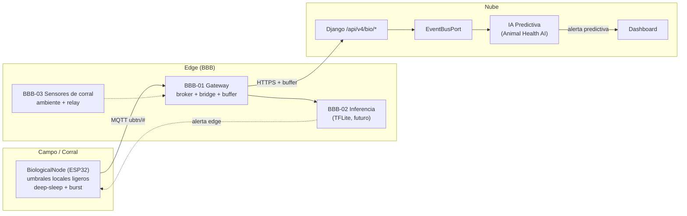
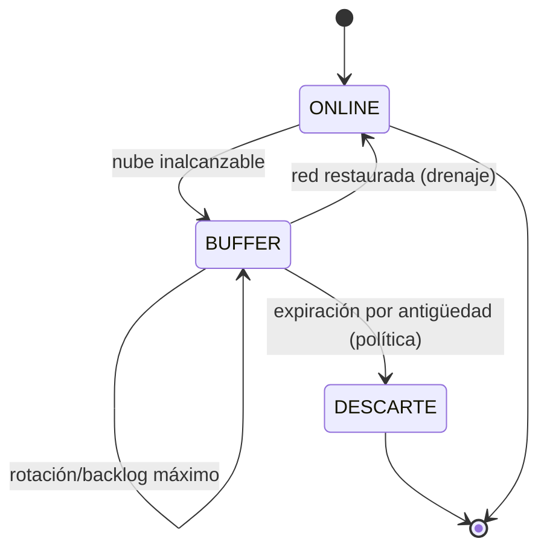

# 🧠 UBTN — Estrategia Edge y IA Predictiva

## Universal Biological Telemetry Node — Computación en el Borde, Resiliencia y Aprendizaje

| Campo | Valor |
|-------|-------|
| **Versión** | 1.0.0 (estrategia — sin implementación) |
| **Fecha** | 2026-09-13 |
| **Rama** | `feature/ubtn-biological-telemetry` |
| **Estado** | 🔷 Diseño — sin código en esta rama |
| **Ámbito** | BBB Gateway · MQTT · Store-and-Forward · Offline First · TinyML · IA Predictiva |

---

## 1. Propósito y Principios

Define **dónde se computa, cómo se garantiza la entrega y cómo se evoluciona de reglas a modelos** en la línea UBTN. Se apoya en los principios rectores del roadmap (no regresión, MVP único, hardware-agnóstico) y en los riesgos de conectividad y energía (RSK-CON-*, RSK-ENE-*).

**Principios de la estrategia:**
1. **Edge-first, nube-última:** el mínimo cómputo (umbrales, filtrado, agregación) ocurre lo más cerca del dato posible; la nube es el destino de series limpias y de modelos pesados.
2. **Offline-first (ADR-UBTN-15):** la red no es un requisito; la resiliencia es una propiedad de diseño.
3. **TinyML como evolución, no como requisito (ADR-UBTN-14):** primero reglas interpretables; la IA se agrega cuando los datos justifiquen modelos y exista gobernanza (IA V2).
4. **Separación firme alerta ≠ diagnóstico (RSK-REG-02).**

---

## 2. Topología de Cómputo del Ecosistema UBTN



---

## 3. Gateway y Protocolo

### 3.1 BBB-01 como Gateway (detalle en `UBTN_BBB_EDGE_GATEWAY.md`)

| Componente | Diseño |
|---|---|
| Broker | Mosquitto (preexistente) — suscripción persistente a `ubtn/#` |
| Bridge | `ubtn_bridge.py`: valida y traduce payload → contrato V4 → HTTPS con backoff |
| Buffer | SQLite local con rotación por tamaño/antigüedad; drenaje ordenado por `captured_at` |
| Monitoreo | `ubtn_monitor`: métricas de backlog del buffer, estado de nodos, batería |

### 3.2 MQTT — Calidad de Servicio y Tópicos

| Tópico | QoS | RETAIN | Nota |
|---|---|---|---|
| `ubtn/{node_id}/reading` | 1 | no | deduplicación por `reading_signature` |
| `ubtn/{node_id}/burst` | 1 | no | metadatos + `samples_uri` (no muestras crudas por tópico) |
| `ubtn/{node_id}/status` | 1 | **sí (retained)** | estado del nodo vía LWT: online/offline/maintenance/lost |
| `ubtn/cmd/{node_id}` | 1 | no | full-duplex futuro (calibración, actualización) |
| `ubtn/{node_id}/alert` | 1 | no | mirror de alerta (read-model por API es la fuente) |

**Retención:** `status` con RETAIN para que el broker guarde el último estado (fuente del evento `NodoEstadoCambiado`); `reading` sin RETAIN (transitorio). Reconciliación A-2: anteriormente `status` se listaba QoS 0 "no persistente", contradictorio con esta nota; se unifica a QoS 1 + retained (ver `UBTN_MQTT_ARCHITECTURE.md` §3-4).

### 3.3 Enlace alternativo LoRaWAN

Si la zona no tiene WiFi (RSK-CON-01), un gateway LoRa dedicado (SX1276/78) ingesta lecturas periódicas minimalistas y las reinyecta en el mismo `MqttBiologicalIngestionAdapter` (ADR-UBTN-12). El dominio no cambia: solo cambia el puerto de entrada.

---

## 4. Store-and-Forward y Offline First (ADR-UBTN-15)

### 4.1 Diagrama de estados del buffer



### 4.2 Invariantes de resiliencia

1. **No pérdida:** toda lectura aceptada por el broker entra al buffer si la nube no responde.
2. **Orden:** el drenaje prioriza `captured_at` (orden cronológico), no el orden de llegada.
3. **Idempotencia:** el backend rechaza duplicados por `reading_signature` (ADR-UBTN-10).
4. **Backlog visible:** `ubtn_monitor` expone la profundidad del buffer (métricas para alerta de saturación).
5. **Límite de retención:** política de expiración definida (ventana de tiempo o tamaño) para evitar crecimiento sin límite; lecturas vencidas se descartan con registro.

### 4.3 Operación con cola en campo

- El **collar** implementa su propia mini-cola (flash) para ráfagas en zonas de apagón WiFi.
- El **bridge** del gateway absorbe interrupciones de nube; el **buffer del collar** absorbe cortes de WiFi.

---

## 5. TinyML en el Borde (Evolución — ADR-UBTN-14)

### 5.1 Fases de cómputo

| Etapa | Ubicación | Carga de trabajo | Madurez |
|---|---|---|---|
| **E0 — Reglas ligeras** | Firmware (ESP32) | umbrales simples, filtrado, dormir/despertar | MVP (U5) |
| **E1 — Umbrales + agregación** | BBB-01 bridge | umbrales por especie, medias móviles, calidad de señal | U3-U4 |
| **E2 — Inferencia en BBB-02** | BBB-02 (TFLite/ONNX Runtime) | clasificación de estado, detección de anomalía en series cortas | Post-U7 (roadmap largo) |
| **E3 — Modelo en nube** | IA Predictiva (AI Context) | modelos pesados multiseñal, benchmark, calibración | U6 |

### 5.2 TinyML — consideraciones

- **Modelos compatibles:** conversión a TFLite Micro (C) o MicroPython en ESP32; pero el límite de RAM (520 KB) restringe redes profundas → en el collar se conservan reglas (E0).
- **Lugar natural de TinyML:** **BBB-02** (Cortex-A8, 512 MB RAM) — inferencia real en edge sin subir muestras (privacidad y latencia), con `ubtn/{node_id}/alert` como salida opcional.
- **Gobernanza:** cualquier modelo en producción requiere el pipeline de entrenamiento/validación de `SIGCT_RURAL_AI_RESEARCH_PROGRAM_V2.md` y la regla alerta ≠ diagnóstico (RSK-REG-02).

### 5.3 Patrón de evolución E0→E2

```
Reglas interpretables (E1)  →  Dataset etiquetado propio (U6)  →  Baseline ML (U6)  →  Benchmark vs umbrales (macro-F1)  →  TinyML (post-U7)
```

---

## 6. IA Predictiva (Línea Animal Health AI)

### 6.1 Pipeline

```mermaid
flowchart LR
    SUB[Serie limpia por sujeto<br/>(query/canales)] --> FE[Feature engineering<br/>medias móviles, variabilidad, tendencias]
    FE --> MOD[Modelos ML/DL<br/>anomalías, clasificación de estado]
    MOD --> RUL[Fusión con umbrales fisiológicos<br/>por especie]
    RUL --> AL[Riesgo compuesto<br/>score + explicación]
    AL --> NOT[Alerta predictiva → productor]
```

### 6.2 Decisiones de la línea IA

| Tema | Diseño |
|---|---|
| Datos de entrada | series limpias del `biological_reading` vía CUI; **sin acoplar el subdominio a `ai`** |
| Primer modelo | baseline de anomalías de una variable (macro-F1 vs umbrales) — benchmark honesto |
| Explicabilidad | alerta con explicación (qué canal, qué desviación, cuánto tiempo) |
| Gobernanza | gobernanza IA V2 + política de datos del ADR-UBTN-16 |
| Despliegue | inicialmente en nube (U6); despliegue edge (BBB-02) sujeto a validación |

### 6.3 Regla alerta ≠ diagnóstico

- Umbral → **alerta fisiológica** (soporte de decisión del productor/veterinario).
- Modelo predictivo → **riesgo estimado** ("probabilidad", no certeza); jamás se presenta como diagnóstico.

---

## 7. Presupuesto de Recursos (orden de magnitud)

| Componente | Memoria/CPU | Nota |
|---|---|---|
| ESP32 firmware (E0) | 520 KB SRAM, ~240 MHz | reglas ligeras + cola flash |
| BBB-01 bridge/buffer | 512 MB RAM, 1 GHz | sobrante para broker+monitor |
| BBB-02 TinyML (futuro) | 512 MB RAM | inference TFLite medio |
| Nube API/IA | según plan | modelos pesados y datasets |

*Detalle fino → fase de implementación con banco de pruebas (U5/U6).*

---

## 8. Métricas de Operación Edge (Observabilidad)

| Métrica | Diseño |
|---|---|
| `buffer_depth` | profundidad de la cola del gateway |
| `buffer_age_max_s` | antigüedad máxima de lecturas en buffer |
| `delivery_rate` | entregas exitosas/total |
| `duplicate_rejected` | duplicados rechazados por firma |
| `nodal_uptime` / `battery` | salud de nodos |
| `placement_site` | validación de la posición medida |

---

## 9. Decisiones Registradas (ADR)

| ID | Decisión | Alternativa rechazada | Justificación |
|---|---|---|---|
| ADR-UBTN-14 | Edge-first: reglas primero; TinyML como evolución en BBB-02 | inferencia ML embarcada desde el MVP | Sin datos propios etiquetados; gobernanza IA V2; MVP de una variable |
| ADR-UBTN-15 | Offline-first con buffer store-and-forward y deduplicación | entrega síncrona sin buffer | Conectividad rural intermitente (RSK-CON-01/02); no pérdida |

---

## 10. Referencias

- [`UBTN_BBB_EDGE_GATEWAY.md`](UBTN_BBB_EDGE_GATEWAY.md) — detalle del nodo de borde.
- [`UBTN_ARCHITECTURE.md`](UBTN_ARCHITECTURE.md) §4.3-4.5 (gateway, MQTT, IA predictiva).
- [`UBTN_ADR_INDEX.md`](UBTN_ADR_INDEX.md) — ADR-14/15.
- `docs/ai/research_v2/SIGCT_RURAL_AI_RESEARCH_PROGRAM_V2.md` — gobernanza IA V2.

---

*Estrategia de diseño — sin implementación. Evolución acordada con el roadmap y la gobernanza de IA V2.*