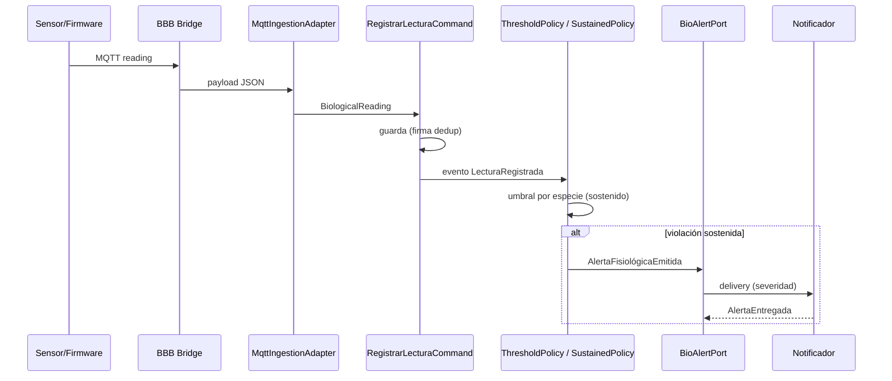
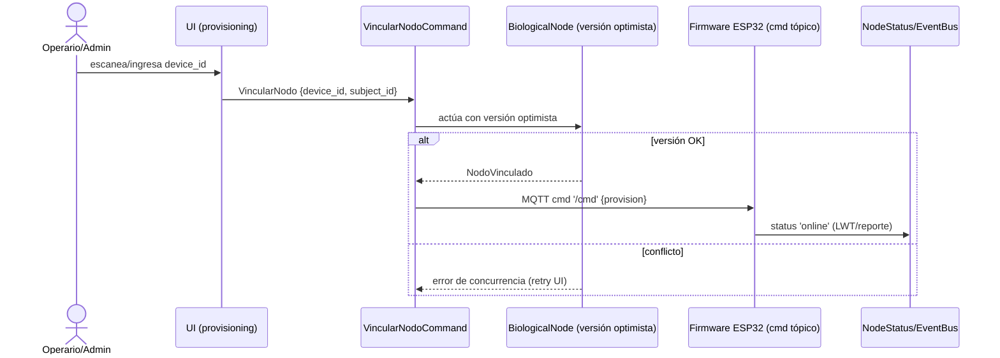

# ⛈️ UBTN — Event Storming

## Universal Biological Telemetry Node — Modelado Colaborativo de Eventos (Big Picture + Process Level)

| Campo | Valor |
|-------|-------|
| **Versión** | 1.0.0 (diseño — sin implementación) |
| **Fecha** | 2026-09-13 |
| **Rama** | `feature/ubtn-biological-telemetry` |
| **Estado** | 🔷 Diseño — Big Picture y hot-spots (provisioning y alerta) modelados |
| **Método** | Event Storming (Big Picture → Proceso) con notación: ⚡ comando · ◆ evento · 🔧 policy · 👤 actor · 🧩 sistema externo |

---

## 1. Notación y Resultado

| Símbolo | Significado |
|---|---|
| ⚡ | Command (intención) |
| ◆ | Domain Event (hecho) |
| 🔧 | Policy / Process Manager (reacción) |
| 👤 | Actor / Rol |
| 🧩 | External System / Integración |
| 🧊 | Read Model (derivado) |

**Resultado central del taller:** el flujo de valor UBTN es **provisioning → lectura → alerta → IA**, con dos hot-spots de complejidad (vigilancia de umbral y gestión de nodos). No hay flujo de comandos que cruce agregados ni contextos de forma transaccional.

---

## 2. Big Picture — Cronología de Eventos

```mermaid
flowchart LR
    P0["👤 Operario"] -->|⚡ AltaSujeto| P1["◆ SujetoRegistrado"]
    P1 --> P2["⚡ VincularNodo"]
    P2 --> P3["◆ NodoVinculadoASujeto"]
    P3 --> P4["⚡ ProvisionarNodo (firmware/red)"]
    P4 --> P5["◆ NodoListo"]

    P5 -->|"periódico"| P6["◆ LecturaRecibida (MQTT)"]
    P5 -->|"a demanda"| P7["⚡ SolicitarRáfaga"]
    P7 --> P8["◆ RáfagaRecibida"]

    P6 --> P9["🔧 QualityPolicy"]
    P9 --> P10["◆ LecturaRegistrada"]
    P9 --> P11["◆ CalidadMarcada (opcional)"]

    P10 --> P12["🔧 ThresholdPolicy"]
    P12 --> P13["◆ UmbralViolado"]
    P13 --> P14["🔧 SustainedPolicy<br/>(sostenimiento)"]
    P14 --> P15["◆ AlertaFisiológicaEmitida"]
    P15 --> P16["👤 Veterinario/Productor nutificado"]
    P16 --> P17["◆ AlertaEntregada"]

    P10 --> P18["🔧 ExportPolicy"]
    P18 --> P19["◆ SerieExportadaAI"]
    P19 --> P20["🧩 IA Predictiva"]
    P20 --> P21["◆ AlertaPredictivaPuesto"]
```

---

## 3. Inventario Completo

### 3.1 👤 Actores

| Actor | Rol | Notas |
|---|---|---|
| Operario/Productor | dueño del animal y del collar | provisiona, lee alertas |
| Veterinario/Zootecnista | interpreta señales y alertas | consume dashboard + alertas |
| Estudiantes (STEM) | operan simulador / nodo educativo | aprenden del dato real |
| Administrador UBTN | alta/baja de dispositivos, revocación | runbook de operaciones |
| Firmware (ESP32) | emisor del wearable | sistema externo |
| BBB Gateway | broker + bridge + buffer | sistema externo edge |
| Backend Django + API | núcleo de persistencia | sistema interno |
| IA Predictiva | produce riesgos | sistema externo (AI Context) |

### 3.2 ⚡ Comandos

| Comando | Agregado/Contexto | Fuente |
|---|---|---|
| `AltaSujeto` | AnimalSubject | operario |
| `BajaSujeto` | AnimalSubject | operario/veterinario |
| `ActualizarSujeto` | AnimalSubject | operario |
| `VincularNodo` | BiologicalNode | operario/admin |
| `DesvincularNodo` | BiologicalNode | operario/admin |
| `ProvisionarNodo` (raspado de red/firmware) | BiologicalNode + red | admin |
| `RegistrarLectura` | BiologicalReading | adaptador MQTT |
| `RegistrarRáfaga` | BiologicalReading (burst) | adaptador MQTT |
| `ActualizarEstadoNodo` | BiologicalNode | monitoreo edge |
| `SolicitarRáfaga` | BiologicalNode (cmd) | admin/operario |
| `ConfirmarEntregaAlerta` | — (read/model de alertas) | notificador |

### 3.3 ◆ Eventos de Dominio

| Evento | Emisor | Contenido clave |
|---|---|---|
| `SujetoRegistrado` | AnimalSubject | subject_id, species |
| `SujetoDesactivado` | AnimalSubject | subject_id |
| `NodoVinculadoASujeto` | BiologicalNode | device_id, subject_id |
| `NodoDesvinculado` | BiologicalNode | device_id |
| `NodoListo` | BiologicalNode | device_id, fw |
| `NodoEstadoCambiado` | BiologicalNode | estado, batería |
| `LecturaRecibida` | adaptador MQTT | device_id, payload |
| `LecturaRegistrada` | BiologicalReading | resumen + firma |
| `CalidadMarcada` | policy de calidad | flag por canal |
| `RáfagaRecibida` | adaptador MQTT | token, canal, SPS |
| `RáfagaAlmacenada` | BiologicalReading (burst) | token, uri |
| `UmbralViolado` | policy de umbral | canal, valor, umbral |
| `AlertaFisiológicaEmitida` | policy de sostenimiento | alert_id, severidad |
| `AlertaEntregada` | notificador | alert_id, canal |
| `SerieExportadaAI` | policy de exportación | ventana, medidas |

### 3.4 🔧 Policies y Process Managers

| Policy | Dispara sobre | Reacción | Idempotencia |
|---|---|---|---|
| `QualityPolicy` | lectura recibida | marcar flags (`low_quality`, `flat_line`) | firma |
| `ThresholdPolicy` | lectura registrada | comparar vs `PhysiologicalThresholdService` | dedupe por ventana |
| `SustainedPolicy` | umbral violado | sostener N minutos antes de alerta (evita ruido) | ventana de ventana única |
| `ExportPolicy` | lectura registrada | puebla buffer de export → IA (CUI) | cursor por canal |
| `ProvisioningPolicy` | NodoListo/LinkRequest | coordinando vínculo ejecuta `VincularNodo` | versión optimista |
| `RetryPolicy` (bridge) | fallo de entrega | store-and-forward + backoff | firma de lectura |
| `DeliveryPolicy` (notificador) | alerta emitida | encolar y confirmar entrega | alert_id |

### 3.5 🧩 Sistemas Externos

| Sistema | Interacción |
|---|---|
| MQTT Broker (BBB-01 Mosquitto) | tópicos `ubtn/#`, QoS 0/1, LWT |
| Bucket de ráfagas (S3/minio) | `samples_uri` de bursts |
| Notificaciones (console/log/webhook futuro) | `BioAlertPort` |
| IA Predictiva | CUI de series + `physiological_alert` |
| Dashboard React | consume `/api/v4/bio/*` |

---

## 4. Hot-Spot A: Vigilancia de Umbral y Alerta

**Descubrimientos del hot-spot:**
- El sostenimiento es **config de especie/severidad**, evaluado sobre ventana, no sobre lecturas individuales.
- La alerta es **read-model** derivada (no agregado); su duplicado en el bus se evita por `alert_id`.

---

## 5. Hot-Spot B: Provisioning de Nodo

**Descubrimientos:**
- El input es `device_id` escaneado (QR) — reduce errores.
- LWT del firmware (online/offline) es la fuente del `NodoEstadoCambiado`.
- Concurrencia real: dos operarios provisionan el mismo nodo → versionado optimista (runbook 001).

---

## 6. Matriz de Descubrimientos y Acciones

| Descubrimiento | Tipo | Acción documental |
|---|---|---|
| La alerta no es agregado, es read-model | decisión | `UBTN_AGGREGATE_DESIGN.md` §7 |
| El sostenimiento es config, no regla dura | diseño | `PhysiologicalThresholdService` (U3) |
| LWT es fuente de verdad de estado de nodo | diseño | `UBTN_MQTT_ARCHITECTURE.md` §4 |
| Provisioning TV: escaneo QR + versionado optimista | diseño | runbooks 001-003 |
| Sin flujo transaccional entre contextos | validación | `UBTN_CONTEXT_MAP.md` §5 |

---

## 7. Referencias

- [`UBTN_AGGREGATE_DESIGN.md`](UBTN_AGGREGATE_DESIGN.md) — eventos cruzando agregados.
- [`UBTN_CONTEXT_MAP.md`](UBTN_CONTEXT_MAP.md) — contexto de los eventos.
- [`UBTN_DATA_CONTRACTS.md`](UBTN_DATA_CONTRACTS.md) — formato de eventos en el bus.
- [`UBTN_MQTT_ARCHITECTURE.md`](UBTN_MQTT_ARCHITECTURE.md) — LWT y tópicos.
- [`UBTN_OPERATIONS_RUNBOOK.md`](UBTN_OPERATIONS_RUNBOOK.md) — provisioning y recuperación.

---

*Event Storming — diseño sin implementación. Hot-spots de umbral y provisioning son los primeros en materializarse (U2/U3).*