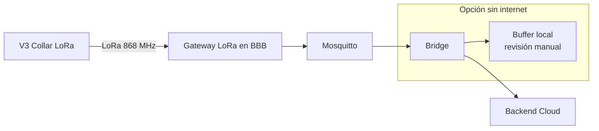

# 🚜 UBTN — Guía de Despliegue en Campo (Field Deployment Guide)

## Universal Biological Telemetry Node — Instalación, puesta en marcha y operación en casos reales

| Campo | Valor |
|-------|-------|
| **Versión** | 1.0.0 (diseño — sin implementación) |
| **Fecha** | 2026-09-13 |
| **Rama** | `feature/ubtn-biological-telemetry` |
| **Estado** | 🔷 Diseño — playbooks de escenarios; ejecutable en U2+ |

> Compañero de `UBTN_HARDWARE_ROADMAP.md` (qué hardware) y `UBTN_OPERATIONS_RUNBOOK.md` (operación). Aquí: **dónde** y **cómo**.

---

## 1. Escenarios Soportados

| Escenario | Perfil | Dónde se ve |
|---|---|---|
| **Finca pequeña** (1–5 nodos) | productor | bovinos/caninos en patio y pradera corta |
| **Finca mediana** (5–15 nodos) | ganadero semitecnificado | bovinos + pequeños rumiantes; Wi-Fi/LoRa mixto |
| **Centro SENA** | educativo | laboratorio + corral de enseñanza |
| **Universidad** | investigación | cátedra (V1/V2) + datasets anonimizados |
| **STEM/demostrador** | feria/museo escolar | demostración sin animales (maniquí) |

---

## 2. Diagrama de Despliegue por Escenario

### 2.1 Finca pequeña (1–5 nodos, Wi-Fi)

```mermaid
flowchart LR
    N1[V2 Collar 1] --> AP[Router Wi-Fi / AP LAN]
    N2[V2 Collar 2] --> AP
    AP --> BBB[BBB Rev C<br/>Mosquitto + bridge]
    BBB --> TB[Backend (local o cloud)]
    TB --> UI[Panel Productor]
```

**Nota:** en finca pequeña con internet flojo, la **BBB como broker local** es clave (evita depender de la nube en el corral).

### 2.2 Finca rural mediana (LoRa reserva)



### 2.3 SENA / Universidad / STEM

| Escenario | Puesta en marcha | Sensor demostrable |
|---|---|---|
| SENA agrícola | 2× V2 collar en toro y ternera; link del taller agronómico | HR, RR, alerta de estrés |
| SENA telecomunicaciones | V1 + V3 (LoRa); montan gateway en BBB | RSSI, latencia MQTT |
| Universidad | V2/V3 en reses de investigación; datasets anonimizados | series exportables para IA (CUI) |
| STEM/feria | V1 demo + maniquí (onda simulada) | sin animales, funciona con ECG seed |

---

## 3. Requisitos de Campo (checklist antes de desplegar)

- [ ] Cobertura de red: Wi-Fi/LAN o plan LoRa (visualización de rango).
- [ ] BBB Rev C configurada (Mosquitto + bridge) y con backups de config.
- [ ] Nodo provisionado (QR) y firmware acorde (V2/V3).
- [ ] Batería ≥ 80% y cargador manual disponible.
- [ ] Protección IP66 en V3 (polvo/agua); collar ajustable en tamaño.
- [ ] Consentimiento/términos de uso si hay animales de terceros (ADR-16).
- [ ] Dashboards accesibles en tablet/celular (móvil-first, `UBTN_FRONTEND_UX_STRATEGY.md`).

---

## 4. Secuencia de Puesta en Marcha (SOP)

| Paso | Acción | Runbook/Observación |
|---|---|---|
| 1 | Configurar BBB (broker + bridge + backups) | OPR-001 base; ver `UBTN_BBB_EDGE_GATEWAY.md` |
| 2 | Provisionar nodos (QR) | OPR-001 |
| 3 | Comprobar estado `online` + battery | panel productor |
| 4 | Primer día: validar 10–20 lecturas por nodo sin gaps | RR-005 tolerancia |
| 5 | Configurar umbral de alertas por especie | `PhysiologicalThresholdService` (U3) |
| 6 | Revisar alertas reales (no falsas) en 72 h | sin falsos: recalibrar o bajar sensibilidad |
| 7 | Dar de alta en docs de la explotación | `UBTN_USE_CASES.md` (perfiles) |

---

## 5. Consideraciones por Especie (operativo)

| Especie | Rango típico | Particularidad de despliegue |
|---|---|---|
| Bovino | HR 48–84, RR 10–30 | collar cervical; V2/V3 con correa robusta |
| Canino | HR 60–140 | collar capa C3/V2; actividad falsa de HR en carrera |
| Felino | HR 120–240 | V4 wearable si se busca comodidad; atención a stress |
| Equino | HR 28–48 | collar de cuello (V2/V3) + nácar; cuidado por sudor |
| Caprino/Ovino | HR 70–160 | collar ligero (V2 mini); LoRa si pradera extensa |
| Apícola | — | sensor de colmena (no collar): temperatura/humedad en BBB |
| Piscícola | — | sensor de agua en estanque (no wearable); BBB opcional |

> Los rangos son **referenciales** para calibrar umbrales; cada explotación requiere validación de línea base (ADR-16 + `UBTN_RESEARCH_BACKLOG.md`).

---

## 6. Tiering de Madurez de Despliegue

| Tipo de finca | Soporte | Normativa |
|---|---|---|
| Demo / STEM | 0-7 días | laboratorio (sin cambio de producción) |
| Prototipo (SENA/UNI) | 1-3 meses | pilotos con tracking manual de incidencias |
| Productivo | continúo | runbook completo + gobernanza ADR-16 |

> ROJO: nunca en producción sin alerta-vet definida y threshold por especie validado (gate U3).

---

## 7. Referencias

- [`UBTN_HARDWARE_ROADMAP.md`](UBTN_HARDWARE_ROADMAP.md) — variantes y costos.
- [`UBTN_OPERATIONS_RUNBOOK.md`](UBTN_OPERATIONS_RUNBOOK.md) — OPR/RR.
- [`UBTN_USE_CASES.md`](UBTN_USE_CASES.md) — líneas por especie.
- [`UBTN_BBB_EDGE_GATEWAY.md`](UBTN_BBB_EDGE_GATEWAY.md) — configuración del gateway.
- [`UBTN_LAB_INTEGRATION.md`](UBTN_LAB_INTEGRATION.md) — laboratorio + áreas de prueba.
- [`UBTN_RISK_ANALYSIS.md`](UBTN_RISK_ANALYSIS.md) — umbrales de detención.

---

*Guía de campo — diseño documental. Su valor real aparece U2+ cuando hay hardware real en el terreno.*