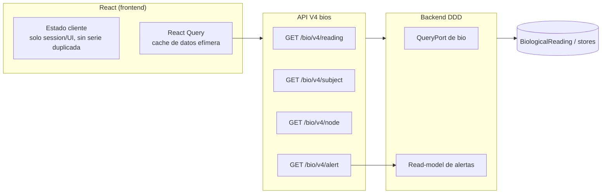

# 🖥️ UBTN — Estrategia Frontend / UX (Vista de Datos Biológicos) — ADR-20

## Universal Biological Telemetry Node — Cómo se muestra y se interactúa con la telemetría biométrica

| Campo | Valor |
|-------|-------|
| **Versión** | 1.0.0 (diseño — sin implementación) |
| **Fecha** | 2026-09-13 |
| **Rama** | `feature/ubtn-biological-telemetry` |
| **Estado** | 🔷 Diseño — formaliza `ADR-UBTN-20` |
| **Decisión** | El frontend consume **API V4 (sin estado duplicado)**; alertas son read-model; UX por perfil (Productor, Veterinario, Estudiante) |

---

## 1. Principios de UX para Datos Biológicos

| # | Principio | Implicación |
|---|---|---|
| U1 | **El dato crudo NO es el producto** | mostrar la señal y el contexto, no confundir |
| U2 | **Alerta ≠ diagnóstico** | UI deja claro que la alerta indica seguimiento, no dictamen clínico (ADR-16) |
| U3 | **Sin estado duplicado en el cliente** | la UI vive de queries del API; no espejo local de series |
| U4 | **Progresivo para cada perfil** | Productor (básico), Veterinario (detalle), Estudiante (modo laboratorio) |
| U5 | **Accesibilidad y móvil-first** | tablet en corral, celular para productor |

---

## 2. Arquitectura de Datos en el Frontend (sin duplicado)

**Regla dura:** el frontend **nunca** escribe ni cachea `metrics` de series en duplicado como fuente de verdad; la fuente es la API V4. La cache de React Query es solo *línea de display*, no dominio.

---

## 3. Perfiles y Pantallas Core

| Perfil | Pantalla principal | Contenido |
|---|---|---|
| **Productor** | Panel de rebaño | tarjetas: animal, sensor online (batería/estado), último valor (HR/RR), semáforo de alertas |
| **Veterinario** | Vista de sujeto (detalle) | series por canal (ventana), flags de calidad, historial de alertas con severidad |
| **Estudiante (STEM)** | Modo laboratorio | burst/raw con zoom, etiquetado, "qué vio el sensor" (datos reales) |
| **Admin/Operador** | Inventario de nodos | provisioning (QR), estado, firmware, revocaciones |

Cada pantalla se implementa **conforme** a `UBTN_DATA_CONTRACTS.md` §4 (env V4) — el frontend no conoce MQTT, tópicos ni formas del payload raw.

---

## 4. Reglas de Estado de Alerta

| Regla | Por qué |
|---|---|
| Las alertas se leen de `GET /bio/v4/alert` | read-model, no chat directo con el bus |
| La alerta muestra **severidad y duración** | para que el veterinario decida, no el UI |
| La alerta NO implica "enfermo" | aviso de seguimiento (dissclaimer B-UI en cada alerta) |
| Acciones del productor: "ver detalle", "marcar seguido" | feedback del productor (evento `alert_followed_up`) |

---

## 5. Métricas de UX (éxito)

| Métrica | Target U3+ |
|---|---|
| Tiempo para ver estado de un animal | < 5 s |
| Tasa de alertas interpretables (sin clics extra) | ≥ 80% |
| % de alertas con acción registrada por productor | > 50% |
| Error en lectura de número de animales | < 1% |

---

## 6. Roadmap Frontend (coherente con U-fases)

| Fase | Entregable frontend |
|---|---|
| U1 | wireframe de panel de rebaño + conexión a `/bio/v4/subject` estático (mock data) |
| U2 | listado real de sujetos, RR/HR vivos vía API V4 |
| U3 | alertas read-model + modo veterinario (severidad, disclaimers) |
| U4 | serie por canal (analítica) + export a IA visible |
| U5-U6 | modo laboratorio STEM + admin de nodos (QR/revocación) |

---

## 7. Referencias

- [`UBTN_DATA_CONTRACTS.md`](UBTN_DATA_CONTRACTS.md) §4/§8 — contrato de API y señales.
- [`UBTN_ADR_INDEX.md`](UBTN_ADR_INDEX.md) — ADR-20 (UX/frontend).
- [`UBTN_CONTEXT_MAP.md`](UBTN_CONTEXT_MAP.md) §4.2 — límite bio→dashboard.
- [`UBTN_OPERATIONS_RUNBOOK.md`](UBTN_OPERATIONS_RUNBOOK.md) — alertas en operación.
- [`UBTN_FIELD_DEPLOYMENT_GUIDE.md`](UBTN_FIELD_DEPLOYMENT_GUIDE.md) — UX en campo.

---

*Estrategia frontend/UX — diseño sin implementación. La fuente de verdad siempre es API V4, nunca el navegador.*