# 🧭 UBTN — Índice General, Árbol Documental y Matriz de Trazabilidad

## Universal Biological Telemetry Node — Punto de Entrada de la Familia Documental

| Campo | Valor |
|-------|-------|
| **Versión** | 1.1.0 (índice — sin implementación) |
| **Fecha** | 2026-09-13 |
| **Rama** | `feature/ubtn-biological-telemetry` |
| **Estado** | 🔷 Diseño (Fase U0) — documentación completa + auditoría, código 0% |
| **Familia** | 26 documentos (13 núcleo + 13 profundización/auditoría) |
| **Regla** | Ningún documento de esta familia implica código creado o modificado |

---

## 1. Propósito

Este es el **punto de entrada único** de la familia documental UBTN: ordena la lectura, traza cada requisito de diseño a su documento, ADR y riesgo, y verifica que la familia cubre todo el espacio arquitectónico sin implementar. La versión 1.1 añade la **arquitectura profunda** (contextos, eventos, MQTT, persistencia, seguridad, operación) y la **auditoría crítica**.

---

## 2. Orden de Lectura Recomendado

```mermaid
flowchart TB
    subgraph CORE["Núcleo (lectura secuencial)"]
        direction LR
        A[1. UBTN_INDEX<br/>punto de entrada] --> B[2. UBTN_ARCHITECTURE<br/>base y no-regresión]
        B --> C0[3. UBTN_ADR_INDEX<br/>decisiones]
        C0 --> D[4. UBTN_DOMAIN_MODEL<br/>DDD táctico]
        D --> E[5. UBTN_USE_CASES<br/>especies y canales]
        E --> F[6. UBTN_SENSOR_CATALOG<br/>hardware]
        F --> G[7. UBTN_DATA_CONTRACTS<br/>JSON]
        G --> H[8. UBTN_EDGE_AI_STRATEGY<br/>edge e IA]
        H --> I[9. UBTN_BBB_EDGE_GATEWAY<br/>gateway]
        I --> J[10. UBTN_RISK_ANALYSIS<br/>riesgos]
        J --> K[11. UBTN_LAB_INTEGRATION<br/>ecosistema]
        K --> L[12. UBTN_RESEARCH_BACKLOG<br/>investigación]
        L --> M[13. UBTN_ROADMAP<br/>fases U0-U7]
    end
    subgraph DEEP["Profundización (a demanda por área)"]
        direction LR
        D1[CONTEXT_MAP] --> D2[AGGREGATE_DESIGN]
        D2 --> D3[EVENT_STORMING]
        D3 --> D4[TELEMETRY_EVOLUTION]
        D4 --> D5[MQTT_ARCHITECTURE]
        D5 --> D6[DATABASE_EVOLUTION]
        D6 --> D7[HARDWARE_ROADMAP]
        D7 --> D8[FRONTEND_UX]
        D8 --> D9[SECURITY_MODEL]
        D9 --> D10[OPERATIONS_RUNBOOK]
        D10 --> D11[FIELD_DEPLOYMENT]
        D11 --> D12[RESEARCH_GAPS]
        D12 --> DA[AUDIT_REVIEW]
    end
    M -.-> D1
```



---

## 3. Árbol Documental UBTN

```
docs/
└── UBTN_*.md                                   ← familia documental (25 + índice + auditoría)
    ├── UBTN_INDEX.md                           con ÍNDICE + trazabilidad (este doc)
    ├── UBTN_ARCHITECTURE.md                    Arquitectura de referencia + no-regresión + ADR 01-06
    ├── UBTN_ADR_INDEX.md                       Registro central de decisiones (ADR 01-20)
    ├── UBTN_DOMAIN_MODEL.md                    DDD táctico: context, entities, VOs, events, repos, aggregates
    ├── UBTN_USE_CASES.md                       Casos de uso por especie (8 líneas)
    ├── UBTN_SENSOR_CATALOG.md                  Comparativa ESP32 / sensores / LoRa / BLE / BBB Rev C
    ├── UBTN_DATA_CONTRACTS.md                  Contratos JSON (diseño, NO implementar)
    ├── UBTN_EDGE_AI_STRATEGY.md                Gateway, MQTT, store-and-forward, offline-first, TinyML, IA
    ├── UBTN_BBB_EDGE_GATEWAY.md                Nodo de borde BBB-01 (bridge + buffer + tópicos)
    ├── UBTN_RISK_ANALYSIS.md                   Registro de riesgos y controles (RSK-*)
    ├── UBTN_LAB_INTEGRATION.md                 Integración con Robótica/Telecom/Electrónica/IA/Agri/STEM
    ├── UBTN_RESEARCH_BACKLOG.md                Backlog RI-* (P0/P1/P2)
    ├── UBTN_ROADMAP.md                         Fases U0-U7 con gates
    ├── UBTN_CONTEXT_MAP.md                     Context Map DDD (upstream/Downstream, ACL, CUI, PbL)
    ├── UBTN_AGGREGATE_DESIGN.md                Diseño de agregados y límites de consistencia
    ├── UBTN_EVENT_STORMING.md                  Big Picture + hot-spots (provisioning/umbral)
    ├── UBTN_TELEMETRY_EVOLUTION_STRATEGY.md    ADR-17: dual-track bio∥telemetry, no-migración
    ├── UBTN_MQTT_ARCHITECTURE.md               Broker, tópicos, QoS/RETAIN, LWT, bridge store-and-forward
    ├── UBTN_DATABASE_EVOLUTION.md              ADR-18: persistencia B/C/D y umbrales de escalado
    ├── UBTN_HARDWARE_ROADMAP.md                Variantes V1-V4, costos y energía
    ├── UBTN_FRONTEND_UX_STRATEGY.md            ADR-20: UX por perfil, sin estado duplicado
    ├── UBTN_SECURITY_MODEL.md                  ADR-19: TLS, identidad, RBAC, privacidad
    ├── UBTN_OPERATIONS_RUNBOOK.md              Playbooks OPR/RR y políticas de operación
    ├── UBTN_FIELD_DEPLOYMENT_GUIDE.md          Escenarios y SOP de puesta en marcha
    ├── UBTN_RESEARCH_GAPS.md                   Gaps físicos/biológicos y anti-patterns
    └── UBTN_AUDIT_REVIEW.md                    Auditoría crítica de la familia (A-1..A-8)
```

**Relación con el resto del árbol documental:**

| Doc del ecosistema | Relación |
|---|---|
| `PLAN_MAESTRO.md` | Fase 9.2/9.3 = motivo del UBTN; referencias cruzadas |
| `MASTERDOC.md` | §3.3 UBTN + bitácora de sesión |
| `README.md` | mapa documental fila 9 + §En Diseño |
| `SIGCT_RURAL_SYSTEM_BOOT.md` | Fase 6 de lectura + prohibición #13 + mapa de continuidad |
| `ECOSYSTEM_IDENTITY.md` | identidad del ecosistema (el UBTN no cambia la identidad) |
| `ADSO_..._REFACTORIZACION_HEXAGONAL...` | patrón hexagonal de referencia |

---

## 4. Matriz de Trazabilidad — Requisitos de Diseño

> Trazabilidad: cada **requisito/área de diseño** → **documento(s)** → **ADR** → **riesgo(s)** → **fase(s) roadmap**.

| # | Requisito / Área de diseño | Documento principal | ADR | Riesgo | Fase |
|---|---|---|---|---|---|
| R1 | No romper Telemetry Context / `SensorReading` | ARCH §2/§6 | 01, 02, 03 | RSK-TEC-01 | todas |
| R2 | Bounded context hermano + puertos propios | ARCH §3, DOMAIN §2/§7 | 01, 02 | RSK-INT-02 | U1-U3 |
| R3 | Señal EventBus `biological_reading` (nueva) | ARCH §3.8/§3.9, CONTRACTS §8 | 03 | RSK-INT-01 | U3 |
| R4 | MVP único (temperatura corporal — variable en revisión A-7) | ROADMAP, USE_CASES §3 | 05 | RSK-SEN-01 | U7 |
| R5 | Umbrales por especie primero; IA después | EDGE_AI §6, ROADMAP | 06 | RSK-REG-02 | U3/U6 |
| R6 | Catálogo abierto de canales (`metrics`) | DOMAIN §4.3, CONTRACTS §3 | 07 | RSK-TEC-02 | U1-U2 |
| R7 | Forma factor por especie / `FacilityId` | DOMAIN §8, USE_CASES §9 | 08 | RSK-HW-04 | U5 |
| R8 | JSONB + burst en contrato aparte | CONTRACTS §4, ARCH §5 | 09 | RSK-TEC-03 | U2 |
| R9 | Deduplicación por `reading_signature` | CONTRACTS §3, EDGE_AI §4 | 10 | RSK-CON-03 | U4 |
| R10 | Envelope V4 (`context/contract_version/source_mode/items`) | CONTRACTS §2 | 11 | RSK-INT-02 | U2 |
| R11 | MQTT 5 base + LoRa de reserva + BLE setup | SENSOR §4, EDGE_AI §3 | 12 | RSK-CON-01, RSK-REG-04 | U4/U5 |
| R12 | Set sensores base (ADS1292R+MAX30102+MPU6050; MAX86150 alt.) | SENSOR §3 | 13 | RSK-HW-01, RSK-SEN-03 | U5 |
| R13 | Edge-first: reglas→TinyML (BBB-02) | EDGE_AI §5 | 14 | RSK-ENE-01 | U3/U6/post-U7 |
| R14 | Offline-first con buffer y reenvío | EDGE_AI §4, BBB-GW §2.2 | 15 | RSK-CON-01/02 | U4 |
| R15 | Gobernanza de dato biométrico | RISK §5.1 | 16 | RSK-REG-01/02 | U2/U7 |
| R16 | Calibración fisiológica por especie | RESEARCH RI-01/02 | 06 | RSK-SEN-01/02 | U5/U6/U7 |
| R17 | Bienestar animal | RISK §5.2 | — | RSK-REG-03 | U5/U7 |
| R18 | Integración ecosistema (labs/STEM) | LAB_INT, ARCH §3.9 | 03 | RSK-INT-01 | U3+ |
| R19 | Investigación priorizada (P0/P1/P2) | RESEARCH | 07/08/12/13 | varios | U1-U7 |
| R20 | Context map DDD canónico | CTX_MAP | 01, 03, 17 | — | todas |
| R21 | Agregados, consistencia y eventos | AGG_DESIGN, EVENT_STORMING | 07, 08, 10, 15 | RSK-TEC-02 | U1-U3 |
| R22 | Evolución de la telemetría sin romper V1 (dual-track) | TELEM_EVOL | 17 | RSK-TEC-01 | todas |
| R23 | Broker MQTT, LWT, QoS y RETAIN de estado | MQTT_ARCH | 12 | RSK-CON-01 | U2-U5 |
| R24 | Persistencia B/C/D con umbrales | DB_EVOL | 18 | RSK-TEC-03 | U2/U4/U6 |
| R25 | Hardware roadmap V1-V4 y autonomía | HW_RM | 13, 14 | RSK-HW-01 | U1-U6 |
| R26 | Frontend/UX por perfil, API V4 sin estado | UX | 20 | RSK-REG-02 | U2-U6 |
| R27 | Seguridad: TLS, identidad, RBAC, privacidad | SEC_MODEL | 19, 16 | RSK-REG-01 | U2-U6 |
| R28 | Operación: runbooks y políticas | RUNBOOK | 15, 16 | RSK-CON-02 | U2+ |
| R29 | Despliegue por escenario de campo | DEPLOY | 13, 16 | varios | U2-U5 |
| R30 | Gaps físicos/biológicos y anti-patterns | GAPS | 05, 14, 18 | RSK-SEN-01 | U1-U6 |

---

## 5. Matriz de Trazabilidad — ADR ↔ Riesgo ↔ Fase

| ADR | Riesgos controlados | Fases de impacto | Estado |
|---|---|---|---|
| ADR-UBTN-01 | RSK-TEC-01, RSK-INT-02 | U1-U7 | 🟡 Propuesta |
| ADR-UBTN-02 | RSK-TEC-01, RSK-INT-02 | U1-U3 | 🟡 Propuesta |
| ADR-UBTN-03 | RSK-INT-01, RSK-TEC-01 | U2-U3 | 🟡 Propuesta |
| ADR-UBTN-04 | (diseño clúster) | U4 | 🟡 Propuesta |
| ADR-UBTN-05 | RSK-SEN-01, alcance | U7 | 🟡 Propuesta |
| ADR-UBTN-06 | RSK-REG-02, gobernanza IA | U3/U6 | 🟡 Propuesta |
| ADR-UBTN-07 | RSK-TEC-02 | U1-U2 | 🟡 Propuesta |
| ADR-UBTN-08 | RSK-HW-04, alcance | U5 | 🟡 Propuesta |
| ADR-UBTN-09 | RSK-TEC-03 | U2 | 🟡 Propuesta |
| ADR-UBTN-10 | RSK-CON-03 | U4 | 🟡 Propuesta |
| ADR-UBTN-11 | RSK-INT-02 | U2 | 🟡 Propuesta |
| ADR-UBTN-12 | RSK-CON-01, RSK-REG-04 | U4-U5 | 🟡 Propuesta |
| ADR-UBTN-13 | RSK-HW-01, RSK-SEN-03 | U5 | 🟡 Propuesta |
| ADR-UBTN-14 | RSK-ENE-01 | U3/U6/post-U7 | 🟡 Propuesta |
| ADR-UBTN-15 | RSK-CON-01/02 | U4 | 🟡 Propuesta |
| ADR-UBTN-16 | RSK-REG-01/02 | U2/U7 | 🟡 Propuesta |
| ADR-UBTN-17 | RSK-TEC-01, RSK-INT-02 | todas | 🟡 Propuesta |
| ADR-UBTN-18 | RSK-TEC-03 | U2/U4/U6 | 🟡 Propuesta |
| ADR-UBTN-19 | RSK-REG-01/02 | U2-U6 | 🟡 Propuesta |
| ADR-UBTN-20 | RSK-REG-02 | U2-U6 | 🟡 Propuesta |

---

## 6. Cobertura del Espacio Arquitectónico (verificación)

| Dimensión | Estado | Documento |
|---|---|---|
| Análisis del contexto existente (no-regresión) | ✅ Cubierto | ARCH |
| DDD táctico completo (EC/ID/VO/EV/Ag/Repo/Command/CM) | ✅ Cubierto | DOMAIN |
| Context Map (relaciones entre dominios, ACL, CUI) | ✅ Cubierto | CONTEXT_MAP |
| Agregados y consistencia | ✅ Cubierto | AGGREGATE_DESIGN |
| Event Storming (hot-spots) | ✅ Cubierto | EVENT_STORMING |
| Hardware y plataformas | ✅ Cubierto | SENSOR |
| Hardware roadmap (V1-V4, costos, energía) | ✅ Cubierto | HARDWARE_ROADMAP |
| Conectividad y protocolos MQTT | ✅ Cubierto | SENSOR + EDGE_AI + MQTT_ARCH |
| Datos (contratos JSON) | ✅ Cubierto | CONTRACTS |
| Persistencia y evolución de almacenamiento | ✅ Cubierto | DATABASE_EVOLUTION |
| Edge / resiliencia / TinyML / IA | ✅ Cubierto | EDGE_AI + BBB_GW |
| Evolución de ingeniería (dual-track, no-migración) | ✅ Cubierto | TELEMETRY_EVOLUTION |
| Frontend / UX | ✅ Cubierto | FRONTEND_UX |
| Seguridad del dato biométrico | ✅ Cubierto | SECURITY_MODEL |
| Operación (runbooks) | ✅ Cubierto | OPERATIONS_RUNBOOK |
| Despliegue en campo | ✅ Cubierto | FIELD_DEPLOYMENT |
| Riesgos (técnicos, regulatorios, HW, rural, energía, sensores, interoperabilidad) | ✅ Cubierto | RISK |
| Casos de uso multiespecie | ✅ Cubierto | USE_CASES |
| Integración con el ecosistema | ✅ Cubierto | LAB_INT |
| Investigación futura + gaps físicos | ✅ Cubierto | RESEARCH + RESEARCH_GAPS |
| Auditoría crítica y reconciliación | ✅ Cubierto | AUDIT_REVIEW |
| Decisiones (ADR) | ✅ Cubierto | ADR_INDEX |
| Plan de ejecución faseado | ✅ Cubierto | ROADMAP |

**Conclusión de cobertura:** el espacio arquitectónico del UBTN (diseño) está **agotado en estas 23 dimensiones**, incluyendo la auditoría crítica. Cualquier trabajo posterior de diseño que no quepa aquí requiere abrir documento nuevo con ADR de justificación — y nunca antes del gate de U0. Los hallazgos altos de la auditoría (A-1, A-2, A-7) quedan reconciliados o etiquetados como deuda abierta en `UBTN_AUDIT_REVIEW.md`.

---

## 7. Gobernanza del Cambio de la Familia UBTN

| Regla | Detalle |
|---|---|
| Cambios de diseño | Actualizan el documento afectado + `UBTN_ADR_INDEX.md` + esta matriz |
| Nueva decisión | Nueva ADR secuencial (nunca reutilizar ID) con status Propuesta |
| Aprobación | Gate U0 convierte Propuestas → Aprobadas en una edición |
| Migración de código | Solo tras gate U0 + cierre Fases 7-8 del PLAN_MAESTRO |
| Prohibición de no-regresión | Se mantiene vigente en toda la familia (ARCH §6 checklist) |

---

## 8. Bitácora del Índice

| Fecha | Evento |
|---|---|
| 2026-09-13 | Creación del índice general, árbol documental y matrices de trazabilidad. Familia UBTN completa en diseño (13 documentos). Sin código nuevo. |
| 2026-09-13 | **MISIÓN CRÍTICA:** familia ampliada a 26 documentos (12 de arquitectura profunda + auditoría crítica). Índice v1.1: árbol ampliado, orden de lectura por capas, trazabilidad R20-R30, ADR 17-20 y 23 dimensiones de cobertura. Auditoría A-1..A-8 reconciliada (ver `UBTN_AUDIT_REVIEW.md`). Sin código nuevo. |

---

## 9. Referencias

- Todas las `docs/UBTN_*.md` (ver §3).
- `SIGCT_RURAL_SYSTEM_BOOT.md` — orden de lectura de onboarding (Fase 6 informativa).
- `PLAN_MAESTRO.md` — Fase 9 (expansión productiva EIARC).
- `SIGCTIARURAL_VISION_ALIGNMENT.md` — alineación de identidad global (Gate U0.5): UBTN se representa como **capacidad/proyecto** que consume la cadena pedagógica, no como eslabón de laboratorio (C-04, `SIGCTIARURAL_REFACTORING_AUDIT.md`).
- `SIGCTIARURAL_CAPABILITIES_VS_HARDWARE.md` — modelo hardware ≠ capacidad (coherente con `BiologicalNode`/ADR-08).

---

*Índice de diseño — sin implementación. La familia UBTN entera permanece en U0.*