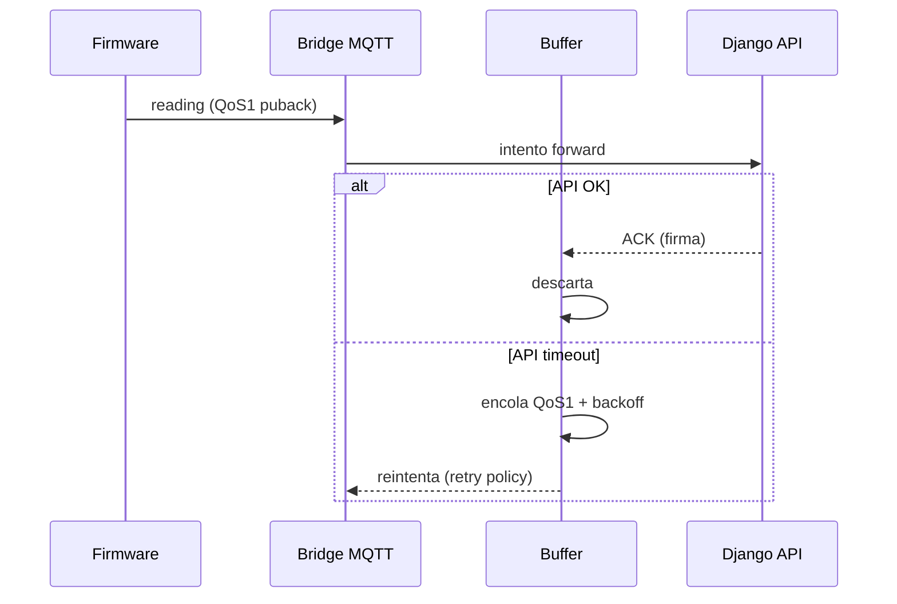

# 📡 UBTN — Arquitectura MQTT (Broker, Bridge, Tópicos, Calidad de Servicio, LWT)

## Universal Biological Telemetry Node — Transporte del borde al backend

| Campo | Valor |
|-------|-------|
| **Versión** | 1.0.0 (diseño — sin implementación) |
| **Fecha** | 2026-09-13 |
| **Rama** | `feature/ubtn-biological-telemetry` |
| **Estado** | 🔷 Diseño — profundiza `ADR-UBTN-12` (transporte) |
| **Decisión** | MQTT 5 base con QoS 0/1, LWT obligatorio, bridge ubtn/#; LoRaWAN y BLE como capa de reserva |

---

## 1. Propósito

Fijar la **arquitectura de transporte MQTT** de UBTN: topología físico-lógica, obligaciones de QoS, uso de LWT, retención, y límites para no cargar el broker. Es el contrato operativo entre el firmware, la BBB y el backend.

---

## 2. Topología de Transporte

```mermaid
flowchart LR
    subgraph EDGE["Borde (Wearable)"]
        FW[ESP32 + ADS1292R/MAX30102/MPU6050]
        RFT[Radio LoRa SX1276<br/>(capa de reserva)]
        BLT[BLE<br/>(provisioning/solo-único setup)]
    end
    subgraph GATEWAY["BBB Rev C (Broker)"]
        MQ[Mosquitto 🔧 broker]
        BR[MQTT Bridge (store-and-forward)]
        BUF[Buffer QoS1 offline-first]
    end
    subgraph BACK["Backend"]
        ING[MqttBiologicalIngestionAdapter]
        DUP[Dedup por firma]
        REPO[BiologicalReadingRepository]
    end

    FW -->|"MQTT TCP 8883/vía TLS<br/>ubtn/{node}/reading QoS1"| MQ
    FW -.->|"MQTT QoS0 especulativo vía BLE<br/>(si no hay IP)"| BLT
    RFT -.->|"LoRaWAN reserva (rural sin IP)"| BR
    MQ --> BR
    BR --> BUF
    BUF --> ING
    ING --> DUP
    DUP --> REPO
```

---

## 3. Convenciones de Tópicos

| Tópico | QoS | RETAIN | Uso |
|---|---|---|---|
| `ubtn/{node_id}/reading` | 1 | no | lectura normal (envelope V4) |
| `ubtn/{node_id}/burst` | 1 | no | ráfaga de alta frecuencia (SPS alto) |
| `ubtn/{node_id}/status` | 1 | **SÍ (retained)** | estado del nodo: `online/offline/maintenance/lost` |
| `ubtn/{node_id}/alert` | 1 | no | alertas emitidas (mirror de `physiological_alert`) |
| `ubtn/cmd/{node_id}` | 1 | no | comandos del backend al nodo (provision, solicitar ráfaga) |
| `$SYS/broker/#` | — | — | monitoreo del broker (Mosquitto `$SYS`) |

**Normas:**
- `status` **retained = true** con valor `offline` al desconectarse (LWT + retained = fuente de última voluntad coherente).
- `reading`, `burst`, `alert`, `cmd` **sin retención** (el estado se pregunta por API, no por RETAIN de datos).
- QoS 1 en todo menos en datos especulativos BLE; QoS 0 **prohibido** en `reading` (habilitar el dedupe no implica perder mensajes críticos).

---

## 4. LWT (Last Will and Testament) — Contrato de Vitalidad

| Mecanismo | Tópico | Payload | Quién establece |
|---|---|---|---|
| LWT online | `ubtn/{node}/status` | `{"status":"online",...}` retained | firmware al conectar (vía will) |
| LWT offline | `ubtn/{node}/status` | `{"status":"offline", "rssi":..., ...}` retained | broker al caer el client (will message) |
| Heartbeat | `ubtn/{node}/status` (retained, % de batería actualizado) | incluye `battery_percent`, `last_seen`, `status` | firmware periódico (60–300 s según modo) |

**Regla de verdad:** el **LWT del broker** es la fuente autoritativa de `NodoEstadoCambiado` (evento). El firmware NO debe auto-publicar "offline" manualmente antes de una desconexión limpia si el broker puede enviar el will; ambos casos confluyen en el mismo tópico, por eso `status` es retained.

> Reconciliación: la lectura retained de `status` reemplaza la estrategia "status no persistente" previa (ver `UBTN_AUDIT_REVIEW.md` A-2). El estado del nodo es **dato de operación**, no dato de telemetría; retenerlo es correcto y no infla volumen.

---

## 5. Parámetros del Broker (diseño)

| Parámetro | Valor tolerado | Nota |
|---|---|---|
| Sesiones | persistentes (clean_session=false) para suscriptores críticos | bridge y adaptador |
| Keep alive | 30–60 s firmware; 15 s bridge | balance consumo vs detección |
| Máximo clientes | umbral escala V2: cientos → miles; ver `UBTN_DATABASE_EVOLUTION.md` §5 |
| TLS | recomendado `tls_version tlsv1.2`, puerto 8883 | en WAN; overlay LAN cuando sea viable |
| Retained + dedup | `retained` solo en `status`; dedupe por `reading_signature` en backend | anti-fanout |

**Hallazgo auditoría (§R2 de `UBTN_RISK_ANALYSIS.md`):** el broker es el **primer punto único de fallo** del flujo IoT adulto. El runbook definirá conmutación (`UBTN_OPERATIONS_RUNBOOK.md` RR-001).

---

## 6. Bridge Store-and-Forward (offline-first)

- Cuando el backend no responde (django down), el bridge **encola en buffer QoS1** y reenvía con backoff.
- La firma de lectura evita reintentos duplicados en el backend.
- El buffer se limpia **solo tras ACK de persistencia** del backend.
- Cuota máxima de buffer por nodo → política de descarte (más antiguo primero), aviso en `$SYS`/health.



---

## 7. App Layer / LoRa

| Capa | Reserva | Cuándo activarla |
|---|---|---|
| **MQTT (base)** | addr WAN/LAN | enlaces IP disponibles (finca, ciudad, STEM) |
| **LoRaWAN** | SX1276/78 via bridge | campo rural sin IP; rangos de 1–5 km |
| **BLE** | provisioning/único-nodo | emparejamiento y tests de laboratorio |

> La transición temporal LoRa↔MQTT **respeta la estrategia de evolución** (`UBTN_TELEMETRY_EVOLUTION_STRATEGY.md`): el backend no distingue el origen mientras el envelope V4 lo declare (`source_mode`).

---

## 8. Contrato de Calidad

| Exigencia | Cómo se garantiza |
|---|---|
| ≤ 2 publicaciones de pérdida por nodo/día | QoS1 + retry + dedup |
| ≤ 1% de lecturas descartadas por buffer | cuota + backoff + monitoreo `$SYS` |
| Estado de nodo disponible a emisores via API | retained en `status` + read-model |
| Sin IP → LoRa reserva operable | bridge dual-lectura firmware |
| No degradar broker por RETAIN masivo | solo `status` retained |

---

## 9. Referencias

- [`UBTN_SENSOR_CATALOG.md`](UBTN_SENSOR_CATALOG.md) — radios (SX1276, BLE) y ADR-12/13.
- [`UBTN_DATA_CONTRACTS.md`](UBTN_DATA_CONTRACTS.md) — envelope V4 (MQTT payload).
- [`UBTN_TELEMETRY_EVOLUTION_STRATEGY.md`](UBTN_TELEMETRY_EVOLUTION_STRATEGY.md) — dual-track seguro.
- [`UBTN_BBB_EDGE_GATEWAY.md`](UBTN_BBB_EDGE_GATEWAY.md) — rol de la BBB / Mosquitto.
- [`UBTN_OPERATIONS_RUNBOOK.md`](UBTN_OPERATIONS_RUNBOOK.md) — RR-001 conmutación broker.
- [`UBTN_ADR_INDEX.md`](UBTN_ADR_INDEX.md) — ADR-12 transporte.

---

*Arquitectura MQTT — diseño sin implementación. El broker y el LWT son infraestructura compartida, respetando la frontera de dominio.*