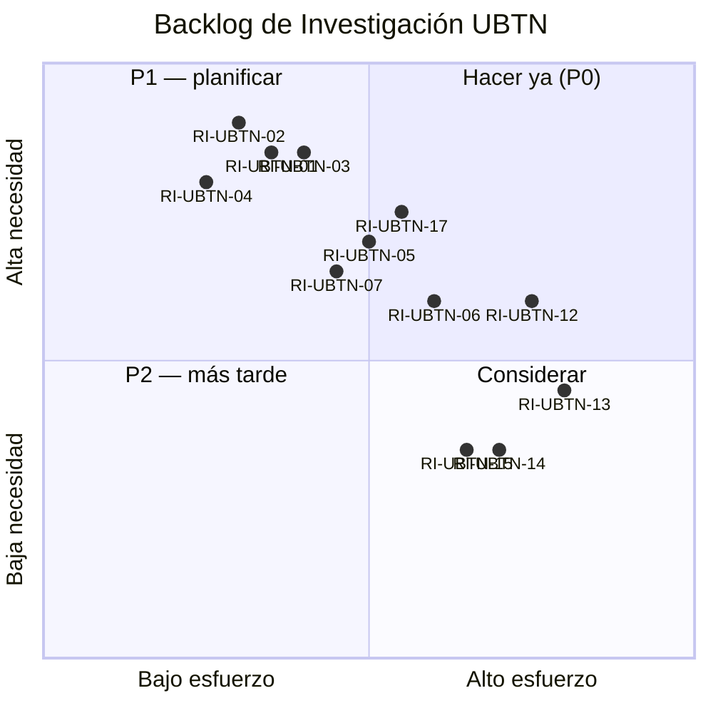

# 🔍 UBTN — Backlog de Investigación (Research Backlog)

## Universal Biological Telemetry Node — Líneas de Investigación Priorizadas

| Campo | Valor |
|-------|-------|
| **Versión** | 1.0.0 (backlog — sin implementación) |
| **Fecha** | 2026-09-13 |
| **Rama** | `feature/ubtn-biological-telemetry` |
| **Estado** | 🔷 Diseño — el backlog NO se ejecuta en esta rama; guía el trabajo de diseño previo a Fases U2-U7 |
| **Prioridad** | P0 (antes del MVP) · P1 (post-MVP) · P2 (escalado) |

---

## 1. Propósito

Inventario **priorizado** de investigaciones futuras que el UBTN necesita resolver — fisiológicas, de hardware, de datos, de campo y de gobernanza — para desbloquear decisiones de las Fases U1-U7 sin bloquear el diseño actual.

> Regla: una línea de investigación marcada P0 es **requisito de entrada** para la fase asociada. Su resultado se registra como evidencia en la bitácora de la fase (planes formateados según la guía ADSO del repositorio).

---

## 2. Backlog Priorizado

| ID | Prioridad | Línea de investigación | Preguntas clave | Desbloquea | Documento de referencia |
|---|---|---|---|---|---|
| RI-UBTN-01 | 🟥 P0 | Rangos fisiológicos por especie (T°, FC, FR, SpO₂, rumia, actividad) | Valores de referencia robustos por especie/raza/etapa; límites de alerta | U2 (umbrales) / U6 (IA) / U7 (MVP) | `UBTN_USE_CASES.md` §2-8; RSK-SEN-01 |
| RI-UBTN-02 | 🟥 P0 | Calibración de temperatura corporal por sitio de medición (collar/arete vs rectal) | Offset y curva de corrección; variabilidad por individuo y clima | U5 (firmware), U7 (MVP T°) | RSK-SEN-02; `UBTN_SENSOR_CATALOG.md` |
| RI-UBTN-03 | 🟥 P0 | Protocolo de bienestar animal y habituación con el collar/tag | Tiempo de habituación, indicadores de estrés IMU, criterios de retiro | U5/U7 | RSK-REG-03 |
| RI-UBTN-04 | 🟥 P0 | Forma factor por especie: ergonomía, fijación, peso máximo | Tamaño/peso límite por animal; materiales; IP/humedad/lodo | U5 (firmware) | `UBTN_USE_CASES.md`; RSK-HW-04 |
| RI-UBTN-05 | 🟡 P1 | Viabilidad de PPG sobre pelaje/pidole y movimiento (por especie) | Límites de SpO₂/HR-PPG; alternativa ECG | U5 (canales), U6 | RSK-SEN-03; `UBTN_SENSOR_CATALOG.md` |
| RI-UBTN-06 | 🟡 P1 | Comparativa de plataformas (ESP32-S3 vs WROOM-32; ICM-20948 vs MPU6050) | BLE5/radio, consumo, DMP, costo | U5 (placa) | `UBTN_SENSOR_CATALOG.md` §9 |
| RI-UBTN-07 | 🟡 P1 | Bandas y normativa inalámbrica rural en Colombia (WiFi 2.4/LoRa 915/BLE) | Marco CRC/MINTIC; licencias mínimas; coexistencia | U4/U5 (radio) | RSK-REG-04; `UBTN_SENSOR_CATALOG.md` |
| RI-UBTN-08 | 🟡 P1 | Diseño del presupuesto energético del nodo (batería + solar opcional) | Duración objetivo, perfil de carga por estación, dimensionado | U5 (energía) | RSK-ENE-01/02 |
| RI-UBTN-09 | 🟡 P1 | Detección de hipoactividad/rumia por IMU (sensibilidad y umbrales) | Algoritmos, validación contra observación de campo | U5/U6 (actividad) | `UBTN_DOMAIN_MODEL.md` |
| RI-UBTN-10 | 🟡 P1 | Benchmark de deduplicación y reordenamiento del buffer (store-and-forward) | Comportamiento ante cortes; políticas de retención | U4 (bridge) | `UBTN_EDGE_AI_STRATEGY.md` §4 |
| RI-UBTN-11 | 🟢 P2 | Viabilidad de bolo ruminal (invivo) para T° interna | Regulatorio, seguridad, valor añadido vs collar | Escalado bovino | `UBTN_USE_CASES.md` §3 |
| RI-UBTN-12 | 🟢 P2 | Modelos de IA de anomalías animales (baseline) y benchmark vs umbrales | Dataset, métricas (macro-F1), explicabilidad | U6 | `UBTN_EDGE_AI_STRATEGY.md` §6 |
| RI-UBTN-13 | 🟢 P2 | TinyML en BBB-02: factibilidad (RAM/CPU) y arquitectura de modelo | Modelos viables en Cortex-A8; latencia | Post-U7 | `UBTN_EDGE_AI_STRATEGY.md` §5 |
| RI-UBTN-14 | 🟢 P2 | Vigilancia acústica de colmenas (api): detección de enjambrazón y salud | Caracterización acústica, microfonía rural | Escalado apícola | `UBTN_USE_CASES.md` §7 |
| RI-UBTN-15 | 🟢 P2 | Sensores de calidad de agua para piscicultura (OD/pH/turbidez) de bajo costo | Sensores fiables, calibración, costo por estanque | Escalado piscícola | `UBTN_USE_CASES.md` §8 |
| RI-UBTN-16 | 🟢 P2 | Red LoRaWAN rural de cobertura extendida (multi-gateway) | Diseño de red, gateway LoRa, presupuesto de enlace | Escalado por rebaño/campo | ADR-UBTN-12 |
| RI-UBTN-17 | 🟡 P1 | Gobernanza y política de datos biométricos (retención, consentimiento, pseudonimización) | Marco Resolución/datos de explotación; implementación práctica | U2/U7 | ADR-UBTN-16; `UBTN_RISK_ANALYSIS.md` §5.1 |
| RI-UBTN-18 | 🟡 P1 | Estrategia de datasets de campo propios (etiquetado de eventos: cojera, celo, estrés) | Definir esquema de etiquetado y captura de ground truth | U6 | Gobierno IA V2 |

---

## 3. Visualización de Prioridades

---

## 4. Dependencia con el Roadmap

| Fase | Investigación de entrada obligatoria |
|---|---|
| U1 (dominio) | RI-01 (rangos por especie); RI-17 (política de datos) |
| U2 (persistencia/API) | RI-01, RI-17 |
| U3 (EventBus/alertas) | RI-01 (umbrales) |
| U4 (edge) | RI-07 (normativa radio); RI-10 (buffer/benchmark) |
| U5 (firmware) | RI-02 (calibración), RI-03 (bienestar), RI-04 (form factor), RI-05 (PPG), RI-06 (plataforma), RI-08 (energía), RI-09 (IMU) |
| U6 (IA) | RI-12 (baseline ML), RI-18 (datasets); gobernanza IA V2 |
| U7 (MVP e2e) | todas las P0 |

---

## 5. Criterios de cierre de una línea de investigación

1. Pregunta respondida con **evidencia replicable** (datos, referencia bibliográfica, medición de campo).
2. Resultado documentado en la bitácora de fase (formato bitácora del repositorio).
3. Si cambia un canal/umbral/configuración → se registra como ADR (superación) o nota en `UBTN_ADR_INDEX.md`.
4. Cierre sin bloqueo: si no hay datos aún, se marca como "abierta con riesgo asumido" y se define el riesgo en `UBTN_RISK_ANALYSIS.md`.

---

## 6. Referencias

- [`UBTN_ROADMAP.md`](UBTN_ROADMAP.md) — fases U1-U7; gates.
- [`UBTN_RISK_ANALYSIS.md`](UBTN_RISK_ANALYSIS.md) — RSK-SEN/ENE/REG asociados.
- [`UBTN_ADR_INDEX.md`](UBTN_ADR_INDEX.md) — cierre/actualización de ADR por investigación.
- `docs/ai/research_v2/SIGCT_RURAL_AI_RESEARCH_PROGRAM_V2.md` — gobernanza IA para RI-12/13/18.

---

*Backlog de investigación — no se ejecuta en esta rama. P0 es puerta obligatoria para U2/U5/U7.*