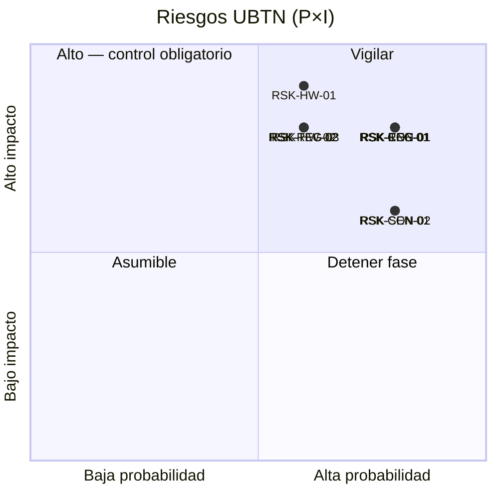

# ⚠️ UBTN — Análisis de Riesgos

## Universal Biological Telemetry Node — Registro de Riesgos y Controles

| Campo | Valor |
|-------|-------|
| **Versión** | 1.0.0 (análisis — sin implementación) |
| **Fecha** | 2026-09-13 |
| **Rama** | `feature/ubtn-biological-telemetry` |
| **Estado** | 🔷 Diseño — registro vivo de riesgos; no bloquea la Fase U0 |
| **Ámbito** | Técnicos · Regulatorios · Hardware · Conectividad rural · Autonomía energética · Sensores biométricos · Interoperabilidad |

---

## 1. Propósito

Documentar, priorizar y controlar los riesgos de la línea UBTN **antes** de programar. Este registro acompaña al roadmap (riesgo por fase) y alimenta los gates de decisión: un riesgo con impacto crítico no mitigado es motivo de **detención** de la fase asociada.

**Metodología:** matriz de probabilidad × impacto con escala cualitativa 1-5 y score 1-25 (5×5). Umbral de detención: score ≥ 12 (naranja) o ≥ 20 (rojo) exige control obligatorio antes de avanzar de fase.

| Escala | Probabilidad (P) | Impacto (I) |
|---|---|---|
| 1 | Muy baja (<10%) | Despreciable |
| 2 | Baja (10-30%) | Menor |
| 3 | Media (30-60%) | Moderado |
| 4 | Alta (60-85%) | Mayor |
| 5 | Muy alta (>85%) | Crítico |

| Score P×I | Clasificación |
|---|---|
| 1-5 | 🟢 Bajo — asumible |
| 6-11 | 🟡 Medio — vigilar |
| 12-19 | 🟠 Alto — control obligatorio |
| 20-25 | 🔴 Crítico — detener fase |

---

## 2. Resumen Ejecutivo

| Categoría | Riesgos | Score máx. | Cantidad por categoría |
|---|---|---|---|
| Riesgos técnicos | 2 | 16 🟠 | RSK-TEC-*
| Riesgos regulatorios | 3 | 16 🟠 | RSK-REG-*
| Riesgos de hardware | 3 | 15 🟠 | RSK-HW-*
| Conectividad rural | 3 | 16 🟠 | RSK-CON-*
| Autonomía energética | 3 | 15 🟠 | RSK-ENE-*
| Sensores biométricos | 4 | 14 🟠 | RSK-SEN-*
| Interoperabilidad | 2 | 12 🟠 | RSK-INT-*

> Todos los riesgos "Alto" tienen control definido y fase propietaria. Ningún riesgo crítico (🔴) sin control en el MVP U7; la orden de magnitud del MVP (una variable, umbrales) se eligió precisamente para mantener el score bajo U7.

---

## 3. ID Contexto y Definiciones

| Término | Definición |
|---|---|
| **UBTN** | Universal Biological Telemetry Node — nodo wearable/in situ de captura biométrica de un individuo o población |
| **MVP UBTN** | Una sola variable vital (recomendado: temperatura corporal) end-to-end (sensor→edge→cloud→alerta) |
| **Edge** | BBB-01 gateway / BBB-02 inferencia (futura) / BBB-03 sensores de corral |
| **Dato biométrico animal** | Señales vitales de un individuo: T°, FC, FR, SpO₂, ECG, actividad, rumia |
| **Gobernanza IA V2** | Marco `docs/ai/research_v2/SIGCT_RURAL_AI_RESEARCH_PROGRAM_V2.md` (línea Animal Health AI) |

---

## 4. Registro de Riesgos

### 4.1 Riesgos Técnicos (RSK-TEC)

| ID | Riesgo | Causa | Efecto | P | I | Score | Control / Mitigación | Fase propietaria |
|---|---|---|---|---|---|---|---|---|
| RSK-TEC-01 | Regresión sobre el Telemetry Context durante la integración | Manipular `wiring.py` o compartir contratos | Dashboards V1-V3 rotos, suscripciones pérdidas | 4 | 4 | 16 🟠 | Trabajo exclusivo en rama dedicada; tests de wiring/idempotencia (Fase U3); regla protegida de solo-adición en `wire_all()`; checklist de no-regresión `UBTN_ARCHITECTURE.md` §6 | U3 |
| RSK-TEC-02 | Contratos internos sin versionar generan arrastre de rompimiento | Payloads ad-hoc entre firmware-bridge-API | Retrabajo en U4/U5/U7, datos inestables | 3 | 4 | 12 🟠 | Contratos JSON versionados (`UBTN_DATA_CONTRACTS.md`); esquemas por contrato; `contract_version` en envelope; pruebas de contrato | U2/U4 |
| RSK-TEC-03 | DB de lecturas periódicas saturada por ráfagas ECG/PPG | Guardar bursts en la tabla de lecturas | Lento, costoso, downsampling forzado | 3 | 3 | 9 🟡 | Contrato/almacén `burst` separado (ADR-UBTN-09); retención y agregación por antigüedad | U2 |

### 4.2 Riesgos Regulatorios y de Gobernanza (RSK-REG)

| ID | Riesgo | Causa | Efecto | P | I | Score | Control / Mitigación | Fase propietaria |
|---|---|---|---|---|---|---|---|---|
| RSK-REG-01 | Dato biométrico de animal tratado sin marco de gobernanza | Guardar propietario/PII junto a la serie | Incumplimiento de protección de datos (Ley 1581/2012 Colombia si hay PII), abuso del dato | 4 | 4 | 16 🟠 | ADR-UBTN-16: minimización, retención definida, `AnimalSubject` pseudonimizado (`external_id` local); sin PII del propietario en el dominio bio | U2/U7 |
| RSK-REG-02 | Dispositivo sin uso médico regulado | Lecturas interpretadas como diagnóstico | Responsabilidad legal, percepción de garantía clínica | 3 | 3 | 9 🟡 | El UBTN es telemetría de apoyo, no dispositivo médico; descláusula de uso, separar "alerta fisiológica" (regla) de "diagnóstico" (IA) | U0/U7 |
| RSK-REG-03 | Manipulación de animales en campo sin protocolo de bienestar | Collares/implantes mal ajustados | Estrés animal, daño, problemas éticos | 3 | 4 | 12 🟠 | Protocolo de bienestar, habituación, diseño ergonómico, revisión veterinaria en MVP | U5/U7 |
| RSK-REG-04 | Espectro / radio (WiFi/LoRa) sin autorización en zona rural | Uso de bandas sin licencia | Interferencias o incumplimiento normativo (Colombia: CRC / MINTIC para bandas) | 2 | 3 | 6 🟡 | Verificación de bandas ISM/plan de frecuencias; LoRa en 915 MHz según marco nacional; documentar licencias mínimas | U4/U5 |

### 4.3 Riesgos de Hardware (RSK-HW)

| ID | Riesgo | Causa | Efecto | P | I | Score | Control / Mitigación | Fase propietaria |
|---|---|---|---|---|---|---|---|---|
| RSK-HW-01 | Falta de stock / discontinuación de ICs biométricos | Colapso de cadena de suministro (2021-2025) | MVP detenido, rediseño de placa | 3 | 5 | 15 🟠 | Catálogo con alternativas (ADS1292R ↔ ADS1299/AD8232 según necesidad; MAX30102 ↔ MAX86150/MAX86916); diseño multisource | U5 |
| RSK-HW-02 | Firmware sin capacidad de actualización remota | Bugs/calibración post-despliegue | Recolección manual de collares | 3 | 4 | 12 🟠 | OTA/DFU del ESP32 diseñado desde U5; sello de versión `fw` verificado por catálogo | U5 |
| RSK-HW-03 | Ruido electromagnético e interferencia en el cuerpo animal | Electrodos/ruido de movimiento | Señal ECG/PPG inutilizable | 3 | 4 | 12 🟠 | Blindaje, electrodos secos de buena calidad, filtrado digital, DC offset management, calibración con referencia clínica | U5 |
| RSK-HW-04 | Defectos mecánicos del form factor (desgaste, humedad, corrosión) | Trabajo en pasto/agua/lodo | Pérdida de nodos, datos rotos | 3 | 3 | 9 🟡 | IP ratings, pruebas de campo, redundancia de nodo por lote, visión de mantenimiento | U5/U7 |

### 4.4 Riesgos de Conectividad Rural (RSK-CON)

| ID | Riesgo | Causa | Efecto | P | I | Score | Control / Mitigación | Fase propietaria |
|---|---|---|---|---|---|---|---|---|
| RSK-CON-01 | Cobertura WiFi inexistente en zonas de pastoreo | Topografía, distancia al gateway | Sin enlace collar→broker | 4 | 4 | 16 🟠 | Store-and-forward en edge (ADR-UBTN-15); Mesh WiFi o relay por BBB-03; LoRaWAN como lazo de reserva (ADR-UBTN-12) | U4 |
| RSK-CON-02 | Conectividad cloud intermitente | Proveedor rural inestable | Lecturas no llegan a la nube | 4 | 3 | 12 🟠 | Buffer local + reenvío ordenado; duplicación protegida (ADR-UBTN-10); monitoreo de backlog del buffer | U4 |
| RSK-CON-03 | Choque de tópicos u / colisión QoS | Múltiples collares y reinientos | Mensajes duplicados/desorden | 3 | 3 | 9 🟡 | QoS 1 + deduplicación por firma; `reading_signature`; monitoreo de métricas del broker | U4 |

### 4.5 Riesgos de Autonomía Energética (RSK-ENE)

| ID | Riesgo | Causa | Efecto | P | I | Score | Control / Mitigación | Fase propietaria |
|---|---|---|---|---|---|---|---|---|
| RSK-ENE-01 | Batería agotada antes de ciclo previsto | WiFi activo frecuente, ráfagas ECG | Nodo offline días/semanas | 4 | 4 | 16 🟠 | Deep-sleep (µA), telemetría periódica (ej. 1/10 min), ráfaga a demanda; presupuesto energético por configuración; Solar/power harvesting opcional | U5 |
| RSK-ENE-02 | Carga solar inadecuada en condiciones rurales | Cobertura nubosa, rebaño a la sombra | Autonomía degradada | 3 | 3 | 9 🟡 | Dimensión de panel y batería con margen; perfil de carga por estación; modo de emergencia de baja tasa | U5 |
| RSK-ENE-03 | Envejecimiento/recarga de batería LiPo inseguro | Manejo en campo | Riesgo de fuego/deterioro | 2 | 3 | 6 🟡 | PMIC con protección, cargadores certificados, reemplazo planificado, registro de `battery_percent` en `status` | U5 |

### 4.6 Riesgos de Sensores Biométricos (RSK-SEN)

| ID | Riesgo | Causa | Efecto | P | I | Score | Control / Mitigación | Fase propietaria |
|---|---|---|---|---|---|---|---|---|
| RSK-SEN-01 | Rango fisiológico por especie desconocido/impreciso | Sin bibliografía suficiente o sin calibración propia | Falsos positivos/negativos de alerta | 4 | 3 | 12 🟠 | Investigación previa (backlog de investigación), MVP de una variable, calibración contra referencia clínica (ADS1292R/termómetro) | U6/U7 |
| RSK-SEN-02 | Sitio de medición improcedente del sensor en el animal | Collar vs. ubicación óptima | Señal con offset/artefactos (témpera superficial) | 4 | 3 | 12 🟠 | Tabla de offset por ubicación (ADR); documentar sitio de medición en el contrato (`placement`); calibración | U5 |
| RSK-SEN-03 | PPG inviable sobre pelaje oscuro o movimiento | Absorción de luz/artefactos | SpO₂/FC PPG no confiable | 2 | 4 | 8 🟡 | Alternativa ECG para FC; prueba por especie; documentar límites | U5 |
| RSK-SEN-04 | Degradación del electrodo/óptica por uso prolongado y suciedad | Lodo, transpiración, lana | Señal degradada gradual | 3 | 3 | 9 🟡 | Mantenimiento planificado, control de calidad de señal (SNR por canal), alerta de calidad en el bridge | U5 |

### 4.7 Riesgos de Interoperabilidad (RSK-INT)

| ID | Riesgo | Causa | Efecto | P | I | Score | Control / Mitigación | Fase propietaria |
|---|---|---|---|---|---|---|---|---|
| RSK-INT-01 | Señal `biological_reading` no consumida por Labs/Agricultura/IA por desconocimiento del contrato | Onboarding insuficiente | Aislamiento de datos | 3 | 4 | 12 🟠 | Documentación de contrato versionada; `OnBiologicalReadingHandler` registrado en wire_all; ejemplos de consumo; gobernanza de señal en `UBTN_DATA_CONTRACTS.md` | U3 |
| RSK-INT-02 | Duplicidad conceptual con telemetría ambiental al exponer APIs | UI/contrato ambiguo | Confusión de fuentes de datos en dashboards | 3 | 4 | 12 🟠 | Prefijos/URLs `/api/v4/bio/*`; envelope `source_mode`; catálogo de flujos en `UBTN_LAB_INTEGRATION.md` | U2/U3 |

---

## 5. Temas Transversales

### 5.1 Gobernanza del Dato Biométrico (casa del ADR-UBTN-16)

| Decisión | Detalle |
|---|---|
| Minimización | Persistir solo las variables necesarias del caso de uso; no recolectar señales crudas sin propósito |
| Recolección | Aceptación/capacitación del productor; el dueño del dato del individuo es el productor que lo cría |
| Retención | Definir ventana de retención por tipo de serie (periódica vs. burst); downsampling/borrado automático |
| Pseudonimización | `AnimalSubject.external_id` local; sin PII del propietario en el modelo de dominio |
| Auditoría | Registro de quién accede a qué serie (política de trazabilidad de acceso, alineada con KB de conocimiento) |
| Diagnóstico vs. alerta | Las reglas de umbral producen "alerta fisiológica" (soporte); los modelos ML/DL jamás se presentan como diagnóstico clínico |

### 5.2 Bienestar animal

- El UBTN **no** es invasivo por diseño: collar/arete/tag, nunca implante en el MVP (bolo ruminal marcado como futuro bajo revisión veterinaria).
- Protocolo de habituación antes de medición productiva (RSK-REG-03).
- Cualquier indicio de estrés detectado por IMU/actividad es insumo de decisión de retiro del collar.

### 5.3 Seguridad de la información

| Superficie | Control |
|---|---|
| Collar ↔ Broker (MQTT) | TLS con CA de laboratorio; credencial por dispositivo |
| Broker ↔ Nube | HTTPS mutual-TLS o token de servicio |
| Buffer local | SQLite restringido, rotación de datos, cifrado en reposo |
| Acceso BBB-01/02/03 | llaves públicas, sin contraseñas |
| Datos en tránsito de serie biométrica | TLS 1.2+; minimización de metadatos |

---

## 6. Matriz Resumen por Categoría

---

## 7. Decisiones Registradas (ADR)

| ID | Decisión | Alternativa rechazada | Justificación |
|---|---|---|---|
| **ADR-UBTN-16** | Gobernanza de dato biométrico: minimización, retención, pseudonimización, alerta≠diagnóstico | Persistir PII del propietario junto a la serie | Riesgo legal RSK-REG-01 + marco Ley 1581/2012; alineación con gobernanza IA V2 |

---

## 8. Umbrales de Detención por Fase

| Fase | Riesgos que deben estar mitigados antes de avanzar |
|---|---|
| U0 (esta) | Registro completo + ADR-16 sobre gobernanza de dato ✅ |
| U1 (dominio) | Umbrales de dominio por especie investigados (RSK-SEN-01) como backlog abierto |
| U2 (persistencia/API) | Contratos versionados (RSK-TEC-02); retención definida (RSK-REG-01) |
| U3 (EventBus/alertas) | Test de wiring/idempotencia (RSK-TEC-01); contrato documentado para Labs/IA (RSK-INT-01) |
| U4 (edge/MQTT) | Store-and-forward (RSK-CON-01/02); tópicos y QoS (RSK-CON-03) |
| U5 (firmware) | Presupuesto energético (RSK-ENE-01); protocolo de bienestar (RSK-REG-03); calibración y offset del sensor (RSK-SEN-02) |
| U6 (IA) | Límite alerta≠diagnóstico (RSK-REG-02); datasets etiquetados con política de dato |
| U7 (MVP e2e) | Todos los de U2-U6 + prueba de campo real con bienestar animal verificado |

---

## 9. Referencias

- [`UBTN_ARCHITECTURE.md`](UBTN_ARCHITECTURE.md) — §6 checklist de no-regresión; §7 ADRs 01-06.
- [`UBTN_ROADMAP.md`](UBTN_ROADMAP.md) — §4 riesgos por fase inicial y gates.
- [`UBTN_ADR_INDEX.md`](UBTN_ADR_INDEX.md) — registro central de decisiones.
- [`PLAN_MAESTRO.md`](PLAN_MAESTRO.md) — Fase 9.2/9.3 (motivo del análisis).
- `docs/ai/research_v2/SIGCT_RURAL_AI_RESEARCH_PROGRAM_V2.md` — gobernanza IA V2 (línea Animal Health AI).

---

*Registro de diseño — sin implementación. Re-evaluar riesgos en cada gate de fase.*