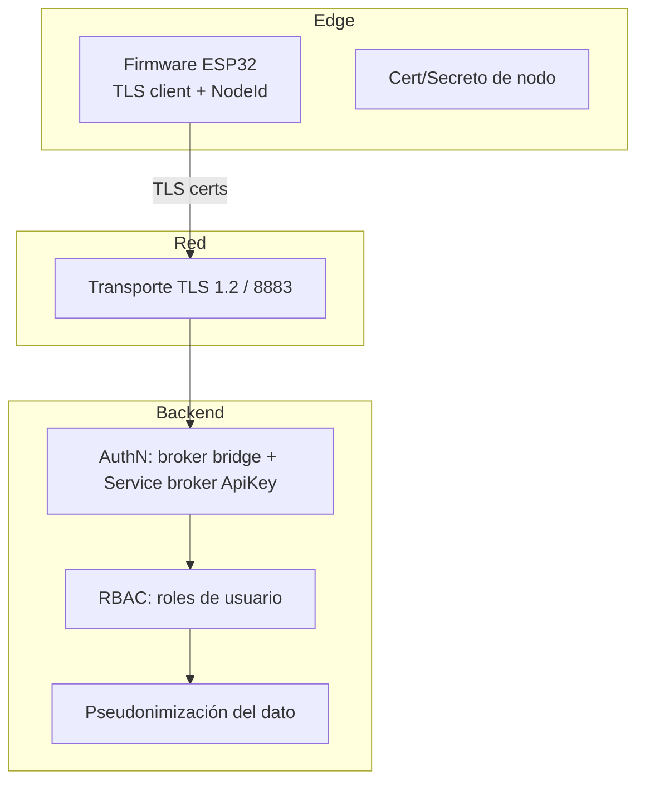

# 🔐 UBTN — Modelo de Seguridad — ADR-19

## Universal Biological Telemetry Node — Cifrado, identidad, autorización y privacidad del dato biométrico

| Campo | Valor |
|-------|-------|
| **Versión** | 1.0.0 (diseño — sin implementación) |
| **Fecha** | 2026-09-13 |
| **Rama** | `feature/ubtn-biological-telemetry` |
| **Estado** | 🔷 Diseño — formaliza `ADR-UBTN-19` (security) |
| **Decisión** | TLS + identidad de dispositivo; RBAC; pseudonimización del dato biométrico (ADR-16); PKI/CA es evolución U6, no premisa |

---

## 1. Postura de Seguridad

| Postura | Opción |
|---|---|
| Nuclear en confidencialidad | El dato fisiológico de un animal es **sensible** para explotación (robo de datos de raza bienestar), aunque no PII humana |
| Enemigo considerado | `eavesdrop` en red rural; `spoof` de nodo; `replay` de lectura; `DoS` del broker; `tamper` físico del collar |
| Objetivo | confidencialidad (privacidad), integridad (firma), disponibilidad (broker), no-repudio (facility log) |

---

## 2. Componentes del Modelo

---

## 3. Cifrado y Transporte

| Capa | Qué | Estándar |
|---|---|---|
| Transporte (LAN/WAN) | MQTT sobre TLS | `tls_version tlsv1.2` moderno; puerto 8883 |
| Datos en reposo | bucket + DB cifrados | KMS/SSE (S3) para burst; `pgcrypto` para campos sensibles |
| Backups | cifrado adicional | policy de retención (ADR-16) |
| Media de ráfaga | `samples_uri` con firma/integridad | checksum gzip + sign (U3+) |

> **No dejar expuesto `ws://` o MQTT plano en WAN.** En la intranet del campo (LAN-carpa) puede usarse overlay con advertencia de lab. En producción SIEMPRE TLS.

---

## 4. Identidad de Dispositivo

| Identidad | Qué representa | Cómo se materializa |
|---|---|---|
| `NodeId` | dispositivo físico (collar) | secreto único por modelo (hash HMAC en provisioning) |
| `FacilityId` | lugar (colmena/estanque/corral) | asociación lógica, no en el collar |
| `SubjectId` | individuo animal | pseudonimizado (ADR-16) |

**Flujo de authN del nodo:**
1. Provisioning (QR vía UI de admin) crea `NodeId`→`NodeSecret`.
2. Firmware hace `CONNECT` con `username=node_id` y `password=HMAC(#timestamp, secret)`.
3. Broker/bridge valida con el `acceptor de nodos` (hook) → si no valida, no se acepta el `CONNECT`.
4. Todo tópico `ubtn/{node_id}/#` solo lo escribe ese nodo (topic ACL).

> **Replay-blindaje:** el uso de token por timestamp + sesión **evita replay** de lecturas viejas reinyectadas (hace el dedup por firma aún más trivial). El bridge también valida la ventana de tiempo.

---

## 5. Tópico ACL (ejemplo táctico)

| Rol | Permiso |
|---|---|
| Nodo `{id}` | `pub ubtn/{id}/reading`, `pub ubtn/{id}/burst`, `pub ubtn/{id}/status`, `sub ubtn/cmd/{id}` |
| Bridge/backend | `sub ubtn/+/reading`, `sub ubtn/+/burst`, `pub ubtn/cmd/#`, `sub ubtn/+/status` (solo lectura del LWT) |
| Un solo sujeto (read-model) | `sub ubtn/{node}/status` autorizado |

Regla base: **el broker autoriza por tópico exacto, nunca por wildcard amplio** salvo bridge.

---

## 6. RBAC (roles de usuario del frontend)

| Rol | Alcance |
|---|---|
| `Productor` | lee sus animales, marca alertas como seguidas |
| `Veterinario` | lee sujetos + series + alertas de su explotación |
| `Estudiante/STEM` | modo laboratorio (dataset anonimizado, sin PII) |
| `Admin` | provisioning de nodos, revocación, RBAC |

**Regla de gobernanza (huérfana sin resolver, ver audit §G-4):** el RBAC finito hoy depende de un `FacilityId`/granja **que aún no existe en Identity**. Mientras tanto, `FacilityId` es local a bio (ADR-16).

---

## 7. Paquete de Privacidad (datos biológicos)

| Protección | Mecánica |
|---|---|
| Pseudonimización | `SubjectId` aleatorio; sin nombre/lugar del granjero en la serie |
| Razonamiento de acceso | rol base (Productor/Veterinario) sin unión cruzada |
| Retención mínima | política de retención de burst (ej: 90 días por defecto, prórroga por plan) |
| Consentimiento/aviso | UI: alertas no-diagnóstico (ADR-16) |
| `facility_id` separado | el lugar NO es parte del collar; es dato operativo |

---

## 8. Evolución (PKI/CA) — puerta U6

| Etapa | Identidad |
|---|---|
| U1–U2 | secreto HMAC por tópico (no-PKI) — aceptable en prototipo |
| U3–U4 | certificados de dispositivo por CA auto-gestionada (option) |
| **U6** | PKI/CA pública o federada (ADR futuro) — **no premisa hoy** |

> No confundir: "identidad de nodo HMAC" ya protege spoof/replay; PKI es sobre **revocación escala**, se abre con ADR en U6.

---

## 9. Referencias

- [`UBTN_DATA_CONTRACTS.md`](UBTN_DATA_CONTRACTS.md) — firma y dedup (integridad).
- [`UBTN_MQTT_ARCHITECTURE.md`](UBTN_MQTT_ARCHITECTURE.md) — TLS en el broker.
- [`UBTN_RISK_ANALYSIS.md`](UBTN_RISK_ANALYSIS.md) — riesgos de seguridad y mitigaciones.
- [`UBTN_ADR_INDEX.md`](UBTN_ADR_INDEX.md) — ADR-19 (security), ADR-16 (gobernanza).
- [`UBTN_OPERATIONS_RUNBOOK.md`](UBTN_OPERATIONS_RUNBOOK.md) — revocación y pérdida de nodo.

---

*Modelo de seguridad — diseño sin implementación. TLS + identity por nodo + RBAC finito; la PKI queda como evolución, no como requisito de arranque.*