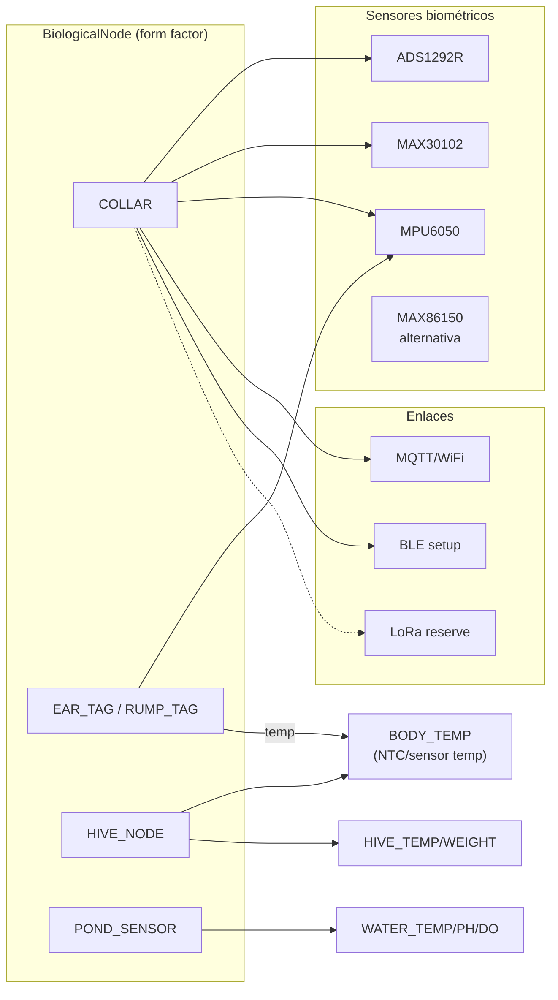

# 🔬 UBTN — Catálogo de Sensores y Plataformas

## Universal Biological Telemetry Node — Investigación Técnica Comparativa

| Campo | Valor |
|-------|-------|
| **Versión** | 1.0.0 (investigación — sin implementación) |
| **Fecha** | 2026-09-13 |
| **Rama** | `feature/ubtn-biological-telemetry` |
| **Estado** | 🔷 Investigación de diseño — decisión de plataforma y sensores propuesta (ADR-UBTN-12/13) |
| **Dispositivos** | ESP32 · ADS1292R · MAX30102 · MPU6050 · MAX86150 · LoRa (SX1276/78) · BLE · BeagleBone Black Rev C |

---

## 1. Propósito

Documentar la **evidencia técnica** detrás de la selección de plataforma MCU, sensores biométricos y enlaces inalámbricos del UBTN. Es la base de los ADR-UBTN-12 y ADR-UBTN-13 y alimenta las Fases U4 (edge) y U5 (firmware).

> ⚠️ Nota: las especificaciones provienen de documentación pública de fabricantes (fecha de revisión 2026-09-13) y deben validarse con el *datasheet* vigente al momento de la compra (riesgo RSK-HW-01).

---

## 2. Plataforma MCU — Comparativa

### 2.1 ESP32 (núcleo propuesto)

| Criterio | ESP32 (WROOM-32) | ESP32-S3 | ESP32-C3 |
|---|---|---|---|
| CPU | Xtensa LX6 dual @ 240 MHz | Xtensa LX7 dual @ 240 MHz | RISC-V @ 160 MHz |
| WiFi | 802.11 b/g/n 2.4 GHz | b/g/n 2.4 GHz (mejor RX) | b/g/n 2.4 GHz |
| Bluetooth | BLE 4.2 | BLE 5.0 | BLE 5.0 |
| SRAM | 520 KB | 512 KB | 400 KB |
| Flash | 4-16 MB | 8-16 MB | 4 MB |
| ADC | 2× SAR 12-bit (18 canales) | 2× SAR 12-bit (20 canales) | 1× SAR 12-bit (6 canales) |
| Interfaces | I²C, SPI, UART, I2S, PWM, touch | + USB OTG | + USB |
| Deep-sleep | ~10 µA (ULP) | ~7 µA | ~5 µA |
| Programa | Arduino + ESP-IDF | Arduino + ESP-IDF | Arduino + ESP-IDF |
| Veredicto UBTN | ✅ **seleccionado** (costo, madurez, ecosistema) | ✅ buena mejora BLE5/radio | 🟡 opción barata para nodos simples (colmena/tag) |

**Razones de selección (ESP32 WROOM-32):**
1. Suficiente potencia para 3 sensores (SPI ADS1292R + I²C MAX30102 + I²C MPU6050) y **Paho MQTT** sobre WiFi.
2. Deep-sleep de ~10 µA habilita telemetría periódica y ráfaga a demanda (ADR-UBTN-12, energía RSK-ENE-01).
3. Ecosistema maduro (Arduino/ESP-IDF), OTA/DFU disponible, costo bajo, suministro amplio.
4. BLE 4.2 para *shedding* local (configuración, debug en campo).

> **Regla de portabilidad:** el dominio **no** conoce ESP32/BBB; la selección vive en el adaptador `MqttBiologicalIngestionAdapter`/firmware. Cambiar de MCU no altera el subdominio (hardware-agnostic, roadmap principio 4).

---

## 3. Sensores Biométricos — Fichas

### 3.1 ADS1292R (TI) — ECG de 2 canales + respiración

| Parámetro | Valor |
|---|---|
| Función | ECG 2 canales, 24-bit ΔΣ ADC; RLD (right-leg drive) integrada; impedancia de respiración |
| Interfaz | SPI (hasta 8 SPS–8 kSPS programable) |
| Consumo | ~345 µW @ 3 V (típico 3.3 V ≤ 700 µA) |
| Alimentación | 2.0–3.5 V |
| Rasgo clave | morfología ECG (arritmias), FC, detección de respiración por impedancia |
| Uso en UBTN | Frecuencia cardíaca + morfología; **máximo rigor clínico del set** |
| Riesgos | ruido/electrodos en cuerpo animal (RSK-HW-03); artefactos de movimiento |

### 3.2 MAX30102 (Analog Devices) — PPG para HR/SpO₂

| Parámetro | Valor |
|---|---|
| Función | pulsioximetría y frecuencia cardíaca por fotopletismografía (LEDs rojo 660 nm + IR 880 nm) |
| Interfaz | I²C (1.8 V) |
| Muestreo | 50–320 SPS configurable; ADC interno con integración |
| Alimentación | 1.8 V |
| Consumo | bajo (mW); apagado de LED en reposo |
| Uso en UBTN | SpO₂ y FC complementaria al ECG |
| Riesgos | pelaje oscuro/movimiento (RSK-SEN-03); respuesta óptica limitada en especies con lana |

### 3.3 MPU6050 (TDK/InvenSense) — IMU 6 ejes

| Parámetro | Valor |
|---|---|
| Función | acelerómetro 3 ejes + giroscopio 3 ejes (6-DoF), 16-bit ADC |
| Interfaz | I²C (400 kHz) + SPI; DMP (procesamiento digital de movimiento) |
| Rangos | Acc ±2/±4/±8/±16 g; Giro ±250–±2000 °/s |
| Alimentación | 2.375–3.46 V |
| Consumo | ~3.9 mA (gyro+accel activos) |
| Uso en UBTN | actividad, rumia/posición (echado/de pie), detección de hipoactividad, estrés por movimiento |
| Datos clave | `AccelerometrySample`, `ActivityScore`, `RuminationIndex` (proxy) |

### 3.4 MAX86150 (Analog Devices) — ECG + PPG integrado (opción de consolidación)

| Parámetro | Valor |
|---|---|
| Función | módulo integrado ECG (single-lead) + PPG (SpO₂/HR) con 2 LEDs (rojo/IR) + fotodetector |
| Interfaz | I²C |
| Alimentación | 1.8 V |
| Nota | reduce tamaño/bom de área (menos componentes que solución ECG+PPG separada) |
| Veredicto UBTN | 🟡 **documentado como alternativa** para nodos más livianos (canino/felino); riesgo de dependencia de único proveedor (RSK-HW-01) |

---

## 4. Enlaces Inalámbricos — Comparativa

### 4.1 BLE (Bluetooth Low Energy 4.2/5.x)

| Aspecto | Valor |
|---|---|
| Banda | 2.4 GHz ISM |
| Alcance | 10–100 m (depende de potencia/clase) |
| Tasa | hasta ~1-2 Mbps (5.2) |
| Consumo | muy bajo (µA en sleep; mA en TX/RX breve) |
| Uso UBTN | configuración local y *shedding* con el smartphone/tablet del operario |
| Limitación | NO es backhaul; no llega al broker desde el potrero (cobertura) |

### 4.2 LoRa / LoRaWAN (SX1276 / SX1278 + protocolo)

| Aspecto | Valor |
|---|---|
| Banda | SX1276: 137–1020 MHz; SX1278: 137–525 MHz. Uso típico LatAm 915/868 MHz (verificar marco CRC/MINTIC — RSK-REG-04) |
| Modulación | LoRa (CSS): SF7–SF12, BW 125–500 kHz |
| Tasa | 0.018–37.5 kbps (baja) |
| Sensibilidad | hasta −137 dBm |
| Alcance | rural LOS 10–15 km (teórico); urbano 2–5 km |
| Consumo | TX: hasta +20 dBm; sleep: µA (módulos nA en modo ultra-sleep) |
| Uso UBTN | **lazo de reserva** en zonas sin WiFi (ADR-UBTN-12): opción con payload reducido (no apto para ráfaga ECG continua completa) |
| Limitaciones | capacidad limitada (duty cycle regional), latencia por clase (A/B/C), tarifas de datos bajas |

### 4.3 MQTT sobre WiFi (lazo principal)

| Aspecto | Valor |
|---|---|
| Transporte | TCP/TLS sobre WiFi 2.4 GHz (ESP32) |
| QoS | 0/1/2; UBTN usa QoS 1 (al menos una vez) + deduplicación (ADR-UBTN-10) |
| Alcance | WiFi típico rural ampliada con relays BBB-03 |
| Capacidad | suficiente para lectura periódica + ráfaga ECG/PPG a demanda |
| Limitación | consumo energético mayor al LoRa; cobertura limitada |

### 4.4 Matriz de decisión del enlace

| Necesidad | MQTT/WiFi | LoRaWAN | BLE |
|---|---|---|---|
| Lectura periódica 1/10 min | ✅ | ✅ (payload minimal) | ❌ alcance |
| Ráfaga ECG 500 SPS (ventanas cortas) | ✅ | ❌ (tasa insuficiente) | ✅ (muy corta distancia) |
| Zona sin WiFi rural | ❌ | ✅ | ❌ |
| Configuración/depuración en campo | 🟡 | ❌ | ✅ |
| Consumo mínimo absoluto | 🟡 | ✅✅ | ✅✅ |

**Conclusión enlace:** `MQTT/WiFi` como base; `LoRa` como lazo alternativo para lecturas periódicas en cobertura extendida; `BLE` como canal de setup. Tri-enlace configurable vía `NodeFormFactor`/configuración, sin afectar el dominio (ADR-UBTN-12).

---

## 5. BeagleBone Black Rev C (Gateway Edge)

| Criterio | Valor |
|---|---|
| SoC | Sitara AM3358 (ARM Cortex-A8 @ 1 GHz) |
| RAM | 512 MB DDR3 |
| Almacenamiento | 4 GB eMMC + microSD |
| Periféricos | 2× PRU 200 MHz, 65+ GPIO, 4× UART, 2× SPI, 2× I²C, 8× PWM, 7× ADC 12-bit, USB host, Ethernet 10/100 |
| OS | Debian (idéntico al clúster actual) |
| Consumo | ~2–3 W (5 V @ 460 mA) |
| Rol UBTN | Gateway (broker Mosquitto + bridge `ubtn_bridge.py`); BBB-02 futuro TinyML; BBB-03 sensores de corral |
| Veredicto | ✅ reutilizado (ADR-UBTN-04): evolución, sin placa nueva; capacidad suficiencia para broker + buffer + enrutamiento |

---

## 6. Mapa de Canal ↔ Sensor ↔ Forma Factor

> Los canales ambientales de nodos in situ (colmena/estanque) usan sensores dedicados (NTC/termistor, celda de carga, sonda pH/OD) — fuera del "set biométrico" pero dentro del mismo agregado `BiologicalNode` (ADR-UBTN-08).

---

## 7. Decisiones Registradas (ADR)

| ID | Decisión | Alternativa rechazada | Justificación |
|---|---|---|---|
| ADR-UBTN-12 | MQTT 5 sobre WiFi como lazo base + TLS/PSK; LoRaWAN (SX1276/78) como lazo de reserva rural; BLE como setup | LoRaWAN como protocolo único | Capacidades de ráfaga y consumo; cobertura rural cubierta por capa de reserva; actúa sin tocar dominio (ENLACE es configuración) |
| ADR-UBTN-13 | Set base `ADS1292R + MAX30102 + MPU6050` (+ ESP32); `MAX86150` documentado como opción de consolidación | Consolidar todo en único IC sin backup de proveedor | Flexibilidad de canales, calidad clínica del ECG, mitigación de suministro (RSK-HW-01) |

---

## 8. Presupuesto Energético (Orden de Magnitud — diseño)

| Modo | Consumo estimado | Nota |
|---|---|---|
| Deep-sleep | ~10-50 µA | 1 lectura periódica cada 10 min |
| Lectura sensores activa | ~15-30 mA (breve) | ADC/SPI/I²C transitorio |
| TX WiFi MQTT | ~120-240 mA (pico corto) | ráfagas breves |
| Ráfaga ECG 500 SPS | ventana corta a demanda | reducir con agregación en firmware |

*Detalle fino del presupuesto → Fase U5 (firmware) con banco de pruebas. Sujeto a RSK-ENE-01/02.*

---

## 9. Backlog de Verificación de Datasheets

| Ítem | Criterio |
|---|---|
| Datasheet ADS1292R vigente | Verificar voltaje/conexión SPI, RLD, cifras de ruido |
| MAX30102 vs MAX86150 | Comparar consumo, óptica, montaje, disponibilidad |
| MPU6050 vs ICM-20948 | Opción BLE/consumo; evaluar si el IMU requiere DMP |
| SX1276 vs SX1278 | Bandas autorizadas LatAm (915 vs 868 MHz) |
| ESP32-S3 vs WROOM-32 | Decidir si BLE5/radio vale el delta |
| BBB Rev C stock | Confirmar disponibilidad y versión (Rev C vs nuevas C) |

---

## 10. Referencias

- [`UBTN_ARCHITECTURE.md`](UBTN_ARCHITECTURE.md) §4 (hardware + MQTT + IA).
- [`UBTN_EDGE_AI_STRATEGY.md`](UBTN_EDGE_AI_STRATEGY.md) §3 (enlace y resiliencia).
- [`UBTN_ADR_INDEX.md`](UBTN_ADR_INDEX.md) — registro central (ADR-12/13).
- [`UBTN_RISK_ANALYSIS.md`](UBTN_RISK_ANALYSIS.md) — RSK-HW-01/03, RSK-ENE-01, RSK-SEN-03.

---

*Catálogo de investigación — sin implementación. Verificar datasheets en la Fase de compra (U5).*