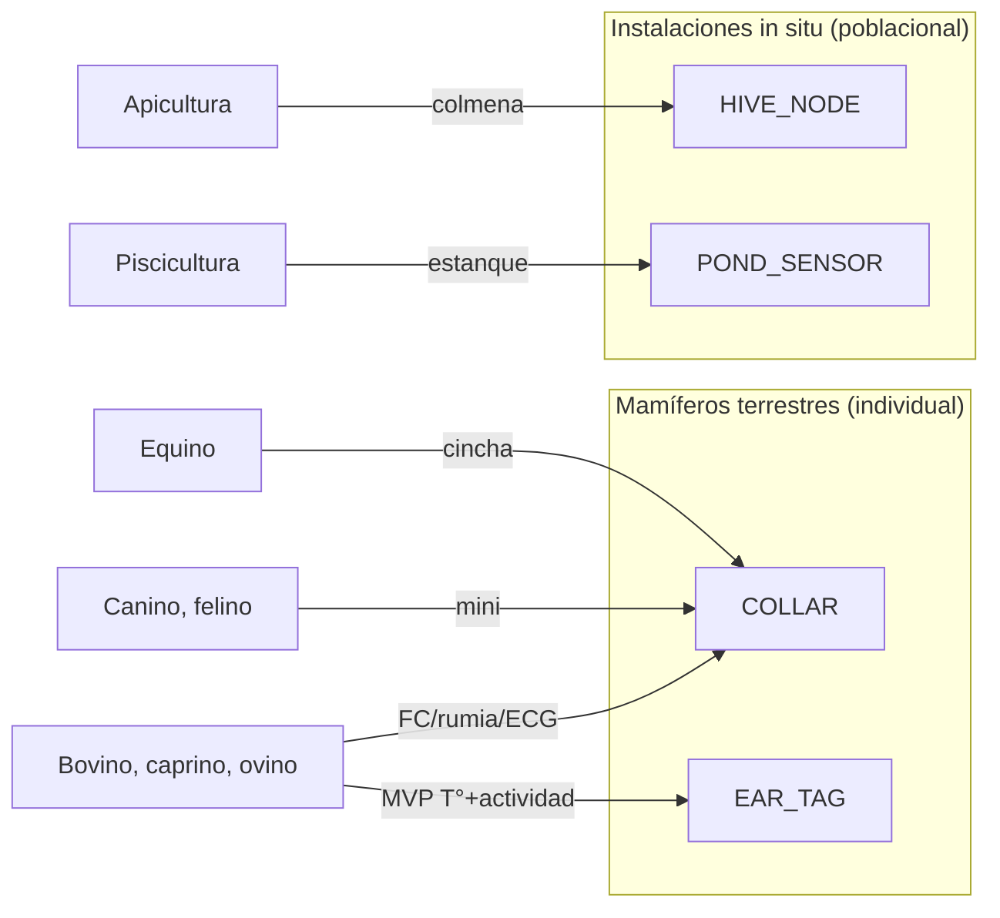

# 🐄 UBTN — Casos de Uso por Especie

## Universal Biological Telemetry Node — Análisis de Aplicación Multiespecie

| Campo | Valor |
|-------|-------|
| **Versión** | 1.0.0 (análisis — sin implementación) |
| **Fecha** | 2026-09-13 |
| **Rama** | `feature/ubtn-biological-telemetry` |
| **Estado** | 🔷 Diseño — casos de uso que alimentan canales, forma factor y umbrales (ADR-UBTN-08) |
| **Especies cubiertas** | Bovinos · Caninos · Felinos · Equinos · Caprinos · Ovinos · Apicultura · Piscicultura |

---

## 1. Propósito

Definir **qué se mide, por qué y cómo** para cada línea animal/especie. Cada caso de uso determina:

1. **Canales requeridos** (`SensorChannel` del dominio).
2. **Forma factor** recomendado (`NodeFormFactor` + `PlacementSite`).
3. **Frecuencia de muestreo / telemetría**.
4. **Rangos fisiológicos** de referencia (para calibración — sin implementar).
5. **Alertas de valor** y su severidad.
6. **Nota de MVP**: qué es lo mínimo medible primero.

> ⚠️ Los rangos indicados son **referencias de literatura** listadas para documentar el diseño; **no** se implementan como reglas hasta la investigación calibrada del backlog (RSK-SEN-01).

---

## 2. Variación por Especie — Tabla Maestra

| Especie | Forma factor | Canales prioritarios | Frecuencia típica | Alertas de valor |
|---|---|---|---|---|
| **Bovino** | COLLAR (MVP); RUMP_TAG futuro | BODY_TEMP, HEART_RATE, RUMINATION_INDEX, ACTIVITY | 1/10 min; burst a demanda | Fiebre, hipoactividad, caída de rumia, taquicardia |
| **Canino** | COLLAR (liviano) | BODY_TEMP, HEART_RATE, ACTIVITY, ECG (burst) | 1/5 min; burst ECG/PPG | Fiebre, estrés (FC elevada), hipoactividad, calidad de sueño |
| **Felino** | COLLAR (mini) | BODY_TEMP, HEART_RATE, ACTIVITY, ECG corto | 1/5 min | Fiebre, hipoactividad, esterotipias por actividad |
| **Equino** | COLLAR / cincha | BODY_TEMP, HEART_RATE, RESPIRATORY_RATE, ACTIVITY | 1/5 min; burst en ejercicio | Sobrecarga térmica, taquicardia post-ejercicio, cojera (asimetría IMU) |
| **Caprino** | COLLAR / EAR_TAG | BODY_TEMP, ACTIVITY, RUMINATION_INDEX | 1/10 min | Fiebre, hipoactividad, pérdida de rumia |
| **Ovino** | EAR_TAG / RUMP_TAG | BODY_TEMP, ACTIVITY | 1/15 min | Fiebre, hipoactividad (proxy de morbilidad en rebaño) |
| **Apicultura** | HIVE_NODE (in situ) | HIVE_TEMP, HUMIDITY, HIVE_WEIGHT, (ACOUSTIC futuro) | 1/5 min | Enjambrazón (peso/temperatura), pérdida de colonia, estrés térmico |
| **Piscicultura** | POND_SENSOR (boya/lanza) | WATER_TEMP, PH, DISSOLVED_O2, TURBIDITY | 1/5 min; alta en eventos | Caída de O₂, salto de pH, estrés térmico, densidades peligrosas |

---

## 3. Caso de Uso — Bovinos (línea MVP recomendada)

> **Prioridad estratégica:** el MVP UBTN apunta aquí (temperatura corporal, ADR-UBTN-05).

| Aspecto | Detalle |
|---|---|
| Meta | Detección temprana de fiebre, cojera incipiente, celo (secundario), estrés térmico |
| Canales | BODY_TEMP (collar: offset por sitio), HEART_RATE (ECG/PPG), RUMINATION_INDEX, ACTIVITY |
| Forma factor | COLLAR sobre cuello (BODY_TEMP = temperatura de piel con offset calibrado; validar con referencia rectal) |
| Rango referencia BOVINE | T° 37.5–39.1 °C; FC 48–84 bpm (adulto, reposo); rumia 8–12 periodos/24 h |
| Alertas | Fiebre (T° sostenida > umbral especie+individuo), hipoactividad, caída de rumia, taquicardia sostenida |
| MVP | 💠 **Temperatura corporal → alerta de fiebre** (end-to-end U7) |
| Particularidades | El sensor de temperatura más confiable es el interno (bolo ruminal futuro) o arete; el collar mide piel → requiere tabla de offset por individuo/sitio (RSK-SEN-02) |

---

## 4. Caso de Uso — Caninos y Felinos (Compañía / Trabajo)

| Aspecto | Detalle |
|---|---|
| Meta | Vigilancia de salud, detección de fiebre, niveles de actividad/estrés (perros de trabajo, mascotas en hogares rurales) |
| Canales | BODY_TEMP, HEART_RATE, ACTIVITY, ECG (burst corto), SpO₂ (opcional) |
| Forma factor | COLLAR mini (canino/felino); fijación en interior de oreja NO recomendada en MVP (invasiva) |
| Rango referencia | CANINE T° 37.5–39.2 °C, FC 60–140 bpm; FELINE T° 38.1–39.2 °C, FC 120–220 bpm |
| Alertas | Fiebre, taquicardia sostenida (estrés), hipoactividad / esterotipias |
| MVP | T° + actividad; ECG como paso posterior (TinyML de morfología) |
| Particularidades | Nodos livianos; la IMU permite detectar temblores y actividad atípica; calidad de PPG difícil por pelaje → ECG preferible para FC (RSK-SEN-03) |

---

## 5. Caso de Uso — Equinos

| Aspecto | Detalle |
|---|---|
| Meta | Monitoreo durante trabajo/carga, detección de sobrecalentamiento y cojeras, salud post-ejercicio |
| Canales | BODY_TEMP, HEART_RATE, RESPIRATORY_RATE, ACTIVITY + IMU asimetría |
| Forma factor | COLLAR o cincha pectoral (para FC/FR) |
| Rango referencia | EQUINE T° 37.2–38.3 °C, FC 28–48 bpm (reposo) → hasta 120-150 en ejercicio, FR 8–16 resp/min |
| Alertas | Hipertermia por ejercicio, taquicardia refractaria al reposo, arritmias (ECG burst), asimetría de paso (cojera) |
| MVP | T° + HT post-ejercicio; ECG burst para evaluación de arritmias |
| Particularidades | Conservar capacidad de ráfaga (ECG 250-500 SPS) — presupuesto energético crítico (RSK-ENE-01) |

---

## 6. Caso de Uso — Caprinos y Ovinos (Rebaño)

| Aspecto | Detalle |
|---|---|
| Meta | Vigilancia de rebaño numeroso: detección temprana de morbilidad y mortalidad (fiebre, inapetencia) sin manejo individual |
| Canales | BODY_TEMP (arete/tag), ACTIVITY, RUMINATION_INDEX |
| Forma factor | EAR_TAG (arete) o RUMP_TAG — menor costo por individuo, mayor densidad de nodos |
| Rango referencia | OVINE T° 38.3–39.9 °C, FC 70–80 bpm; CAPRINE T° 38.5–40.0 °C |
| Alertas | Fiebre, hipoactividad sostenida, caída de rumia; correlación de "señal de rebaño" (n casos simultáneos) |
| MVP | T° con nodo tag (menor costo); despliegue por lotes |
| Particularidades | Densidad de nodos y escalado: el gateway debe manejar N dispositivos; LoRa útil aquí (arcabuco) — ADR-UBTN-12 |

---

## 7. Caso de Uso — Apicultura (nodos de colmena)

| Aspecto | Detalle |
|---|---|
| Meta | Vigilancia de la colmena: temperatura interior, peso (enjambrazón/abastecimiento), humedad, acústica (futuro) |
| Forma factor | HIVE_NODE (nodo fijo en el interior/entrada de la colmena) |
| Canales | HIVE_TEMP, HUMIDITY, HIVE_WEIGHT, ACOUSTIC (futuro) |
| Frecuencia | 1/5-15 min; eventos por cambio de peso súbito |
| Alertas | Enjambrazón (pico de peso + temperatura), pérdida de colonia, estrés térmico, actividad anómala nocturna |
| MVP | HIVE_TEMP + HIVE_WEIGHT (báscula) en 2-3 colmenas |
| Particularidades | Modo "no-individual": el sujeto es la colmena (`FacilityId`); sin biométrica por insecto — el nodo monitoriza variables del hábitat (ADR-UBTN-08) |

---

## 8. Caso de Uso — Piscicultura (boya/lanza de estanque)

| Aspecto | Detalle |
|---|---|
| Meta | Calidad de agua para cultivo: temperatura, oxígeno disuelto, pH, turbidez — prevención de mortandades masivas |
| Forma factor | POND_SENSOR (boya sumergible / lanza con sonda) |
| Canales | WATER_TEMP, PH, DISSOLVED_O2, TURBIDITY |
| Frecuencia | 1/5 min; alertas inmediatas en eventos críticos |
| Valores objetivo (tilapia) | T° 26–30 °C, DO ≥ 4 mg/L (crítico < 2), pH 6.5–8.5 |
| Alertas | Caída de O₂ (mortandad nocturna), salto de pH, estrés térmico, turbidez |
| MVP | WATER_TEMP + DO (+PH) en un estanque |
| Particularidades | Energía: boya con panel solar (RSK-ENE-02); el sujeto es el estanque/lote (`FacilityId`); el enlace puede necesitar LoRa a la casa/productor |

---

## 9. Síntesis: Selección de Forma Factor y Canales (ADR-UBTN-08)

**Conclusión de diseño:** el subdominio soporta dos familias de "sujeto": **individuo** (mamíferos; `AnimalSubject`) e **instalación/lote** (apícola/piscícola; `FacilityId`). El *MVP* de individuo (bovino, T°) y el de instalación (colmena o estanque) pueden desarrollarse en paralelo porque comparten agregados (`BiologicalReading`/`BiologicalNode`) y difieren solo en canales y forma factor (ADR-UBTN-08).

---

## 10. Alertas (diseño de severidad)

| Severidad | Ejemplo | Acción sugerida |
|---|---|---|
| 🔵 Informativa | Nivel de actividad bajo durante la noche | Registro, sin notificación |
| 🟡 Vigilar | T° en borde superior del rango | Notificación al productor; sugerir medición manual |
| 🟠 Alertar | T° sostenida > umbral especie | Alerta inmediata al operario/veterinario |
| 🔴 Urgente | Caída de O₂ < crítico (piscicultura) | Alarma instantánea + procedimiento de emergencia |

*La severidad se resuelve en el `PhysiologicalThresholdService` + `BioAlertPort`, no en el contrato de datos (U3).*

---

## 11. Decisiones Registradas (ADR)

| ID | Decisión | Alternativa rechazada | Justificación |
|---|---|---|---|
| ADR-UBTN-08 | Formalizar forma factor + `FacilityId` para casos población (api/acuícola) | Modelar solo individuos | Cubre las 8 líneas sin romper el subdominio; un solo agregado para dos familias de sujeto |

---

## 12. Referencias

- [`UBTN_DOMAIN_MODEL.md`](UBTN_DOMAIN_MODEL.md) — VOs, canales, formas factor.
- [`UBTN_DATA_CONTRACTS.md`](UBTN_DATA_CONTRACTS.md) — serialización de los canales por caso.
- [`UBTN_ROADMAP.md`](UBTN_ROADMAP.md) — mapeo de casos a fases.
- [`UBTN_RISK_ANALYSIS.md`](UBTN_RISK_ANALYSIS.md) — RSK-SEN-01/02/03, RSK-REG-03.

---

*Análisis de casos de uso — sin implementación. Rangos de referencia a calibrar (backlog de investigación).*