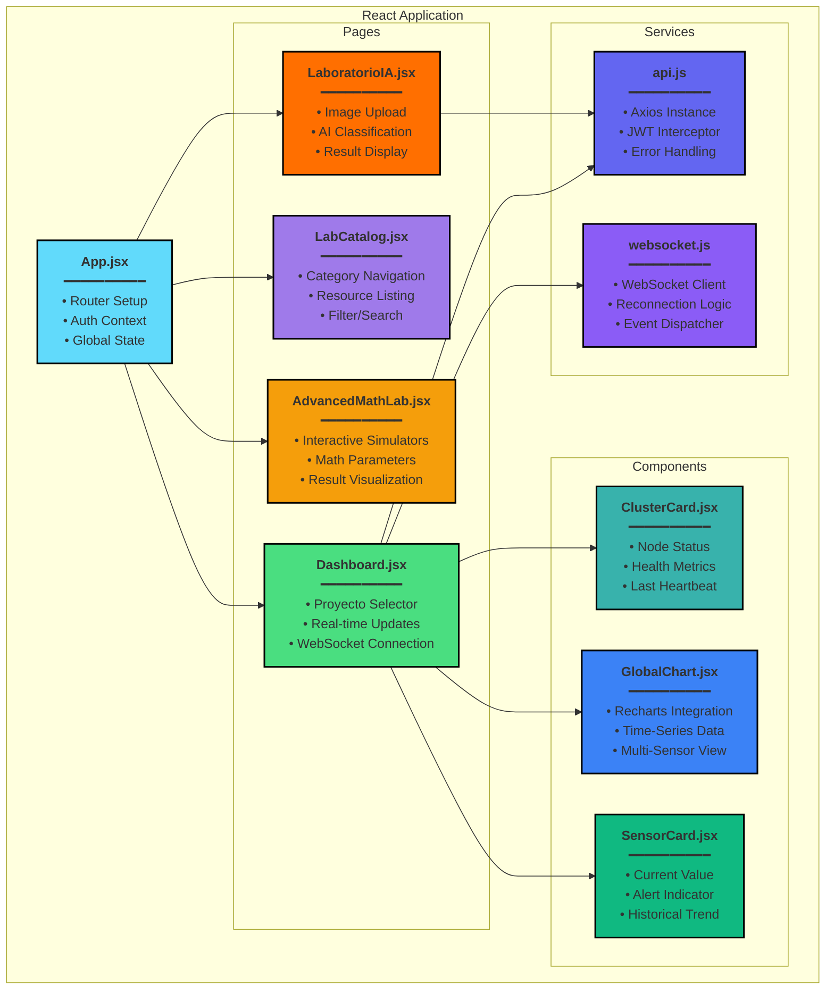
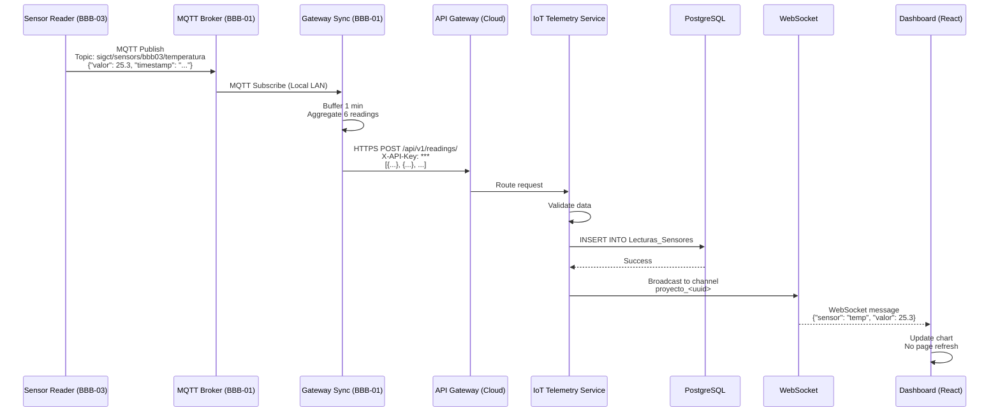

# 🌾 SIGC&T Rural - Documento de Arquitectura de Software (DAS)

**Sistema Integrado de Gestión en Ciencia y Tecnología Rural**  
*Proyecto Productivo para el programa de formación en el SENA en Análisis y Desarrollo de Software (ADSO)*

<div align="center">


</div>

---

## ðŸ"‹ Información del Documento

| Campo | Valor |
|-------|-------|
| **Versión** | 4.3 |
| **Estado** | Arquitectura Definitiva |
| **Fecha** | 14-Nov-2025 |
| **Autor** | B. Gómez (Asistente: Claude AI) |
| **Formato** | Markdown + Mermaid (GitHub) |

---

## ðŸ"' Tabla de Contenidos

- [1. Visión y Alcance](#1-visi%C3%B3n-y-alcance)
  - [1.1. Propósito del Sistema](#11-prop%C3%B3sito-del-sistema)
  - [1.2. Objetivos del Negocio](#12-objetivos-del-negocio)
  - [1.3. Alcance y Límites](#13-alcance-y-l%C3%ADmites)
  - [1.4. Actores y Roles](#14-actores-y-roles)
- [2. Vistas de Arquitectura (Modelo C4)](#2-vistas-de-arquitectura-modelo-c4)
  - [2.1. Vista de Contexto del Sistema](#21-vista-de-contexto-del-sistema)
  - [2.2. Vista de Contenedores](#22-vista-de-contenedores)
  - [2.3. Vista de Componentes](#23-vista-de-componentes)
  - [2.4. Vista de Despliegue](#24-vista-de-despliegue)
- [3. Vista de Casos de Uso](#3-vista-de-casos-de-uso)
- [4. Vista de Datos](#4-vista-de-datos)
  - [4.1. Modelo Entidad-Relación](#41-modelo-entidad-relaci%C3%B3n)
  - [4.2. Diccionario de Datos](#42-diccionario-de-datos)
- [5. Vista de Implementación](#5-vista-de-implementaci%C3%B3n)
  - [5.1. Estructura del Repositorio](#51-estructura-del-repositorio)
  - [5.2. Backend (Cloud)](#52-backend-cloud)
  - [5.3. Frontend (Cloud)](#53-frontend-cloud)
  - [5.4. Edge Computing](#54-edge-computing)
- [6. Arquitectura de Inteligencia Artificial](#6-arquitectura-de-inteligencia-artificial)
  - [6.1. Pipeline de Entrenamiento](#61-pipeline-de-entrenamiento)
  - [6.2. Pipeline de Inferencia Híbrida](#62-pipeline-de-inferencia-h%C3%ADbrida)
  - [6.3. Modelo Seleccionado](#63-modelo-seleccionado)
- [7. Infraestructura y Servicios](#7-infraestructura-y-servicios)
  - [7.1. Redis (Caché)](#71-redis-cach%C3%A9)
  - [7.2. Celery (Tareas Asíncronas)](#72-celery-tareas-as%C3%ADncronas)
  - [7.3. S3/MinIO (Almacenamiento)](#73-s3minio-almacenamiento)
  - [7.4. API Gateway (Nginx)](#74-api-gateway-nginx)
- [8. Recursos y Referencias](#8-recursos-y-referencias)

---

# 1. Visión y Alcance

## 1.1. Propósito del Sistema

**SIGC&T Rural** es una plataforma web híbrida (Cloud/Edge) de propósito académico, científico y social que impulsa la educación técnica aplicada al campo colombiano mediante la integración de:

- 🌱 **Monitoreo agrícola inteligente** con IoT y sensores embebidos
- 🤖 **Diagnóstico de enfermedades de plantas** mediante Inteligencia Artificial
- ðŸ"š **Ecosistema educativo abierto** con recursos digitales y laboratorios virtuales
- ðŸ"¬ **Laboratorio de hardware embebido** (Clúster BeagleBone Black de 3 nodos)
- â˜ï¸ **Arquitectura híbrida Cloud-Edge** para procesamiento distribuido

El sistema actúa como un **laboratorio digital accesible** desde cualquier institución educativa o centro rural, permitiendo experimentación científica remota, toma de decisiones basadas en datos, y formación técnica de calidad.

### 🌠Impacto Social

El proyecto se alinea con los **Objetivos de Desarrollo Sostenible (ODS)**:

- **ODS 2**: Hambre Cero - Optimización de producción agrícola
- **ODS 4**: Educación de Calidad - Formación técnica abierta
- **ODS 9**: Industria, Innovación e Infraestructura - Tecnología rural
- **ODS 17**: Alianzas para lograr los objetivos - Colaboración institucional

---

## 1.2. Objetivos del Negocio

### Objetivos Académicos (SENA - Proyecto Productivo ADSO)

| ID | Objetivo | Descripción | Criterio de Éxito |
|----|----------|-------------|-------------------|
| **O-01** | Dashboard Centralizado | Proveer visualización web de datos de sensores en tiempo real | Dashboard funcional con latencia <2s |
| **O-02** | Modelo de IA | Implementar clasificación de enfermedades de plantas con alta precisión | Accuracy >85% en dataset de validación |
| **O-03** | Laboratorio Hardware | Establecer clúster de 3 BeagleBone Black operacional | 3 nodos comunicados vía MQTT/HTTP |
| **O-04** | Biblioteca Educativa | Crear repositorio de recursos educativos curados | Mínimo 20 recursos categorizados |
| **O-05** | Cumplimiento ADSO | Entregar artefactos completos del Proyecto Productivo | 100% de entregables aprobados |

### Objetivos Técnicos

- **Arquitectura Escalable**: Sistema capaz de soportar 100+ nodos Edge sin degradación
- **Alta Disponibilidad**: Uptime >99% en componentes Cloud
- **Seguridad**: Implementar autenticación JWT, encriptación HTTPS/TLS
- **Documentación**: Cobertura completa de código, APIs y procesos

---

## 1.3. Alcance y Límites

### ✅ Dentro del Alcance

<table>
<tr>
<td width="50%">

**Cloud (Plataforma Web)**

- Frontend React responsive (mobile-first)
- Backend Django con API RESTful
- Base de datos PostgreSQL + PostGIS
- Autenticación y autorización (roles)
- Dashboard con gráficos en tiempo real
- Sistema de alertas (email/push)
- Módulo de IA (inferencia cloud)
- CRUD de contenido académico
- **Redis** para caché y sessions
- **Celery** para tareas asíncronas
- **S3/MinIO** para almacenamiento de objetos

</td>
<td width="50%">

**Edge (Laboratorio Físico)**

- Clúster 3x BeagleBone Black Rev C
- Broker MQTT (Mosquitto)
- Lectura de sensores (DHT22, humedad suelo)
- Captura de imágenes (cámara USB)
- Inferencia local con TensorFlow Lite
- Sincronización cloud automática
- Lógica de "store-and-forward"

</td>
</tr>
</table>

**Inteligencia Artificial**

- Modelo CNN para clasificación de enfermedades
- Dataset: PlantVillage (tomate, papa, pimiento)
- Transfer Learning con MobileNetV2
- Modelos: `.h5` (cloud) y `.tflite` (edge)
- Pipeline de reentrenamiento documentado

**Contenido Educativo**

- Cursos sobre IoT, IA, agricultura 4.0
- Videos tutoriales (embebidos de YouTube)
- Laboratorios virtuales interactivos
- Documentación técnica completa
- Enlaces a recursos externos (SENA, PlantVillage, etc.)

### ⌠Fuera del Alcance

- âš ï¸ Creación de hardware personalizado (PCBs, sensores propios)
- âš ï¸ Aplicación móvil nativa (iOS/Android) - solo web responsive
- âš ï¸ Integración directa con SofiaPlus del SENA (fase futura)
- âš ï¸ Comercialización del producto o soporte empresarial
- âš ï¸ Procesamiento de pagos o e-commerce
- âš ï¸ Soporte 24/7 en producción

---

## 1.4. Actores y Roles

| Actor | Rol | Descripción | Interacciones Principales |
|-------|-----|-------------|---------------------------|
| ðŸ'¨â€ðŸŒ¾ **Agricultor** | Usuario Final | Propietario/operador de cultivo que monitorea producción | • Ver Dashboard de su proyecto<br>• Recibir alertas de anomalías<br>• Solicitar análisis IA de imágenes<br>• Consultar históricos |
| ðŸŽ" **Estudiante SENA** | Aprendiz | Usuario que consume contenido educativo y experimenta | • Acceder a Biblioteca de Cursos<br>• Usar Laboratorios Virtuales<br>• Ver tutoriales y videos<br>• Descargar recursos (PDFs, datasets) |
| ðŸ'¨â€ðŸ'¼ **Administrador** | Gestor del Sistema | B. Gómez - Mantiene plataforma y contenido | • CRUD de Contenido Académico<br>• Gestión de usuarios<br>• Ver logs y métricas<br>• Configurar nodos Edge |
| ðŸ–¥ï¸ **Clúster BBB** | Sistema Externo (Hardware) | 3 nodos BeagleBone Black en red local | • Enviar telemetría vía MQTT<br>• Ejecutar inferencia IA local<br>• Sincronizar con Cloud<br>• Reportar estado (health checks) |
| 🌠**PlantVillage** | Sistema Externo (Datos) | Repositorio académico de Penn State University | • N/A (uso offline)<br>• Fuente de datasets de entrenamiento |

---

# 2. Vistas de Arquitectura (Modelo C4)

## 2.1. Vista de Contexto del Sistema

**Nivel 1 C4**: Muestra el sistema como "caja negra" y sus interacciones con actores y sistemas externos.

```mermaid
graph TD
    subgraph "ðŸ'¥ Actores Humanos"
        direction TB
        actor1[ðŸ'¨â€ðŸŒ¾ Agricultor<br/>Monitorea cultivos]
        actor2[ðŸŽ" Estudiante SENA<br/>Aprende y experimenta]
        actor3[ðŸ'¨â€ðŸ'¼ Administrador<br/>Gestiona plataforma]
    end

    subgraph "🌾 Sistema SIGC&T Rural"
        direction LR
        C4_Context["<b>Plataforma Web Híbrida</b><br/>Cloud + Edge<br/>━━━━━━━━━━━<br/>• Dashboard IoT<br/>• IA para diagnóstico<br/>• Biblioteca educativa<br/>• Gestión de nodos"]
    end

    subgraph "ðŸ"— Sistemas Externos"
        direction TB
        C4_Sys_BBB["ðŸ–¥ï¸ <b>Clúster 3-BBB</b><br/>Hardware Edge<br/>━━━━━━━━━━━<br/>• Sensores IoT<br/>• Cámara<br/>• IA local TFLite"]
        C4_Sys_PV["🌠<b>PlantVillage</b><br/>Penn State Univ.<br/>━━━━━━━━━━━<br/>• Datasets plantas<br/>• Imágenes etiquetadas"]
        C4_Sys_SENA["ðŸ"š <b>SENA SofiaPlus</b><br/>Plataforma SENA<br/>━━━━━━━━━━━<br/>• Integración futura<br/>• SSO potencial"]
    end

    actor1 -- "Consulta Dashboard<br/>Recibe Alertas<br/>(HTTPS)" --> C4_Context
    actor2 -- "Consume Cursos<br/>Usa Labs Virtuales<br/>(HTTPS)" --> C4_Context
    actor3 -- "Administra<br/>Contenido/Usuarios<br/>(HTTPS)" --> C4_Context
    
    C4_Context -- "Descarga Datasets<br/>(Offline, HTTP)" --> C4_Sys_PV
    C4_Sys_BBB -- "Envía Telemetría<br/>(MQTT/HTTPS)<br/>Sube Imágenes" --> C4_Context
    
    C4_Context -. "Integración Futura<br/>(OAuth 2.0)" .-> C4_Sys_SENA

    style C4_Context fill:#2e8b57,stroke:#fff,stroke-width:3px,color:#fff
    style C4_Sys_BBB fill:#ff6f00,stroke:#fff,stroke-width:2px
    style C4_Sys_PV fill:#4285f4,stroke:#fff,stroke-width:2px
    style C4_Sys_SENA fill:#ffd700,stroke:#333,stroke-width:2px
```

---

## 2.2. Vista de Contenedores

**Nivel 2 C4**: Descompone el sistema en sus componentes principales (contenedores de software).

```mermaid
graph TB
    subgraph "🌠Internet / Usuarios"
        actor1["ðŸ'¤ Usuario Final<br/>(Navegador Web)<br/>Chrome / Firefox / Safari"]
    end

    subgraph "â˜ï¸ Cloud Infrastructure (Render / Railway)"
        direction TB
        
        subgraph "Frontend Layer"
            WebApp["âš›ï¸ <b>React SPA</b><br/>━━━━━━━━━━<br/>• Vite Build<br/>• TailwindCSS<br/>• React Router<br/>• Axios Client<br/>• WebSocket Client"]
        end
        
        subgraph "Backend Layer"
            direction LR
            
            APIGateway["🚪 <b>API Gateway</b><br/>━━━━━━━━━━<br/>• Nginx Reverse Proxy<br/>• Rate Limiting<br/>• SSL Termination"]
            
            subgraph "Django Services"
                direction TB
                AuthService["ðŸ"' <b>Auth Service</b><br/>━━━━━━━━━━<br/>• JWT Authentication<br/>• User Management<br/>• Role-Based Access"]
                
                APIServer["ðŸ"¡ <b>API Service</b><br/>━━━━━━━━━━<br/>• Django REST Framework<br/>• Proyectos CRUD<br/>• Nodos/Sensores CRUD<br/>• Lecturas IoT"]
                
                IoTService["ðŸ"¡ <b>IoT Telemetry</b><br/>━━━━━━━━━━<br/>• MQTT Bridge<br/>• Data Validation<br/>• Time-Series Storage<br/>• WebSocket Broadcast"]
                
                ImageService["ðŸ–¼ï¸ <b>Image Processing</b><br/>━━━━━━━━━━<br/>• Upload Handler<br/>• Validation<br/>• Resize/Optimize<br/>• S3 Upload"]
                
                LabsService["🧪 <b>Labs Service</b><br/>━━━━━━━━━━<br/>• Contenido Académico<br/>• Laboratorios Virtuales<br/>• CRUD Recursos"]
            end
            
            AIService["🤖 <b>AI Service</b><br/>━━━━━━━━━━<br/>• TensorFlow Serving<br/>• Modelo .h5<br/>• Endpoint /classify/<br/>• Result Storage"]
            
            WorkerService["âš™ï¸ <b>Celery Workers</b><br/>━━━━━━━━━━<br/>• Async Tasks<br/>• Email Notifications<br/>• Data Aggregation<br/>• Scheduled Jobs"]
        end
        
        subgraph "Data & Cache Layer"
            direction LR
            
            Database[("ðŸ'¾ <b>PostgreSQL 15</b><br/>+ PostGIS<br/>━━━━━━━━━━<br/>• Usuarios<br/>• Proyectos<br/>• Nodos/Sensores<br/>• Lecturas (TSDB)<br/>• Análisis IA<br/>• Contenido")]
            
            Redis[("ðŸ"´ <b>Redis 7</b><br/>━━━━━━━━━━<br/>• Session Cache<br/>• Query Cache<br/>• Celery Broker<br/>• Rate Limit Store")]
            
            S3Storage[("ðŸ"¦ <b>S3 / MinIO</b><br/>━━━━━━━━━━<br/>• Imágenes Usuarios<br/>• Modelos IA (.h5)<br/>• Logs Persistentes<br/>• Backups DB")]
        end
    end

    subgraph "ðŸ  Edge Computing (Laboratorio - LAN)"
        direction TB
        
        subgraph "BBB-01: Gateway Node"
            MQTT_Broker["ðŸ"¡ <b>Mosquitto MQTT</b><br/>━━━━━━━━━━<br/>• Broker Local<br/>• Port 1883<br/>• Topic Management"]
            
            Gateway_Sync["ðŸ"„ <b>Sync Service</b><br/>━━━━━━━━━━<br/>• MQTT Subscriber<br/>• Store-and-Forward<br/>• HTTPS Client<br/>• Systemd Daemon"]
        end
        
        subgraph "BBB-02: IA Edge Node"
            Edge_AI_API["🧠 <b>Flask API</b><br/>━━━━━━━━━━<br/>• /classify_local<br/>• Port 5000<br/>• TensorFlow Lite"]
            
            TFLite_Model["ðŸ"¦ <b>Model TFLite</b><br/>━━━━━━━━━━<br/>• model.tflite<br/>• labels.txt<br/>• ARM Optimized"]
        end
        
        subgraph "BBB-03: Sensor Node"
            Sensor_Reader["ðŸ"¡ <b>Sensor Reader</b><br/>━━━━━━━━━━<br/>• Adafruit_BBIO<br/>• DHT22 Driver<br/>• ADC Reader<br/>• MQTT Publisher"]
            
            Camera_Service["ðŸ"· <b>Camera Capture</b><br/>━━━━━━━━━━<br/>• OpenCV<br/>• V4L2 Driver<br/>• HTTP POST<br/>• Scheduled (30min)"]
        end
    end

    %% Conexiones Usuario - Frontend
    actor1 -- "HTTPS:443<br/>TLS 1.3" --> WebApp
    
    %% Conexiones Frontend - Backend
    WebApp -- "REST API<br/>HTTPS" --> APIGateway
    WebApp -- "WebSocket<br/>WSS" --> APIGateway
    
    %% API Gateway a Servicios
    APIGateway --> AuthService
    APIGateway --> APIServer
    APIGateway --> IoTService
    APIGateway --> ImageService
    APIGateway --> LabsService
    APIGateway --> AIService
    
    %% Servicios a Base de Datos
    AuthService -- "SQL" --> Database
    APIServer -- "SQL" --> Database
    IoTService -- "SQL<br/>(TSDB)" --> Database
    ImageService -- "SQL" --> Database
    LabsService -- "SQL" --> Database
    AIService -- "SQL" --> Database
    
    %% Servicios a Redis
    AuthService -- "Session<br/>Cache" --> Redis
    APIServer -- "Query<br/>Cache" --> Redis
    IoTService -- "Pub/Sub" --> Redis
    
    %% Servicios a S3
    ImageService -- "Upload<br/>Images" --> S3Storage
    AIService -- "Load<br/>Models" --> S3Storage
    
    %% Celery
    APIServer -- "Queue<br/>Tasks" --> Redis
    Redis -- "Consume<br/>Tasks" --> WorkerService
    WorkerService -- "Read/Write" --> Database
    
    %% Edge - Gateway
    Sensor_Reader -- "MQTT Publish<br/>sigct/sensors/#" --> MQTT_Broker
    Camera_Service -- "HTTP POST<br/>Image Binary" --> Edge_AI_API
    
    Edge_AI_API -- "TFLite<br/>Inference" --> TFLite_Model
    Edge_AI_API -- "MQTT Publish<br/>sigct/ai/results" --> MQTT_Broker
    
    MQTT_Broker -- "Subscribe<br/>All Topics" --> Gateway_Sync
    
    %% Edge - Cloud
    Gateway_Sync -- "HTTPS POST<br/>/api/v1/readings/<br/>X-API-Key" --> APIGateway
    
    %% Estilos
    style WebApp fill:#61dafb,stroke:#000,stroke-width:2px
    style APIGateway fill:#4a5568,stroke:#fff,stroke-width:2px,color:#fff
    style AuthService fill:#805ad5,stroke:#fff,stroke-width:2px,color:#fff
    style APIServer fill:#0c4b33,stroke:#fff,stroke-width:2px,color:#fff
    style IoTService fill:#ed8936,stroke:#fff,stroke-width:2px,color:#fff
    style ImageService fill:#38b2ac,stroke:#fff,stroke-width:2px,color:#fff
    style LabsService fill:#9f7aea,stroke:#fff,stroke-width:2px,color:#fff
    style AIService fill:#ff6f00,stroke:#fff,stroke-width:2px
    style WorkerService fill:#e53e3e,stroke:#fff,stroke-width:2px,color:#fff
    style Database fill:#336791,stroke:#fff,stroke-width:2px,color:#fff
    style Redis fill:#dc2626,stroke:#fff,stroke-width:2px,color:#fff
    style S3Storage fill:#f59e0b,stroke:#000,stroke-width:2px
    style MQTT_Broker fill:#3c5a99,stroke:#fff,stroke-width:2px,color:#fff
    style Gateway_Sync fill:#ffa500,stroke:#000,stroke-width:2px
    style Edge_AI_API fill:#000,stroke:#fff,stroke-width:2px,color:#fff
    style TFLite_Model fill:#ff6f00,stroke:#fff,stroke-width:2px
    style Sensor_Reader fill:#4444ff,stroke:#fff,stroke-width:2px,color:#fff
    style Camera_Service fill:#06b6d4,stroke:#fff,stroke-width:2px,color:#fff
```

### Descripción de Contenedores

| Contenedor | Tecnología | Propósito | Puerto | Dependencias |
|------------|------------|-----------|--------|--------------|
| **React SPA** | Vite + React 18 + TailwindCSS | Interfaz de usuario, renderizado en navegador | 443 (HTTPS) | API Gateway |
| **API Gateway** | Nginx 1.24 | Reverse proxy, SSL termination, rate limiting | 443 → 8000 | Todos los servicios Django |
| **Auth Service** | Django 4 + JWT | Autenticación, autorización, gestión de usuarios | 8000 (interno) | PostgreSQL, Redis |
| **API Service** | Django REST Framework | CRUD de Proyectos, Nodos, Sensores, Lecturas | 8000 (interno) | PostgreSQL, Redis |
| **IoT Telemetry** | Django Channels + WebSockets | Recepción MQTT, broadcast en tiempo real | 8000 (interno) | PostgreSQL, Redis |
| **Image Processing** | Django + Pillow | Validación, resize, upload a S3 | 8000 (interno) | PostgreSQL, S3 |
| **Labs Service** | Django REST Framework | Gestión de contenido académico | 8000 (interno) | PostgreSQL |
| **AI Service** | TensorFlow 2.15 + Keras | Inferencia de modelos de clasificación | 8000 (interno) | PostgreSQL, S3 |
| **Celery Workers** | Celery 5 + Python | Tareas asíncronas (emails, agregación) | N/A | PostgreSQL, Redis |
| **PostgreSQL** | PostgreSQL 15 + PostGIS | Almacenamiento persistente relacional | 5432 (interno) | - |
| **Redis** | Redis 7 | Cache, session store, Celery broker | 6379 (interno) | - |
| **S3 / MinIO** | AWS S3 / MinIO | Almacenamiento de objetos (imágenes, modelos) | 443 / 9000 | - |
| **Mosquitto MQTT** | Mosquitto 2.x | Broker MQTT local en Edge | 1883 (LAN) | - |
| **Gateway Sync** | Python 3.10 + Paho-MQTT | Sincronización Edge → Cloud | N/A | MQTT Broker, API Gateway |
| **Flask IA Edge** | Flask + TensorFlow Lite | Inferencia local de baja latencia | 5000 (LAN) | TFLite Model |
| **Sensor Reader** | Python + Adafruit_BBIO | Lectura de sensores físicos | N/A | MQTT Broker |
| **Camera Capture** | Python + OpenCV | Captura y envío de imágenes | N/A | Flask IA Edge |

---

## 2.3. Vista de Componentes

**Nivel 3 C4**: Descompone los contenedores principales en sus componentes internos.

### Frontend (React) - Componentes



### Backend (Django) - Componentes

```mermaid
graph TB
    subgraph "Django Backend Services"
        direction TB
        
        subgraph "Auth Service Components"
            AuthViews["<b>AuthViews</b><br/>━━━━━━━━━━<br/>• RegisterView<br/>• LoginView<br/>• RefreshTokenView"]
            
            AuthSerializers["<b>Serializers</b><br/>━━━━━━━━━━<br/>• UserSerializer<br/>• TokenSerializer<br/>• RegisterSerializer"]
            
            CustomUser["<b>CustomUser Model</b><br/>━━━━━━━━━━<br/>• AbstractUser<br/>• Role Field<br/>• Permissions"]
        end
        
        subgraph "API Service Components"
            APIViews["<b>ViewSets</b><br/>━━━━━━━━━━<br/>• ProyectoViewSet<br/>• NodoViewSet<br/>• SensorViewSet<br/>• LecturaViewSet"]
            
            APISerializers["<b>Serializers</b><br/>━━━━━━━━━━<br/>• ProyectoSerializer<br/>• NodoSerializer<br/>• LecturaSensorSerializer"]
            
            APIModels["<b>Models</b><br/>━━━━━━━━━━<br/>• Proyecto<br/>• NodoEdge<br/>• Sensor<br/>• LecturaSensor"]
            
            Filters["<b>Filters</b><br/>━━━━━━━━━━<br/>• DjangoFilterBackend<br/>• Date Range<br/>• Sensor Type"]
            
            Permissions["<b>Permissions</b><br/>━━━━━━━━━━<br/>• IsOwnerOrAdmin<br/>• IsAuthenticated<br/>• RoleBasedAccess"]
        end
        
        subgraph "IoT Telemetry Components"
            IoTConsumer["<b>WebSocket Consumer</b><br/>━━━━━━━━━━<br/>• Django Channels<br/>• Group Management<br/>• Broadcast Updates"]
            
            IoTViews["<b>Telemetry Views</b><br/>━━━━━━━━━━<br/>• CreateReadingView<br/>• LatestReadingsView<br/>• HistoricalDataView"]
            
            MQTTBridge["<b>MQTT Bridge</b><br/>━━━━━━━━━━<br/>• Paho-MQTT Client<br/>• Topic Subscriber<br/>• Data Validator"]
        end
        
        subgraph "Image Processing Components"
            ImageUpload["<b>Upload Handler</b><br/>━━━━━━━━━━<br/>• File Validation<br/>• Size Check<br/>• Format Check"]
            
            ImageProcessor["<b>Processor</b><br/>━━━━━━━━━━<br/>• Pillow Resize<br/>• Optimization<br/>• Thumbnail Gen"]
            
            S3Uploader["<b>S3 Uploader</b><br/>━━━━━━━━━━<br/>• Boto3 Client<br/>• Presigned URLs<br/>• Error Handling"]
        end
        
        subgraph "AI Service Components"
            AIViews["<b>AI Views</b><br/>━━━━━━━━━━<br/>• ClassifyView<br/>• AnalysisListView<br/>• FeedbackView"]
            
            InferenceEngine["<b>Inference Engine</b><br/>━━━━━━━━━━<br/>• TensorFlow Model<br/>• Preprocessing<br/>• Postprocessing"]
            
            AIModels["<b>AI Models</b><br/>━━━━━━━━━━<br/>• AnalisisIA<br/>• ModelMetadata<br/>• FeedbackLog"]
        end
        
        subgraph "Labs Service Components"
            LabsViews["<b>Labs Views</b><br/>━━━━━━━━━━<br/>• ContenidoViewSet<br/>• CategoryListView<br/>• ResourceDetailView"]
            
            LabsModels["<b>Labs Models</b><br/>━━━━━━━━━━<br/>• ContenidoAcademico<br/>• Category<br/>• Tag"]
        end
        
        subgraph "Celery Tasks"
            EmailTasks["<b>Email Tasks</b><br/>━━━━━━━━━━<br/>• send_alert_email<br/>• send_weekly_report<br/>• send_welcome_email"]
            
            DataTasks["<b>Data Tasks</b><br/>━━━━━━━━━━<br/>• aggregate_daily_stats<br/>• cleanup_old_readings<br/>• generate_reports"]
            
            ScheduledTasks["<b>Scheduled Tasks</b><br/>━━━━━━━━━━<br/>• Celery Beat<br/>• Periodic Tasks<br/>• Cron Jobs"]
        end
    end
    
    %% Auth Flow
    AuthViews --> AuthSerializers
    AuthSerializers --> CustomUser
    
    %% API Flow
    APIViews --> APISerializers
    APIViews --> Filters
    APIViews --> Permissions
    APISerializers --> APIModels
    
    %% IoT Flow
    IoTViews --> APIModels
    MQTTBridge --> IoTConsumer
    IoTConsumer --> IoTViews
    
    %% Image Processing Flow
    ImageUpload --> ImageProcessor
    ImageProcessor --> S3Uploader
    
    %% AI Flow
    AIViews --> ImageUpload
    AIViews --> InferenceEngine
    InferenceEngine --> AIModels
    
    %% Labs Flow
    LabsViews --> LabsModels
    
    %% Celery Flow
    APIViews -.->|Queue Tasks| EmailTasks
    AIViews -.->|Queue Tasks| EmailTasks
    ScheduledTasks --> DataTasks
    
    style AuthViews fill:#805ad5,stroke:#fff,stroke-width:2px,color:#fff
    style APIViews fill:#0c4b33,stroke:#fff,stroke-width:2px,color:#fff
    style IoTViews fill:#ed8936,stroke:#fff,stroke-width:2px,color:#fff
    style ImageUpload fill:#38b2ac,stroke:#fff,stroke-width:2px,color:#fff
    style AIViews fill:#ff6f00,stroke:#fff,stroke-width:2px
    style LabsViews fill:#9f7aea,stroke:#fff,stroke-width:2px,color:#fff
    style EmailTasks fill:#e53e3e,stroke:#fff,stroke-width:2px,color:#fff
```



---

## 2.4. Vista de Despliegue

**Diagrama UML de Despliegue**: Muestra la infraestructura física y software desplegado.

```mermaid
graph TB
    subgraph "🌠Cliente (Anywhere)"
        client["ðŸ'» <b>Dispositivo del Usuario</b><br/>━━━━━━━━━━━━━━━<br/>• PC / Laptop<br/>• Tablet / Móvil<br/>• Navegador moderno"]
    end

    subgraph "â˜ï¸ Cloud Infrastructure (PaaS - Render)"
        direction LR
        
        subgraph "🳠Compute Node (Docker Container)"
            direction TB
            artifact_react["ðŸ"¦ <b>frontend-build/</b><br/>━━━━━━━━━━━<br/>• index.html<br/>• bundle.js<br/>• assets/"]
            artifact_django["ðŸ"¦ <b>Django App</b><br/>━━━━━━━━━━━<br/>• Gunicorn WSGI<br/>• Django Channels<br/>• Celery Workers"]
        end
        
        subgraph "ðŸ'¾ Database Node (Managed Service)"
            node_db["ðŸ—„ï¸ <b>PostgreSQL 15</b><br/>━━━━━━━━━━━<br/>• Persistent Volume<br/>• Automated Backups<br/>• Connection Pooling"]
        end
        
        subgraph "ðŸ"´ Cache Node (Managed Service)"
            node_redis["ðŸ"´ <b>Redis 7</b><br/>━━━━━━━━━━━<br/>• In-Memory Cache<br/>• Pub/Sub<br/>• Celery Broker"]
        end
        
        subgraph "ðŸ"¦ Storage Node (S3)"
            node_s3["☁ï¸ <b>AWS S3</b><br/>━━━━━━━━━━━<br/>• Bucket: sigct-rural<br/>• Versioning Enabled<br/>• Lifecycle Policies"]
        end
        
        artifact_django -- "TCP/IP:5432<br/>psycopg2" --> node_db
        artifact_django -- "TCP/IP:6379<br/>redis-py" --> node_redis
        artifact_django -- "HTTPS:443<br/>boto3" --> node_s3
    end

    subgraph "ðŸ  Laboratorio Físico (LAN 192.168.1.x)"
        direction TB
        
        subgraph "ðŸ–¥ï¸ BBB-01 (Gateway Node)"
            hw1["<b>Hardware:</b> BeagleBone Black Rev C<br/><b>OS:</b> Debian 11 (ARM)<br/><b>RAM:</b> 512 MB | <b>Storage:</b> 8GB eMMC"]
            artifact_mqtt["ðŸ"¡ Mosquitto 2.x<br/>━━━━━━━━━━━<br/>• Broker MQTT<br/>• Port 1883"]
            artifact_sync["ðŸ"„ sync_service.py<br/>━━━━━━━━━━━<br/>• Paho-MQTT Client<br/>• Requests Library<br/>• Systemd Service"]
        end
        
        subgraph "ðŸ–¥ï¸ BBB-02 (AI Edge Node)"
            hw2["<b>Hardware:</b> BeagleBone Black Rev C<br/><b>OS:</b> Debian 11 (ARM)<br/><b>RAM:</b> 512 MB | <b>Storage:</b> 16GB µSD"]
            artifact_flask["ðŸŒ¶ï¸ Flask API<br/>━━━━━━━━━━━<br/>• /classify_local<br/>• Port 5000"]
            artifact_tflite["🧠 TensorFlow Lite<br/>━━━━━━━━━━━<br/>• Interpreter ARM<br/>• model.tflite"]
        end
        
        subgraph "ðŸ–¥ï¸ BBB-03 (Sensor Node)"
            hw3["<b>Hardware:</b> BeagleBone Black Rev C<br/><b>OS:</b> Debian 11 (ARM)<br/><b>RAM:</b> 512 MB | <b>Storage:</b> 8GB eMMC"]
            artifact_gpio["âš¡ sensor_reader.py<br/>━━━━━━━━━━━<br/>• Adafruit_BBIO<br/>• DHT22 Driver<br/>• I2C/GPIO"]
            artifact_cam["ðŸ"· camera_capture.py<br/>━━━━━━━━━━━<br/>• OpenCV<br/>• V4L2 Driver"]
        end
    end

    client -- "HTTPS:443<br/>TLS 1.3" --> artifact_react
    client -- "HTTPS:443 + WSS<br/>API Requests" --> artifact_django
    
    artifact_sync -- "HTTPS:443<br/>POST /api/v1/readings/" --> artifact_django
    
    artifact_gpio -- "MQTT:1883<br/>Topic: sigct/sensors/#" --> artifact_mqtt
    artifact_gpio -- "HTTP:5000<br/>POST /classify_local" --> artifact_flask
    artifact_flask -- "MQTT:1883<br/>Topic: sigct/ai/results" --> artifact_mqtt
    
    artifact_cam -.- artifact_gpio

    style client fill:#e1f5fe,stroke:#01579b,stroke-width:2px
    style artifact_react fill:#61dafb,stroke:#000,stroke-width:2px
    style artifact_django fill:#0c4b33,stroke:#fff,stroke-width:2px,color:#fff
    style node_db fill:#336791,stroke:#fff,stroke-width:2px,color:#fff
    style node_redis fill:#dc2626,stroke:#fff,stroke-width:2px,color:#fff
    style node_s3 fill:#f59e0b,stroke:#000,stroke-width:2px
    style artifact_mqtt fill:#3c5a99,stroke:#fff,stroke-width:2px,color:#fff
    style artifact_flask fill:#000,stroke:#fff,stroke-width:2px,color:#fff
    style artifact_tflite fill:#ff6f00,stroke:#fff,stroke-width:2px
```

### Especificaciones de Hardware

| Nodo | Hardware | CPU | RAM | Storage | Red | Función |
|------|----------|-----|-----|---------|-----|---------|
| **BBB-01** | BeagleBone Black Rev C | AM335x 1GHz ARM Cortex-A8 | 512 MB DDR3 | 8GB eMMC | Ethernet 10/100 | Gateway MQTT |
| **BBB-02** | BeagleBone Black Rev C | AM335x 1GHz ARM Cortex-A8 | 512 MB DDR3 | 16GB µSD | Ethernet 10/100 | IA Edge |
| **BBB-03** | BeagleBone Black Rev C | AM335x 1GHz ARM Cortex-A8 | 512 MB DDR3 | 8GB eMMC + µSD | Ethernet 10/100 | Sensores IoT |

---

# 3. Vista de Casos de Uso

## 3.1. Casos de Uso Principales

```mermaid
graph TB
    subgraph "🌾 Sistema SIGC&T Rural"
        U1(("ðŸ"Š Ver Dashboard<br/>de Cultivo"))
        U2(("🚨 Recibir Alertas<br/>de IA"))
        U3(("ðŸ" Solicitar Análisis<br/>IA de Imagen"))
        U4(("ðŸ"š Acceder a Biblioteca<br/>de Cursos"))
        U5(("🧪 Usar Laboratorio<br/>Virtual"))
        U6(("âš™ï¸ Administrar<br/>Contenido"))
        U7(("ðŸ"¡ Enviar Telemetría<br/>de Sensor"))
        U8(("🤖 Reportar Anomalía<br/>IA-Edge"))
    end

    actorA["ðŸ'¨â€ðŸŒ¾<br/><b>Agricultor</b>"]
    actorB["ðŸŽ"<br/><b>Estudiante SENA</b>"]
    actorC["ðŸ'¨â€ðŸ'¼<br/><b>Administrador</b>"]
    actorS["🖥ï¸<br/><b>Clúster BBB</b><br/>(Sistema)"]

    actorA --> U1
    actorA --> U2
    actorA --> U3
    actorB --> U4
    actorB --> U5
    actorC --> U6
    actorC --> U1
    actorS --> U7
    actorS --> U8
    
    U2 -.-> U3
    U7 -.-> U1
    U8 -.-> U2

    style U1 fill:#4caf50,stroke:#000,stroke-width:2px
    style U2 fill:#ff9800,stroke:#000,stroke-width:2px
    style U3 fill:#2196f3,stroke:#000,stroke-width:2px
    style U4 fill:#9c27b0,stroke:#fff,stroke-width:2px,color:#fff
    style U5 fill:#e91e63,stroke:#fff,stroke-width:2px,color:#fff
    style U6 fill:#607d8b,stroke:#fff,stroke-width:2px,color:#fff
    style U7 fill:#ff5722,stroke:#fff,stroke-width:2px,color:#fff
    style U8 fill:#f44336,stroke:#fff,stroke-width:2px,color:#fff
```

## 3.2. Diagramas de Secuencia

### Flujo 1: Telemetría (Edge → Cloud → Dashboard)



### Flujo 2: Análisis IA Cloud (Usuario → Backend)