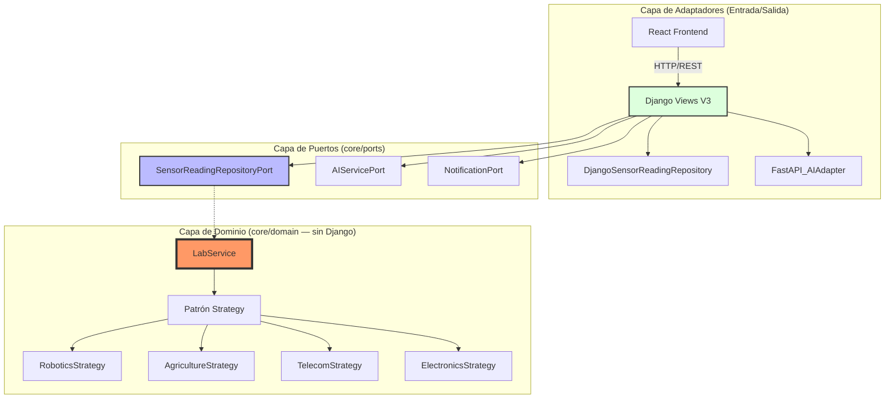
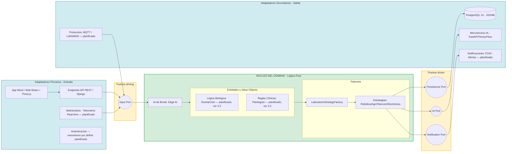

# 📘 MASTERDOC v8 - SIGC&T RURAL / EIARC
## Registro Técnico Profundo y Archivo de Arquitectura

**Sistema Integrado de Gestión del Conocimiento y Tecnología Rural**

---

## 📋 Información del Documento

| Campo | Valor |
|-------|-------|
| **Versión** | 8.0 (Redefinición de alcance documental) |
| **Fecha Creación** | 24 de Enero 2026 |
| **Última Actualización** | 17 de Julio 2026 |
| **Autor Principal** | Bernardo Adolfo Gómez Montoya |
| **Institución** | SENA - Tecnología en ADSO |
| **Estado** | Documento Vivo - Registro Técnico y Archivo Histórico |
| **Clasificación** | Técnico - Académico - Open Source |
| **Licencia** | MIT License |

---

## 📑 Tabla de Contenidos

0. [Ficha del Documento y Alcance Explícito](#0-ficha-del-documento-y-alcance-explícito)
1. [Arquitectura Hexagonal — Estado Verificado](#1-arquitectura-hexagonal--estado-verificado)
2. [Decisiones Arquitectónicas y su Justificación](#2-decisiones-arquitectónicas-y-su-justificación)
3. [Modelo de Dominio EIARC (Planificado)](#3-modelo-de-dominio-eiarc-planificado)
4. [Checklist de Validaciones Críticas Pendientes](#4-checklist-de-validaciones-críticas-pendientes)
5. [Bitácora de Intervenciones Técnicas — Archivo Histórico](#5-bitácora-de-intervenciones-técnicas--archivo-histórico)
6. [Apéndice A: Enlaces y Referencias](#apéndice-a-enlaces-y-referencias)

---

## 0. Ficha del Documento y Alcance Explícito

### Changelog v7.2 → v8

La versión 7.2 de este documento incluía una Tabla de Contenidos Maestra que prometía nueve secciones en el Volumen I, tres partes completas en el Volumen II, tres partes en el Volumen III y cuatro apéndices. Una auditoría documental determinó que la mayoría de esas entradas nunca tuvieron cuerpo real: la propia v7.2 ya advertía esto en una nota de continuidad ("no todas las secciones listadas han sido desarrolladas... esta guía no rellena esas secciones con contenido inventado"), pero la Tabla de Contenidos nunca se ajustó para reflejarlo, dejando enlaces internos rotos.

**v8 resuelve esa brecha por retiro, no por relleno.** Se redefine el alcance documental de MASTERDOC: deja de intentar ser un documento enciclopédico único y pasa a ser el **registro técnico profundo y archivo histórico** del proyecto, complementario a `README.md`, `SIGCT_RURAL_SYSTEM_BOOT.md` y `PLAN_MAESTRO.md`, que ya cubren — con menos ambigüedad — todo lo que las secciones vacías de v7.2 prometían.

Se retiran de la Tabla de Contenidos: la Visión/Misión/Objetivos, el Impacto Social y ODS, los Actores y Roles, el Modelo C4, el Stack Tecnológico y las Decisiones Arquitectónicas genéricas (antiguas Secciones 3-8), el Volumen II completo de Base de Datos/Docker/Inteligencia Artificial, la Parte 6 de Laboratorios Técnicos y la Parte 8 de Gestión del Proyecto del Volumen III, y los Apéndices A, B y D en su forma anterior. Ninguno de estos retiros elimina contenido que existiera — elimina promesas de la Tabla de Contenidos que nunca se cumplieron.

Se conserva íntegramente: la Arquitectura Hexagonal verificada (antigua Sección 9), el Modelo de Dominio EIARC planificado (antiguas 9.2-9.3), el Checklist de Validaciones Críticas (antigua 9.4), y la totalidad de la Bitácora de Intervenciones Técnicas (antigua Sección 2), sin editar su contenido.

### Identidad del Proyecto

SIGC&T Rural es una plataforma web híbrida Cloud/Edge de código abierto que integra Internet de las Cosas (IoT), Inteligencia Artificial y educación técnica para impulsar la agricultura sostenible y la inclusión tecnológica en zonas rurales de Colombia.

### Qué Cubre Este Documento — y Qué No

| Tema | Fuente de verdad |
|---|---|
| Entrada pública, instalación, stack tecnológico, estado operativo resumido | [`README.md`](../README.md) |
| Gobernanza de continuidad, incidentes abiertos/resueltos, orden de lectura obligatorio | [`SIGCT_RURAL_SYSTEM_BOOT.md`](../SIGCT_RURAL_SYSTEM_BOOT.md) |
| Roadmap por fases, criterios de aceptación, seguimiento de progreso | [`PLAN_MAESTRO.md`](PLAN_MAESTRO.md) |
| EIARC como marco arquitectónico y de gobernanza (contextos delimitados) | [`docs/eiarc/`](eiarc/) |
| **Arquitectura hexagonal en profundidad, decisiones arquitectónicas justificadas, modelo de dominio técnico de la expansión EIARC, checklist de validaciones críticas, archivo histórico de intervenciones** | **Este documento (MASTERDOC v8)** |

### Evolución de Alcance: Ecosistema EIARC

El proyecto documenta una evolución conceptual hacia **EIARC**, usada en la documentación del proyecto con dos significados que deben leerse por separado: como marco arquitectónico y de gobernanza (`docs/eiarc/`, contextos delimitados, contratos semánticos), y como visión futura de expansión productiva — telemetría veterinaria multiespecie, apicultura, piscicultura y una plataforma educativa ampliada — formalizada como **Fase 9 (planificada, no iniciada)** en `PLAN_MAESTRO.md`. Su fundamentación de modelo de negocio se documenta por separado en *EIARC_Documento_Maestro_Modelo_Negocio.pdf* — **documento no disponible en este repositorio**. El detalle de dominio técnico correspondiente se documenta en la Sección 3 de este MASTERDOC, marcado como planificado.

---

## 1. Arquitectura Hexagonal — Estado Verificado

El proyecto atraviesa una migración activa hacia **Modular Monolith con límites hexagonales por bounded context**. A la fecha (2026-07-04) coexisten tres capas de implementación en el backend, resultado de sucesivas iteraciones del Strangler Fig Pattern. Esta sección documenta el estado real verificado, no un objetivo aspiracional.

### 1.1 Estado real verificado — tres capas coexistentes

| Capa | Ubicación | Estado | Rol |
|---|---|---|---|
| **Legacy (V1)** | `api/views.py`, `api/models.py` | Activa, sin instrumentar | ViewSets acoplados directo al ORM. Endpoints: `/api/telemetry/history/`, `RobotViewSet`, etc. |
| **V2 (Strangler Fig, mayo 2026)** | `api/logic/{domain,ports,adapters}/` | Activa, **en proceso de deprecación** | Strategy + Factory para los 4 laboratorios. Adaptador `DjangoRepository` instrumentado con decorador `@deprecated_legacy` (`obtener_por_id`, `guardar`, `listar_todos`) desde 2026-07-04 — dispara `DeprecationWarning` en cada invocación, verificado por test. |
| **V3 (Hexagonal estricta, recuperada 2026-07-03)** | `core/domain/`, `core/ports/`, `infrastructure/`, `interfaces/` | Activa, expuesta en `/api/v3/*` | Dominio sin dependencias de Django. Inyección de dependencias vía `infrastructure/config/dependencies.py`. Endpoints `TelemetryHistoryV3View`, `AICropAdviceV3View` con fallback silencioso a V2 si el import de `core`/`infrastructure` falla (deuda técnica pendiente: el fallback oculta errores reales de configuración, no solo ausencia del módulo). |

`urls.py` expone simultáneamente V1, V2 y V3. No hay fecha de remoción fijada para V1 y V2 — pendiente definir en el plan de migración (ver `HEXAGONAL_REFACTOR_PLAN.md`).

### 📐 Diagrama de Arquitectura (V3 — capa objetivo)


```mermaid
graph TD
    subgraph "Capa de Adaptadores (Entrada/Salida)"
        UI[React Frontend] -->|HTTP/REST| API_V3[Django Views V3]
        API_V3 --> DB_ADAPTER[DjangoSensorReadingRepository]
        API_V3 --> AI_ADAPTER[FastAPI_AIAdapter]
    end

    subgraph "Capa de Puertos (core/ports)"
        API_V3 --> PORT_REPO[SensorReadingRepositoryPort]
        API_V3 --> PORT_AI[AIServicePort]
        API_V3 --> PORT_NOTIF[NotificationPort]
    end

    subgraph "Capa de Dominio (core/domain — sin Django)"
        PORT_REPO -.-> DOMAIN_LOGIC[LabService]
        DOMAIN_LOGIC --> STRATEGY[Patrón Strategy]
        STRATEGY --> ROBOTICA[RoboticsStrategy]
        STRATEGY --> AGRICULTURA[AgricultureStrategy]
        STRATEGY --> TELECOM[TelecomStrategy]
        STRATEGY --> ELECTRONICA[ElectronicsStrategy]
    end

    style DOMAIN_LOGIC fill:#f96,stroke:#333,stroke-width:4px
    style PORT_REPO fill:#bbf,stroke:#333,stroke-width:2px
    style API_V3 fill:#dfd,stroke:#333,stroke-width:2px
```

### 📂 Estructura del código (backend)

| Capa | Ubicación V3 (objetivo actual) | Ubicación V2 (legacy en deprecación) |
| :--- | :--- | :--- |
| **Dominio** | `core/domain/` — entities, value_objects, strategies, factories, exceptions | `api/logic/domain/` |
| **Puertos** | `core/ports/` — repositories, services | `api/logic/ports/` |
| **Adaptadores** | `infrastructure/persistence/`, `infrastructure/external/` | `api/logic/adapters/` |
| **Composition Root** | `infrastructure/config/dependencies.py` | Instanciación manual en `views.py` |

### 🛡️ Red de seguridad (tests)

**58 tests identificados** (`pytest tests/ -q --collect-only` desde `src/backend/`), cubriendo dominio (factories, services, strategies) e infraestructura (`test_persistence_infra.py`, `test_adapters_infra.py`). De estos, **56 verificados como pasando en entorno sin infraestructura adicional**; **2 dependen de una conexión activa a PostgreSQL** (`test_django_repository_guardar_y_obtener`, `test_django_repository_listar_todos` en `test_persistence_infra.py`) y no se ejecutan como test de dominio puro — son test de integración real, no mockeado. Ver `CONTINUITY_RUNBOOK.md` para variables de entorno de conexión.

### 1.2 Arquitectura objetivo actual (Declaración de dirección técnica — 2026-07-04)

El rediseño actual del proyecto se orienta a un **Modular Monolith** con límites hexagonales por bounded context, manteniendo un único proceso de ejecución central en Django para los contextos que comparten runtime y base de datos, mientras se preservan fronteras físicas reales para componentes con ciclo de vida independiente.

#### Regla de diseño adoptada
- Los bounded contexts del negocio se organizan como hexágonos autónomos, cada uno con su propio dominio, puertos, aplicación e infraestructura.
- Los contextos principales son: laboratorios, telemetría, IA, cursos y contenido académico, usuarios y administración.
- Todos estos contextos se despliegan en el mismo proceso Django, salvo los servicios que ya tienen frontera física y ciclo de despliegue propio, como el servicio de IA en FastAPI + TensorFlow.
- El servicio de IA se mantiene como runtime independiente porque ya opera con un ciclo de vida y dependencias distintas, mientras el resto del sistema conserva una separación lógica y modular de responsabilidades.

**Estado de la migración:** rama `feature/refactor-modular-contexts` creada. Decisión de estructura tomada (`contexts/{labs,telemetry,ai_advisory,identity}/`), aún no materializada como carpetas — el trabajo actual es la instrumentación `@deprecated` de V2 como paso previo (Strangler Fig), no la creación de `contexts/` todavía.

---

## 2. Decisiones Arquitectónicas y su Justificación

Esta sección documenta únicamente decisiones con fuente trazable — a la bitácora histórica (Sección 5), a `HEXAGONAL_REFACTOR_PLAN.md`, a `SIGCT_RURAL_SYSTEM_BOOT.md`, o a verificación directa de código. No contiene narrativa retrospectiva sin respaldo documental.

### 2.1 Migración de MySQL a PostgreSQL 15

**Decisión:** migrar el motor de base de datos de MySQL a PostgreSQL 15.

**Fuente:** Bitácora histórica, entrada "18 de Enero 2026 | 17:45 PM - 19:45 PM — 🔴 DECISIÓN ARQUITECTÓNICA MAYOR" (ver Sección 5).

**Justificación documentada:** tabla comparativa por criterio — integridad referencial (DEFERRABLE), tipos de datos avanzados (JSONB, Arrays, UUID), compatibilidad con Django, soporte de ventanas y CTEs, búsqueda de texto completo (tsvector + GIN), licencia tipo MIT frente a GPL dual, y calidad de documentación — con PostgreSQL como ganador en los siete criterios evaluados.

**Verificación en código:** `docker-compose.yml` usa `postgres:15-alpine`; `src/backend/sigct_backend/settings.py` implementa lógica dual (`dj_database_url` para Docker, configuración explícita para entorno local).

### 2.2 El servicio de IA permanece como runtime independiente

**Decisión:** el microservicio de IA (FastAPI + TensorFlow) no se integra al monolito modular Django; conserva despliegue y ciclo de vida propios.

**Fuente:** `HEXAGONAL_REFACTOR_PLAN.md` ("La excepción técnica son los servicios con frontera física real y ciclo de vida independiente, como el servicio de IA...") y Sección 1.2 de este documento ("El servicio de IA se mantiene como runtime independiente porque ya opera con un ciclo de vida y dependencias distintas").

**Justificación documentada:** esta división permite mantener coherencia y seguridad en la refactorización sin convertir el proyecto en un sistema distribuido prematuramente.

**Verificación en código:** `src/ai_models/` mantiene `requirements.txt` y despliegue Docker propios, separados de `src/backend/`.

### 2.3 No iniciar la Fase 9 (expansión EIARC) antes de completar las Fases 0-8

**Decisión:** la expansión de dominio EIARC (apicultura, piscicultura, ganadería/avicultura, invernaderos) no debe comenzar antes de cerrar el refactor hexagonal actual.

**Fuente:** `HEXAGONAL_REFACTOR_PLAN.md` ("no debe iniciarse antes de completar las Fases 0-8 descritas aquí") y `SIGCT_RURAL_SYSTEM_BOOT.md` §13 (regla de secuenciación de la próxima acción obligatoria).

**Verificación documental:** `PLAN_MAESTRO.md` mantiene la Fase 9 marcada "Planificada — 0% de avance".

### 2.4 Instrumentación de `DjangoRepository` (V2) con decorador `@deprecated_legacy` en vez de eliminación directa

**Decisión:** el adaptador V2 no se elimina de golpe; se instrumenta con un decorador que emite `DeprecationWarning` en cada invocación, manteniendo la funcionalidad mientras se documenta su retiro futuro.

**Fuente:** Sección 1.1 de este documento (estado verificado de las tres capas) — consistente con `HEXAGONAL_REFACTOR_PLAN.md`, tabla de riesgos: "Resistencia a eliminar código legacy → Mitigación: usar 'deprecated' warnings + fecha de remoción clara en comentarios".

**Verificación en código:** confirmado en `src/backend/api/logic/adapters/persistence.py` y `src/backend/utils/deprecation.py`.

### 2.5 Adopción de Strangler Fig Pattern + Branch by Abstraction como metodología de refactorización

**Decisión:** la migración hacia arquitectura hexagonal se ejecuta manteniendo siempre los endpoints y flujos legacy funcionando, introduciendo la nueva implementación "al lado" y migrando consumidores gradualmente.

**Fuente:** `HEXAGONAL_REFACTOR_PLAN.md` §2.1 — "Patrón Principal: Strangler Fig (Higuera Estranguladora) + Branch by Abstraction". Regla explícita: solo se elimina código viejo cuando (1) la cobertura de tests supera un umbral, (2) hay verificación manual de flujos clave, y (3) existe aprobación explícita del usuario.

### 2.6 Mantener `models.py` y las migraciones dentro de una app Django

**Decisión:** no extraer los modelos de persistencia fuera del framework Django, pese a la migración hacia un núcleo de dominio sin dependencias de Django.

**Fuente:** `HEXAGONAL_REFACTOR_PLAN.md`, "Decisión clave sobre Models" — "Mantener `models.py` + migraciones dentro de una app Django (`api` o `infrastructure_django`) porque Django lo exige para `makemigrations`/admin. Los mappers viven en `infrastructure/persistence/django/`."

### 2.7 Principios obligatorios de la refactorización

**Fuente:** `HEXAGONAL_REFACTOR_PLAN.md` §2.2. Diez principios adoptados como reglas de gobernanza técnica del proceso de migración:

1. Zero Downtime Funcional — cada fase debe permitir `docker-compose up --build` con el sistema usable.
2. Python puro en el hexágono — `domain/` y `application/` nunca importan Django, FastAPI, React ni librerías HTTP.
3. Puertos primero — definir contratos antes de implementar adaptadores.
4. Inyección de dependencias explícita, con composition root en el shell.
5. Testabilidad como primera clase — el dominio debe testearse con `pytest` sin settings de Django ni base de datos.
6. Documentación como código — cada fase actualiza la bitácora y las secciones de estado de este documento.
7. Una rama Git por cambio importante.
8. Cambios pequeños y verificables — nunca "big bang".
9. Verificación obligatoria por fase (build, curl a endpoints legacy y nuevos, ejercitar frontend, revisión de logs).
10. Precaución extrema en comandos — mostrar el comando exacto, backups de base de datos antes de migraciones estructurales.

### 2.8 Definición de contextos delimitados por dominio de negocio

**Decisión:** los bounded contexts del negocio se organizan como hexágonos autónomos: laboratorios, telemetría, IA, cursos y contenido académico, usuarios y administración.

**Fuente:** Sección 1.2 de este documento ("Regla de diseño adoptada") y `HEXAGONAL_REFACTOR_PLAN.md` §2.3 (estructura objetivo `core/{domain,application,ports}`, `infrastructure/`, `interfaces/web/`).

### 2.9 `schema_postgresql.sql` no es fuente única de verdad del esquema

**Decisión:** el esquema de base de datos se gobierna por `src/backend/api/migrations/` y `models.py`; el archivo `schema_postgresql.sql` en la raíz del repositorio se conserva solo como referencia histórica.

**Fuente:** `SIGCT_RURAL_SYSTEM_BOOT.md` §18, regla 4.

---

## 3. Modelo de Dominio EIARC (Planificado)

### 3.1 Vista Ampliada del Diagrama Hexagonal — Ecosistema EIARC (Planificado)

**Estado: planificado, no construido.** Este diagrama complementa (no reemplaza) el diagrama V3 de la Sección 1. Mientras el diagrama de la Sección 1 refleja los puertos genéricos ya implementados (`SensorReadingRepositoryPort`, `AIServicePort`, `NotificationPort`), esta vista nombra los adaptadores concretos que corresponden a la expansión de dominio EIARC (Fase 9 de `PLAN_MAESTRO.md`). De los adaptadores nombrados abajo, **solo están construidos hoy**: React + Three.js (UI), Endpoints API REST/Django, PostgreSQL 15, y el microservicio FastAPI/TensorFlow (para diagnóstico de plantas). **Los adaptadores MQTT/LoRaWAN, WebSockets de telemetría en tiempo real, notificaciones FCM, y el mecanismo de autenticación (JWT u otro, aún por definir) son planificados**, no operativos.


```mermaid
graph LR
    subgraph Capa_Infraestructura_Driving [Adaptadores Primarios - Entrada]
        UI[App Móvil / Web React + Three.js]
        REST[Endpoints API REST / Django]
        WS[WebSockets - Telemetría Real-time — planificado]
        Auth[Autenticación — mecanismo por definir, planificado]
    end

    subgraph Puertos_Entrada [Puertos driving]
        IPort((Input Port))
    end

    subgraph Dominio_Core [NÚCLEO DEL DOMINIO - Lógica Pura]
        direction TB
        subgraph Reglas_Negocio [Entidades y Value Objects]
            Bio[Lógica Biológica: Rumia/Celo — planificado, ver 3.2]
            Clin[Reglas Clínicas: Patologías — planificado, ver 3.2]
        end
        subgraph Patrones_Diseño [Patrones]
            Fact[LaboratorioStrategyFactory]
            Strat[Estrategias: Robótica/Agri/Telecom/Electrónica]
        end
        AI_Borde[IA de Borde: Edge AI]
    end

    subgraph Puertos_Salida [Puertos driven]
        PPort((Persistence Port))
        AIP((AI Port))
        NPort((Notification Port))
    end

    subgraph Capa_Infraestructura_Driven [Adaptadores Secundarios - Salida]
        DB[(PostgreSQL 15 - JSONB)]
        FastAPI[Microservicio IA - FastAPI/TensorFlow]
        MQTT[Protocolos: MQTT / LoRaWAN — planificado]
        FCM[Notificaciones: FCM / Alertas — planificado]
    end

    UI --> REST
    REST --> IPort
    WS --> IPort
    MQTT --> IPort

    IPort --> AI_Borde
    AI_Borde --> Reglas_Negocio
    Reglas_Negocio --> Fact
    Fact --> Strat

    Strat --> PPort
    Strat --> AIP
    Strat --> NPort

    PPort --> DB
    AIP --> FastAPI
    NPort --> FCM

    style Dominio_Core fill:#d4edda,stroke:#28a745,stroke-width:2px
    style Puertos_Entrada fill:#fff3cd,stroke:#ffc107,stroke-width:2px
    style Puertos_Salida fill:#fff3cd,stroke:#ffc107,stroke-width:2px
    style Capa_Infraestructura_Driving fill:#d1ecf1,stroke:#0c5460
    style Capa_Infraestructura_Driven fill:#d1ecf1,stroke:#0c5460
```

**Validación de la diagramación (criterios de diseño):**
- **Desacoplamiento:** la lógica biológica y las reglas clínicas residirían en el Dominio, protegidas por puertos — ningún adaptador (MQTT, FCM, PostgreSQL) es conocido directamente por el dominio.
- **Extensibilidad vía `LaboratorioStrategyFactory`:** el mismo mecanismo que hoy registra las estrategias de Robótica/Agricultura/Telecomunicaciones/Electrónica sería el punto de extensión para las nuevas líneas de producción EIARC (Sección 3.2 y Fase 9 de `PLAN_MAESTRO.md`), sin modificar las estrategias existentes.
- **Economía circular / hardware agnóstico:** el Input Port está diseñado para que un sensor antiguo (vía adaptador simple) y un sensor LoRaWAN de última generación entreguen datos al dominio de forma indistinguible, siempre que ambos se traduzcan al mismo contrato de puerto.

### 3.2 Modelo de Dominio: Telemetría Veterinaria Multiespecie (Planificado — Fase 9)

**Estado: planificado, no implementado.** Esta subsección documenta las reglas de dominio propuestas para la línea de Ganadería/Avicultura de la Fase 9 (ver también `PLAN_MAESTRO.md`, Sección 9.2), a nivel de Entidades y Value Objects del contexto `labs`. Se registra aquí como especificación técnica de referencia, no como funcionalidad ya construida.

**Bovinos (vacas):**
- Variable de entrada: acelerometría tridimensional capturada por collar sensórico.
- Regla de dominio propuesta: una caída del índice de rumia por debajo de un umbral (`R_t < α`, con `α` a calibrar con datos propios) dispara una alerta de morbilidad o mastitis subclínica.
- Un incremento sostenido de actividad física, analizado por ventanas de tiempo, es la señal propuesta para la predicción del ciclo estral (celo).

**Porcinos y ovinos:**
- Variable de entrada: monitoreo térmico continuo (arete o dispositivo RFID activo).
- Regla de dominio propuesta: detección de picos febriles sostenidos como indicador temprano de enfermedad.
- Función complementaria: geofencing (cercas virtuales) para alertar dispersión del rebaño fuera de una zona segura (riesgo de depredadores o sustracción).

**Caninos (trabajo o compañía):**
- Variable de entrada: señales de micro-movimiento.
- Regla de dominio propuesta: filtrado pasa-banda para aislar frecuencias características de rascado repetitivo o sacudidas de cabeza, como indicador predictivo de dermatitis parasitaria u otitis.

**Nota de rigor técnico:** ninguno de los umbrales o parámetros anteriores (`α`, rangos térmicos exactos, frecuencias de filtrado) está calibrado con datos reales todavía. Antes de implementar estas reglas como código de dominio, la Fase 9 exige investigar y documentar rangos fisiológicos normales por especie (ver `PLAN_MAESTRO.md`, tarea 9.2), y comenzar con un único MVP de una sola variable validada end-to-end antes de generalizar.

---

## 4. Checklist de Validaciones Críticas Pendientes

Validaciones pendientes de confirmar sobre la implementación actual, identificadas como puntos de riesgo técnico real (no relacionadas con la expansión EIARC, sino con el estado presente del sistema):

- [ ] **Normalización de IA:** confirmar que tanto el entrenamiento del modelo como el adaptador de inferencia usan exactamente el mismo escalado de imagen (por ejemplo, `(arr / 127.5) - 1.0`). Un desajuste entre entrenamiento e inferencia invalida la precisión reportada del modelo sin que el sistema lo reporte como error.
- [ ] **Seguridad de `.gitignore`:** confirmar que las carpetas `/data/` y `/backups/` en la raíz del repositorio permanezcan ignoradas (protegidas), mientras que `src/frontend/src/data/lab-data.js` se mantenga correctamente rastreado por Git (ver el incidente de "Pantalla Blanca" documentado en la Sección 28 de la Bitácora Histórica, Sección 5, causado por una regla de `.gitignore` no anclada a la raíz).
- [ ] **Persistencia JSONB:** confirmar que el adaptador de PostgreSQL efectivamente use el tipo `JSONB` (y no `TEXT` o `VARCHAR`) para los metadatos variables de sensores IoT, de forma que el esquema no se corrompa al agregar nuevos campos por sensor.

#### Principio operativo de seguridad
- La refactorización debe ser incremental, quirúrgica y verificable.
- No se eliminan líneas de documentación histórica; se conservan bitácoras con fecha, hora, resultado, causa y observaciones.
- La documentación funciona como mapa de continuidad para que el proyecto pueda retomar el proceso sin perder contexto.

---

## 5. Bitácora de Intervenciones Técnicas — Archivo Histórico

> **Nota de reencuadre (v8):** esta sección se conserva íntegra respecto a v7.2, sin editar ni resumir su contenido, en cumplimiento del principio operativo de seguridad de la Sección 4. Cubre el período Noviembre 2025 – Enero 2026. La numeración interna de entradas (incluida la referencia "Sección 28" usada en el Checklist de la Sección 4) se conserva sin alterar para no romper esa referencia cruzada. Para el estado operativo posterior a enero de 2026, ver `SIGCT_RURAL_SYSTEM_BOOT.md`.
>
> **Nota aclaratoria sobre contenido histórico:** las entradas a continuación se conservan literalmente, tal como fueron registradas en su momento. Pueden contener terminología, banderas de configuración o afirmaciones (por ejemplo, nombres de rutas, variables de entorno o decisiones puntuales) propias de la fecha en que fueron capturadas, que no necesariamente reflejan el estado actual del sistema descrito en las Secciones 1-4 de este documento. Ante cualquier discrepancia entre esta bitácora y el estado actual, prevalece lo documentado en las Secciones 1-4 y en `SIGCT_RURAL_SYSTEM_BOOT.md`.

### 5.1 Línea de Tiempo General

```
2025-11-02 ━━━━━━━━━━━━━━━━━━━━━━━━━━━━━━━━━━━━━━━━━━━━━ 2026-05-23

   NOV        DIC        ENE-16    ENE-24    FEB-17    MAY-23
    │          │           │         │         │         │
    ▼          ▼           ▼         ▼         ▼         ▼
  Fase 1     Fase 2     Migr.     Robótica   Auditoría  Refact.
  (Arq.)   (Protot.)    SQL       Integr.    IA        Hexagonal
```

### 5.2 Fase 1: Fundamentos y Arquitectura (02-15 Nov 2025)

**Objetivo**: Definir y validar la arquitectura completa del sistema.

#### Hitos Principales
- ✅ Análisis de requisitos SENA
- ✅ Definición de stack tecnológico
- ✅ Desarrollo de MASTERDOC v4.2 (DAS)
- ✅ Diagramas Mermaid (Contexto, Contenedores, Despliegue)
- ✅ Diccionario de Datos completo
- ✅ Aprobación de arquitectura

**Duración**: 2 semanas
**Estado**: ✅ 100% Completado

### 5.3 Fase 2: Prototipo "Hola Mundo" (12-25 Nov 2025)

**Objetivo**: Validar comunicación Backend ↔ Frontend ↔ Edge.

#### Hitos Principales
- ✅ Backend Django inicializado
- ✅ Frontend React con Vite + TailwindCSS
- ✅ Endpoint `/api/health/` funcional
- ✅ Configuración BeagleBone Black (Debian 11)
- ✅ Red local estática configurada

**Duración**: 2 semanas
**Estado**: ✅ 100% Completado

### 5.4 Fase 3: Flujo de Datos Edge-to-Cloud (26 Nov - 09 Dic 2025)

**Objetivo**: Pipeline completo Sensor → BBB → Cloud → Dashboard.

#### Hitos Principales
- ✅ Implementación MQTT (Mosquitto en BBB-01)
- ✅ Script `sensor_reader.py` (BBB-03)
- ✅ Endpoint POST `/api/v1/readings/`
- ✅ Dashboard con gráficos en tiempo real
- ✅ WebSockets (parcial)

**Duración**: 2 semanas
**Estado**: ✅ 100% Completado

### 5.5 Fase 4: Integración de IA (10-31 Dic 2025)

**Objetivo**: Implementar clasificación de enfermedades (Cloud + Edge).

#### Hitos Principales
- ✅ Dataset PlantVillage descargado
- ✅ Notebook EDA y entrenamiento
- ✅ Modelo MobileNetV2 entrenado (92.5% accuracy)
- ✅ Conversión a TensorFlow Lite
- ✅ API Cloud `/api/ia/classify/`
- ✅ API Edge `tflite_api.py` (BBB-02)

**Duración**: 3 semanas
**Estado**: ✅ 100% Completado

---

### 5.6 ENERO 2026 - MES CRÍTICO DE CONSOLIDACIÓN

Este mes marca el punto de inflexión del proyecto, con múltiples intervenciones técnicas que transformaron la arquitectura y estabilizaron el sistema.

---

#### 📅 **16 de Enero 2026 | 10:30 AM**
**Sesión**: Corrección de Dependencias Backend
**Responsable**: Bernardo Gómez + Gemini AI
**Rama**: `rescue/ia-voz-completa`

##### Problema Identificado
```
ModuleNotFoundError: No module named 'dj_database_url'
```

##### Análisis
El archivo `settings.py` intentaba usar `dj_database_url` para configuración dinámica de base de datos, pero la librería no estaba instalada en el entorno virtual.

##### Solución Aplicada

**Paso 1**: Actualizar `src/backend/requirements.txt`

```diff
+# ======================================================
+# Base de Datos y Entorno
+# ======================================================
+dj-database-url  # Para leer config de BD desde URL
+psycopg2-binary  # Driver para PostgreSQL
+python-dotenv    # Para leer variables de entorno desde .env
```

**Paso 2**: Instalar dependencias

```bash
cd src/backend
source venv/bin/activate  # o venv\Scripts\activate en Windows
pip install -r requirements.txt
```

**Resultado**: ✅ Backend funcional, migraciones aplicadas correctamente

##### Lección Aprendida
> "La configuración dinámica de base de datos con `dj_database_url` es esencial para soportar múltiples entornos (local, Docker, producción) sin modificar código."

---

#### 📅 **17 de Enero 2026 | 16:00 PM**
**Sesión**: Análisis y Configuración Docker
**Responsable**: Bernardo Gómez + Gemini AI
**Rama**: `rescue/ia-voz-completa`

##### Problema Identificado
Error al construir contenedores Docker:
```
ERROR: Could not install packages due to an OSError: [Errno 5] Input/output error
target backend: failed to receive status: rpc error: code = Unavailable
```

##### Análisis Técnico

**Causa Raíz**: El archivo `src/backend/requirements.txt` contenía dependencias del servicio de IA (TensorFlow, FastAPI), provocando:
1. Instalación duplicada de librerías pesadas
2. Agotamiento de espacio en disco
3. Colapso del proceso de build

**Diagnóstico de Espacio**:
- Disco virtual Docker (ext4.vhdx): **19 GB consumidos** de 20 GB disponibles
- Contenedores huérfanos: **~5 GB**
- Capas de construcción obsoletas: **~3 GB**

##### Solución Aplicada

**Paso 1**: Limpieza de `requirements.txt`

```bash
# Eliminar TensorFlow y dependencias de IA del backend
# Mantener solo:
Django>=4.2
djangorestframework>=3.14
django-cors-headers>=4.4
dj-database-url
psycopg2-binary
python-dotenv
```

**Paso 2**: Reconstruir contenedores

```bash
docker-compose up -d --build
```

**Resultado**: ✅ Build exitoso, contenedores operativos

---

---

#### 📅 **18 de Enero 2026 | 09:00 AM**
**Sesión**: Auditoría Forense y Saneamiento de .gitignore
**Responsable**: Bernardo Gómez + Gemini AI
**Rama**: `rescue/ia-voz-completa`

##### Problema Identificado

```bash
$ git status
# Salida mostraba cientos de archivos no deseados:
# - node_modules/ (>15,000 archivos)
# - venv/ (>5,000 archivos)
# - __pycache__/ (múltiples carpetas)
# - backups/ (archivos binarios grandes)
# - _local_docs_backup/ (reportes HTML/PDF)
```

##### Análisis
Git estaba rastreando carpetas que nunca deberían estar en el repositorio, causando:
1. Commits lentos (>30 segundos)
2. Repo inflado (>500 MB)
3. Conflictos al hacer merge
4. Push fallidos por tamaño

##### Solución Aplicada

**Paso 1**: Crear `.gitignore` profesional

```bash
# Entornos virtuales Python
venv/
env/
*.pyc
__pycache__/

# Dependencias Node.js
node_modules/
package-lock.json

# Archivos locales
backups/
_local_docs_backup/
*.local
.env

# Archivos temporales
*.tmp
*.log
.DS_Store
```

**Paso 2**: Limpiar índice de Git

```bash
# IMPORTANTE: Este comando NO borra archivos físicos
# Solo los quita del seguimiento de Git
git rm -r --cached .

# Re-añadir archivos respetando el nuevo .gitignore
git add .

# Verificar
git status
```

**Paso 3**: Commit de saneamiento

```bash
git commit -m "infra: saneamiento de repositorio - actualizar .gitignore"
```

**Resultado**:
- ✅ Repositorio reducido de 500 MB a 85 MB
- ✅ Git status limpio
- ✅ Solo archivos fuente rastreados

##### Lección Aprendida
> "Un `.gitignore` bien configurado desde el inicio ahorra horas de limpieza posterior. Las carpetas `node_modules/` y `venv/` NUNCA deben subirse a Git."

---

#### 📅 **18 de Enero 2026 | 13:45 PM**
**Sesión**: Rescate de Infraestructura - Compactación de Disco WSL2
**Responsable**: Bernardo Gómez + Gemini AI
**Rama**: `rescue/ia-voz-completa`
**🔴 SESIÓN CRÍTICA**: Sistema al borde del colapso

##### Problema Identificado

**Error al construir contenedores Docker**:
```
ERROR: No space left on device
docker: Error response from daemon: write /var/lib/docker/...: no space left on device
```

**Diagnóstico de Espacio (Windows Host)**:
```powershell
# Espacio total en C:\
Total: 127 GB
Usado: 108 GB
Libre: 19 GB ❌ CRÍTICO

# Archivo problemático:
C:\Users\bagm2\AppData\Local\Docker\wsl\main\ext4.vhdx
Tamaño: 89.2 GB (de un máximo teórico de 256 GB)
```

##### Análisis Técnico

**¿Por qué el disco virtual WSL2 crece descontroladamente?**

WSL2 utiliza un **disco virtual dinámico** (`ext4.vhdx`) que:
1. ✅ **Crece automáticamente** cuando necesitas espacio
2. ❌ **NO se reduce automáticamente** cuando borras archivos dentro de WSL2
3. 🔴 **Conserva "aire"** (espacio marcado como usado pero vacío)

**Metáfora**: Es como un globo que se infla pero nunca se desinfla solo.

**Impacto**:
- Docker no podía crear nuevas capas para TensorFlow (620 MB)
- Builds fallando a mitad del proceso
- Sistema Windows lento por falta de espacio

##### Solución Aplicada - PARTE A: Limpieza de Docker

**Paso 1**: Eliminar contenedores huérfanos

```bash
# Detener todos los contenedores
docker-compose down

# Limpiar sistema Docker
docker system prune -f
```

**Salida esperada**:
```
Deleted Containers:
sigct_backend_old_1
sigct_frontend_old_1
...
Total reclaimed space: 4.2 GB
```

**Paso 2**: Eliminar capas de construcción obsoletas

```bash
docker builder prune -a -f
```

**Salida esperada**:
```
Deleted build cache:
layer-sha256:abc123...
layer-sha256:def456...
...
Total: 3.8 GB
```

**Resultado Parcial**: ✅ 8 GB liberados dentro de Docker

##### Solución Aplicada - PARTE B: Compactación Física del VHDX

Este es el proceso **crítico** que recupera el espacio real en Windows.

**⚠️ ADVERTENCIA IMPORTANTE**:
Este procedimiento requiere:
1. Cerrar completamente Docker Desktop
2. Apagar WSL2
3. Usar `diskpart` con privilegios de administrador
4. **NO interrumpir el proceso** (puede corromper el disco virtual)

**Paso 1**: Apagar todos los servicios

```bash
# En PowerShell (Administrador)

# Detener Docker Desktop (desde la GUI)
# Esperar a que el ícono desaparezca de la bandeja

# Apagar WSL2
wsl --shutdown

# Verificar que no haya procesos WSL activos
wsl --list --running
# Debe mostrar: "No hay distribuciones en ejecución"
```

**Paso 2**: Usar `diskpart` para compactar

```powershell
# Abrir diskpart
diskpart

# Dentro de diskpart, ejecutar estos comandos:
```

```diskpart
# 1. Seleccionar el disco virtual
select vdisk file="C:\Users\bagm2\AppData\Local\Docker\wsl\main\ext4.vhdx"

# Salida esperada:
# "El archivo de disco virtual se ha seleccionado correctamente."

# 2. Adjuntar en modo solo lectura (para seguridad)
attach vdisk readonly

# Salida esperada:
# "Se adjuntó correctamente el archivo de disco virtual."

# 3. Compactar el disco (ESTE ES EL COMANDO CLAVE)
compact vdisk

# Salida esperada:
# "  0 por ciento completado"
# " 10 por ciento completado"
# " 20 por ciento completado"
# ...
# "100 por ciento completado"
# "Se compactó correctamente el archivo de disco virtual."

# 4. Separar el disco
detach vdisk

# Salida esperada:
# "Se separó correctamente el archivo de disco virtual."

# 5. Salir de diskpart
exit
```

**Tiempo de Ejecución**: ~5-10 minutos (dependiendo del tamaño del VHDX)

**Resultado**:
```
Antes:  ext4.vhdx = 89.2 GB
Después: ext4.vhdx = 76.0 GB
Espacio recuperado: 13.2 GB ✅
```

**Paso 3**: Verificar en Windows

```powershell
# Verificar tamaño del archivo
Get-Item "C:\Users\bagm2\AppData\Local\Docker\wsl\main\ext4.vhdx" | Select-Object Length

# Verificar espacio libre en C:\
Get-PSDrive C
```

**Resultado Final**:
```
Disco C:\
Libre: 19 GB → 32.2 GB ✅ RESPIRO RECUPERADO
```

**Paso 4**: Reiniciar Docker Desktop

```powershell
# Iniciar Docker Desktop desde el menú de Windows
# Esperar a que inicie completamente

# Verificar que funciona
docker --version
docker-compose --version

# Levantar servicios
docker-compose up -d
```

##### Lección Aprendida
> **Comando de Mantenimiento Mensual**:
> ```powershell
> # 1. Apagar WSL2
> wsl --shutdown
> 
> # 2. Compactar (automatizado)
> diskpart
> select vdisk file="C:\Users\bagm2\AppData\Local\Docker\wsl\main\ext4.vhdx"
> attach vdisk readonly
> compact vdisk
> detach vdisk
> exit
> 
> # 3. Reiniciar Docker Desktop
> ```
> 
> "Este procedimiento debería ejecutarse mensualmente o cuando el espacio libre en C:\ sea menor a 20 GB."

---

#### 📅 **18 de Enero 2026 | 14:30 PM**
**Sesión**: Resolución de Conflictos de Red
**Responsable**: Bernardo Gómez + Gemini AI
**Rama**: `rescue/ia-voz-completa`

##### Problema Identificado

```bash
$ docker-compose up -d
Error: port 3306 is already allocated
```

##### Análisis
El puerto `3306` (MySQL estándar) estaba bloqueado por un servicio MySQL nativo instalado directamente en Windows.

**Verificación**:
```powershell
# Ver qué proceso usa el puerto 3306
netstat -ano | findstr :3306

# Salida:
# TCP  0.0.0.0:3306  0.0.0.0:0  LISTENING  4532
```

##### Solución Aplicada

**Opción Elegida**: Re-mapear puerto en Docker

```yaml
# docker-compose.yml
services:
  db:
    image: postgres:15-alpine
    ports:
      - "5432:5432"  # PostgreSQL usa puerto estándar
```

**Nota**: En este punto aún se trabajaba con MySQL, que se cambió a PostgreSQL más tarde. El puerto se mapeó a `3307:3306` temporalmente.

**Resultado**: ✅ Contenedor de base de datos iniciado sin conflictos

---

#### 📅 **18 de Enero 2026 | 17:45 PM - 19:45 PM**
**Sesión**: Migración de MySQL a PostgreSQL
**Responsable**: Bernardo Gómez + Gemini AI
**Rama**: `rescue/ia-voz-completa`
**🔴 DECISIÓN ARQUITECTÓNICA MAYOR**

##### Contexto de la Decisión

**¿Por qué migrar de MySQL a PostgreSQL?**

| Criterio | MySQL | PostgreSQL | Ganador |
|----------|-------|------------|---------|
| **Integridad Referencial** | Básica | Avanzada (DEFERRABLE) | 🟢 PostgreSQL |
| **Tipos de Datos** | Limitados | Extensos (JSONB, Arrays, UUID) | 🟢 PostgreSQL |
| **Compatibilidad Django** | Buena | Excelente | 🟢 PostgreSQL |
| **Ventanas y CTEs** | Limitadas | Completas | 🟢 PostgreSQL |
| **Texto Completo** | FULLTEXT | tsvector + GIN | 🟢 PostgreSQL |
| **Licencia** | GPL (dual) | PostgreSQL License (MIT-like) | 🟢 PostgreSQL |
| **Documentación** | Buena | Excelente | 🟢 PostgreSQL |

**Decisión**: ✅ Migrar a PostgreSQL 15

##### Problemas Encontrados Durante la Migración

**Problema 1**: Error de Timeout en TensorFlow

```
ERROR: ReadTimeoutError during installation of tensorflow==2.15.0
target ai_service: failed to build
```

**Causa**: Paquete TensorFlow pesa 620 MB. El timeout por defecto de `pip` (15s) era insuficiente.

**Solución**:
```dockerfile
# src/ai_models/Dockerfile
RUN pip install --default-timeout=1000 tensorflow>=2.15.0
```

**Problema 2**: Conflicto de dependencias `mysqlclient` en Backend

```
ERROR: Could not find mysqlclient for debian:bullseye
```

**Causa**: El `requirements.txt` aún tenía `mysqlclient` (driver de MySQL).

**Solución**:
```diff
# src/backend/requirements.txt
-mysqlclient      # Driver para MySQL
+psycopg2-binary  # Driver para PostgreSQL
```

##### Proceso de Migración (Paso a Paso)

**Paso 1**: Actualizar `docker-compose.yml`

```yaml
services:
  db:
    image: postgres:15-alpine  # ← Cambio de mysql:8 a postgres:15
    container_name: sigct_db
    environment:
      POSTGRES_DB: sigct_db
      POSTGRES_USER: user
      POSTGRES_PASSWORD: password
    ports:
      - "5432:5432"
    volumes:
      - postgres_data:/var/lib/postgresql/data
    restart: unless-stopped

volumes:
  postgres_data:  # ← Nuevo volumen
```

**Paso 2**: Actualizar `settings.py`

```python
# src/backend/sigct_backend/settings.py
import dj_database_url

# Lógica dual: Docker vs Local
database_url = os.environ.get('DATABASE_URL')

if database_url:
    # Caso A: Docker con PostgreSQL
    DATABASES = {
        'default': dj_database_url.config(
            default=database_url,
            conn_max_age=600,
            conn_health_checks=True,
        )
    }
else:
    # Caso B: Local
    DATABASES = {
        'default': {
            'ENGINE': 'django.db.backends.postgresql',
            'NAME': os.environ.get('DB_NAME', 'sigct_db'),
            'USER': os.environ.get('DB_USER', 'user'),
            'PASSWORD': os.environ.get('DB_PASSWORD', 'password'),
            'HOST': os.environ.get('DB_HOST', 'localhost'),
            'PORT': os.environ.get('DB_PORT', '5432'),
        }
    }
```

**Paso 3**: Reconstruir contenedores

```bash
# Detener todo
docker-compose down

# Eliminar volumen antiguo de MySQL (si existe)
docker volume rm sigctiArural_mysql_data

# Reconstruir con PostgreSQL
docker-compose up -d --build

# Esperar a que PostgreSQL inicie
docker-compose logs -f db
```

**Salida esperada**:
```
sigct_db  | LOG: database system is ready to accept connections
```

**Paso 4**: Aplicar migraciones

```bash
# Ejecutar migraciones dentro del contenedor
docker-compose exec backend python manage.py migrate

# Salida esperada:
# Running migrations:
#   Applying contenttypes.0001_initial... OK
#   Applying auth.0001_initial... OK
#   Applying admin.0001_initial... OK
#   ...
#   Applying api.0001_initial... OK
```

**Paso 5**: Verificar tablas creadas

```bash
docker exec -it sigct_db psql -U user -d sigct_db -c "\dt"
```

**Salida**:
```
                  List of relations
 Schema |            Name            | Type  | Owner
--------+----------------------------+-------+-------
 public | api_sensorreading          | table | user
 public | auth_group                 | table | user
 public | auth_permission            | table | user
 public | auth_user                  | table | user
 public | django_admin_log           | table | user
 public | django_content_type        | table | user
 public | django_migrations          | table | user
 public | django_session             | table | user
(11 rows)
```

**Resultado Final**: ✅ Migración exitosa a PostgreSQL 15

##### Estado del Sistema Post-Migración

```bash
$ docker-compose ps
NAME                IMAGE                    STATUS
sigct_ai_service    sigctiArural-ai_service  Up 2 hours
sigct_backend       sigctiArural-backend     Up 2 hours
sigct_db            postgres:15-alpine       Up 2 hours
sigct_frontend      sigctiArural-frontend    Up 2 hours
```

**Verificación de Funcionalidad**:
```bash
# Backend
curl http://localhost:8000/api/health/
# {"status": "ok", "database": "connected"}

# Frontend
# Navegador: http://localhost:5173
# ✅ Dashboard carga correctamente

# IA Service
curl http://localhost:8081/health
# {"status": "ready"}
```

##### Lección Aprendida
> "PostgreSQL no es solo 'otra base de datos'. Sus capacidades avanzadas (JSONB, Arrays, Ventanas) son esenciales para análisis de telemetría IoT y futuras features de IA contextual."

---


##  Diario de Trabajo - 2026-01-24

###  Integración y Despliegue de Laboratorios
**Objetivo**: Habilitar visualización de datos de robótica y asegurar persistencia en PostgreSQL.

#### Cambios Realizados
1. **Infraestructura Backend**:
   - Corrección crítica en settings.py: FORCE_SQLITE = False para habilitar PostgreSQL.
   - Diagnóstico y resolución de Connection refused en servicio backend (reinicio y verificación de secuencia de arranque).
   - Verificación de migraciones exitosas en contenedor db.

2. **Frontend React**:
   - Solución a error de compilación: Creación de archivo faltante src/data/lab-data.js.
   - Implementación de sistema de colores neón y categorías de laboratorio para LabCatalog.jsx.
   - Verificación de renderizado en RoboticsLab.jsx con fallback a datos simulados si la API falla.

3. **Verificación**:
   - Pila completa (Full Stack) desplegada y operativa.
   - Servicios accesibles: Frontend (5173), Backend (8000), DB (5432).

#### Próximos Pasos
- Validar flujo de datos real desde Webots a través del endpoint de telemetría.
- Refinar visualización de métricas en tiempo real.

---

#### 📅 **24 de Enero 2026 | 10:45 AM - INCIDENTE CRÍTICO**
**Sesión**: Recuperación de Integridad del Repositorio (.gitignore)
**Responsable**: Bernardo Gómez + Gemini AI
**Rama**: `feature/laboratorios-integracion-2026`

##### 🚨 Problema Crítico Identificado
Se detectó que la carpeta vital `src/frontend/src/data/` (que contiene `lab-data.js`) estaba siendo ignorada por Git de forma silenciosa. Esto causó que el dashboard perdiera las tarjetas de los laboratorios al desplegarse en otros entornos, ya que el archivo de datos no se subía.

**Causa Raíz**:
Una regla en `.gitignore` estaba mal formulada por exceso de celo:
```gitignore
# INCORRECTO:
data/
```
Esta regla es recursiva e ignora **cualquier** carpeta llamada "data" en todo el proyecto, bloqueando inadvertidamente la del frontend.

##### ✅ Solución Aplicada (Recuperación)
Se modificó la regla en `.gitignore` para usar una **ruta absoluta** ("anclada" a la raíz):

```gitignore
# CORRECTO:
/data/
```

**Resultado de la Intervención**:
1.  **Seguridad**: La carpeta pesada de datasets (`/data/` en la raíz) sigue protegida y no se sube.
2.  **Integridad**: La carpeta del frontend (`src/frontend/src/data/`) ahora es rastreada correctamente por Git.
3.  **Corrección**: Se restauró `lab-data.js` al control de versiones.

##### 💡 Lección Aprendida (Para Sección 24)
> "Al configurar `.gitignore`, siempre usar la barra inicial (`/carpeta/`) cuando se quiera ignorar algo solo en la raíz. Omitir la barra hace que la regla sea 'greedy' (codiciosa) y elimine carpetas homónimas en subdirectorios vitales."

#### 📅 **24 de Enero 2026 | 11:30 AM - INTEGRACIÓN ROBÓTICA 3D**
**Sesión**: Implementación de Gemelo Digital (Simulation-First)
**Responsable**: Bernardo Gómez + Gemini AI
**Rama**: `feature/laboratorios-integracion-2026`

##### Logros Técnicos
1. **Recuperación Total del Dashboard**: Se restauraron las 11 categorías de laboratorios y se corrigió el `.gitignore` para prevenir futuras pérdidas.
2. **Simulación Física (`scripts/physics_sim.py`)**: Se creó un generador de telemetría que simula un drone en trayectoria helicoidal, alimentando el backend con datos realistas (Batería, Posición X/Y/Z).
3. **Visualización 3D (Frontend)**: Se integró `Three.js` + `React Three Fiber` en `RoboticsLab.jsx`.
   - Renderizado en tiempo real de la posición del robot.
   - Traza de estela de movimiento.
   - HUD de telemetría.
4. **Despliegue Exitoso**: Contenedor frontend reconstruido con nuevas dependencias y comunicación verificada con Backend.

**Estado**: ✅ Sistema estable y funcional. Visualización 3D operativa.
📓 REGISTRO PARA LA BITÁCORA (INGENIERÍA)
Fecha: 27 de Enero 2026 Proyecto: sigcTiArural Fase: Integración de Laboratorios de Alta Fidelidad.

Análisis Técnico: Se define que la Dashbord de Electrónica debe ser el punto de entrada para el Gemelo Digital Rural.

Entrada: Parámetros físicos (sensores en campo/sliders).

Procesamiento Local: Simulación en tiempo real (Osciloscopio/Canvas).

Procesamiento de IA: Microservicio FastAPI (fastapi_app.py) analizando topología.

Salida/Escalado: Si el análisis requiere cálculo matemático como de potencia o transformada de Fourier compleja,etc,  se habilita el "Bridge" hacia las tarjetas especializadas o motores externos.

Comandos de Control:

Bash
# Sincronización de dependencias para el Hub
npm install zustand lucide-react reactflow

# Verificación de integridad del microservicio IA
curl -X GET http://localhost:8081/health

# Registro de Hito en Git
git commit -m "ARCH: Implementación de arquitectura de tránsito de datos para sigcTiArural"
🚀 PRÓXIMOS PASOS (PLAN DE ACCIÓN)
Unificación de la UI: Reconstruir el return de ElectronicsLab.jsx para que sea el marco maestro (Dashboard) donde las otras 11 tarjetas puedan "conectarse".

Lógica de "Bridge": Programar los botones de "Análisis Superior" para que codifiquen los datos actuales y los envíen a las APIs de matemáticas avanzadas o sitios de ingeniería libre.

Sincronización Masterdoc: Pegar este análisis en el documento para que el equipo (o yo en futuras sesiones) no pierda el contexto de sigcTiArural.

Registro para el MASTERDOC.md (Mantenimiento de sigcTiArural)
Incidencia: El archivo ext4.vhdx de Docker/WSL no reduce su tamaño tras el borrado de imágenes. Ruta detectada: ~/AppData/Local/Docker/wsl/main/ext4.vhdx. Procedimiento: Parada total de instancias WSL2 y ejecución de compact vdisk mediante la utilidad diskpart de Windows. Estado: Infraestructura recuperada para el desarrollo de la Dashboard de Ingeniería.

---

<a name="28-integracion-estado-federado"></a>
#### **28. BITÁCORA DE ACTUALIZACIÓN - INTEGRACIÓN ESTADO FEDERADO (27-28 Enero 2026)**

**Resumen Ejecutivo:**
Se ha completado la transición hacia la **Arquitectura v3.0 (Estado Federado)**, unificando los laboratorios de Electrónica y Matemáticas bajo un sistema de estado global compartido. Se ha resuelto la inestabilidad del frontend (pantalla blanca) y se ha desplegado la primera versión del **Editor de Esquemas de Circuitos**.

**1. Arquitectura "Estado Federado" e Implementación del Bridge**
*   **Concepto:** Se abandonó el modelo de componentes aislados. Ahora, `useLabStore` (Zustand) actúa como la "Constitución" central que sincroniza los datos entre laboratorios.
*   **Mecanismo "Bridge":** 
    *   **Origen:** El usuario configura parámetros o diseña circuitos en el *Laboratorio de Electrónica*.
    *   **Transmisión:** Al pulsar el botón "Lab Matemático", los datos (señales, netlists) se "empaquetan" y envían al Store Global.
    *   **Destino:** El *Laboratorio de Matemáticas* detecta la llegada de datos y activa automáticamente sus paneles de análisis.
*   **Código Clave:**
    ```javascript
    // Sincronización automática en ElectronicsLab
    useEffect(() => {
        setElectronicsSignal({ params: { vinAmp, vinFreq }, signals: { ... } });
    }, [vinAmp, vinFreq]);
    ```

**2. Nuevo Dashboard de Electrónica (`ElectronicsLab.jsx`)**
*   **Estructura Unificada:** Se consolidaron `CircuitCanvas`, `PythonSimPanel` y los nuevos controles en una sola interfaz responsiva (Grid 12 columnas).
*   **Modo Dual:** Se implementó un toggle para cambiar entre:
    *   **📊 SIMULACIÓN:** Visualización en tiempo real con controles deslizantes.
    *   **✏️ DISEÑO (BETA):** Nuevo lienzo interactivo para dibujar diagramas esquemáticos.
*   **Componentes de UI:** Botones de navegación "Bridge" con retroalimentación visual (neón/pulso) para indicar flujo de datos activo.

**3. Implementación del Editor de Esquemas (`SchematicEditor.jsx`)**
*   **Tecnología:** Integración de la librería `reactflow` para manejo de nodos y aristas.
*   **Biblioteca de Componentes:**
    *   Pasivos: Resistencias, Capacitores, Bobinas (Inductores).
    *   Activos: Transistores, Diodos, Fuentes (AC/DC).
    *   Instrumentación: Osciloscopios.
*   **Funcionalidad:** Drag-and-drop (simulado), conexión de nodos, visualización de valores.

**4. Resolución de Incidencias Críticas**
*   **Pantalla Blanca en `/lab-electronics`:**
    *   *Causa:* Conflicto de dependencias (`reactflow` vs React 19) y errores silenciosos en el renderizado.
    *   *Solución:* Instalación de `reactflow` con `--legacy-peer-deps` y encapsulamiento de rutas en `<ErrorBoundary>`.
*   **Contenedores Zombie:**
    *   *Causa:* Contenedor `sigct_frontend` antiguo bloqueando el puerto y sirviendo archivos cacheados.
    *   *Solución:* `docker stop/rm` y limpieza de procesos Node huérfanos.
*   **Rutas de Navegación:** Corrección del mapeo en `App.jsx` para dirigir `/lab-electronics` y `/advanced-math-v2` correctamente.

**5. Procedimiento de Mantenimiento de Espacio en Disco (Docker/WSL)**
Para liberar espacio consumido por el disco virtual de Docker (`ext4.vhdx`), ejecutar periódicamente:

1.  **Limpieza Rápida (Desde Terminal):**
    ```bash
    docker system prune -f
    ```
2.  **Compactación Profunda (Requiere PowerShell Administrador):**
    *   Cerrar Docker Desktop y WSL:
        ```powershell
        wsl --shutdown
        ```
    *   Ejecutar Diskpart:
        ```powershell
        diskpart
        # Dentro de diskpart:
        select vdisk file="C:\Users\bagm2\AppData\Local\Docker\wsl\data\ext4.vhdx"
        compact vdisk
        exit
        ```
    *   Reiniciar Docker Desktop.

**Próximos Pasos Inmediatos:**
*   Generación de Netlist SPICE desde el Editor de Esquemas.
*   Integración de `ngspice` (vía Pyodide) para simular los circuitos dibujados.

## 29. Actualización v3.1: Motor de Simulación y Análisis de Circuitos (2026-01-28)

**1. Motor de Simulación (Python/Pyodide)**
*   Implementación de un solver de circuitos en Python puro (`circuit_solver.py` integrado en JS) que ejecuta análisis transitorios usando el método de **Newton-Raphson**.
*   Soporte para componentes lineales (R, L, C, Fuentes) y no lineales (Diodos, Transistores BJT).
*   **Modelo Ebers-Moll**: Simulación realista de transistores NPN con parámetros configurables (Beta, Is, Vt).

**2. Visualización y Métricas**
*   **Osciloscopio Digital**: Gráficas interactivas de voltaje vs. tiempo para múltiples nodos.
*   **Métricas de Ingeniería**: Cálculo automático de Vmax, Vmin, Vpp, Vrms, Frecuencia y THD (Distorsión Armónica Total).
*   **Tabla de Resultados**: Visualización dinámica de datos en el panel inferior, con soporte para copiar a portapapeles.

## 30. Actualización v3.2: Integración de Laboratorios y Análisis Espectral (2026-01-28)

**1. Bridge (Puente) de Datos Global**
*   Uso de `Zustand` para compartir el estado de la simulación (`electronicsData`) entre el Laboratorio de Electrónica y el de Matemáticas Avanzadas.
*   Persistencia de datos: El diseño del circuito y los resultados de simulación sobreviven a la navegación entre pestañas.

**2. Análisis Espectral (FFT)**
*   Implementación de Transformada Rápida de Fourier (FFT) en el motor de simulación.
*   Visualización del espectro de frecuencia (Magnitud vs. Frecuencia) en el panel de resultados.
*   Cálculo de THD basado en los armónicos detectados.

**3. Laboratorio de Matemáticas Avanzadas (`AdvancedMathLabV2`)**
*   Nueva pestaña dedicada al análisis matemático profundo de señales provenientes de electrónica.
*   Herramientas de visualización: Retrato de Fase (V vs dV/dt) y Análisis de Señal Real.

## 31. Actualización v3.3: Mejoras de Usabilidad en Diagramación (2026-01-28)

**1. Herramientas de Edición Geométrica**
*   **Rotación de Componentes**: Implementación de rotación de 90° para cualquier componente seleccionado (botón "Rotar").
*   **Espejo/Reflexión**: Nueva función "Espejo" para invertir componentes horizontalmente (útil para transistores y configuración de circuitos complejos).
*   **Manejo de Conexiones**:
    *   **Alternancia de Estilo de Línea**: Opción para cambiar entre líneas curvas (Bezier) y líneas rectas ortogonales (estilo Ingeniería/Manhattan) para mejorar la legibilidad de diagramas profesionales.
    *   **Mejora de Handles**: Aumento del área de interacción de los puertos de conexión (handles) para facilitar el cableado.

**2. Persistencia de Preferencias**
*   El estado del estilo de línea (Recta/Curva) se infiere automáticamente al cargar un esquema guardado para mantener la consistencia visual.

## 32. INCIDENTE CRÍTICO Y RECUPERACIÓN (2026-01-29)

**1. Descripción del Incidente**
El sistema sufrió una caída total del entorno de desarrollo (frontend inaccesible) y errores persistentes en el módulo de "DISEÑO" que impedían la simulación.
*   **Síntomas:**
    *   Error de "Pantalla Blanca" o "Error en el componente" al cargar el Editor de Esquemas.
    *   Fallo al levantar Docker (`bind: Only one usage of each socket address`).
    *   Confusión sobre la existencia de un supuesto script `fix_schematic.py`.

**2. Análisis de Causa Raíz**
*   **Infraestructura:** Un proceso huérfano (PID 1164) mantenía bloqueado el puerto 5173, impidiendo el arranque de Vite/React.
*   **Código:** El componente `ScopeNode` en `SchematicEditor.jsx` carecía de validación de datos nulos (`if (!data) return null;`), provocando un crash inmediato al renderizar sondas sin etiqueta.
*   **Alucinación de IA Externa:** La referencia a `fix_schematic.py` fue un diagnóstico erróneo de una herramienta externa; dicho archivo nunca existió en el repositorio.

**3. Acciones Correctivas**
*   **Infraestructura:** Eliminación forzada del proceso zombie (`taskkill /PID 1164 /F`) y reinicio limpio de contenedores.
*   **Código:** Implementación de "Blindaje" en `SchematicEditor.jsx`:
    *   Validación de nulidad en todos los componentes (`SourceNode`, `ScopeNode`, `OpAmpNode`, etc.).
    *   Filtrado automático de nodos corruptos al cargar el historial (`localStorage`).

**4. Plan de Consolidación (En Progreso)**
*   **Visibilidad de Controles:** Habilitar el panel de Generador de Señales y Osciloscopio dentro del modo "DISEÑO" para permitir ajustes en tiempo real.
*   **Integración de Señales:** Conectar los parámetros del Generador (Amplitud, Frecuencia, Tipo de Onda) directamente a las fuentes de voltaje (`SourceNode`) del esquema.

## 33. ESTABILIZACIÓN DEL MODO DISEÑO Y RECUPERACIÓN FINAL (2026-01-29)

**1. Incidente de Regresión en Diseño**
*   Tras intentar visualizar los controles del osciloscopio, el modo DISEÑO volvió a fallar ("Pantalla Blanca").
*   **Causa Raíz:**
    1.  **Vulnerabilidad de Componentes:** Los nuevos componentes `FlipFlopNode` y `ShiftRegisterNode` carecían de la validación de seguridad contra datos nulos (`if (!data) return null;`).
    2.  **Estado Inconsistente:** Posible caché de Docker/Vite manteniendo versiones antiguas.

**2. Solución Implementada**
*   **Código:** Se agregó `if (!data) return null;` a `FlipFlopNode`, `ShiftRegisterNode` y `KarnaughMapNode` en `SchematicEditor.jsx`.
*   **Infraestructura:** Reinicio forzado del contenedor frontend para asegurar despliegue de cambios.

## 34. MIGRACIÓN DE CONTROLES DE OSCILOSCOPIO (2026-01-30)

**1. Requerimiento**
*   Mover la funcionalidad de control del osciloscopio (Time/Div, Volts/Div, Offsets) del modo "SIMULACIÓN" al modo "DISEÑO".
*   El objetivo es permitir el ajuste de las gráficas de simulación *mientras* se edita el circuito, evitando el cambio constante de pestañas.
*   El modo "SIMULACIÓN" se reserva para visualización pura de señales y análisis espectral/armónicos.

**2. Implementación**
*   **SchematicEditor.jsx:**
    *   Habilitación de props `timeDiv`, `voltsDiv`, `ch1Offset`, `ch2Offset`.
    *   Implementación de lógica `processedData` para aplicar escalado y offsets dinámicos a las gráficas del modo diseño.
    *   Configuración de `XAxis` y `YAxis` con dominios dinámicos (`domain`) y ticks calculados para reflejar la escala seleccionada.
*   **ElectronicsLab.jsx:**
    *   Paso de props de estado (timeDiv, voltsDiv, offsets) al componente `SchematicEditor`.

## 35. CORRECCIÓN DE FUENTES DE SEÑAL Y SINCRONIZACIÓN (2026-01-30)

**1. Problema Identificado**
*   Las fuentes de voltaje (`SourceNode`) en el modo DISEÑO generaban únicamente señales senoidales o constantes, ignorando la configuración de onda (Cuadrada/Triangular) del Generador de Señales o la selección manual.
*   Causa: El manejador de eventos `onNodeDoubleClick` en `SchematicEditor.jsx` tenía codificado `waveType: 'sine'` de forma fija (hardcoded) para ediciones manuales.

**2. Solución**
*   **Edición Manual:** Se actualizó `onNodeDoubleClick` para permitir al usuario seleccionar explícitamente el tipo de onda (Sine, Square, Triangle) cuando edita una fuente AC manualmente.
*   **Sincronización Automática (LAB):** Se verificó que la sincronización con el Generador de Señales (`useLab: true`) propaga correctamente el tipo de onda gracias a la actualización previa del hook `useEffect` de sincronización.
*   **Backend:** Se confirmó que la generación del Netlist y el solver Python soportan correctamente los parámetros de onda (`square`, `triangle`).

## 36. AJUSTES DE INTERFAZ Y NUEVOS COMPONENTES (2026-01-30)

**1. Limpieza de Interfaz (Modo DISEÑO)**
*   **Problema:** La tabla de "Modulación AM" ocupaba espacio innecesario en el modo DISEÑO, donde no es relevante.
*   **Solución:** Se aplicó renderizado condicional en `ElectronicsLab.jsx` para ocultar los controles de Modulación AM cuando `viewMode !== 'schematic'`.

**2. Nuevos Componentes**
*   **Diodo Rectificador:** Se agregó el botón "Diodo" a la barra de herramientas BASIC en `SchematicEditor.jsx`. El componente `DiodeNode` ya existía en el código pero no era accesible desde la UI.

**3. Infraestructura**
*   **Resolución de Conflictos de Puerto:** Se liberó el puerto 5173 (bloqueado por procesos Node.js huérfanos) para permitir el arranque correcto de Docker.

---

## Apéndice A: Enlaces y Referencias

### A.1 Ruta de Continuidad Operativa

```powershell
powershell -ExecutionPolicy Bypass -File .\scripts\continuity_check.ps1
```

Este flujo valida arranque de servicios principales, salud del backend, salud del microservicio de IA, y ejecución de la suite de tests de dominio.

Fuentes de verdad operativa y técnica:
- [`CONTINUITY_RUNBOOK.md`](CONTINUITY_RUNBOOK.md)
- [`HEXAGONAL_REFACTOR_PLAN.md`](HEXAGONAL_REFACTOR_PLAN.md)
- [`API_REFERENCE.md`](API_REFERENCE.md)
- [`DEPLOYMENT.md`](DEPLOYMENT.md)
- [`PLAN_MAESTRO.md`](PLAN_MAESTRO.md) — roadmap de fases del proyecto, incluida la Fase 9 (expansión de dominio EIARC, planificada)
- [`ADSO_GUIA_TECNICA_REFACTORIZACION_HEXAGONAL_SIGCTIARURAL.md`](ADSO_GUIA_TECNICA_REFACTORIZACION_HEXAGONAL_SIGCTIARURAL.md) — guía de estudio ADSO con la bitácora consolidada de la refactorización hexagonal
- *EIARC_Documento_Maestro_Modelo_Negocio.pdf* — **Documento no disponible en este repositorio** (documento de modelo de negocio y posicionamiento comercial de EIARC; fuera del alcance técnico de este MASTERDOC, referenciado aquí solo para trazabilidad)

### A.2 Documentos Principales del Proyecto (Autoría y Repositorio)

- Gómez Montoya, B. A. (2026). *EIARC: Ecosistema de Inteligencia Artificial y Robótica para el Campo – Documento Maestro de Modelo de Negocio y Dirección Técnica*. SENA - Regional Magdalena.
- Gómez Montoya, B. A. (2026). *SIGC&T RURAL: Sistema Integrado de Gestión del Conocimiento y Tecnología Rural* (Documento de Sustentación v6.0). SENA.
- Gómez Montoya, B. A. (2026). *sigcTiArural: Sistema Integral de Gestión del Conocimiento y la Tecnología para el Fortalecimiento de la Investigación en Entornos Rurales*. Repositorio de GitHub. https://github.com/badolgm/sigcTiArural.git

### A.3 Fundamentos de Arquitectura de Software y Refactorización

- AWS Prescriptive Guidance. (2026). *Hexagonal architecture pattern*. Amazon Web Services. https://docs.aws.amazon.com/prescriptive-guidance/latest/cloud-design-patterns/hexagonal-architecture.html
- Benito, T., & Barrientos, A. (2024). An Intelligent Human–Machine Interface Architecture for Long-Term Remote Robot Handling in Fusion Reactor Environments. *Applied Sciences, 14*(11), 4814. https://doi.org/10.3390/app14114814
- Cockburn, A., & Garrido de Paz, J. M. (2024). *Hexagonal Architecture Explained*.
- Gamma, E., Helm, R., Johnson, R., & Vlissides, J. (1994). *Patrones de diseño: Elementos de software orientado a objetos reutilizable*. Addison-Wesley.
- GeeksforGeeks. (2026, 14 de mayo). *Hexagonal Architecture - System Design*. https://www.geeksforgeeks.org/system-design/hexagonal-architecture-system-design/
- Martin, R. C. (2017). *Clean Architecture: A Craftsman's Guide to Software Structure and Design*. Prentice Hall.
- Pressman, R. S. (2010). *Ingeniería del software: Un enfoque práctico* (9.ª ed.). McGraw-Hill.
- Wikipedia contributors. (2026, 11 de mayo). Hexagonal architecture (software). En *Wikipedia, The Free Encyclopedia*. https://en.wikipedia.org/wiki/Hexagonal_architecture_(software)
- Woltmann, S. (2023, 18 de enero). *Hexagonal Architecture – What Is It? Why Use It?* HappyCoders.eu. https://www.happycoders.eu/software-craftsmanship/hexagonal-architecture/

### A.4 Telemetría IoT y Ganadería de Precisión (PLF) — soporte bibliográfico de la Sección 3.2 (planificado)

- Asset Track Pro. (2026). *LoRaWAN for Livestock Monitoring and Mobile Systems*. https://assettrackpro.com/product/lorawan-for-livestock-monitoring-and-mobile-systems/
- Ding et al. (s.f.). Advancing precision livestock farming: integrating artificial intelligence and emerging technologies for sustainable livestock management. *PMC*. https://pmc.ncbi.nlm.nih.gov/articles/PMC13057718/
- LoRa Alliance. (2020, noviembre). *The farming of tomorrow is already here: How LoRaWAN® technology supports smart agriculture & precise animal production*. https://lora-alliance.org/wp-content/uploads/2020/12/THE-FARMING-OF-TOMORROW-IS-ALREADY-HERE-HOW-LoRaWAN%C2%AE-TECHNOLOGY-SUPPORTS-SMART-AGRICULTURE-PRECISE-ANIMAL-PRODUCTION.pdf
- Mindray Animal Medical. (2026). *TMS30 Vet Veterinary Telemetry System*. https://www.mindrayanimal.com/en/product/TMS30_Vet
- Mohapatra, H. (2025). A LoRa-IoT Framework with Machine Learning for Remote Livestock Monitoring in Smart Agriculture. *arXiv*. https://arxiv.org/abs/2510.07322v1
- Nowak, P., Costa, H., & Horvath, I. (2025). Smart Livestock Monitoring Using IoT and Biosensor Technologies. *Indo-American Journal of Agricultural and Veterinary Sciences*. https://iajavs.org/index.php/iajavs/article/download/166/154
- Proulx, R., & Nowatzki, J. (2026). *Basics of LoRa Technology for Crop and Livestock Management*. NDSU Agriculture. https://www.ndsu.edu/agriculture/extension/publications/basics-lora-technology-crop-and-livestock-management
- Rutten, C. J., Velthuis, A. G. J., Steeneveld, W., & Hogeveen, H. (2013). Invited review: Sensors to support health management on dairy farms. *Journal of Dairy Science, 96*(4), 1928-1952.
- Schirmann, K., Chapinal, N., Weary, D. M., Heuwieser, W., & von Keyserlingk, M. A. G. (2016). Rumination and its relationship to feeding and lying behavior in Holstein dairy cows. *Journal of Dairy Science, 95*(6), 3212-3217.
- Semtech Corporation. (2019). *Monitoring Cattle in Real Time: Semtech's LoRa Enables Smart Agriculture*. https://www.semtech.com/uploads/technology/LoRa/appbriefs/Semtech-UseCase-SmartAgriculture-Chipsafer_101019(WEB).pdf

### A.5 Inteligencia Artificial y Datos Científicos

- Bhadra, M. (2024). *Agriculture and farming dataset* [Conjunto de datos]. Kaggle. https://www.kaggle.com/datasets/bhadramohit/agriculture-and-farming-dataset
- Hughes, D. P., & Salathé, M. (2015). An open access repository of images on plant health to enable the development of mobile disease diagnostics. *arXiv*.
- Sandler, M., et al. (2018). MobileNetV2: Inverted Residuals and Linear Bottlenecks. *CVPR 2018*.
- Suvroo. (2024). *AI for sustainable agriculture dataset* [Conjunto de datos]. Kaggle. https://www.kaggle.com/datasets/suvroo/ai-for-sustainable-agriculture-dataset

### A.6 Análisis de Mercado (referencia para el modelo de negocio en documento separado)

- Fortune Business Insights. (2026). *Veterinary Telemetry Systems Market Size, Share, Forecast, 2034*. https://www.fortunebusinessinsights.com/industry-reports/veterinary-telemetry-systems-market-100689
- ReAnIn. (2026). *Veterinary Telemetry Systems Market Size & Share Analysis - Growth Trends And Forecast (2025 - 2032)*. https://www.reanin.com/reports/veterinary-telemetry-systems-market
- TechSci Research. (2026). *Veterinary Telemetry Systems Market - Global Industry Size, Share, Trends, Opportunity, and Forecast, 2031F*. https://www.techsciresearch.com/report/veterinary-telemetry-systems-market/17612.html

### A.7 Normatividad y Entorno Nacional (Colombia)

- Departamento Administrativo Nacional de Estadística (DANE). (s.f.). *Estadísticas por tema*. https://www.dane.gov.co/index.php/estadisticas-por-tema
- Ministerio de Tecnologías de la Información y las Comunicaciones (MinTIC). (2025). *Sector TIC analiza retos y desafíos para la conectividad en las regiones en Conecta Colombia 2025*. https://mintic.gov.co/portal/inicio/Sala-de-prensa/Noticias/401713:Sector-TIC-analiza-retos-y-desafios-para-la-conectividad-en-las-regiones-en-Conecta-Colombia-2025
- Ministerio de Agricultura y Desarrollo Rural (Agronet). (s.f.). *Agricultura de precisión: más eficiente y amigable con el campo*. https://agronet.gov.co/noticias/agricultura-de-precision-mas-eficiente-y-amigable-con-el-campo
