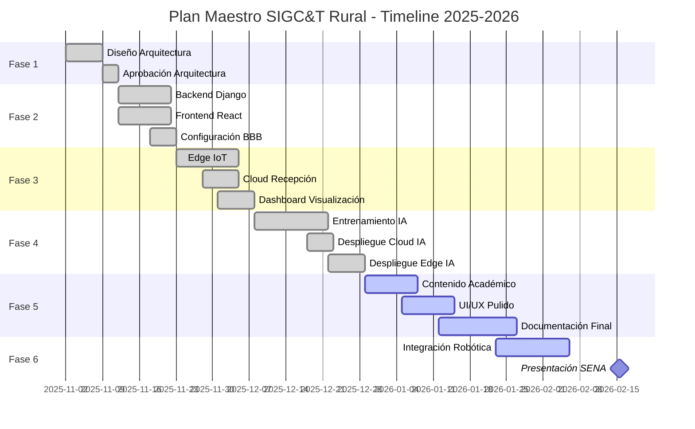

🚀 PLAN MAESTRO v5.0 - SIGC&T Rural ADSO

Fases de Implementación Basadas en Arquitectura
Roadmap Completo del Proyecto Productivo

## 📋 Información del Plan
| Campo | Valor |
|---|---|
| Versión | 5.0 (Sincronizado 2026) |
| Estado | Fase 6 en Inicio |
| Fecha Inicio | 02-Nov-2025 |
| Fecha Estimada Final | 15-Feb-2026 |
| Responsable | B. Gómez |
| Metodología | Iterativa e Incremental |

## 🎯 Visión General del Proyecto
### Objetivo Principal
Desarrollar SIGC&T Rural como plataforma web híbrida (Cloud/Edge) que integra IoT, IA y educación técnica para el sector agrícola, cumpliendo con todos los requisitos del Proyecto Productivo ADSO - SENA.

### Entregables Finales
- ✅ Plataforma web funcional (React + Django) desplegada en Cloud
- ✅ Clúster de 3 BeagleBone Black operacional con sensores
- ✅ Modelo de IA entrenado (>85% accuracy) con inferencia Cloud/Edge
- ✅ Biblioteca educativa con 20+ recursos curados
- ✅ Documentación técnica completa (MASTERDOC, APIs, Despliegue)
- ✅ Artefactos SENA (Proyecto Formativo, Evidencias, Presentación)

## 📊 Resumen de Fases

## 🟢 FASE 1: Fundamentos y Arquitectura
**Estado:** ✅ Completado (100%)
**Duración:** 2 semanas (02-Nov → 15-Nov)
**Objetivo:** Definir y validar la arquitectura de software completa como "plano" del proyecto.

### 📝 Tareas
#### 1.1 Revisión de Requisitos
- [x] Analizar README.md original (Responsable: B. Gómez)
- [x] Revisar requisitos SENA para Proyecto Productivo ADSO
- [x] Definir stack tecnológico final (Django/React/PostgreSQL/BBB/TensorFlow)

#### 1.2 Diseño de Arquitectura
- [x] Desarrollar MASTERDOC_v4.2_DAS.md
- [x] Crear diagramas Mermaid (Contexto, Contenedores, Despliegue, Casos de Uso, E-R)
- [x] Definir Diccionario de Datos completo
- [x] Especificar APIs (Backend) y Componentes (Frontend/Edge)

#### 1.3 Hito de Aprobación (Revisión)
- [x] Revisar MASTERDOC.md en GitHub
- [x] Validar con instructor SENA

**GATE:** ✅ APROBADO PARA FASE 2

## 🟡 FASE 2: Prototipo "Hola Mundo" (Cloud)
**Estado:** ✅ Completado (100%)
**Duración:** 2 semanas (12-Nov → 25-Nov)
**Objetivo:** Asegurar que Backend y Frontend se comunican correctamente en la nube.

### 📝 Tareas
#### 2.1 Backend (Django)
- [x] Inicializar proyecto Django
- [x] Configurar settings.py (PostgreSQL, CORS, DRF, Channels)
- [x] Crear modelos iniciales (Users, API)
- [x] Crear endpoint /api/health/
- [x] Desplegar en Render/Docker

#### 2.2 Frontend (React)
- [x] Inicializar proyecto React con Vite
- [x] Configurar TailwindCSS
- [x] Crear página que consuma /api/health/
- [x] Desplegar en Render (Static Site)

#### 2.3 Configuración Edge (BBB)
- [x] Instalar Debian en las 3 BeagleBone Black
- [x] Instalar dependencias Python Edge
- [x] Configurar red local estática
- [x] Configurar SSH para acceso remoto

## 🟠 FASE 3: Flujo de Datos "Humo" (Edge-to-Cloud)
**Estado:** ✅ Completado (100%)
**Duración:** 2 semanas (26-Nov → 09-Dic)
**Objetivo:** Probar el pipeline completo: Sensor → BBB → Cloud → Dashboard.

### 📝 Tareas
#### 3.1 Edge (Sensores y MQTT)
- [x] Implementar sensor_reader.py (BBB-03)
- [x] Instalar y configurar Mosquitto (BBB-01)
- [x] Implementar mqtt_broker.py (BBB-01)

#### 3.2 Cloud (Recepción y Almacenamiento)
- [x] Crear modelos completos en api/models.py
- [x] Crear endpoint POST /api/v1/readings/
- [x] Test E2E

#### 3.3 Cloud (Visualización)
- [x] Crear componente Dashboard.jsx
- [x] Crear componente SensorCard.jsx
- [x] Implementar WebSocket (Opcional/Parcial)

## 🔵 FASE 4: Integración de IA
**Estado:** ✅ Completado (100%)
**Duración:** 3 semanas (10-Dic → 31-Dic)
**Objetivo:** Implementar pipeline de IA híbrido (Cloud + Edge) y Voz Inteligente.

### 📝 Tareas
#### 4.1 Entrenamiento (Offline)
- [x] Descargar dataset PlantVillage
- [x] Desarrollar Notebook EDA
- [x] Desarrollar Notebook Entrenamiento
- [x] Convertir a TensorFlow Lite
- [x] Evaluar modelo (>85% acc)

#### 4.2 Despliegue (Cloud)
- [x] Crear ia_service/inference.py
- [x] Crear endpoint POST /api/ia/classify/
- [x] Crear página LaboratorioIA.jsx
- [x] Implementar IA de Voz con Memoria Contextual (Nueva Feature 2026)

#### 4.3 Despliegue (Edge)
- [x] Implementar tflite_api.py (BBB-02)
- [x] Implementar camera_capture.py (BBB-03)
- [x] Lógica de clúster

## ⚫ FASE 5: Contenido Académico y Pulido Final
**Estado:** 🟡 En Progreso
**Duración:** 6 semanas (01-Ene → 15-Feb)
**Objetivo:** Completar módulos educativos, UI/UX premium y documentación SENA.

### 📝 Tareas
#### 5.1 Backend (Contenido Académico)
- [ ] Crear modelo Contenido_Academico
- [ ] Poblar BD con contenido inicial (20+ recursos)

#### 5.2 Frontend (Biblioteca)
- [ ] Crear página Biblioteca.jsx
- [ ] Crear página LaboratoriosVirtuales.jsx

#### 5.3 UI/UX Pulido
- [ ] Refactorizar CSS a TailwindCSS
- [ ] Agregar animaciones
- [ ] Responsive design

#### 5.4 Documentación Final (SENA)
- [ ] Completar artefactos ADSO
- [ ] Crear API_REFERENCE.md
- [ ] Crear DEPLOYMENT.md
- [ ] Actualizar README.md

## 🟣 FASE 6: Laboratorio de Robótica e Integración (SENA 2026)
**Estado:** 🟡 En Inicio
**Duración:** Enero 2026 - Febrero 2026
**Objetivo:** Integrar actuadores robóticos y control por voz contextual.

### 📝 Tareas
#### 6.1 Integración Robótica
- [ ] Definir contratos de datos (JSON) para comandos
- [ ] Integrar telemetría de actuadores (ESP32/Arduino)
- [ ] Implementar Control por Voz para actuadores

#### 6.2 Pruebas de Campo
- [ ] Validación de comandos en laboratorio
- [ ] Pruebas de latencia y respuesta

## 📊 Seguimiento de Progreso
### Dashboard de Estado
| Fase | Progreso | Estado |
|---|---|---|
| Fase 1 | ██████████ 100% | ✅ Completado |
| Fase 2 | ██████████ 100% | ✅ Completado |
| Fase 3 | ██████████ 100% | ✅ Completado |
| Fase 4 | ██████████ 100% | ✅ Completado |
| Fase 5 | ████░░░░░░ 40% | 🟡 En Progreso |
| Fase 6 | ██░░░░░░░░ 20% | 🟢 En Progreso |

### ⚠️ Riesgos y Mitigaciones
| Riesgo | Probabilidad | Impacto | Mitigación |
|---|---|---|---|
| Hardware BBB defectuoso | Media | Alto | Tener BBB de repuesto, documentar proceso de reemplazo |
| Dataset insuficiente para IA | Baja | Alto | Usar PlantVillage (54K imágenes), augmentation agresivo |
| Despliegue Cloud falla | Media | Medio | Tener backup en Railway/Heroku, scripts automatizados |
| Retraso en Integración Robótica | Alta | Alto | Simplificar comandos, usar simuladores si hardware falla |

## 🎯 Criterios de Aceptación Global
### Para Aprobar el Proyecto ADSO
- **Funcionalidad:** Sistema completo funcionando end-to-end
- **IA:** Modelo con accuracy >85% demostrable
- **Hardware:** Clúster 3-BBB operativo con video demostrativo
- **Código:** Repositorio GitHub con commits consistentes
- **Documentación:** MASTERDOC, APIs, Despliegue completos
- **Artefactos SENA:** Proyecto Formativo, Evidencias, Presentación
- **Presentación:** Defensa oral de 20 minutos con demo en vivo

## 📞 Soporte y Comunicación
**Canales**
- GitHub Issues: Para bugs y features
- Email: badolgm@gmail.com
- Instructor SENA: [Nombre y contacto]

**Reuniones**
- Weekly Sync: Cada lunes 9:00 AM (autoevaluación de progreso)
- Sprint Review: Al final de cada fase (demo de funcionalidades)

## 📚 Referencias Rápidas
| Documento | Enlace | Propósito |
|---|---|---|
| MASTERDOC.md | docs/MASTERDOC.md | Arquitectura completa |
| robotics_contracts.md | docs/architecture/robotics_contracts.md | Contratos JSON Robótica |
| README.md | Raíz del proyecto | Introducción y setup |
| API_REFERENCE.md | docs/API_REFERENCE.md | Documentación de APIs |
| DEPLOYMENT.md | docs/DEPLOYMENT.md | Guía de despliegue |

🌱 "El éxito es la suma de pequeños esfuerzos repetidos día tras día."
— Proyecto SIGC&T Rural

Última actualización: 23 de Enero, 2026
Próxima revisión: 30 de Enero, 2026
Versión: 5.0

