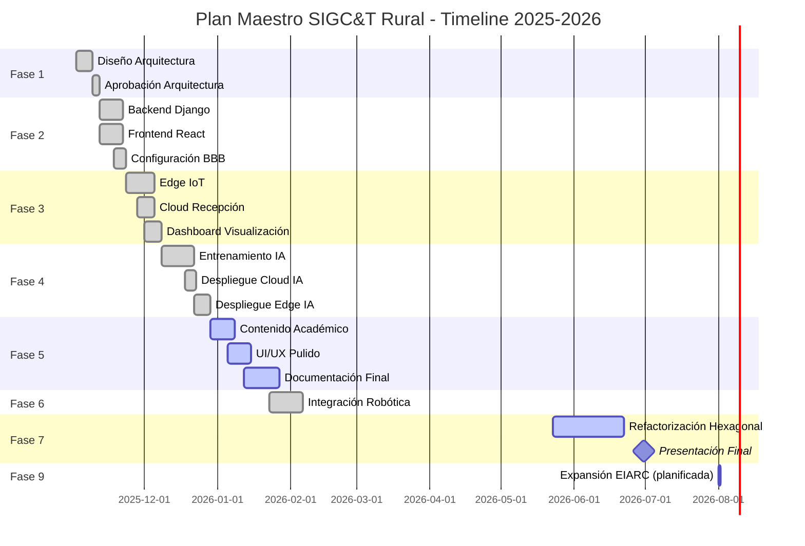

🚀 PLAN MAESTRO v8.1 - SIGC&T Rural / EIARC ADSO

Fases de Implementación Basadas en Arquitectura
Roadmap Completo del Proyecto Productivo

## 📋 Información del Plan
| Campo | Valor |
|---|---|
| Versión | 8.1 (Sincronizado Julio 2026 — incorpora evolución hacia EIARC) |
| Estado | Fase 7 en Progreso + Fase 8 en Preparación + Fase 9 Planificada |
| Fecha Inicio | 02-Nov-2025 |
| Fecha Estimada Final | 31-Jul-2026 (continuidad y consolidación de Fases 7-8; Fase 9 sin fecha de cierre aún) |
| Responsable | Bernardo Adolfo  Gómez Montoya|
| Metodología | Iterativa, Incremental y Segura |

## 🎯 Visión General del Proyecto
### Objetivo Principal
Desarrollar SIGC&T Rural como plataforma web híbrida (Cloud/Edge) que integra IoT, IA y educación técnica para el sector agrícola, cumpliendo con todos los requisitos del Proyecto Productivo ADSO - SENA.

El proyecto evoluciona conceptualmente hacia un ecosistema más amplio, **EIARC (Ecosistema de Inteligencia Artificial y Robótica para el Campo)**, que busca extender el mismo enfoque técnico —sensores, modelos de aprendizaje automático y arquitectura modular— a otras líneas de producción agropecuaria (apicultura, piscicultura, ganadería y avicultura, invernaderos) y a una multiplataforma educativa dirigida tanto a hijos de agricultores como al público general interesado en ciencias naturales, matemáticas y física. Esta ampliación se planifica como la Fase 9 del proyecto (ver sección correspondiente) y se apoya en la misma arquitectura de Monolito Modular con límites hexagonales, que permite incorporar nuevas líneas de producción como nuevas estrategias de dominio sin reescribir lo ya construido.

### Entregables Finales
- ✅ Plataforma web funcional (React + Django) desplegada en Cloud
- ✅ Clúster de 3 BeagleBone Black operacional con sensores
- ✅ Modelo de IA entrenado (>85% accuracy) con inferencia Cloud/Edge
- ✅ Biblioteca educativa con 20+ recursos curados
- ✅ Documentación técnica completa (MASTERDOC, APIs, Despliegue, bitácoras)
- ✅ Artefactos SENA (Proyecto Formativo, Evidencias, Presentación)
- 🔲 (Planificado — Fase 9) Al menos un MVP funcional de una nueva línea de producción EIARC (apicultura, piscicultura, ganadería/avicultura o invernaderos)
- 🔲 (Planificado — Fase 9) Monitoreo biométrico de ganado vía dispositivo sensórico portable (collar), con al menos una variable vital validada end-to-end (temperatura, ritmo cardíaco o comportamiento)
- 🔲 (Planificado — Fase 9) Multiplataforma educativa ampliada para público infantil/general en ciencias naturales, matemáticas y física

### Declaración Arquitectónica Actual (2026-07-04)
El proyecto se está reconduciendo hacia un enfoque de Modular Monolith con límites hexagonales por bounded context. La intención es que cada contexto del negocio —laboratorios, telemetría, IA, cursos, usuarios y administración— tenga su propia estructura interna de dominio, puertos, aplicación e infraestructura, pero que todos compartan el mismo proceso principal de Django como runtime común.

La excepción técnica son los componentes con frontera física real y ciclo de vida independiente, como el servicio de IA en FastAPI + TensorFlow, que continúa operando aparte por sus propias dependencias y despliegue. Esto permite mantener coherencia, seguridad y trazabilidad en la refactorización sin convertir prematuramente el sistema en una arquitectura distribuida compleja.

> **⚠️ DOCUMENTO SUPERADO (20-jul-2026):** La definición de EIARC en este documento fue reemplazada por la identidad canónica vigente. Ver `docs/ECOSYSTEM_IDENTITY.md`. Este documento se conserva como referencia histórica, no como fuente de verdad.

### Evolución de la Visión del Proyecto: Ecosistema EIARC (06-Jul-2026)

SIGC&T Rural evoluciona conceptualmente hacia **EIARC (Ecosistema de Inteligencia Artificial y Robótica para el Campo)**: un ecosistema agropecuario integral que va más allá de la agricultura de precisión y el diagnóstico de enfermedades en plantas, para cubrir también:

- **Apicultura:** monitoreo de colmenas y salud de polinizadores (variables ambientales críticas para la supervivencia de las abejas, cuyo rol en la polinización tiene impacto directo en la seguridad alimentaria).
- **Piscicultura:** calidad de agua, oxígeno disuelto y ciclos de cría en estanques o sistemas acuícolas.
- **Ganadería y avicultura (vacas, cerdos, gallinas, etc.):** monitoreo biométrico individual del animal mediante **dispositivos sensóricos portables tipo collar** (o equivalentes para especies que no lo admitan), que capturan señales vitales en tiempo real: temperatura corporal (detección temprana de fiebre/estrés térmico), ritmo cardíaco, variables como pH cuando aplique, y patrones de movimiento/comportamiento del animal. Estas señales se procesan mediante ingeniería de características (feature engineering) y modelos de Machine Learning / Deep Learning para detectar anomalías de salud o comportamiento antes de que se vuelvan críticas.
- **Invernaderos:** control climático y riego automatizado.
- **IA con alertas tempranas:** los modelos no se limitan a clasificar una condición actual, sino que buscan anticipar eventos (enfermedad, estrés térmico, comportamiento anómalo) mediante el análisis histórico de las señales de sensores, permitiendo intervención preventiva en vez de solo reactiva.
- **Multiplataforma educativa:** un componente pedagógico dirigido a hijos de agricultores y al público general, para el aprendizaje de ciencias naturales, matemáticas y física de forma intuitiva, aprovechando la misma infraestructura de laboratorios virtuales ya construida.

**Por qué la arquitectura ya definida absorbe esta expansión sin rediseño:**

- El contexto `labs` (laboratorios/producción) ya usa el patrón Strategy + Factory para sus 4 líneas actuales (agricultura, electrónica, robótica, telecomunicaciones). Cada nueva línea de producción (apicultura, piscicultura, ganadería/avicultura, invernaderos) se incorpora como una **nueva estrategia de dominio** dentro del mismo contexto, sin tocar las estrategias existentes ni el contrato del puerto (`RepositoryPort`, `NotificationPort`, etc.).
- El contexto `telemetry` (ingesta IoT), ya separado de `labs` desde el rediseño hacia `contexts/`, es el punto natural de entrada para las señales de un collar sensórico de ganado: es el mismo tipo de dato (lecturas periódicas de sensores) que ya maneja para `SensorReading`, solo que asociado a un animal en vez de a un cultivo o a un laboratorio.
- El contexto `ai_advisory` (puente hacia el servicio de IA) se extiende agregando nuevos modelos de detección de anomalías/alertas tempranas, sin modificar el adaptador existente hacia el servicio de diagnóstico de enfermedades en plantas — ambos conviven como capacidades distintas detrás del mismo puerto `AIServicePort`.
- El contexto `cursos`, ya anticipado en la lista de bounded contexts de la Declaración Arquitectónica, es exactamente donde se formaliza la multiplataforma educativa ampliada.

Esta ampliación se documenta como **intención estratégica confirmada**, pero se mantiene como **Fase 9 planificada** (ver más abajo), para no interferir con el cierre de las Fases 7 y 8 actualmente en curso, en línea con el principio de gobernanza de no romper funcionalidades existentes para avanzar.

### Principios de Continuidad y Gobernanza
- La documentación jamás se elimina; se conserva de forma histórica y se actualiza con fecha, hora, resultado, causas y observaciones.
- La refactorización debe ser quirúrgica, incremental y verificable. No se rompen funcionalidades existentes para avanzar.
- Cada cambio debe dejar evidencia operativa: pruebas, logs, validación de puertos, verificación de entorno y registro en bitácora.
- La migración y el rediseño deben mantener coherencia entre arquitectura, implementación, infraestructura y documentación.

## 📊 Resumen de Fases

## 🟢 FASE 1: Fundamentos y Arquitectura
**Estado:** ✅ Completado (100%)
**Duración:** 2 semanas (02-Nov → 15-Nov)
**Objetivo:** Definir y validar la arquitectura de software completa como "plano" del proyecto.

### 📝 Tareas
#### 1.1 Revisión de Requisitos
- [x] Analizar README.md original (Responsable: B. Gómez)
- [x] Revisar requisitos SENA para Proyecto Productivo ADSO
- [x] Definir stack tecnológico final (Django/React/PostgreSQL/BBB/TensorFlow)

#### 1.2 Diseño de Arquitectura
- [x] Desarrollar MASTERDOC_v4.2_DAS.md
- [x] Crear diagramas Mermaid (Contexto, Contenedores, Despliegue, Casos de Uso, E-R)
- [x] Definir Diccionario de Datos completo
- [x] Especificar APIs (Backend) y Componentes (Frontend/Edge)

#### 1.3 Hito de Aprobación (Revisión)
- [x] Revisar MASTERDOC.md en GitHub
- [x] Validar con instructor SENA

**GATE:** ✅ APROBADO PARA FASE 2

## 🟡 FASE 2: Prototipo "Hola Mundo" (Cloud)
**Estado:** ✅ Completado (100%)
**Duración:** 2 semanas (12-Nov → 25-Nov)
**Objetivo:** Asegurar que Backend y Frontend se comunican correctamente en la nube.

### 📝 Tareas
#### 2.1 Backend (Django)
- [x] Inicializar proyecto Django
- [x] Configurar settings.py (PostgreSQL, CORS, DRF, Channels)
- [x] Crear modelos iniciales (Users, API)
- [x] Crear endpoint /api/health/
- [x] Desplegar en Render/Docker

#### 2.2 Frontend (React)
- [x] Inicializar proyecto React con Vite
- [x] Configurar TailwindCSS
- [x] Crear página que consuma /api/health/
- [x] Desplegar en Render (Static Site)

#### 2.3 Configuración Edge (BBB)
- [x] Instalar Debian en las 3 BeagleBone Black
- [x] Instalar dependencias Python Edge
- [x] Configurar red local estática
- [x] Configurar SSH para acceso remoto

## 🟠 FASE 3: Flujo de Datos "Humo" (Edge-to-Cloud)
**Estado:** ✅ Completado (100%)
**Duración:** 2 semanas (26-Nov → 09-Dic)
**Objetivo:** Probar el pipeline completo: Sensor → BBB → Cloud → Dashboard.

### 📝 Tareas
#### 3.1 Edge (Sensores y MQTT)
- [x] Implementar sensor_reader.py (BBB-03)
- [x] Instalar y configurar Mosquitto (BBB-01)
- [x] Implementar mqtt_broker.py (BBB-01)

#### 3.2 Cloud (Recepción y Almacenamiento)
- [x] Crear modelos completos en api/models.py
- [x] Crear endpoint POST /api/v1/readings/
- [x] Test E2E

#### 3.3 Cloud (Visualización)
- [x] Crear componente Dashboard.jsx
- [x] Crear componente SensorCard.jsx
- [x] Implementar WebSocket (Opcional/Parcial)

## 🔵 FASE 4: Integración de IA
**Estado:** ✅ Completado (100%)
**Duración:** 3 semanas (10-Dic → 31-Dic)
**Objetivo:** Implementar pipeline de IA híbrido (Cloud + Edge) y Voz Inteligente.

### 📝 Tareas
#### 4.1 Entrenamiento (Offline)
- [x] Descargar dataset PlantVillage
- [x] Desarrollar Notebook EDA
- [x] Desarrollar Notebook Entrenamiento
- [x] Convertir a TensorFlow Lite
- [x] Evaluar modelo (>85% acc)

#### 4.2 Despliegue (Cloud)
- [x] Crear ia_service/inference.py
- [x] Crear endpoint POST /api/ia/classify/
- [x] Crear página LaboratorioIA.jsx
- [x] Implementar IA de Voz con Memoria Contextual (Nueva Feature 2026)

#### 4.3 Despliegue (Edge)
- [x] Implementar tflite_api.py (BBB-02)
- [x] Implementar camera_capture.py (BBB-03)
- [x] Lógica de clúster

## ⚫ FASE 5: Contenido Académico y Pulido Final
**Estado:** ✅ Completado (100%)
**Duración:** 6 semanas (01-Ene → 15-Feb)
**Objetivo:** Completar módulos educativos, UI/UX premium y documentación SENA.

### 📝 Tareas
#### 5.1 Backend (Contenido Académico)
- [x] Crear modelo Contenido_Academico
- [x] Poblar BD con contenido inicial (20+ recursos)

#### 5.2 Frontend (Biblioteca)
- [x] Crear página Biblioteca.jsx
- [x] Crear página LaboratoriosVirtuales.jsx

#### 5.3 UI/UX Pulido
- [x] Refactorizar CSS a TailwindCSS
- [x] Agregar animaciones
- [x] Responsive design

#### 5.4 Documentación Final (SENA)
- [x] Completar artefactos ADSO
- [x] Crear API_REFERENCE.md
- [x] Crear DEPLOYMENT.md
- [x] Actualizar README.md

## 🟣 FASE 6: Laboratorio de Robótica e Integración (SENA 2026)
**Estado:** ✅ Completado (100%)
**Duración:** Enero 2026 - Febrero 2026
**Objetivo:** Integrar actuadores robóticos y control por voz contextual.

### 📝 Tareas
#### 6.1 Integración Robótica
- [x] Definir contratos de datos (JSON) para comandos
- [x] Integrar telemetría de actuadores (ESP32/Arduino)
- [x] Implementar Control por Voz para actuadores

## 🔴 FASE 7: Refactorización Arquitectónica Hexagonal (Mayo - Julio 2026)
**Estado:** 🟡 En Progreso
**Duración:** Mayo 2026 - Julio 2026
**Objetivo:** Desacoplar el dominio del framework (Django) y consolidar un diseño modular con límites hexagonales por bounded context, preservando estabilidad operativa.

### 📝 Tareas
#### 7.1 Definición de Capas de Dominio
- [x] Consolidar la intención arquitectónica del proyecto como Modular Monolith con bounded contexts
- [x] Documentar la diferencia entre contextos que comparten runtime y servicios con frontera física real
- [ ] Migrar progresivamente la lógica de negocio a estructuras de dominio más limpias y aisladas
- [ ] Definir contratos claros entre dominio, puertos, aplicación e infraestructura

#### 7.2 Implementación de Estrategias y Contextos
- [x] Identificar bounded contexts principales: laboratorios, telemetría, IA, usuarios, contenidos y administración
- [ ] Refactorizar la lógica de procesamiento de laboratorios usando patrones Strategy/Factory y límites claros de contexto
- [ ] Separar las reglas de negocio de la generación de datos y de la presentación en vistas
- [ ] Establecer un patrón de adaptación para persistencia y servicios externos

#### 7.3 Adaptadores, API y Seguridad
- [x] Alinear la configuración de puertos y variables de entorno con Docker y Django
- [x] Cargar variables de entorno desde el archivo de proyecto para evitar errores por entorno local
- [ ] Completar la integración del servicio de IA con el backend sin romper el flujo actual
- [ ] Fortalecer la seguridad de configuración y evitar dependencias rígidas a variables hardcodeadas

#### 7.4 Continuidad Documental
- [x] Actualizar bitácoras con fecha, hora, resultado y causa de intervención
- [x] Mantener la documentación histórica sin borrado de líneas ni pérdida de contexto
- [ ] Completar una guía operativa de continuidad para que la IA o cualquier desarrollador retome el proyecto sin ambigüedad

## 🟢 FASE 8: Continuidad Operativa, Observabilidad y Hardening
**Estado:** 🟡 En Preparación
**Duración:** Julio 2026
**Objetivo:** Dejar el proyecto estable, verificable y listo para avanzar sin riesgo de pérdida de contexto ni rotura funcional.

### 📝 Tareas
- [ ] Establecer un flujo de arranque seguro: DB → migraciones → backend → IA → frontend
- [ ] Definir un checklist de verificación por entorno (Docker, venv, puertos, variables de entorno)
- [ ] Implementar observabilidad mínima: logs estructurados, health checks y trazabilidad de errores
- [ ] Asegurar que los cambios de puertos no rompan la ejecución de otros proyectos locales
- [ ] Mantener la documentación como fuente única de continuidad del proceso de refactorización

> **⚠️ DOCUMENTO SUPERADO (20-jul-2026):** La definición de EIARC en este documento fue reemplazada por la identidad canónica vigente. Ver `docs/ECOSYSTEM_IDENTITY.md`. Este documento se conserva como referencia histórica, no como fuente de verdad.

## ⚪ FASE 9: Expansión de Dominio — Ecosistema EIARC (Planificada)
**Estado:** 🔲 Planificada (no iniciada)
**Duración:** A definir (posterior al cierre satisfactorio de las Fases 7 y 8)
**Objetivo:** Extender el ecosistema más allá del dominio agrícola original hacia un ecosistema agropecuario integral (EIARC), reutilizando la arquitectura modular por bounded context ya definida, sin reabrir el trabajo de estabilización de las Fases 7 y 8.

### 📝 Tareas (backlog inicial, sujeto a priorización)

#### 9.1 Nuevas Líneas de Producción (contexto `labs`)
- [ ] Definir estrategia de dominio para Apicultura (monitoreo de colmenas, salud de polinizadores, variables ambientales críticas)
- [ ] Definir estrategia de dominio para Piscicultura (calidad de agua, oxígeno disuelto, ciclos de cría)
- [ ] Definir estrategia de dominio para Ganadería y Avicultura (vacas, cerdos, gallinas, etc.)
- [ ] Definir estrategia de dominio para Invernaderos (control climático, riego automatizado)
- [ ] Extender `LaboratorioStrategyFactory` (o su equivalente en `contexts/labs/domain/factories/`) para registrar las nuevas estrategias sin romper las 4 existentes

#### 9.2 Monitoreo Biométrico Individual de Ganado (contexto `telemetry` + `ai_advisory`)
- [ ] Diseñar el contrato de datos del dispositivo sensórico portable (collar u otro formato según la especie): temperatura corporal, ritmo cardíaco, pH cuando aplique, y variables de movimiento/actividad
- [ ] Definir `AnimalReadingPort` (o extender `SensorReadingRepositoryPort` existente) para que la ingesta de telemetría distinga entre lectura de cultivo/laboratorio y lectura biométrica de un animal individual
- [ ] Investigar y documentar rangos fisiológicos normales por especie (vacas, cerdos, gallinas) como base para la detección de anomalías (fiebre, estrés térmico, taquicardia, hipoactividad)
- [ ] Aplicar ingeniería de características (feature engineering) sobre las series de tiempo de cada animal (medias móviles, variabilidad, tendencias) como insumo para los modelos
- [ ] Evaluar modelos de Machine Learning / Deep Learning para clasificación de estado de salud y detección de comportamiento anómalo por animal
- [ ] Diseñar el mecanismo de alerta temprana (umbral + modelo predictivo) para notificar al productor antes de que la condición se vuelva crítica
- [ ] Definir el MVP mínimo viable: una sola variable vital (por ejemplo, temperatura) validada end-to-end (sensor → ingesta → almacenamiento → visualización → alerta) antes de sumar más variables o especies

#### 9.3 IA de Alertas Tempranas (contexto `ai_advisory`, general para todas las líneas EIARC)
- [ ] Definir puertos y contratos para modelos de detección de anomalías/alertas tempranas, reutilizables entre cultivos, colmenas, estanques e individuos de ganado
- [ ] Evaluar modelos de Machine Learning y Deep Learning adicionales al de diagnóstico de enfermedades en plantas, manteniendo el mismo `AIServicePort` como punto de integración
- [ ] Diseñar el mecanismo de retroalimentación para que la IA "guíe" y eduque al usuario (recomendaciones explicables, no solo predicciones aisladas)

#### 9.4 Multiplataforma Educativa (contexto `cursos`)
- [ ] Formalizar el contexto `cursos` como bounded context independiente (actualmente solo referenciado en la Declaración Arquitectónica)
- [ ] Definir contenidos dirigidos a hijos de agricultores y público general (ciencias naturales, matemáticas, física)
- [ ] Diseñar rutas de aprendizaje progresivas, separadas del contenido técnico/profesional existente

#### 9.5 Gobernanza de Alcance
- [ ] Priorizar un único MVP (una sola línea de producción o una sola variable biométrica) antes de escalar a las demás, para evitar expansión simultánea sin control
- [ ] Validar que cada nueva línea siga el mismo patrón Strategy/Factory/Port ya probado en los 4 laboratorios actuales
- [ ] Actualizar MASTERDOC con los nuevos diagramas de contexto una vez priorizada la primera línea nueva

**Nota de gobernanza:** esta fase se documenta como intención estratégica confirmada del proyecto, pero permanece **planificada** y no debe iniciarse operativamente hasta el cierre satisfactorio de las Fases 7 y 8, en línea con el principio de "no romper funcionalidades existentes para avanzar".

## 📊 Seguimiento de Progreso
### Dashboard de Estado
| Fase | Progreso | Estado |
|---|---|---|
| Fase 1 | ██████████ 100% | ✅ Completado |
| Fase 2 | ██████████ 100% | ✅ Completado |
| Fase 3 | ██████████ 100% | ✅ Completado |
| Fase 4 | ██████████ 100% | ✅ Completado |
| Fase 5 | ██████████ 100% | ✅ Completado |
| Fase 6 | ██████████ 100% | ✅ Completado |
| Fase 7 | ████░░░░░░ 45% | 🟢 En Progreso |
| Fase 8 | ██░░░░░░░░ 15% | 🟡 En Preparación |
| Fase 9 | ░░░░░░░░░░ 0% | 🔲 Planificada |

### ⚠️ Riesgos y Mitigaciones
| Riesgo | Probabilidad | Impacto | Mitigación |
|---|---|---|---|
| Hardware BBB defectuoso | Media | Alto | Tener BBB de repuesto, documentar proceso de reemplazo |
| Dataset insuficiente para IA | Baja | Alto | Usar PlantVillage (54K imágenes), augmentation agresivo |
| Despliegue Cloud falla | Media | Medio | Tener backup en Railway/Heroku, scripts automatizados |
| Retraso en Integración Robótica | Alta | Alto | Simplificar comandos, usar simuladores si hardware falla |
| Expansión de alcance sin control hacia múltiples dominios EIARC (apicultura, piscicultura, ganadería, invernaderos) antes de cerrar Fases 7-8 | Alta | Alto | Mantener Fase 9 estrictamente planificada hasta cierre de Fases 7-8; priorizar un único MVP por línea nueva; reutilizar el mismo patrón Strategy/Factory/Port ya validado en los 4 laboratorios actuales |
| Falta de datos etiquetados/rangos fisiológicos confiables por especie para el monitoreo biométrico de ganado | Media | Alto | Investigación previa de rangos fisiológicos normales por especie antes de entrenar modelos; comenzar con reglas de umbral simples y evolucionar a ML/DL cuando existan suficientes datos propios |

## 🎯 Criterios de Aceptación Global
### Para Aprobar el Proyecto ADSO
- **Funcionalidad:** Sistema completo funcionando end-to-end
- **IA:** Modelo con accuracy >85% demostrable
- **Hardware:** Clúster 3-BBB operativo con video demostrativo
- **Código:** Repositorio GitHub con commits consistentes
- **Documentación:** MASTERDOC, APIs, Despliegue completos
- **Artefactos SENA:** Proyecto Formativo, Evidencias, Presentación
- **Presentación:** Defensa oral de 20 minutos con demo en vivo

## 📞 Soporte y Comunicación
**Canales**
- GitHub Issues: Para bugs y features
- Email: badolgm@gmail.com
- Instructor SENA: Carlos Stuwe

**Reuniones**
- Weekly Sync: Cada lunes 9:00 AM (autoevaluación de progreso)
- Sprint Review: Al final de cada fase (demo de funcionalidades)

## 📚 Referencias Rápidas
| Documento | Enlace | Propósito |
|---|---|---|
| MASTERDOC.md | docs/MASTERDOC.md | Arquitectura completa |
| robotics_contracts.md | docs/architecture/robotics_contracts.md | Contratos JSON Robótica |
| README.md | Raíz del proyecto | Introducción y setup |
| API_REFERENCE.md | docs/API_REFERENCE.md | Documentación de APIs |
| DEPLOYMENT.md | docs/DEPLOYMENT.md | Guía de despliegue |
| EIARC_VISION.md (pendiente de creación) | docs/EIARC_VISION.md | Visión y alcance ampliado del ecosistema EIARC (Fase 9) |

🌱 "El éxito es la suma de pequeños esfuerzos repetidos día tras día."
— Proyecto SIGC&T Rural / EIARC

Última actualización: 06 de Julio, 2026
Próxima revisión: A definir según cierre de Fase 7-8
Versión: 8.1

