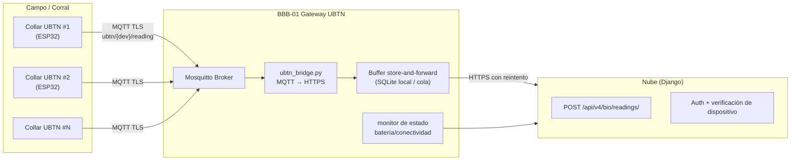

# 🔌 UBTN — BeagleBone Black Rev C como Edge Gateway

## Universal Biological Telemetry Node — Diseño del Nodo de Borde

| Campo | Valor |
|-------|-------|
| **Versión** | 1.0.0 (diseño — sin implementación) |
| **Fecha** | 2026-09-13 |
| **Rama** | `feature/ubtn-biological-telemetry` |
| **Estado** | 🔷 Planificado (la integración física del clúster BBB está en progreso; el código edge actual de `src/embedded/bbb_*/` es referencia en 0 bytes) |

---

## 1. Rol del Gateway en el Ecosistema UBTN

En la arquitectura de referencia del clúster (documentada en `README.md` §Edge Computing y `docs/edge/architecture_edge.mmd`), **BBB-01** ya cumple el rol de **Gateway** (broker MQTT + sincronización cloud). El UBTN evoluciona ese rol sin cambiar el hardware:

```
BBB-01 Gateway (rol ampliado UBTN)
├── Broker MQTT (Mosquitto) — preexistente
├── Bridge MQTT → HTTPS (nuevo, UBTN)
├── Store-and-forward local (nuevo, UBTN)
└── Enrutamiento de tópicos ubtn/* (nuevo, UBTN)
```

| Nodo | Rol UBTN | Responsabilidad |
|---|---|---|
| **BBB-01** | Gateway UBTN | Broker MQTT, `ubtn/*` routing, bridge a cloud, buffer de resiliencia |
| **BBB-02** | Inferencia IA edge (futuro) | Detección de anomalías con TFLite en local |
| **BBB-03** | Adquisición complementaria | Sensores ambientales del corral (temperatura/humedad ambiente), cámara |

> **Decisión ADR-UBTN-04:** se reutiliza BBB-01 en lugar de agregar una cuarta placa. El clúster ya es de 3 nodos, el gateway tiene el broker asignado y el rol de conectividad; evolución, no expansión de hardware.

---

## 2. Topología de Datos UBTN



### 2.1 Flujo normal
1. Collares publican en tópicos `ubtn/{device}/reading` y `ubtn/{device}/status`.
2. Mosquitto entrega al suscriptor `ubtn_bridge`.
3. El bridge valida y traduce el payload al formato del contrato V4.
4. Envío HTTPS a `POST /api/v4/bio/readings/` con reintento/backoff.

### 2.2 Flujo resiliente (conectividad intermitente)
1. Si la nube está inalcanzable, el bridge persiste en buffer local (SQLite, rotación por tamaño/antigüedad).
2. Al restaurarse la conectividad, se drena el buffer en orden de `timestamp`.
3. Duplicación protegida: el backend deduplica por `(device_id, captured_at, reading_signature)` en el contrato.

---

## 3. Ingeniería del Bridge (`ubtn_bridge.py` — diseño)

| Aspecto | Diseño propuesto |
|---|---|
| Runtime | Python 3.9 sobre Debian 11 (Bullseye) — idéntico al resto del clúster |
| Dependencias | `paho-mqtt` (cliente), `requests`/`urllib3` (HTTPS), `sqlite3` (buffer) |
| Ciclo | Suscripción persistente a `ubtn/#`; loop de drenaje del buffer cada N segundos |
| Reconexión | Reintento con backoff exponencial; no pierde mensajes del buffer |
| Seguridad | TLS 1.2+ con CA local para MQTT y HTTPS; secretos fuera del repo (env) |
| Identidad de dispositivo | El bridge firma o adjunta el `device_id`; el backend verifica contra el catálogo de `CollarDevice` |

```
Topología de despliegue propuesta:
src/embedded/ubtn/
├── gateway/
│   ├── ubtn_bridge.py          # suscriptor MQTT → HTTPS
│   ├── ubtn_buffer.py          # cola store-and-forward
│   ├── ubtn_config.env.example # credenciales/tópicos (nunca con secretos reales)
│   └── systemd/ubtn_bridge.service
└── firmware/                   # (Fase U5 — ESP32)
```

> ⚠️ Esta estructura **no se crea** en la rama actual. Se documenta para el roadmap (Fase U4).

---

## 4. Contrato de Tópicos MQTT

| Tópico | QoS | Garantía | Payload |
|---|---|---|---|
| `ubtn/{device}/reading` | 1 | al menos una vez | telemetría periódica (HR, T°, SpO₂, actividad) |
| `ubtn/{device}/burst` | 1 | al menos una vez | ráfaga ECG/PPG de alta frecuencia |
| `ubtn/{device}/status` | 0 | no persistente | batería, firmware, estado |
| `ubtn/{device}/cmd` | 1 | al menos una vez | comando del gateway al collar (full-duplex futuro) |
| `ubtn/alert` | 1 | al menos una vez | alerta pre-analizada en edge (opcional, con IA edge) |

**Regla de diseño:** el *internal broker* permanece aislado de la inmensa mayoría de la red; la nube no se expone a tópicos internos — el bridge es el único punto de salida.

---

## 5. Seguridad del Nodo Edge

| Superficie | Control |
|---|---|
| Comunicación collar ↔ broker | TLS con CA de laboratorio; credenciales por dispositivo (username = `device_id`) |
| Comunicación broker ↔ nube | HTTPS mutual-TLS o token de servicio (a definir en implementación) |
| Almacenamiento local (buffer) | SQLite con permisos restringidos; rotación de datos sensibles |
| Acceso SSH a BBB-01 | Solo clave pública; sin contraseñas |
| Firmware | Firma/sello de versión (`fw`) verificado en el catálogo de dispositivos |

---

## 6. Criterios de Aceptación del Gateway (Fase U4)

1. `ubtn_bridge` publica correctamente en el contrato `POST /api/v4/bio/readings/`.
2. Un collar simulado (script emisor) es ingerido y visible en la query por sujeto.
3. Con la nube apagada, las lecturas se almacenan en buffer y se drenan al restaurarse (sin pérdida).
4. Duplicados se rechazan en backend (idempotencia).
5. No hay cambios en `src/embedded/bbb_01_gateway/mqtt_broker.py` hasta que el bridge esté validado en laboratorio.
6. Evidencia de funcionamiento: logs y video corto del flujo edge→cloud.

---

## 7. Referencias

- [`UBTN_ARCHITECTURE.md`](UBTN_ARCHITECTURE.md) §4 (hardware + protocolo MQTT) y §7 (ADR-UBTN-04).
- [`UBTN_ROADMAP.md`](UBTN_ROADMAP.md) Fase U4.
- `docs/edge/architecture_edge.mmd` — diagrama heredado del clúster (los scripts en `src/embedded/bbb_*/` están en 0 bytes; el diagrama documenta el objetivo, no la implementación).
- `README.md` §Edge Computing — arquitectura de referencia del clúster 3-BBB.

---

*Diseño de nodo de borde — sin implementación en esta rama.*