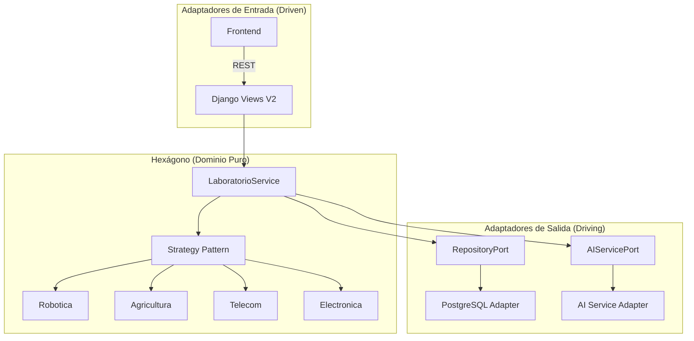

# 🏗️ Arquitectura del Sistema — SIGC&T Rural

Este documento detalla los niveles de arquitectura del sistema, desde la visión general hasta la implementación de bajo nivel en el backend.

## 1. Nivel 1: Vista de Contexto (C4 Model)
Define cómo interactúan los usuarios y los sistemas externos con la plataforma.
*(Ver diagrama en el README principal)*

## 2. Nivel 2: Vista de Contenedores
Detalla la infraestructura Docker y la comunicación entre servicios (Frontend, Backend, AI Service, DB, Edge).
*(Ver diagrama en el README principal)*

## 3. Nivel 3: Arquitectura Hexagonal (Backend)
Implementada para desacoplar el **Dominio** (Reglas de Negocio Rural) de la **Infraestructura** (Django, DB, APIs).

### Diagrama de Puertos y Adaptadores

### Ventajas de este Diseño
- **Testabilidad**: Se puede probar la lógica de agricultura sin levantar Django.
- **Flexibilidad**: Podemos cambiar PostgreSQL por MongoDB solo creando un nuevo adaptador.
- **Resiliencia**: Si la IA falla, el adaptador de salida maneja el error y devuelve una sugerencia básica.

---
*Bernardo Adolfo Gómez Montoya — 2026*
