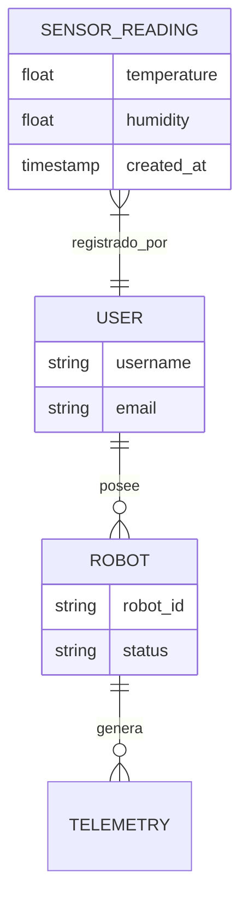

# 🗄️ Gestión de Base de Datos — SIGC&T Rural

Este documento detalla el esquema de datos y la evolución de la persistencia en el proyecto.

## 1. Stack de Datos
- **Motor:** PostgreSQL 15.16 (Docker)
- **ORM:** Django ORM
- **Driver:** `psycopg2-binary`

## 2. Diagrama Entidad-Relación (ERD)

## 3. Historia de Migración
- **Enero 2026**: Migración exitosa de MySQL 8.0 a PostgreSQL 15.
- **Motivo**: Mejor soporte para tipos de datos complejos (JSONB), mayor integridad referencial y compatibilidad superior con Django.
- **Procedimiento**: Saneamiento de `requirements.txt` y reconstrucción de imágenes Docker con soporte nativo para `libpq-dev`.

## 4. Adaptador Hexagonal de Persistencia
En la nueva estructura, el dominio no habla directamente con el ORM. Se utiliza el `DjangoRepository` ubicado en `src/backend/api/logic/adapters/persistence.py`, el cual implementa la interfaz `RepositoryInterface`.

---
*Bernardo Adolfo Gómez Montoya — 2026*
