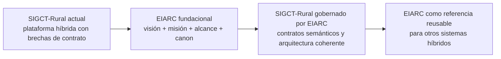

> **⚠️ DOCUMENTO SUPERADO (20-jul-2026):** La definición de EIARC en este documento fue reemplazada por la identidad canónica vigente. Ver `docs/ECOSYSTEM_IDENTITY.md`. Este documento se conserva como referencia histórica, no como fuente de verdad.

# EIARC Scope

## Propósito del documento

Definir el alcance actual y futuro de EIARC, delimitando qué cubre, qué no cubre, cómo se relaciona con SIGCT-Rural y cuál es la evolución prevista desde la plataforma actual hacia el marco arquitectónico fundacional.

## Definición de alcance

EIARC cubre la capa de gobierno arquitectónico necesaria para que plataformas híbridas con inteligencia artificial operen con coherencia semántica, continuidad estructural y capacidad de evolución multi-modelo.

EIARC no se define como una aplicación, un microservicio, un framework de frontend ni un reemplazo del dominio de SIGCT-Rural. Se define como el marco que organiza y gobierna la forma en que esos elementos deben relacionarse.

## Alcance actual

En su estado fundacional, EIARC incluye:

### 1. Definición conceptual

- visión
- misión
- alcance
- principios arquitectónicos
- relación formal con SIGCT-Rural

### 2. Gobierno semántico de IA

- necesidad de contrato semántico único
- necesidad de taxonomía versionada
- necesidad de separar resultado técnico y significado de negocio

### 3. Modelo canónico de evolución

- estado actual del ecosistema
- estado objetivo SIGCT-Rural
- estado objetivo EIARC
- transición desde plataforma híbrida actual hacia arquitectura gobernada

### 4. Base documental inicial

- documentos fundacionales
- base de conocimiento del proyecto
- articulación con documentación maestra existente

## Alcance futuro

EIARC está destinado a crecer hacia una arquitectura de referencia completa. Su alcance futuro incluye:

### 1. Contratos canónicos

- contrato semántico IA
- contrato canónico de predicción
- versionado de taxonomías y clases
- reglas de compatibilidad entre consumidores

### 2. Arquitectura multi-modelo

- screening
- clasificación específica
- severidad
- recomendación contextual
- coexistencia cloud y edge con equivalencia semántica

### 3. Gobierno de integración

- principios para integración entre frontend, backend, IA y edge
- reglas de trazabilidad entre modelos, APIs, UX y documentación
- criterios para desacoplar servicios técnicos de contratos de negocio

### 4. Arquitectura de despliegue y evolución

- lineamientos cloud-edge
- criterios para entornos híbridos
- políticas de transición desde legacy hacia bounded contexts y contratos estables

### 5. Base gráfica y de decisión

- diagramas oficiales EIARC
- mapas de evolución
- matrices de verdad documental
- artefactos de gobierno arquitectónico

## Fuera de alcance actual

En esta etapa fundacional, EIARC no cubre todavía:

- implementación de código
- refactor técnico de backend o frontend
- cambios en Docker o infraestructura existente
- reentrenamiento o sustitución de modelos
- automatización de CI/CD
- diseño detallado de todos los bounded contexts

Estos temas podrán ser gobernados por EIARC en el futuro, pero no forman parte del alcance actual de esta estructura documental inicial.

## Relación entre SIGCT-Rural y EIARC

La relación entre ambos debe entenderse así:

### SIGCT-Rural

- plataforma de dominio
- caso real de uso
- contexto de negocio, educación técnica e integración rural
- primer sistema en el que se identifican las necesidades que EIARC formaliza

### EIARC

- marco fundacional
- autoridad arquitectónica conceptual
- capa de gobierno para semántica, integración, evolución y consistencia
- referencia reutilizable para SIGCT-Rural y futuros sistemas

## Evolución prevista

## Principios de alcance

### 1. EIARC empieza por arquitectura, no por implementación

La primera responsabilidad de EIARC es definir el marco de decisión antes de intervenir técnicamente en los componentes.

### 2. EIARC no compite con SIGCT-Rural

EIARC no reemplaza la identidad del proyecto. La clarifica y la hace evolutivamente sostenible.

### 3. EIARC crece por capas

La expansión de EIARC debe seguir un orden:

1. fundación conceptual
2. contratos y taxonomías
3. arquitectura formal
4. diagramas oficiales
5. lineamientos de evolución e implementación

### 4. EIARC debe preservar continuidad

El paso desde SIGCT-Rural a una plataforma gobernada por EIARC debe ser incremental, explícito y trazable.

## Declaración final de alcance

EIARC, en su fase inicial, cubre la definición del marco fundacional que permitirá transformar SIGCT-Rural desde una plataforma híbrida técnicamente valiosa pero semánticamente fragmentada, hacia un sistema gobernado por principios, contratos y modelos canónicos de arquitectura.
