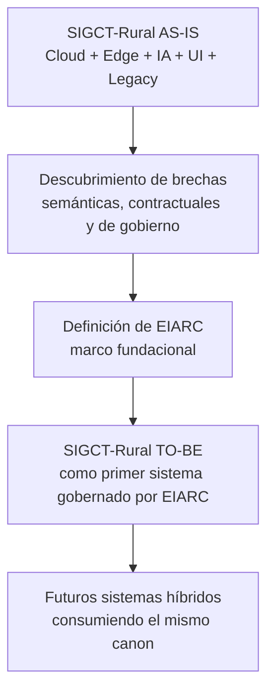

# EIARC Vision

## Propósito del documento

Definir la visión fundacional de EIARC como marco arquitectónico de referencia para la evolución de SIGCT-Rural y de futuros sistemas que requieran integrar inteligencia artificial, telemetría, edge computing, experiencia de usuario y gobierno semántico bajo un mismo modelo coherente.

## Qué es EIARC

EIARC es un marco arquitectónico fundacional para sistemas híbridos que combinan:

- inteligencia artificial multi-modelo
- contratos semánticos de negocio
- integración cloud y edge
- plataformas de observación, diagnóstico y operación
- evolución gradual desde sistemas existentes hacia arquitecturas gobernadas por dominio

EIARC no nace como un producto aislado, sino como una respuesta arquitectónica a los hallazgos encontrados en SIGCT-Rural: coexistencia de múltiples semánticas, integración parcial entre servicios, documentación aspiracional, y ausencia de una fuente única de verdad para IA y contratos de negocio.

## Visión

Construir una base arquitectónica capaz de convertir ecosistemas técnicos heterogéneos en sistemas coherentes, donde los modelos pueden cambiar, los despliegues pueden variar y las implementaciones pueden evolucionar, sin romper el significado de negocio ni la trazabilidad operativa.

En términos prácticos, la visión de EIARC es habilitar plataformas donde:

- la inteligencia artificial no se integre solo por transporte, sino por semántica
- cloud y edge cooperen bajo un contrato común
- los frontends consuman significado estable, no detalles internos de inferencia
- la arquitectura sirva como gobierno activo del sistema, no solo como documentación descriptiva

## Problema que resuelve

EIARC resuelve un problema recurrente en plataformas de IA aplicada:

- los modelos cambian más rápido que los contratos de negocio
- cada capa del sistema tiende a inventar su propia semántica
- la integración técnica puede parecer exitosa aunque el sistema esté conceptualmente roto
- la documentación, el frontend, los servicios y los modelos terminan describiendo realidades distintas

EIARC propone una solución fundacional: una arquitectura donde el significado de negocio sea un activo explícito, versionado y gobernado.

## Relación entre SIGCT-Rural y EIARC

SIGCT-Rural es el contexto de origen y validación de EIARC.

La relación correcta entre ambos es:

- SIGCT-Rural es una plataforma de dominio rural, educativa y productiva
- EIARC es el marco arquitectónico que abstrae y ordena las lecciones estructurales necesarias para que SIGCT-Rural evolucione con coherencia

Por tanto:

- SIGCT-Rural no es reemplazado por EIARC
- SIGCT-Rural se convierte en el primer caso de aplicación de EIARC
- EIARC define el canon arquitectónico; SIGCT-Rural lo implementa progresivamente

## Principios arquitectónicos fundacionales

### 1. El significado de negocio prevalece sobre la forma técnica

La salida de un modelo, un índice de clase o una ruta HTTP no constituyen por sí solos un contrato suficiente. EIARC establece que el sistema debe exponer significado estable de dominio.

### 2. Los modelos son reemplazables; el contrato semántico no

Los artefactos de inferencia pueden cambiar por precisión, costo, hardware o contexto. Lo que no debe romperse es la semántica consumida por el sistema.

### 3. Cloud y Edge deben converger en el mismo lenguaje de negocio

EIARC no define igualdad de implementación entre cloud y edge, sino equivalencia semántica entre sus resultados.

### 4. La arquitectura debe gobernar la evolución

La arquitectura no es un apéndice documental. Debe establecer fuentes de verdad, límites, taxonomías, contratos, evolución y criterios de consistencia.

### 5. La migración desde sistemas existentes debe ser gradual

EIARC parte de la realidad de sistemas ya vivos, con legacy, deuda técnica y capas mixtas. Su adopción está diseñada para convivir con estados intermedios.

## Evolución conceptual

## Alcance de la visión

En su etapa fundacional, EIARC se enfoca en:

- gobierno semántico de IA
- arquitectura multi-modelo
- relación cloud-edge
- separación entre inferencia técnica y contrato de negocio
- evolución arquitectónica desde plataformas híbridas existentes

## Declaración final

EIARC existe para evitar que plataformas técnicamente complejas terminen funcionando como sistemas conceptualmente incoherentes. Su visión es convertir integración dispersa en arquitectura gobernada, y heterogeneidad tecnológica en un lenguaje común de negocio.
