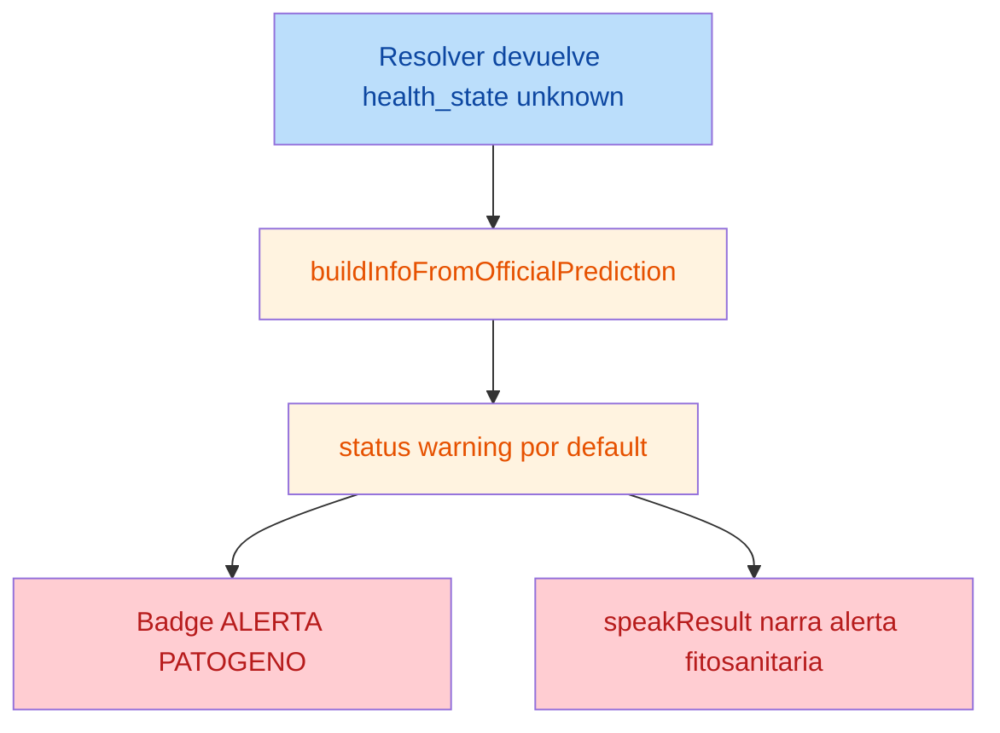

# AI PR1 Code Review

## Fecha

2026-07-12

## Version

v1.0.0

## Objetivo

Auditar tecnicamente el PR1 del AI Context para validar errores funcionales, errores de contrato, inconsistencias semanticas, riesgos de produccion, problemas de taxonomia y el nivel de cumplimiento respecto de `AI_CONTEXT_IMPLEMENTATION_GUIDE.md` y del contrato semantico oficial de EIARC.

## Alcance auditado

- `src/backend/api/urls.py`
- `src/backend/api/views.py`
- `src/backend/infrastructure/external/ai_service/fastapi_ai_adapter.py`
- `src/backend/infrastructure/external/ai_service/semantic_prediction_resolver.py`
- `src/frontend/src/pages/AIPredictiva.jsx`

## Intencion inferida del PR1

Introducir la fachada oficial `POST /api/v3/ai/inference/`, encapsular `/infer` detras del backend, publicar un envelope semantico EIARC y mover a `AIPredictiva.jsx` desde el contrato tecnico legacy hacia `prediction_code` y `prediction.*`.

## Resumen ejecutivo

El PR1 **si introduce** la puerta oficial del AI Context y **si publica** la forma base del contrato esperado por la guia: `context`, `contract_version`, `operation`, `source_mode`, `prediction` y `trace`.

Sin embargo, la implementacion **no alcanza todavia cumplimiento completo** de la intencion EIARC por cuatro razones:

1. la UI convierte respuestas degradadas o `unknown` en alertas fitosanitarias, rompiendo la degradacion controlada definida en la guia
2. la resiliencia prometida por `@retry` no existe realmente en el adapter que alimenta la ruta oficial
3. un fallo de import en la nueva ruta de IA puede deshabilitar silenciosamente endpoints V3 no relacionados
4. `AIPredictiva.jsx` conserva un camino alterno local en `robotMode`, por lo que la pagina no consume de forma uniforme el contrato oficial

Resultado:

- **Contract shape**: conforme de forma parcial
- **Semantica de negocio**: no conforme
- **Riesgo residual**: alto

## Diagramas

### Flujo tecnico actual del PR1

```mermaid
flowchart LR
    FE[Frontend AIPredictiva] --> API[POST /api/v3/ai/inference/]
    API --> ADP[FastAPIAIAdapter]
    ADP --> INF[/infer]
    INF --> RAW[diagnosis + class_index]
    RAW --> RES[SemanticPredictionResolver]
    RES --> ENV[Envelope EIARC]
    ENV --> UI[UI y voz]

    style API fill:#bbdefb,color:#0d47a1
    style RES fill:#c8e6c9,color:#1a5e20
    style UI fill:#fff3e0,color:#e65100
```

### Punto de fuga semantico detectado



## Hallazgos

| No. | Severidad | Hallazgo | Evidencia | Impacto |
|---|---|---|---|---|
| 1 | High | `AIPredictiva.jsx` convierte respuestas degradadas o `unknown` en alerta de patogeno, contradiciendo la degradacion controlada del contrato. | [AIPredictiva.jsx:L56-L65](file:///c:/Users/Devbadolgm/Development/research-ai/ProjectsAndDatasets/sigcTiArural/src/frontend/src/pages/AIPredictiva.jsx#L56-L65), [AIPredictiva.jsx:L81-L90](file:///c:/Users/Devbadolgm/Development/research-ai/ProjectsAndDatasets/sigcTiArural/src/frontend/src/pages/AIPredictiva.jsx#L81-L90), [AIPredictiva.jsx:L372-L376](file:///c:/Users/Devbadolgm/Development/research-ai/ProjectsAndDatasets/sigcTiArural/src/frontend/src/pages/AIPredictiva.jsx#L372-L376), [semantic_prediction_resolver.py:L95-L104](file:///c:/Users/Devbadolgm/Development/research-ai/ProjectsAndDatasets/sigcTiArural/src/backend/infrastructure/external/ai_service/semantic_prediction_resolver.py#L95-L104), [AI_CONTEXT_IMPLEMENTATION_GUIDE.md:L248-L263](file:///c:/Users/Devbadolgm/Development/research-ai/ProjectsAndDatasets/sigcTiArural/docs/eiarc/02_ARCHITECTURE/AI_CONTEXT_IMPLEMENTATION_GUIDE.md#L248-L263), [EIARC_AI_SEMANTIC_CONTRACT.md:L85-L99](file:///c:/Users/Devbadolgm/Development/research-ai/ProjectsAndDatasets/sigcTiArural/docs/eiarc/02_ARCHITECTURE/EIARC_AI_SEMANTIC_CONTRACT.md#L85-L99) | Una salida oficialmente degradada termina interpretada como enfermedad activa. Esto rompe semantica de negocio, UX y trazabilidad operativa. |
| 2 | High | `@retry` en `FastAPIAIAdapter.predecir_enfermedad` no reintenta realmente porque los errores se convierten en diccionarios dentro del metodo decorado. | [fastapi_ai_adapter.py:L17-L39](file:///c:/Users/Devbadolgm/Development/research-ai/ProjectsAndDatasets/sigcTiArural/src/backend/infrastructure/external/ai_service/fastapi_ai_adapter.py#L17-L39), [views.py:L214-L229](file:///c:/Users/Devbadolgm/Development/research-ai/ProjectsAndDatasets/sigcTiArural/src/backend/api/views.py#L214-L229), [AI_CONTEXT_IMPLEMENTATION_GUIDE.md:L320-L334](file:///c:/Users/Devbadolgm/Development/research-ai/ProjectsAndDatasets/sigcTiArural/docs/eiarc/02_ARCHITECTURE/AI_CONTEXT_IMPLEMENTATION_GUIDE.md#L320-L334) | La ruta oficial de inferencia pierde resiliencia frente a fallos transitorios de red o del servicio IA y responde 502 en el primer fallo efectivo. |
| 3 | High | Un `ImportError` en el nuevo path de AI puede deshabilitar silenciosamente endpoints V3 no relacionados. | [views.py:L67-L79](file:///c:/Users/Devbadolgm/Development/research-ai/ProjectsAndDatasets/sigcTiArural/src/backend/api/views.py#L67-L79), [views.py:L81-L246](file:///c:/Users/Devbadolgm/Development/research-ai/ProjectsAndDatasets/sigcTiArural/src/backend/api/views.py#L81-L246), [urls.py:L27-L35](file:///c:/Users/Devbadolgm/Development/research-ai/ProjectsAndDatasets/sigcTiArural/src/backend/api/urls.py#L27-L35), [AI_CONTEXT_IMPLEMENTATION_GUIDE.md:L433-L438](file:///c:/Users/Devbadolgm/Development/research-ai/ProjectsAndDatasets/sigcTiArural/docs/eiarc/02_ARCHITECTURE/AI_CONTEXT_IMPLEMENTATION_GUIDE.md#L433-L438) | Un problema de import del resolver o del endpoint nuevo puede hacer desaparecer tambien `v3/telemetry/history/` y `v3/ai/crop-advice/`, ocultando el fallo en despliegue. |
| 4 | Medium | `AIPredictiva.jsx` mantiene un flujo alterno local en `robotMode`, por lo que la pagina no consume de forma uniforme el contrato oficial del AI Context. | [AIPredictiva.jsx:L111-L115](file:///c:/Users/Devbadolgm/Development/research-ai/ProjectsAndDatasets/sigcTiArural/src/frontend/src/pages/AIPredictiva.jsx#L111-L115), [AIPredictiva.jsx:L144-L175](file:///c:/Users/Devbadolgm/Development/research-ai/ProjectsAndDatasets/sigcTiArural/src/frontend/src/pages/AIPredictiva.jsx#L144-L175), [AIPredictiva.jsx:L187-L236](file:///c:/Users/Devbadolgm/Development/research-ai/ProjectsAndDatasets/sigcTiArural/src/frontend/src/pages/AIPredictiva.jsx#L187-L236), [AI_CONTEXT_IMPLEMENTATION_GUIDE.md:L368-L382](file:///c:/Users/Devbadolgm/Development/research-ai/ProjectsAndDatasets/sigcTiArural/docs/eiarc/02_ARCHITECTURE/AI_CONTEXT_IMPLEMENTATION_GUIDE.md#L368-L382) | La misma pantalla opera con dos semanticas distintas: flujo oficial para upload manual y flujo legacy local para modo robot. Esto dificulta validar el AI Context como puerta unica. |

## Detalle de hallazgos

### 1. Respuestas `unknown` convertidas en alertas de enfermedad

El resolver nuevo ya incorpora degradacion controlada y puede emitir `health_state = unknown` para taxonomia no resuelta. Eso esta alineado con la guia y con el contrato EIARC. El problema aparece en frontend:

- `buildInfoFromOfficialPrediction()` colapsa cualquier estado distinto de `healthy` o `critical` a `warning`
- la voz trata todo estado no saludable como alerta fitosanitaria
- la UI renderiza todo estado no `healthy` como `⚠️ ALERTA PATÓGENO`

Conclusión: el endpoint publica una degradacion semantica razonable, pero la UI la reinterpreta como enfermedad activa. Este punto invalida la regla de compatibilidad semantica del contrato.

### 2. Reintentos no operativos en el adapter oficial

La ruta nueva `POST /api/v3/ai/inference/` depende de `FastAPIAIAdapter.predecir_enfermedad()`. Aunque el metodo esta decorado con `@retry`, dentro del mismo metodo captura:

- `requests.RequestException`
- `ValueError`

y los convierte en diccionarios de error. Al no relanzar la excepcion, Tenacity no puede reintentar.

Conclusión: el endpoint oficial hereda una falsa sensacion de resiliencia. En produccion esto amplifica intermitencias de red o payloads inconsistentes.

### 3. Acoplamiento de imports entre V3 AI y V3 no relacionados

El nuevo `SemanticPredictionResolver` fue agregado dentro del mismo bloque `try` que habilita toda la capa V3 en `views.py`. Si ese import falla:

- `HEXAGONAL_V3_AVAILABLE` pasa a `False`
- ninguna vista V3 se define
- `urls.py` intenta importarlas en bloque
- cualquier `ImportError` queda silenciado con `pass`

Conclusión: el PR1 de AI no queda aislado. Un fallo de import del path nuevo puede degradar tambien Telemetry V3 y Crop Advice V3.

### 4. Camino alterno legacy en `AIPredictiva.jsx`

La integracion manual si usa el endpoint oficial, pero `robotMode`:

- genera `diagnosis` y `confidence` localmente
- sigue usando `processDiagnosis()`
- no consume `prediction.*`
- no pasa por `/api/v3/ai/inference/`

Conclusión: el PR1 queda en cumplimiento parcial respecto de la guia, porque la pantalla no consume el contrato oficial de forma uniforme.

## Riesgo residual

**Riesgo residual estimado: Alto**

Justificacion:

1. Existe riesgo semantico directo en UX: una prediccion oficialmente `unknown` puede mostrarse como alerta de patogeno.
2. Existe riesgo operativo real: la resiliencia del adapter es menor a la aparente.
3. Existe riesgo transversal de despliegue: un `ImportError` nuevo puede tumbar endpoints V3 ajenos al AI Context.
4. La coexistencia de dos flujos en `AIPredictiva.jsx` dificulta pruebas, monitoreo y auditoria del contrato oficial.

## Compatibilidad

### Cumplimiento con `AI_CONTEXT_IMPLEMENTATION_GUIDE.md`

| Item | Estado | Observacion |
|---|---|---|
| Endpoint `POST /api/v3/ai/inference/` | Cumple | La ruta esta registrada y la vista existe. |
| Envelope oficial `context = ai` | Cumple | La respuesta publica `context`, `contract_version`, `operation`, `source_mode`, `prediction` y `trace`. |
| Resolver semantico backend | Cumple | Existe `SemanticPredictionResolver` y publica `prediction_code`. |
| Degradacion controlada | Parcial | Backend degrada correctamente, pero frontend la reinterpreta como alerta. |
| `AIPredictiva.jsx` consume el endpoint oficial | Parcial | El upload manual si; `robotMode` no. |
| Riesgo acotado a AI Context | No cumple | Un problema de import del path nuevo puede afectar V3 no relacionados. |

### Validacion del contrato oficial EIARC

`POST /api/v3/ai/inference/` **publica parcialmente** el contrato oficial EIARC.

**Cumple en forma:**

- `prediction_code`
- `prediction_label`
- `plant_species`
- `condition_name`
- `condition_group`
- `health_state`
- `severity`
- `confidence`
- `recommended_action`
- `model_id`
- `model_version`
- `semantic_contract_version`
- `source_mode`
- `class_index` relegado a `trace`

**No cumple todavia en interpretacion de negocio extremo a extremo:**

- el consumidor principal reinterpreta `health_state = unknown` como alerta
- la pagina mantiene un camino paralelo que no usa el contrato oficial

## Imports faltantes

No se detectaron imports faltantes en los archivos auditados.

## Recomendacion final

**Veredicto:** no recomendar merge a produccion tal como esta.

Orden recomendado de correccion:

1. corregir primero la reinterpretacion de `unknown` y estados degradados en `AIPredictiva.jsx`
2. corregir despues la estrategia de reintentos del adapter oficial
3. desacoplar el gate de imports V3 para que AI PR1 no pueda tumbar telemetria V3
4. decidir explicitamente si `robotMode` queda como demo local etiquetada o si debe migrarse al contrato oficial

Cuando esos cuatro puntos queden cerrados, el PR1 del AI Context va a estar mucho mas cerca de cumplir la guia y el contrato EIARC de forma consistente.
