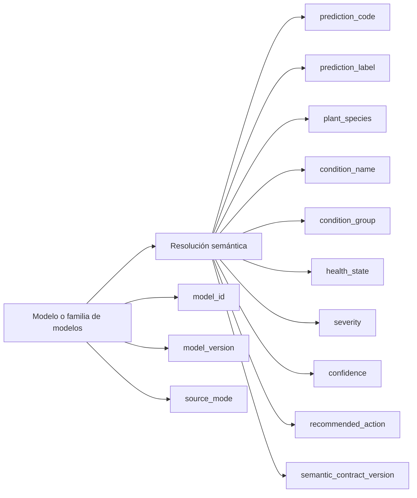

# EIARC AI Semantic Contract

## Fecha

2026-07-12

## Versión

v1.0.0

## Objetivo

Definir formalmente el contrato semántico oficial de IA de EIARC para que SIGCT-Rural y futuros sistemas híbridos publiquen predicciones comprensibles, trazables y compatibles entre cloud, edge, documentación y experiencia de usuario.

## Referencias

- `docs/eiarc/01_FOUNDATION/EIARC_VISION.md`
- `docs/eiarc/01_FOUNDATION/EIARC_MISSION.md`
- `docs/eiarc/01_FOUNDATION/EIARC_SCOPE.md`
- `docs/project_knowledge_base/KB-004-AI-SEMANTIC-CONTRACT-AUDIT.md`
- `docs/project_knowledge_base/KB-005-EIARC-AI-CANONICAL-MODEL.md`
- `docs/architect_master/02_SIGCTRURAL_CANONICAL_MODEL.md`

## Propósito del contrato

El contrato semántico de IA existe para separar el significado de negocio de la forma técnica de inferencia. Ningún consumidor oficial de EIARC debe depender de índices de clase, orden interno de clases, alias improvisados o nombres opacos derivados directamente del modelo.

## Campos oficiales

### `prediction_code`

Identificador estable y canónico de la predicción.

Reglas:

- debe ser estable entre versiones compatibles del contrato
- debe ser el identificador principal consumido por otros sistemas
- no debe derivarse de `class_index` de forma pública

### `prediction_label`

Etiqueta humana oficial de la predicción.

Reglas:

- debe ser legible por humanos
- debe representar el significado de negocio y no la forma técnica
- puede cambiar redacción menor sin cambiar `prediction_code`, si el contrato lo permite

### `plant_species`

Especie vegetal o unidad biológica principal a la que aplica la predicción.

Reglas:

- debe usar nomenclatura de dominio consistente
- puede ser `unknown` solo en escenarios explícitamente permitidos

### `condition_name`

Nombre de la condición detectada o evaluada.

Reglas:

- debe expresar la condición específica o el estado saludable correspondiente
- debe estar alineado con la taxonomía oficial del dominio

### `condition_group`

Agrupación semántica superior de la condición.

Ejemplos de intención:

- enfermedad
- estrés
- deficiencia
- normalidad
- anomalía

Reglas:

- debe servir para agregación y análisis transversal
- no reemplaza a `condition_name`; lo contextualiza

### `health_state`

Estado general de salud inferido por el sistema.

Valores esperados a nivel conceptual:

- healthy
- warning
- critical
- unknown

Reglas:

- debe ser interpretable por humanos y por sistemas
- cloud y edge deben converger en la misma semántica aunque no usen el mismo modelo

### `severity`

Nivel de severidad asociado a la predicción.

Valores conceptuales permitidos:

- low
- medium
- high
- critical
- none
- unknown

Reglas:

- puede derivarse de la condición, del modelo o de políticas del dominio
- debe ser explícita cuando la UX o la operación la necesiten

### `confidence`

Confianza numérica de la inferencia.

Reglas:

- debe representarse como valor normalizado
- debe preservar significado estadístico consistente dentro del ecosistema
- no puede reemplazar el significado semántico del diagnóstico

### `recommended_action`

Acción recomendada principal asociada a la predicción.

Reglas:

- debe expresarse en lenguaje accionable
- puede estar gobernada por taxonomía de dominio además del modelo
- debe poder cambiar entre dominios sin romper el resto del contrato

### `model_id`

Identificador lógico del modelo o familia de modelos que generó la predicción.

Reglas:

- debe servir para trazabilidad
- no sustituye al significado de negocio

### `model_version`

Versión del modelo específico que produjo la salida.

Reglas:

- debe estar presente para auditoría y análisis de compatibilidad
- puede cambiar sin romper el contrato, si la semántica publicada se preserva

### `semantic_contract_version`

Versión del contrato semántico utilizado para publicar la predicción.

Reglas:

- es obligatoria en todo consumidor o publicador oficial
- permite distinguir cambios de contrato de cambios de modelo

### `source_mode`

Modo de origen de la predicción.

Valores conceptuales permitidos:

- cloud
- edge
- fallback
- mock

Reglas:

- debe informar procedencia operativa sin cambiar el significado semántico central
- no autoriza al consumidor a reinterpretar `prediction_code`

## Reglas oficiales de compatibilidad

### Regla 1. Compatibilidad semántica antes que compatibilidad técnica

Dos servicios son compatibles si publican el mismo significado de negocio, aunque internamente usen modelos o topologías distintas.

### Regla 2. `prediction_code` es la clave de interoperabilidad

Los consumidores deben basar compatibilidad, reglas de negocio y trazabilidad primaria en `prediction_code`, no en etiquetas libres ni en `class_index`.

### Regla 3. `prediction_label` no es la clave primaria

La etiqueta humana puede ayudar a UX y documentación, pero la interoperabilidad formal depende de `prediction_code`.

### Regla 4. `class_index` no forma parte del contrato oficial

Puede existir como dato técnico interno o auxiliar, pero no debe ser requisito para consumidores del contrato EIARC.

### Regla 5. Cloud y Edge deben preservar equivalencia semántica

Pueden diferir en latencia, modelo o resolución interna, pero no en el significado final publicado al negocio.

### Regla 6. Cambios de modelo no implican cambio de contrato

Un cambio de `model_version` no debe exigir cambios aguas arriba si el contrato semántico sigue siendo compatible.

### Regla 7. Cambios de contrato deben versionarse explícitamente

Si cambia el significado, cardinalidad o compatibilidad de campos semánticos, debe cambiar `semantic_contract_version`.

### Regla 8. `source_mode=fallback` no invalida el contrato

El contrato sigue siendo válido, pero el consumidor debe poder distinguir que la predicción no provino de la ruta principal.

### Regla 9. Taxonomía y contrato deben evolucionar juntos

No debe aparecer una nueva clase o categoría de negocio sin su correspondiente definición canónica dentro de la taxonomía y del contrato.

## Diagrama de lectura del contrato

## Lectura de gobernanza

- `prediction_code` y `semantic_contract_version` gobiernan compatibilidad
- `model_id` y `model_version` gobiernan trazabilidad técnica
- `prediction_label`, `condition_name`, `health_state` y `recommended_action` gobiernan interpretación humana y operativa
- `source_mode` gobierna contexto de origen, no significado de negocio

## Conclusiones

- EIARC establece un contrato semántico oficial donde la verdad de negocio se expresa mediante campos estables, explícitos y versionados.
- El contrato rompe la dependencia entre consumidores y detalles internos de inferencia como `class_N` o `class_index`.
- Este contrato es la base para que SIGCT-Rural y futuros sistemas EIARC sean compatibles entre cloud, edge, UI, documentación y operación.
