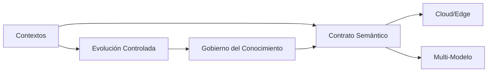

# EIARC Canonical Principles

## Fecha

2026-07-12

## Versión

v1.0.0

## Objetivo

Definir formalmente los principios arquitectónicos canónicos de EIARC para gobernar la evolución de SIGCT-Rural y de futuros sistemas híbridos que integren inteligencia artificial, telemetría, edge computing, conocimiento, experiencia de usuario y despliegue multi-entorno.

## Referencias

- `docs/eiarc/01_FOUNDATION/EIARC_VISION.md`
- `docs/eiarc/01_FOUNDATION/EIARC_MISSION.md`
- `docs/eiarc/01_FOUNDATION/EIARC_SCOPE.md`
- `docs/project_knowledge_base/KB-004-AI-SEMANTIC-CONTRACT-AUDIT.md`
- `docs/project_knowledge_base/KB-005-EIARC-AI-CANONICAL-MODEL.md`
- `docs/architect_master/02_SIGCTRURAL_CANONICAL_MODEL.md`
- `docs/architect_master/05_FINAL_ARCHITECTURE_BASELINE.md`

## Principios arquitectónicos

### 1. Principio de Contextos

EIARC organiza el sistema a partir de contextos explícitos y no de carpetas, herramientas o tecnologías. Cada contexto existe porque concentra una responsabilidad arquitectónica estable y un lenguaje de negocio reconocible.

Implicaciones:

- cada contexto debe tener propósito, límites, dependencias y evolución prevista
- las decisiones de integración deben pasar por contextos, no por acoplamientos ad hoc
- SIGCT-Rural debe evolucionar hacia una lectura por contextos y no solo por módulos técnicos

### 2. Principio de Contrato Semántico

EIARC establece que el sistema no debe exponer como contrato de negocio ni `class_index`, ni `argmax`, ni `class_N`, ni ninguna convención interna de inferencia. La interfaz oficial debe ser semántica, estable y versionada.

Implicaciones:

- la semántica es un activo gobernado, no un efecto colateral del modelo
- frontend, backend, edge y documentación deben consumir el mismo contrato
- los metadatos del modelo no sustituyen el contrato; lo respaldan

### 3. Principio Cloud/Edge

EIARC no exige igualdad de implementación entre cloud y edge, pero sí equivalencia semántica. Ambos entornos pueden usar modelos, costos y topologías distintas, siempre que entreguen resultados compatibles a nivel de negocio.

Implicaciones:

- cloud y edge pueden optimizar por capacidad, latencia o costo
- el consumidor no debe reinterpretar la predicción según el entorno de origen
- el contrato oficial debe incluir trazabilidad del `source_mode`

### 4. Principio Multi-Modelo

EIARC asume desde el origen que existirán múltiples modelos con distintos propósitos: screening, clasificación específica, severidad, recomendación contextual y variantes por dominio o entorno.

Implicaciones:

- ningún componente debe acoplarse a un único modelo como fuente absoluta de verdad
- el modelo es reemplazable; el contrato de negocio no
- la arquitectura debe contemplar catálogo, versión y compatibilidad de modelos

### 5. Principio de Evolución Controlada

EIARC gobierna la transición desde arquitecturas mixtas o legacy hacia un estado más coherente sin exigir rupturas inmediatas. La evolución debe ser incremental, trazable y explícita.

Implicaciones:

- el estado actual y el estado objetivo deben coexistir documentados
- las capas legacy pueden seguir existiendo, pero no deben definir el destino
- toda transición debe preservar continuidad operativa y semántica

### 6. Principio de Gobierno del Conocimiento

EIARC entiende la documentación como parte activa de la arquitectura. El conocimiento arquitectónico debe estar estructurado, versionado, trazable y alineado con los artefactos que gobierna.

Implicaciones:

- la documentación no es decorativa; es parte del sistema de decisión
- diagramas, contratos, principios y bases de conocimiento deben formar una sola línea narrativa
- ningún documento aspiracional debe desplazar la verdad arquitectónica canónica

## Principios derivados

### Arquitectura como gobierno

La arquitectura en EIARC no describe solamente lo que existe; define cómo debe evolucionar, qué está permitido y qué constituye desviación.

### Separación entre técnica y significado

La arquitectura debe impedir que decisiones de implementación contaminen el lenguaje de negocio.

### Trazabilidad entre capas

Todo resultado relevante debe poder relacionarse con:

- el contexto que lo gobierna
- el contrato que lo publica
- el modelo o servicio que lo originó
- el canal o dominio que lo consume

## Relación con SIGCT-Rural

Estos principios no reemplazan la identidad de SIGCT-Rural. Su función es dar a SIGCT-Rural un marco de continuidad para pasar de una plataforma híbrida técnicamente valiosa pero fragmentada, a un sistema coherente y gobernado.

## Diagrama de síntesis

## Conclusiones

- EIARC se funda sobre seis principios canónicos: Contextos, Contrato Semántico, Cloud/Edge, Multi-Modelo, Evolución Controlada y Gobierno del Conocimiento.
- Estos principios convierten a EIARC en un marco de gobierno arquitectónico y no solo en una taxonomía documental.
- La adopción de estos principios permite que SIGCT-Rural evolucione sin perder significado, trazabilidad ni continuidad de dominio.
