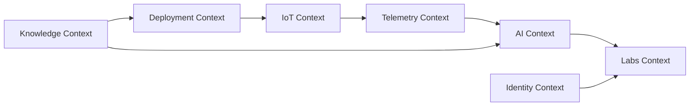

# EIARC Contexts

## Fecha

2026-07-12

## Versión

v1.0.0

## Objetivo

Definir formalmente los contextos iniciales oficiales de EIARC y establecer, para cada uno, su propósito, responsabilidades, entidades principales, dependencias y evolución prevista.

## Referencias

- `docs/eiarc/01_FOUNDATION/EIARC_VISION.md`
- `docs/eiarc/01_FOUNDATION/EIARC_MISSION.md`
- `docs/eiarc/01_FOUNDATION/EIARC_SCOPE.md`
- `docs/project_knowledge_base/KB-005-EIARC-AI-CANONICAL-MODEL.md`
- `docs/architect_master/02_SIGCTRURAL_CANONICAL_MODEL.md`
- `docs/architect_master/05_FINAL_ARCHITECTURE_BASELINE.md`

## Diagrama general

## 1. Telemetry Context

### Propósito

Gobernar la captura, normalización, consulta, trazabilidad y exposición de señales operativas del sistema.

### Responsabilidades

- observar lecturas y eventos
- estructurar telemetría como lenguaje consumible
- servir como puente entre IoT, AI, labs y operación
- preservar trazabilidad temporal y contextual

### Entidades principales

- telemetry event
- sensor reading
- device status
- robot telemetry
- time series snapshot

### Dependencias

- depende de `IoT Context` para la captura de señales
- sirve a `AI Context`, `Labs Context` y `Knowledge Context`
- requiere coordinación con `Deployment Context` para topologías y flujos

### Evolución prevista

Pasar de una telemetría parcialmente implementada y mezclada con legacy hacia un contexto explícito, con contratos estables, trazabilidad uniforme y rol central en la observabilidad del sistema.

## 2. AI Context

### Propósito

Gobernar inferencia, resolución semántica, contratos de predicción y arquitectura multi-modelo.

### Responsabilidades

- ejecutar o coordinar inferencia
- separar salida técnica de significado de negocio
- publicar contrato semántico oficial
- gestionar trazabilidad de modelo, versión y modo de origen

### Entidades principales

- prediction
- semantic contract
- model descriptor
- inference result
- recommendation

### Dependencias

- depende de `Telemetry Context` e `IoT Context` para enriquecer contexto operativo
- se apoya en `Knowledge Context` para taxonomías y verdad arquitectónica
- sirve a `Labs Context`, dominios productivos y experiencias de usuario

### Evolución prevista

Pasar de un microservicio técnicamente funcional pero semánticamente fragmentado a un contexto gobernado por contrato canónico, catálogo de modelos y equivalencia cloud-edge.

## 3. Labs Context

### Propósito

Gobernar laboratorios, simulaciones, experiencias educativas, interfaces de diagnóstico y representación interactiva del sistema.

### Responsabilidades

- presentar experiencias de aprendizaje y exploración
- consumir telemetría y predicciones de forma entendible
- traducir contexto operativo a interacción útil
- sostener experiencias humanas consistentes con el contrato de negocio

### Entidades principales

- lab session
- simulation state
- diagnosis view
- educational artifact
- interaction flow

### Dependencias

- depende de `AI Context`, `Telemetry Context` e `Identity Context`
- puede apoyarse en `Knowledge Context` para contenido y trazabilidad

### Evolución prevista

Pasar de una colección de laboratorios y demos parcialmente heterogéneos a un contexto de experiencia gobernado por contratos, trazabilidad y objetivos pedagógicos claros.

## 4. Knowledge Context

### Propósito

Gobernar la verdad arquitectónica, documental y semántica del ecosistema.

### Responsabilidades

- custodiar principios, contratos, diagramas y taxonomías
- mantener consistencia entre arquitectura y documentación
- registrar decisiones, hallazgos y evolución
- habilitar trazabilidad entre dominios, contextos y artefactos

### Entidades principales

- knowledge artifact
- truth source
- architecture decision
- taxonomy
- semantic registry

### Dependencias

- sirve transversalmente a todos los demás contextos
- depende de evidencia proveniente de código, arquitectura y operación

### Evolución prevista

Pasar de documentación extensa pero parcialmente desalineada a un contexto de conocimiento gobernado, versionado y reutilizable.

## 5. Identity Context

### Propósito

Gobernar actores, roles, acceso, pertenencia y contexto de uso.

### Responsabilidades

- definir quién consume, opera o administra el sistema
- proporcionar contexto de actor para labs, operaciones y dominios
- alinear acceso con responsabilidades de negocio

### Entidades principales

- actor
- role
- capability
- access scope
- context of use

### Dependencias

- sirve a `Labs Context`, `Telemetry Context`, `AI Context` y dominios verticales
- requiere alineación con `Knowledge Context` para políticas y verdad arquitectónica

### Evolución prevista

Pasar de un estado donde la identidad está débilmente materializada a un contexto explícito de roles, capacidades y relación con el dominio.

## 6. IoT Context

### Propósito

Gobernar dispositivos, sensores, nodos edge, captura física y sincronización de señales con el resto del ecosistema.

### Responsabilidades

- representar la capa física y sus eventos
- coordinar adquisición y sincronización
- separar captura técnica de consumo de negocio
- servir de base al flujo cloud-edge

### Entidades principales

- device
- sensor
- edge node
- gateway
- acquisition cycle

### Dependencias

- depende de `Deployment Context` para topologías y entornos
- alimenta a `Telemetry Context` y `AI Context`
- requiere coherencia con `Knowledge Context` para nombrado y trazabilidad

### Evolución prevista

Pasar de una capa edge principalmente documentada a un contexto formal con límites, contratos y política clara de integración.

## 7. Deployment Context

### Propósito

Gobernar entornos, topologías, modos de despliegue y relación entre cloud, edge y operación.

### Responsabilidades

- definir dónde vive cada capacidad
- establecer diferencias permitidas entre entornos
- documentar topologías y responsabilidades de despliegue
- asegurar que la variación técnica no rompa el significado de negocio

### Entidades principales

- environment
- topology
- deployment mode
- runtime boundary
- service placement

### Dependencias

- sirve a `IoT Context`, `AI Context` y `Telemetry Context`
- depende de `Knowledge Context` para lineamientos y verdad canónica

### Evolución prevista

Pasar de una topología parcialmente representada y con brechas entre documentación y realidad a un contexto explícito de despliegue cloud-edge.

## Conclusiones

- EIARC adopta siete contextos oficiales iniciales: Telemetry, AI, Labs, Knowledge, Identity, IoT y Deployment.
- Estos contextos no describen solamente módulos técnicos; organizan el lenguaje arquitectónico con el que SIGCT-Rural puede evolucionar.
- El contexto más crítico para la consolidación inmediata es `AI Context`, pero su estabilidad depende de la coordinación con `Knowledge Context`, `Telemetry Context` y `Deployment Context`.
