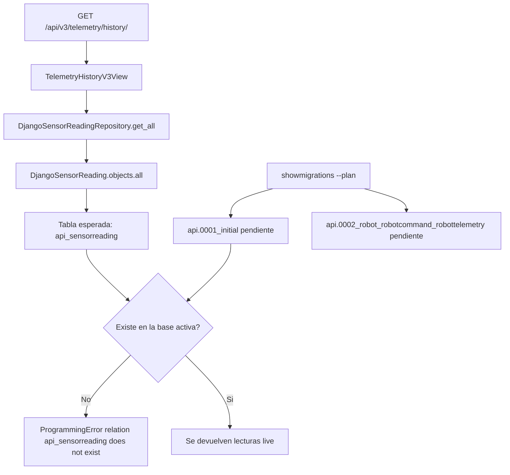

# TELEMETRY DATABASE DIAGNOSTIC

## Fecha

2026-07-12

## Objetivo

Diagnosticar por que `GET /api/v3/telemetry/history/` falla con:

`ProgrammingError: relation "api_sensorreading" does not exist`

y determinar si el problema se resuelve aplicando migraciones o si existe una desalineacion estructural entre modelo, migraciones y acceso a persistencia.

## Alcance analizado

- `src/backend/api/models.py`
- `src/backend/api/migrations/`
- `src/backend/api/views.py`
- `src/backend/infrastructure/persistence/django/repositories/django_sensor_reading_repository.py`
- `src/backend/infrastructure/persistence/django/mappers/sensor_reading_mapper.py`
- `src/backend/sigct_backend/settings.py`

## Evidencia confirmada

- El endpoint afectado es `GET /api/v3/telemetry/history/`
- El error reportado es `ProgrammingError: relation "api_sensorreading" does not exist`
- Django reporta `You have 20 unapplied migration(s)`

## Resumen ejecutivo

El problema **no es** un desalineamiento entre `Telemetry V3` y el modelo `SensorReading`.

El problema principal es este:

1. `SensorReading` **si existe** como modelo Django
2. `SensorReading` **si tiene migracion** de creacion
3. la tabla esperada por Django es efectivamente **`api_sensorreading`**
4. `Telemetry V3` consulta esa tabla por ORM a traves del repositorio hexagonal
5. en la base activa esa tabla **no existe todavia**
6. Django confirma que hay **20 migraciones sin aplicar**, incluidas `api.0001_initial` y `api.0002_robot_robotcommand_robottelemetry`

Conclusion principal:

**La causa mas probable es que la base de datos activa no ha recibido las migraciones.**

No encontre evidencia de renombre de modelo, renombre de tabla ni desalineacion estructural en los archivos auditados.

## Diagrama de causalidad



## Hallazgos tecnicos

### 1. `SensorReading` existe como modelo

Evidencia:

- [models.py:L4-L14](file:///c:/Users/Devbadolgm/Development/research-ai/ProjectsAndDatasets/sigcTiArural/src/backend/api/models.py#L4-L14)

Hallazgo:

`SensorReading` esta definido explicitamente con estos campos:

- `sensor_id`
- `temperature`
- `humidity`
- `timestamp`

No existe `Meta.db_table`, por lo que Django usara el nombre de tabla por defecto.

Conclusión:

**Si existe el modelo** y su definicion es consistente con el uso que hace Telemetry V3.

### 2. Si existen migraciones para `SensorReading`

Evidencia:

- [0001_initial.py:L15-L28](file:///c:/Users/Devbadolgm/Development/research-ai/ProjectsAndDatasets/sigcTiArural/src/backend/api/migrations/0001_initial.py#L15-L28)
- [0002_robot_robotcommand_robottelemetry.py:L10-L12](file:///c:/Users/Devbadolgm/Development/research-ai/ProjectsAndDatasets/sigcTiArural/src/backend/api/migrations/0002_robot_robotcommand_robottelemetry.py#L10-L12)

Hallazgo:

- `api.0001_initial` crea `SensorReading`
- `api.0002_robot_robotcommand_robottelemetry` depende de `api.0001_initial`

Conclusión:

**Si existen migraciones validas para `SensorReading`** y forman una cadena coherente.

### 3. El nombre real de tabla esperado es `api_sensorreading`

Evidencia:

- [models.py:L10-L12](file:///c:/Users/Devbadolgm/Development/research-ai/ProjectsAndDatasets/sigcTiArural/src/backend/api/models.py#L10-L12)
- `python manage.py sqlmigrate api 0001`
- SQL generado:

```sql
CREATE TABLE "api_sensorreading" (
  "id" bigint NOT NULL PRIMARY KEY GENERATED BY DEFAULT AS IDENTITY,
  "sensor_id" varchar(50) NOT NULL,
  "temperature" double precision NOT NULL,
  "humidity" double precision NOT NULL,
  "timestamp" timestamp with time zone NOT NULL
);
```

Conclusión:

**La tabla correcta esperada por Django es `api_sensorreading`.**

### 4. No hay evidencia de renombres de tabla o modelo

Evidencia:

- busqueda en `src/backend/api/migrations/` sobre:
  - `RenameModel`
  - `AlterModelTable`
  - `DeleteModel`
  - `SensorReading`

Resultado:

- se detecta `CreateModel(name='SensorReading')` en `0001_initial.py`
- no se detectan operaciones de renombre o cambio de nombre de tabla para `SensorReading`

Conclusión:

**No hubo renombre de `SensorReading` ni de su tabla** en el historial de migraciones auditado.

### 5. Telemetry V3 consulta efectivamente la tabla inexistente

Evidencia:

- [views.py:L101-L103](file:///c:/Users/Devbadolgm/Development/research-ai/ProjectsAndDatasets/sigcTiArural/src/backend/api/views.py#L101-L103)
- [django_sensor_reading_repository.py:L19-L23](file:///c:/Users/Devbadolgm/Development/research-ai/ProjectsAndDatasets/sigcTiArural/src/backend/infrastructure/persistence/django/repositories/django_sensor_reading_repository.py#L19-L23)
- [sensor_reading_mapper.py:L14-L22](file:///c:/Users/Devbadolgm/Development/research-ai/ProjectsAndDatasets/sigcTiArural/src/backend/infrastructure/persistence/django/mappers/sensor_reading_mapper.py#L14-L22)

Flujo real:

1. `TelemetryHistoryV3View.get()` obtiene el repositorio
2. llama `repository.get_all(limit=24)`
3. el repositorio ejecuta `DjangoSensorReading.objects.all()`
4. Django ORM traduce eso a la tabla `api_sensorreading`

Conclusión:

**Si, Telemetry V3 consulta una tabla que no existe en la base activa.**

### 6. El fallback simulado no protege contra este error

Evidencia:

- [views.py:L101-L104](file:///c:/Users/Devbadolgm/Development/research-ai/ProjectsAndDatasets/sigcTiArural/src/backend/api/views.py#L101-L104)
- [views.py:L123-L160](file:///c:/Users/Devbadolgm/Development/research-ai/ProjectsAndDatasets/sigcTiArural/src/backend/api/views.py#L123-L160)

Hallazgo:

El codigo solo entra al modo `simulated` **despues** de ejecutar `repository.get_all(limit=24)`.

Si el ORM lanza `ProgrammingError` por ausencia de tabla, la ejecucion no llega al bloque:

- `if readings: ...`
- `data_simulada = service.obtener_simulacion_historica()`

Conclusión:

El endpoint no cae en simulacion cuando la tabla falta; **falla antes** durante la consulta a base de datos.

### 7. Migraciones pendientes exactas

Evidencia:

- `python manage.py showmigrations --plan`

Migraciones pendientes detectadas:

1. `contenttypes.0001_initial`
2. `auth.0001_initial`
3. `admin.0001_initial`
4. `admin.0002_logentry_remove_auto_add`
5. `admin.0003_logentry_add_action_flag_choices`
6. `api.0001_initial`
7. `api.0002_robot_robotcommand_robottelemetry`
8. `contenttypes.0002_remove_content_type_name`
9. `auth.0002_alter_permission_name_max_length`
10. `auth.0003_alter_user_email_max_length`
11. `auth.0004_alter_user_username_opts`
12. `auth.0005_alter_user_last_login_null`
13. `auth.0006_require_contenttypes_0002`
14. `auth.0007_alter_validators_add_error_messages`
15. `auth.0008_alter_user_username_max_length`
16. `auth.0009_alter_user_last_name_max_length`
17. `auth.0010_alter_group_name_max_length`
18. `auth.0011_update_proxy_permissions`
19. `auth.0012_alter_user_first_name_max_length`
20. `sessions.0001_initial`

Conclusión:

La evidencia coincide exactamente con el reporte de Django: **hay 20 migraciones sin aplicar**.

### 8. La configuracion actual apunta siempre a PostgreSQL

Evidencia:

- [settings.py:L86-L110](file:///c:/Users/Devbadolgm/Development/research-ai/ProjectsAndDatasets/sigcTiArural/src/backend/sigct_backend/settings.py#L86-L110)

Hallazgo:

La aplicacion no cae a SQLite. Siempre usa PostgreSQL:

- via `DATABASE_URL` si existe
- via `DB_NAME/DB_USER/DB_PASSWORD/DB_HOST/DB_PORT` si no existe `DATABASE_URL`

Conclusión:

El problema no es un backend ORM sin engine; el problema esta en el **estado del esquema Postgres activo**.

## Diagnostico final por objetivo

### 1. Verificar si `SensorReading` existe como modelo

**Si.** Existe en `models.py`.

### 2. Verificar si existen migraciones para `SensorReading`

**Si.** `api.0001_initial` lo crea.

### 3. Verificar cual es el nombre real de la tabla esperada

**`api_sensorreading`**

### 4. Verificar si hubo renombres de tablas o modelos

**No.** No hay evidencia de renombres en las migraciones auditadas.

### 5. Verificar si Telemetry V3 consulta una tabla inexistente

**Si.** La consulta ORM de V3 resuelve a `api_sensorreading`, y esa relacion no existe en la base activa.

### 6. Determinar exactamente que migraciones faltan

**Faltan 20 migraciones**, detalladas en la seccion anterior.

### 7. Determinar si basta con ejecutar `migrate` o si existe un problema estructural

Diagnostico principal:

**Con la evidencia disponible, lo mas probable es que baste con ejecutar `python manage.py migrate` contra la base correcta.**

No encontre evidencia de:

- modelo sin migracion
- tabla renombrada
- `db_table` inconsistente
- mapper consultando otro modelo
- repositorio apuntando a otra entidad

Riesgo a verificar antes de correr `migrate`:

- que el proceso Django este conectado a la **misma base PostgreSQL** esperada por el entorno actual
- que no exista otra base ya migrada distinta de la que esta usando este proceso

### 8. Generar plan de correccion minimo

## Plan de correccion minimo

### Fase 1. Confirmacion operativa

1. Confirmar las variables efectivas de conexion:
   - `DATABASE_URL` o
   - `DB_NAME`, `DB_USER`, `DB_HOST`, `DB_PORT`
2. Confirmar que el backend y el comando `manage.py` apuntan al mismo Postgres

### Fase 2. Correccion minima

1. Ejecutar:

```bash
python manage.py migrate
```

2. Verificar que se creen al menos estas tablas:
   - `api_sensorreading`
   - `api_robot`
   - `api_robotcommand`
   - `api_robottelemetry`
   - tablas base de `auth`, `admin`, `contenttypes`, `sessions`

### Fase 3. Validacion posterior

1. Repetir `GET /api/v3/telemetry/history/`
2. Esperar uno de estos resultados:
   - `source_mode = live` si existen lecturas
   - `source_mode = simulated` si no hay lecturas pero ya existe la tabla
3. Verificar que el error `relation "api_sensorreading" does not exist` desaparezca

## Evaluacion estructural

### Veredicto

**No se detecta un problema estructural en el codigo auditado.**

El problema es compatible con una base PostgreSQL inicializada sin migraciones aplicadas o con el proyecto apuntando a una base distinta de la ya migrada.

## Conclusion

`Telemetry V3` falla porque consulta correctamente el modelo `SensorReading`, pero en la base PostgreSQL activa no existe la tabla `api_sensorreading`.

La evidencia tecnica indica que:

- el modelo existe
- la migracion existe
- el nombre de tabla esperado es correcto
- no hubo renombres
- hay 20 migraciones sin aplicar

Por tanto, la correccion minima recomendada es:

1. verificar la base objetivo
2. ejecutar `python manage.py migrate`
3. revalidar `GET /api/v3/telemetry/history/`

Con la evidencia disponible, **la causa raiz es de estado de esquema, no de diseño de persistencia**.
