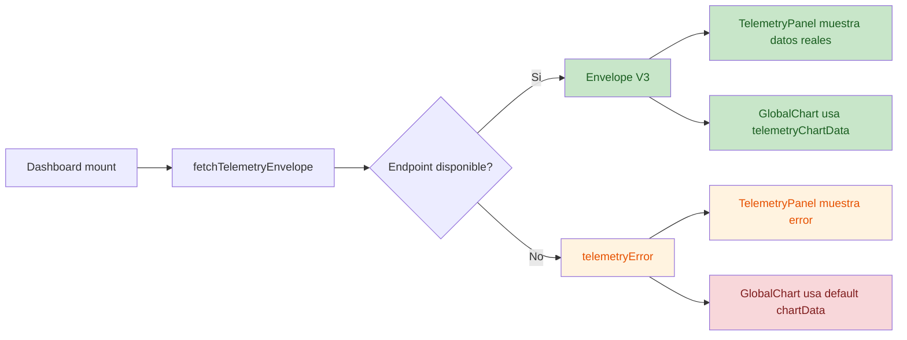

# TELEMETRY PR1 Code Review

## Fecha

2026-07-12

## Alcance

Revisión técnica estática exclusiva de:

- [src/backend/api/views.py](file:///c:/Users/Devbadolgm/Development/research-ai/ProjectsAndDatasets/sigcTiArural/src/backend/api/views.py)
- [src/frontend/src/pages/Dashboard.jsx](file:///c:/Users/Devbadolgm/Development/research-ai/ProjectsAndDatasets/sigcTiArural/src/frontend/src/pages/Dashboard.jsx)
- [src/frontend/src/components/TelemetryPanel.jsx](file:///c:/Users/Devbadolgm/Development/research-ai/ProjectsAndDatasets/sigcTiArural/src/frontend/src/components/TelemetryPanel.jsx)

## Intención inferida

El PR1 intenta promover `Telemetry V3` como contrato oficial, conectar `Dashboard` al endpoint nuevo y reemplazar la simulación autónoma de `TelemetryPanel` por consumo real del backend.

## Resultado ejecutivo

- **Critical:** 0
- **High:** 1
- **Medium:** 2
- **Low:** 0

No detecté imports faltantes en los tres archivos revisados.  
Tampoco encontré un error de estado React fatal, pero sí una combinación de estados que produce UI engañosa cuando la telemetría oficial falla.

## Flujo observado

## Hallazgos

| No. | Severity | Issue Title | Suggestion | Code Link |
|---|---|---|---|---|
| 1 | High | El dashboard solo intenta same-origin y `localhost`, por lo que la telemetría oficial puede romperse en despliegues frontend/backend desacoplados | Externalizar la base URL del backend o consumir una URL configurada por entorno en vez de depender de reverse proxy implícito o `localhost` del navegador | [Dashboard.jsx:L32-L35](file:///c:/Users/Devbadolgm/Development/research-ai/ProjectsAndDatasets/sigcTiArural/src/frontend/src/pages/Dashboard.jsx#L32-L35) |
| 2 | Medium | La gráfica sigue mostrando datos fallback aunque el panel ya indique error de telemetría oficial | Hacer que `GlobalChart` entre en estado vacío/error coherente cuando falle la carga oficial, o distinguir visualmente el fallback para que no parezca telemetría real | [Dashboard.jsx:L135-L148](file:///c:/Users/Devbadolgm/Development/research-ai/ProjectsAndDatasets/sigcTiArural/src/frontend/src/pages/Dashboard.jsx#L135-L148) |
| 3 | Medium | El contrato V3 usa formatos distintos para `timestamp` según `source_mode`, lo que vuelve inconsistente el mismo `contract_version` | Normalizar `timestamp` para `live` y `simulated` al mismo formato canónico, idealmente ISO-8601, y evitar strings heredadas `HH:MM` o vacías bajo el mismo contrato | [views.py:L101-L130](file:///c:/Users/Devbadolgm/Development/research-ai/ProjectsAndDatasets/sigcTiArural/src/backend/api/views.py#L101-L130) |

## Hallazgo descartado

No confirmé como hallazgo formal que “V3 haya roto consumidores previos en la misma ruta” porque, dentro del alcance restringido a estos tres archivos, no hay evidencia suficiente para demostrar el contrato anterior de `/api/v3/telemetry/history/` en esa misma URL.  
Sí existe riesgo conceptual de compatibilidad, pero **no quedó verificable** con el alcance pedido.

## Revisión por objetivo

### 1. Errores potenciales

- Sí: dependencia rígida de endpoints en `Dashboard.jsx`
- Sí: fallback engañoso en gráfica
- Sí: inconsistencia de contrato en `timestamp`

### 2. Imports faltantes

- No detectados
- `Dashboard.jsx` importa correctamente `useEffect`, `useMemo`, `useState`
- `TelemetryPanel.jsx` no requiere imports adicionales

### 3. Estados React incorrectos

- No hay un bug de hooks ni dependencia circular evidente
- Sí hay un estado UX inconsistente: `TelemetryPanel` puede estar en error mientras `GlobalChart` pinta datos válidos aparentes

### 4. Incompatibilidades con `GlobalChart`

- **No verificable completamente** sin abrir `GlobalChart.jsx`
- Con lo visible en `Dashboard.jsx`, la forma `{time, temp, humidity}` se conserva
- El problema real no es la forma, sino que el origen de esos datos puede ser fallback silencioso

### 5. Incompatibilidades con V3

- Sí: el envelope V3 mezcla dos semánticas de `timestamp`
- No se detectó incompatibilidad interna entre `Dashboard.jsx` y el envelope actual; el consumidor sí espera `context` + `items`

### 6. Riesgos de producción

- `Dashboard.jsx` puede fallar por configuración de endpoint en cualquier despliegue donde el frontend no comparta origen con el backend y no exista reverse proxy
- El dashboard puede transmitir falsa sensación de salud porque la gráfica sigue viva con datos fallback

### 7. Regresiones frontend

- Se pierde el comportamiento “siempre animado” del panel cuando el backend no responde
- El panel queda correctamente atado al contrato oficial, pero la página conserva una parte de la experiencia antigua en la gráfica

### 8. Regresiones backend

- El backend no tiene un fallo sintáctico en el cambio revisado
- El principal riesgo backend es de contrato: mismo `contract_version`, distinto formato de `timestamp`

## Conclusión

El PR1 va en la dirección correcta, pero todavía deja dos riesgos funcionales visibles:

1. la telemetría oficial depende de endpoints demasiado rígidos para producción
2. la UI mezcla error real con datos fallback aparentando normalidad

Además, el contrato V3 todavía no es completamente estable porque `timestamp` no significa lo mismo en `live` y en `simulated`.
