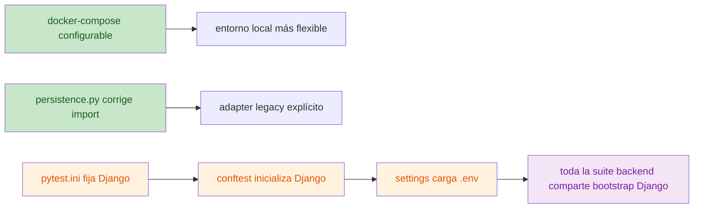

# KB-006 - Pending Changes Audit

## Fecha

2026-07-12

## Objetivo

Auditar los cambios pendientes en:

- `docker-compose.yml`
- `src/backend/api/logic/adapters/persistence.py`
- `src/backend/pytest.ini`
- `src/backend/sigct_backend/settings.py`
- `src/backend/tests/conftest.py`

para determinar qué cambió, qué problema intentan resolver, si están alineados con `architect_master`, `project_knowledge_base` y EIARC, cómo debe clasificarse cada archivo, si conviene conservar los cambios y si el conjunto está listo para commit.

## Alcance y método

- Análisis estático únicamente.
- Sin modificar código.
- Sin `git add`, sin `git commit`, sin `git push`.
- Validación cruzada realizada en segunda pasada con dos revisiones independientes.

## Intención inferida del autor

El cambio parece perseguir tres objetivos simultáneos:

1. hacer configurable el mapeo de puertos de `docker-compose.yml` para evitar colisiones locales y facilitar despliegues multi-entorno
2. corregir y etiquetar mejor el adaptador legacy de persistencia del backend
3. convertir la suite de tests backend en una suite con arranque Django homogéneo, de modo que convivan tests de dominio y tests de infraestructura con ORM

## Resumen ejecutivo

El conjunto de cambios mezcla dos bloques sanos con un bloque todavía discutible:

- **Sano y recomendable conservar**:
  - parametrización de puertos en [docker-compose.yml:L12-L13](file:///c:/Users/Devbadolgm/Development/research-ai/ProjectsAndDatasets/sigcTiArural/docker-compose.yml#L12-L13), [L48-L49](file:///c:/Users/Devbadolgm/Development/research-ai/ProjectsAndDatasets/sigcTiArural/docker-compose.yml#L48-L49), [L65-L66](file:///c:/Users/Devbadolgm/Development/research-ai/ProjectsAndDatasets/sigcTiArural/docker-compose.yml#L65-L66), [L81-L82](file:///c:/Users/Devbadolgm/Development/research-ai/ProjectsAndDatasets/sigcTiArural/docker-compose.yml#L81-L82)
  - corrección de import y marcado explícito de legacy en [persistence.py:L1-L28](file:///c:/Users/Devbadolgm/Development/research-ai/ProjectsAndDatasets/sigcTiArural/src/backend/api/logic/adapters/persistence.py#L1-L28)

- **Útil pero con riesgo arquitectónico**:
  - bootstrap global de Django para toda la suite backend en [pytest.ini:L1-L4](file:///c:/Users/Devbadolgm/Development/research-ai/ProjectsAndDatasets/sigcTiArural/src/backend/pytest.ini#L1-L4), [conftest.py:L9-L18](file:///c:/Users/Devbadolgm/Development/research-ai/ProjectsAndDatasets/sigcTiArural/src/backend/tests/conftest.py#L9-L18) y [settings.py:L14-L16](file:///c:/Users/Devbadolgm/Development/research-ai/ProjectsAndDatasets/sigcTiArural/src/backend/sigct_backend/settings.py#L14-L16)

Veredicto global:

- **deberían conservarse parcialmente**
- **no están listos para commit como un único lote**

## Hallazgos principales

### Hallazgo 1

El cambio en `pytest.ini` + `settings.py` + `tests/conftest.py` transforma una suite originalmente documentada como “dominio puro sin Django” en una suite con bootstrap global de Django.

Evidencia:

- configuración actual en [pytest.ini:L1-L4](file:///c:/Users/Devbadolgm/Development/research-ai/ProjectsAndDatasets/sigcTiArural/src/backend/pytest.ini#L1-L4)
- inicialización manual en [conftest.py:L9-L13](file:///c:/Users/Devbadolgm/Development/research-ai/ProjectsAndDatasets/sigcTiArural/src/backend/tests/conftest.py#L9-L13)
- carga automática de `.env` en [settings.py:L14-L16](file:///c:/Users/Devbadolgm/Development/research-ai/ProjectsAndDatasets/sigcTiArural/src/backend/sigct_backend/settings.py#L14-L16)
- estrategia objetivo previa en [02_SIGCTRURAL_CANONICAL_MODEL.md:L122-L123](file:///c:/Users/Devbadolgm/Development/research-ai/ProjectsAndDatasets/sigcTiArural/docs/architect_master/02_SIGCTRURAL_CANONICAL_MODEL.md#L122-L123)
- intención anterior del propio archivo en la versión previa de `pytest.ini`: tests de dominio sin dependencia de Django

Lectura:

- el cambio resuelve una necesidad real: existen tests ORM/integración como [test_persistence_infra.py:L1-L30](file:///c:/Users/Devbadolgm/Development/research-ai/ProjectsAndDatasets/sigcTiArural/src/backend/tests/test_persistence_infra.py#L1-L30)
- pero lo hace empujando toda la suite al arranque de Django, en lugar de separar explícitamente dominio puro e integración

Clasificación del hallazgo:

- **riesgo medio-alto**

### Hallazgo 2

`tests/conftest.py` introduce un `pytest_configure()` manual aunque el proyecto ya usa `pytest-django` y ya define `DJANGO_SETTINGS_MODULE`.

Evidencia:

- dependencia declarada en [requirements.txt:L16-L18](file:///c:/Users/Devbadolgm/Development/research-ai/ProjectsAndDatasets/sigcTiArural/src/backend/requirements.txt#L16-L18)
- configuración global en [pytest.ini:L2](file:///c:/Users/Devbadolgm/Development/research-ai/ProjectsAndDatasets/sigcTiArural/src/backend/pytest.ini#L2)
- hook manual en [conftest.py:L9-L13](file:///c:/Users/Devbadolgm/Development/research-ai/ProjectsAndDatasets/sigcTiArural/src/backend/tests/conftest.py#L9-L13)

Lectura:

- esto parece una solución pragmática para destrabar tests
- pero añade deuda técnica y duplica responsabilidad con el plugin

Clasificación del hallazgo:

- **deuda técnica**

## Visualización del cambio

## Evaluación por archivo

| Archivo | Qué cambió | Problema que intenta resolver | Alineación | Clasificación | ¿Conservar? | ¿Listo para commit? |
|---|---|---|---|---|---|---|
| `docker-compose.yml` | Puertos hardcodeados pasaron a variables con default | Evitar colisiones locales y soportar multi-entorno | Alineado con Compose AS-IS y con la necesidad de endurecer despliegue gradual | **Refactorización útil** | Sí | Sí, por sí solo |
| `src/backend/api/logic/adapters/persistence.py` | Corrige import a `utils.deprecation` y añade decoradores `deprecated_legacy` | Arreglar resolución de import y hacer explícita la transición legacy | Bien alineado con migración hexagonal gradual y retiro controlado de legacy | **Corrección válida** | Sí | Sí, por sí solo |
| `src/backend/pytest.ini` | Fuerza `DJANGO_SETTINGS_MODULE` y amplía `pythonpath` | Hacer correr también tests con Django/ORM | Parcialmente alineado: habilita integración, pero choca con el objetivo de dominio puro sin DB | **Riesgo** | Sí, con revisión | No, no aislado así |
| `src/backend/sigct_backend/settings.py` | Carga `.env` del root del repo | Unificar configuración local y de tests | Parcialmente alineado con multi-entorno, pero introduce acoplamiento implícito a configuración externa | **Deuda técnica** | Sí, con cautela | No, no sin decisión explícita |
| `src/backend/tests/conftest.py` | Añade `pytest_configure()` manual y simplifica fixtures | Destrabar bootstrap de Django en pytest | Débilmente alineado; sirve como workaround, no como diseño estable | **Experimento** | No en su forma actual ideal | No |

## Evidencia detallada por archivo

### 1. `docker-compose.yml`

Evidencia:

- [docker-compose.yml:L12-L13](file:///c:/Users/Devbadolgm/Development/research-ai/ProjectsAndDatasets/sigcTiArural/docker-compose.yml#L12-L13)
- [docker-compose.yml:L48-L49](file:///c:/Users/Devbadolgm/Development/research-ai/ProjectsAndDatasets/sigcTiArural/docker-compose.yml#L48-L49)
- [docker-compose.yml:L65-L66](file:///c:/Users/Devbadolgm/Development/research-ai/ProjectsAndDatasets/sigcTiArural/docker-compose.yml#L65-L66)
- [docker-compose.yml:L81-L82](file:///c:/Users/Devbadolgm/Development/research-ai/ProjectsAndDatasets/sigcTiArural/docker-compose.yml#L81-L82)

Juicio:

- es una mejora limpia
- mantiene los mismos defaults
- no altera semántica de servicios
- está alineada con el diagnóstico previo de infraestructura híbrida y necesidad de sincronizar despliegue con realidad

### 2. `src/backend/api/logic/adapters/persistence.py`

Evidencia:

- [persistence.py:L1-L28](file:///c:/Users/Devbadolgm/Development/research-ai/ProjectsAndDatasets/sigcTiArural/src/backend/api/logic/adapters/persistence.py#L1-L28)
- decorador real en [deprecation.py:L1-L8](file:///c:/Users/Devbadolgm/Development/research-ai/ProjectsAndDatasets/sigcTiArural/src/backend/utils/deprecation.py#L1-L8)
- puerto implementado en [repositories.py:L4-L18](file:///c:/Users/Devbadolgm/Development/research-ai/ProjectsAndDatasets/sigcTiArural/src/backend/api/logic/ports/repositories.py#L4-L18)

Juicio:

- corrige un import más coherente con el layout real del backend
- hace visible que el adapter sigue siendo legacy
- no cambia el comportamiento funcional de persistencia, solo su etiquetado y viabilidad de import

### 3. `src/backend/pytest.ini`

Evidencia:

- [pytest.ini:L1-L4](file:///c:/Users/Devbadolgm/Development/research-ai/ProjectsAndDatasets/sigcTiArural/src/backend/pytest.ini#L1-L4)
- tests de infraestructura con Django en [test_persistence_infra.py:L1-L30](file:///c:/Users/Devbadolgm/Development/research-ai/ProjectsAndDatasets/sigcTiArural/src/backend/tests/test_persistence_infra.py#L1-L30)
- objetivo arquitectónico en [02_SIGCTRURAL_CANONICAL_MODEL.md:L122-L123](file:///c:/Users/Devbadolgm/Development/research-ai/ProjectsAndDatasets/sigcTiArural/docs/architect_master/02_SIGCTRURAL_CANONICAL_MODEL.md#L122-L123)

Juicio:

- resuelve una necesidad real de integración
- pero cambia el contrato operativo de la suite completa
- debería estar explícitamente justificado como cambio de estrategia de testing, no entrar mezclado con otras correcciones

### 4. `src/backend/sigct_backend/settings.py`

Evidencia:

- [settings.py:L14-L16](file:///c:/Users/Devbadolgm/Development/research-ai/ProjectsAndDatasets/sigcTiArural/src/backend/sigct_backend/settings.py#L14-L16)
- [settings.py:L86-L109](file:///c:/Users/Devbadolgm/Development/research-ai/ProjectsAndDatasets/sigcTiArural/src/backend/sigct_backend/settings.py#L86-L109)

Juicio:

- ayuda a que el backend y pytest encuentren configuración local real
- pero hace que el comportamiento de arranque dependa implícitamente de un `.env` de nivel repositorio
- es útil, aunque deja difusa la frontera entre configuración de app, configuración de tests y configuración de despliegue

### 5. `src/backend/tests/conftest.py`

Evidencia:

- [conftest.py:L1-L18](file:///c:/Users/Devbadolgm/Development/research-ai/ProjectsAndDatasets/sigcTiArural/src/backend/tests/conftest.py#L1-L18)
- plugin disponible en [requirements.txt:L16-L18](file:///c:/Users/Devbadolgm/Development/research-ai/ProjectsAndDatasets/sigcTiArural/src/backend/requirements.txt#L16-L18)

Juicio:

- el fixture `lab_service` sigue siendo correcto
- el hook `pytest_configure()` parece un workaround, no una solución canónica
- el cambio simplifica fixtures, pero a costa de introducir lógica de bootstrap que probablemente debería vivir en la configuración de pytest-django, no aquí

## Alineación con `architect_master`

### Alineado

- la parametrización de puertos empuja a una infraestructura más gobernable y menos rígida
- el marcado de `deprecated_legacy` está bien alineado con la transición V1/V2/V3 y con la retirada controlada de legacy

### Parcialmente alineado

- el stack de testing ahora contempla integración con Django, lo cual tiene sentido en fase intermedia

### Desalineado

- `architect_master` define explícitamente como objetivo que el dominio se pruebe con `pytest` sin dependencia de DB: [02_SIGCTRURAL_CANONICAL_MODEL.md:L122-L123](file:///c:/Users/Devbadolgm/Development/research-ai/ProjectsAndDatasets/sigcTiArural/docs/architect_master/02_SIGCTRURAL_CANONICAL_MODEL.md#L122-L123)
- el nuevo bootstrap global empuja en la dirección contraria para toda la suite, no solo para integración

## Alineación con `project_knowledge_base`

- está alineado con el diagnóstico previo de monolito Django en transición y coexistencia de capas legacy y refactorizadas
- refuerza el hallazgo de que el repositorio necesita más gobierno explícito para que “lo útil” no llegue mezclado con “lo provisional”
- no contradice la base de conocimiento, pero confirma que el backend sigue resolviendo problemas estructurales con ajustes tácticos

## Alineación con EIARC

### Aportes positivos

- `docker-compose.yml` mejora la gobernabilidad del `Deployment Context`
- `deprecated_legacy` ayuda a la trazabilidad de evolución controlada

### Limitaciones

- los cambios de testing no están expresados como política de contexto ni como contrato de calidad
- no hay aquí avance directo sobre contrato semántico, multi-modelo ni conocimiento canónico
- desde EIARC, el bloque de tests sigue siendo una solución técnica local, no una decisión arquitectónica formalizada

## ¿Deberían conservarse?

### Sí

- `docker-compose.yml`
- `src/backend/api/logic/adapters/persistence.py`

### Sí, pero solo tras decisión explícita y preferiblemente separados

- `src/backend/pytest.ini`
- `src/backend/sigct_backend/settings.py`

### No en su forma actual ideal

- `src/backend/tests/conftest.py` como mecanismo manual de bootstrap

## ¿Están listos para commit?

### Veredicto

**No como un único commit.**

Razones:

1. mezclan mejoras operativas claras con una redefinición implícita de la estrategia de tests
2. el bloque de testing cambia el comportamiento de toda la suite backend
3. el workaround manual en `conftest.py` indica que la solución todavía no está completamente asentada

### Estado por bloque

- bloque `docker-compose.yml` + `persistence.py`: **sí, listo**
- bloque `pytest.ini` + `settings.py` + `conftest.py`: **todavía no completamente listo**

## Conclusiones

- Hay dos cambios buenos y conservables: puertos configurables en Compose y etiquetado/corrección del adapter legacy de persistencia.
- Hay un tercer cambio que intenta resolver una necesidad real de testing, pero lo hace con una estrategia demasiado global y con un workaround manual.
- El conjunto completo no está listo para commit como lote único porque mezcla refactor útil con una decisión de testing que todavía introduce deuda y desalineación respecto al objetivo arquitectónico de dominio puro.

## Impacto para SIGCT-Rural

- Positivo en despliegue local y trazabilidad del legacy.
- Ambiguo en calidad de pruebas: puede facilitar integración, pero debilita la separación entre dominio puro e infraestructura que el proyecto dice perseguir.
- Si se conserva sin clarificación, aumenta la probabilidad de que los tests de backend dependan cada vez más del arranque Django completo.

## Impacto para EIARC

- Refuerza la necesidad de gobierno explícito del `Knowledge Context` sobre decisiones de testing, configuración y transición legacy.
- Muestra un patrón típico que EIARC debería evitar: soluciones locales válidas que no quedan elevadas a política arquitectónica.
- Confirma que la evolución controlada no consiste solo en mover código, sino en formalizar qué capas pueden depender de qué tipo de bootstrap y configuración.
